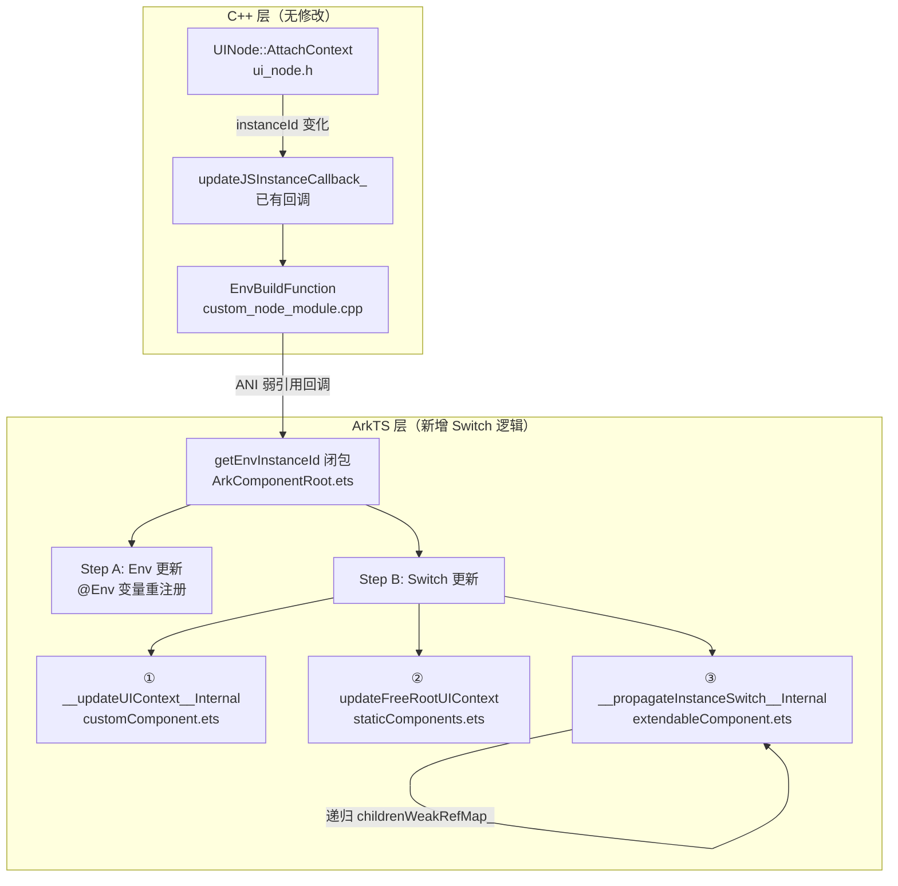
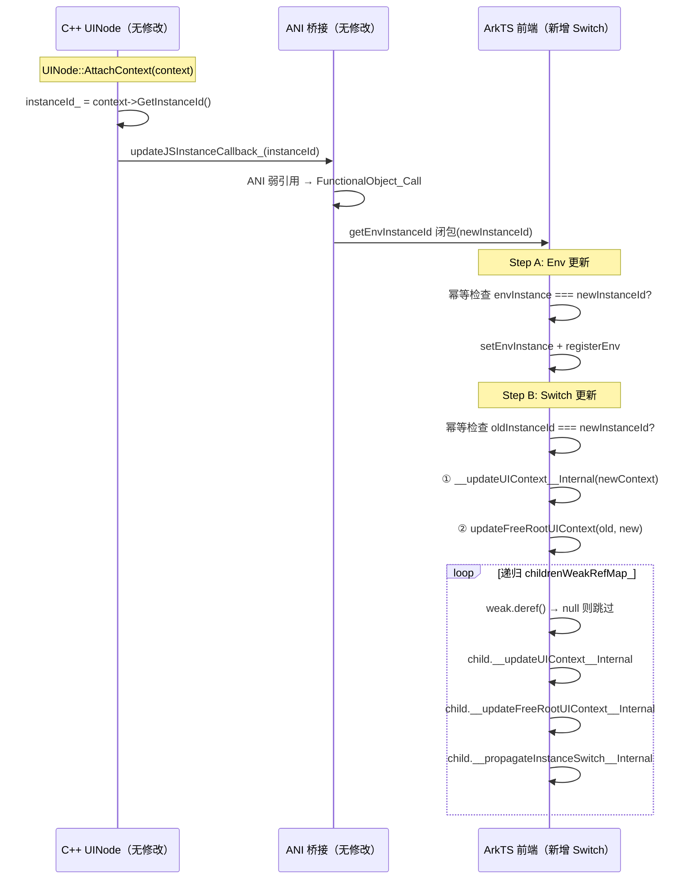

# 架构设计

> 静态自定义组件跨 Ability 实例迁移——复用已有 Env 回调通路（C++ 零新增），在 ArkTS 前端层实现 UIContext/FreeRootNode/子组件递归更新，使静态组件在新 UIAbility 中完全可用。

## 设计元数据

| Field | Content |
|-------|---------|
| Design ID | DESIGN-Func-03-03-01 |
| 关联需求 | proposal.md（Baselined） |
| 关联 Epic | 无 |
| 目标 Feature | Feat-01: 静态自定义组件支持跨 Ability 实例迁移 |
| 复杂度 | 标准 |
| 目标版本 | API 26.0.0 |
| Owner | ArkUI SIG |
| 状态 | Approved |

## 需求基线

> 需求基线详见 proposal.md。以下仅列出设计阶段需要额外强调的要点。

| 项 | 补充说明 |
|----|----------|
| 仅静态组件 | `'use static'` + `@Component`/`@ComponentV2`，动态组件不在范围 |
| 仅单进程 | 不涉及 IPC/跨进程迁移 |
| 不新增/修改 Public API | 所有迁移相关接口为平台已有，本次仅实现框架内部逻辑 |
| 获取 ID 方式 | `getUIContext().getId()` |

## 上下文和现状

### 涉及仓和模块

| 仓库 | 模块路径 | 当前职责 | 本 Feature 影响 |
|------|---------|---------|----------------|
| ace_engine | `arkui-ohos/src/ArkComponentRoot.ets` | 静态组件根节点创建 | 合并 Env+Switch 闭包逻辑 |
| ace_engine | `arkui-ohos/src/CallbackTransformer.ets` | 回调转换器 | FreeRootNode.updateUIContext + transformFromCustomBuilder UIContext 延迟获取 |
| ace_engine | `arkui-ohos/src/component/extendableComponent.ets` | 可扩展组件基类接口 | 新增 `__updateUIContext__Internal`/`__updateFreeRootUIContext__Internal`/`__propagateInstanceSwitch__Internal`/`__getIExtendableDelegate__Internal` |
| ace_engine | `arkui-ohos/src/component/customComponent.ets` | CustomDelegate 组件代理 | `CustomDelegate.__updateUIContext__Internal()` 更新 uiContext |
| ace_engine | `arkui-ohos/src/component/staticComponents.ets` | 静态组件 Peer | `ArkCustomComponentRootPeer.updateFreeRootUIContext()` 遍历 freezeRoot |
| ace_engine | `arkui-ohos/src/base/UIContextImpl.ets` | UIContext 实现 | `DetachedRootEntryManager.freezedRoots_` 从 private 改为 public |

### 适用架构规则

| Rule ID | 适用原因 | 设计结论 | 验证方式 |
|---------|----------|----------|----------|
| OH-ARCH-LAYERING | 前端 ArkTS 层实现迁移，C++ 层零改动 | C++ 已有 Env 回调通路不变；ArkTS 层新增 Switch 逻辑 | 代码评审 |
| OH-ARCH-SUBSYSTEM | 不涉及跨子系统 | N/A | N/A |
| OH-ARCH-IPC-SAF | 不涉及跨进程 | N/A | N/A |
| OH-ARCH-API-LEVEL | 不新增/修改 Public API | 无 API 变更 | API 评审 |
| OH-ARCH-COMPONENT-BUILD | 不涉及构建变更 | 无 BUILD.gn/bundle.json 变更 | 构建验证 |
| OH-ARCH-ERROR-LOG | 迁移异常场景 | hilog 记录迁移异常；子组件 GC 安全跳过 | hilog 断言 |

## 不涉及项承接

> proposal.md 已完成 N/A 判定。本节仅对需要展开设计的维度给出结论。

| 维度 | 设计结论 |
|------|----------|
| 动态组件迁移 | 不涉及。迁移逻辑仅在 `ExtendableComponent`（静态前端组件基类）上执行 |
| 跨进程迁移 | 不涉及。仅单进程内 |
| 焦点/动画状态 | 不涉及。仅更新 UIContext/FreeRootNode，不迁移焦点/动画 |
| 组件树序列化 | 不涉及。组件树通过 FrameNode 引用直接复用 |
| 新增/修改 Public API | 不涉及。所有 API 为已有 |
| C++ 层改动 | 不涉及。C++ 零新增，完全复用已有 `EnvBuildFunction` → `RegisterUpdateJSInstanceCallback` 通路 |

## 关键设计决策

| 决策 ID | 问题 | 推荐方案 | 探索过的替代方案 | 取舍理由 | 影响 |
|---------|------|---------|----------------|---------|------|
| ADR-1 | 如何触发迁移 | 复用已有 Env 回调通路：`UINode::AttachContext` → `updateJSInstanceCallback_` → `EnvBuildFunction` → ANI 弱引用 → ArkTS `getEnvInstanceId` 闭包。在闭包中新增 Switch 逻辑 | 新增专用 C++ `SwitchBuildFunction` + ANI 注册 | 新增 C++ 通道会产生与 Env 通道完全相同的冗余代码；复用 Env 通道可零改动 C++ 层，闭包内合并即可 | FR-1.1, FR-1.3 |
| ADR-2 | 如何传播 UIContext 更新 | 在 `getEnvInstanceId` 闭包中通过 `__propagateInstanceSwitch__Internal` 递归遍历 `childrenWeakRefMap_` 弱引用传播 | 后端递归 DFS 遍历 `isStaticNode_` 节点 | C++ 零新增；前端闭合所有 Switch 逻辑；弱引用天然 GC 安全 | FR-2.3, AC-2.1 |
| ADR-3 | 幂等保护机制 | 两层幂等：Env 层 `envInstance === newInstanceId` 跳过；Switch 层 `oldInstanceId === newInstanceId` 跳过 | 无保护 | 首次 AttachContext 时两层均命中幂等，确保无副作用 | FR-3.1, AC-3.1, AC-3.2 |
| ADR-4 | 子组件 GC 安全 | `childrenWeakRefMap_` 中 `WeakRef.deref()` 返回 undefined 时安全跳过 | 强引用持有子组件 | 弱引用不阻止 GC，避免迁移逻辑影响组件生命周期 | ER-1 |
| ADR-5 | 如何获取子组件的 oldContext | 在调用 `__updateUIContext__Internal` 之前先 `childOldContext = child.getUIContext()`，再传入 `__updateFreeRootUIContext__Internal` | 更新后再获取 | `updateFreeRootUIContext` 需要旧 UIContext 定位旧 DetachedRootEntryManager；更新后 getUIContext 返回新值 | FR-2.4 |
| ADR-6 | `transformFromCustomBuilder` UIContext 获取时机 | 将 `UIContext` 获取从方法外层移到返回的闭包内部 | 在方法外层获取，闭包捕获固化 | 跨 Ability 迁移后闭包执行时外层 context 已过时；闭包内获取保证每次都是最新 | FR-2.4 |
| ADR-7 | `__getIExtendableDelegate__Internal` vs 泛型 `__getDelegate__Internal` | 新增 `__getIExtendableDelegate__Internal(): IExtendableComponent \| undefined` 返回接口类型 | 使用泛型 `__getDelegate__Internal` | 传播时调用 `__updateUIContext__Internal` 不需要泛型参数；接口类型保证类型安全 | FR-2.3 |

## 设计骨架

### 骨架范围

| 骨架项 | 目标 | 不包含 | 验证方式 |
|--------|------|--------|---------|
| Env+Switch 闭包合并 | 在 `getEnvInstanceId` 闭包中合并 Env 更新和 Switch 更新 | 新增 C++ 函数 | SPEC-001, SPEC-005 |
| UIContext 更新 | `__updateUIContext__Internal` 更新组件 uiContext | 修改 C++ 层 | SPEC-001 |
| FreeRootNode 条目转移 | `updateFreeRootUIContext` 将 detachedRoots_/freezedRoots_ 从旧 Manager 转到新 Manager | 重建组件树 | SPEC-003 |
| 子组件递归传播 | `__propagateInstanceSwitch__Internal` 通过 childrenWeakRefMap_ 弱引用递归 | C++ 层遍历 | SPEC-004 |
| 两层幂等保护 | Env 层 + Switch 层各自检查 instanceId | — | SPEC-005 |
| 异常安全 | WeakRef.deref() 返回 undefined 时安全跳过 | 重建被回收组件 | SPEC-006 |

### 骨架 Spec 拆分

| Task ID | 目标 | 受影响文件 | AC |
|---------|------|----------|-----|
| TASK-SKELETON-1 | Env+Switch 闭包合并 + 两层幂等保护 | `ArkComponentRoot.ets` | AC-1.1, AC-3.1, AC-3.2 |
| TASK-SKELETON-2 | CustomDelegate UIContext 更新 | `customComponent.ets`, `extendableComponent.ets` | AC-1.1, AC-4.1 |
| TASK-SKELETON-3 | FreeRootNode 条目转移 + updateFreeRootUIContext | `staticComponents.ets`, `CallbackTransformer.ets`, `UIContextImpl.ets` | AC-6.1, AC-6.2 |
| TASK-SKELETON-4 | 子组件递归传播 + __getIExtendableDelegate__Internal | `extendableComponent.ets` | AC-2.1, AC-3.3 |
| TASK-SKELETON-5 | transformFromCustomBuilder UIContext 延迟获取 | `CallbackTransformer.ets` | AC-6.1 |

## 后续 Task 拆分

| Task ID | 目标 | 受影响文件 | 依赖 |
|---------|------|----------|------|
| TASK-01 | 基线：Env+Switch 闭包合并 + UIContext 更新 + FreeRootNode 转移 + 递归传播 | `ArkComponentRoot.ets`, `extendableComponent.ets`, `customComponent.ets`, `staticComponents.ets` | 无 |
| TASK-02 | UIContextImpl 访问限定符变更 + transformFromCustomBuilder 延迟获取 | `UIContextImpl.ets`, `CallbackTransformer.ets` | 无 |

## API 签名与权限

### 新增 API

无新增 Public API。本次需求仅实现框架内部逻辑。

### 变更/废弃 API

无变更/废弃 API。

## 构建系统影响

### BUILD.gn 变更

无。6 个修改文件均为已有 ArkTS 源文件，不新增编译单元。

### bundle.json 变更

无。不新增外部依赖。

## 可选设计扩展

### 架构图



### 时序设计



### 测试性设计

| 测试层级 | 测试目标 | Mock 策略 | 验证方式 |
|---------|---------|----------|---------|
| 前端 E2E | UIContext 更新（SPEC-001） | 双 UIAbility 环境 | hilog 断言 getId() 值 |
| 前端 E2E | @State/@Watch 迁移（SPEC-002） | 双 UIAbility 环境 | hilog 断言 Watch count |
| 前端 E2E | 冻结功能迁移（SPEC-003） | 双 UIAbility 环境 | hilog 断言 @Monitor 触发 |
| 前端 E2E | 子组件传播（SPEC-004） | 三层组件树 | hilog 断言三层 ID |
| 前端 E2E | 幂等保护（SPEC-005） | 单 UIAbility | 行为无变化 |
| 前端 E2E | 异常安全（SPEC-006） | GC 子组件 | 无崩溃 |
| 前端 E2E | V2 状态管理（SPEC-007） | 全部 V2 装饰器 | hilog 断言回调触发 |
| 前端 E2E | 组件复用（SPEC-008） | @Reusable 生命周期 | hilog 断言回调触发 |

## 详细设计

### 触发机制（复用已有 Env 通路，C++ 零新增）

已有 C++ 回调链路（不修改）：

```
UINode::AttachContext(context)  [ui_node.h]
  → instanceId_ = context->GetInstanceId()
  → updateJSInstanceCallback_(instanceId)  [已有回调]
    → EnvBuildFunction  [custom_node_module.cpp]
      → node->RegisterUpdateJSInstanceCallback(lambda)  [已有注册机制]
        → ANI 弱引用回调
          → ArkTS getEnvInstanceId 闭包  [ArkComponentRoot.ets]
```

触发时机：`UINode::AttachContext()` 在组件首次挂载和跨 Ability 转移时被调用。

### 闭包内执行流程（ArkTS 新增）

在 `ArkComponentRoot.ets` 的 `getEnvInstanceId` 闭包中合并 Env + Switch 逻辑：

**Step A: Env 更新（@Env 变量重注册）**
1. 幂等检查：`envInstance === newInstanceId` → 跳过
2. `setEnvInstance(newInstanceId)`
3. 遍历 envSet → `unRegisterEnv` → `registerEnv`

**Step B: Switch 更新（UIContext/FreeRootNode/子组件）**
1. 幂等检查：`oldInstanceId === newInstanceId` → 跳过
2. 获取 `newContext = UIContextUtil.getOrCreateUIContextById(newInstanceId)`
3. ① `delegateComponent.__updateUIContext__Internal(newContext)` — 更新 `this.uiContext`
4. ② `peer.updateFreeRootUIContext(oldContext, newContext)` — 转移 detachedRoots_/freezedRoots_ 条目
5. ③ `switchComponent.__propagateInstanceSwitch__Internal(newId, newCtx)` — 递归子组件传播

### FreeRootNode 条目转移

在 `CallbackTransformer.ets` 中新增 `FreeRootNode.updateUIContext`：
- 从旧 `DetachedRootEntryManager` 取出 detachedRoots_/freezedRoots_ 条目
- 转移到新 `DetachedRootEntryManager`
- 更新 `this.context = newContext`

前置条件：`UIContextImpl.ets` 中 `freezedRoots_` 从 `private` 改为 `public`。

### 子组件递归传播

在 `extendableComponent.ets` 中新增 `__propagateInstanceSwitch__Internal`：
- 遍历 `childrenWeakRefMap_`（`WeakRef<ExtendableComponent>`）
- `weak.deref()` 返回 undefined → 安全跳过（GC 安全）
- 先保存 `childOldContext = child.getUIContext()`（更新前获取）
- 调用 `childDelegate.__updateUIContext__Internal(newContext)`
- 调用 `child.__updateFreeRootUIContext__Internal(childOldContext, newContext)`
- 递归调用 `child.__propagateInstanceSwitch__Internal`

### transformFromCustomBuilder UIContext 延迟获取

在 `CallbackTransformer.ets` 中，将 `UIContext` 的获取从方法外层移到返回的闭包内部，确保每次回调执行时获取最新 UIContext。

### 关键设计约束

- C++ 零新增：不新增 C++ 函数、不新增 ANI 注册、不修改 UINode 基类
- 前端闭合：所有 Switch 逻辑在 ArkTS 层完成，C++ 侧完全无感知
- 两层幂等保护：Env 层和 Switch 层各有独立幂等检查

## 风险和开放问题

| 项 | 类型 | 影响 | 处理方式 | Owner |
|----|------|------|---------|-------|
| 递归遍历深层组件树性能 | 性能 | 中 | 仅跨 Ability 时触发（低频）；幂等保护避免不必要遍历 | ArkUI SIG |
| 状态管理 V1/V2 底层绑定遗漏 | 架构 | 高 | 按 AC 逐项覆盖 SPEC 测试 | ArkUI SIG |
| 子组件 GC 时序与迁移并发 | 架构 | 中 | 弱引用安全跳过；UI 单线程保证时序 | ArkUI SIG |
| 现有代码对 UIContext 绑定有隐式假设 | 兼容性 | 中 | 充分回归测试；幂等保护不影响同 Ability 行为 | ArkUI SIG |

## 设计审批

- [ ] 需求基线已确认，设计覆盖 P0/P1 AC
- [ ] 不涉及项已承接，N/A 和展开项都有结论
- [ ] 涉及仓和模块职责清楚
- [ ] 适用架构规则已识别并形成设计结论
- [ ] 分层和子系统边界合规
- [ ] API 变更有签名、权限、错误码和兼容性说明
- [ ] BUILD.gn/bundle.json 影响明确
- [ ] 设计输出和后续 Task 拆分明确
- [ ] 关键设计决策有理由和影响说明
- [ ] 风险和开放问题有 Owner
