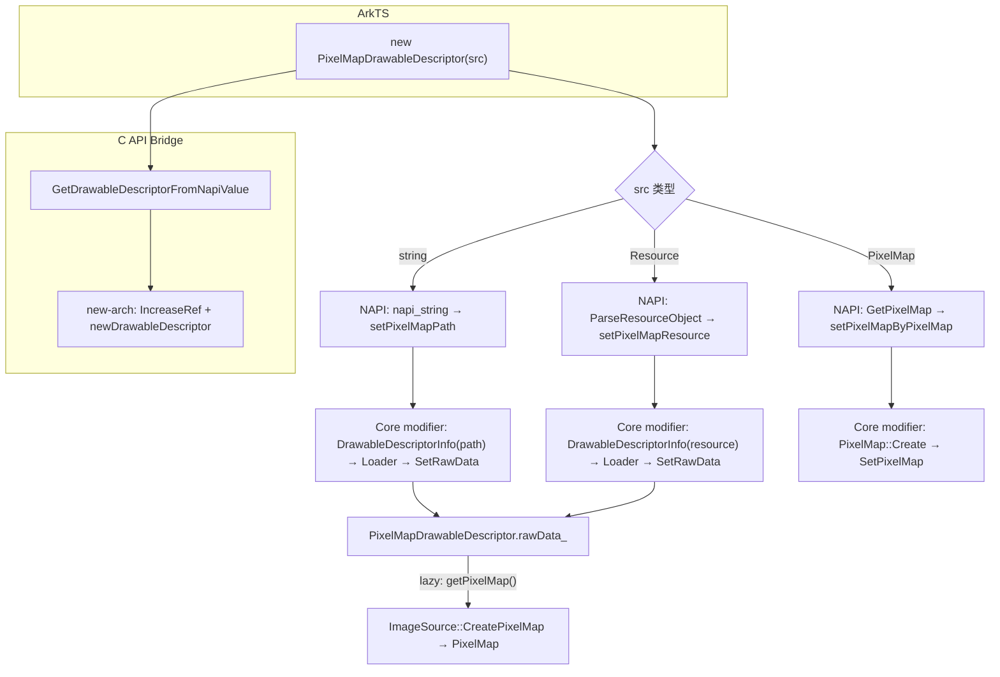

# 架构设计（短期 — Feat-02 增量）

> Stage 4 将增量合并至长期 `specs/04-common-capability/01-image-loading/03-drawable-descriptor/design.md`。

---

## 设计元数据（增量）

| 字段 | 值 | 合并位置 |
|------|-----|----------|
| 目标 Feature（追加） | `, Feat-02: PixelMapDrawableDescriptor ResourceStr 支持` | `## 设计元数据` → `目标 Feature` |

## 需求基线（增量）

| 项 | 补充说明 | 合并位置 |
|----|----------|----------|
| PixelMapDrawableDescriptor 支持 ResourceStr | Feat-02: 补全 SDK 已声明的 `constructor(src: ResourceStr)` 实现，覆盖 string(文件路径/base64) + Resource(资源引用)，动静态均实现 | `## 需求基线` |

## 涉及仓和模块（增量）

| 仓库 | 模块路径 | 当前职责 | 本 Feature 影响 |
|------|----------|----------|----------------|
| ace_engine | `interfaces/inner_api/drawable_descriptor/js_drawable_descriptor.cpp` | 动态 NAPI 桥接 | Feat-02: PixelMapConstructor 重写为 string/PixelMap/Resource 三分支 |
| ace_engine | `frameworks/core/interfaces/drawable/drawable_api.h` | modifier 函数表定义 | Feat-02: +2 函数指针 |
| ace_engine | `frameworks/core/interfaces/native/drawable/drawable_modifier.cpp` | modifier 函数表实现 | Feat-02: +2 函数 + 注册 |
| ace_engine | `interfaces/native/node/native_node_napi.cpp` | C API NAPI Bridge | Feat-02: PixelMapDrawableDescriptor 加入新架构分支 |
| ace_engine | `frameworks/bridge/.../drawableDescriptor.ets` | 静态前端 ArkTS | Feat-02: +constructor(ResourceStr) |
| ace_engine | `frameworks/bridge/.../drawable_module.cpp` | 静态 ANI 实现 | Feat-02: +2 ANI 方法 + Transfer 路径修正 |
| ace_engine | `frameworks/bridge/.../drawable_module.h` | 静态 ANI 声明 | Feat-02: +2 声明 |
| ace_engine | `frameworks/bridge/.../module.cpp` | 静态 ANI 注册 | Feat-02: +2 注册 |
| ace_engine | `frameworks/bridge/.../ArkUIAniModule.ts` | 静态 ANI TS 声明 | Feat-02: +2 native 声明 |

## 关键设计决策（增量）

| 决策 ID | 问题 | 推荐方案 | 取舍理由 |
|---------|------|----------|----------|
| ADR-F2-1 | ResourceStr 加载与已有 PixelMap 构造如何共存？ | NAPI 层按参数类型三分支：`napi_string` → `setPixelMapPath`，`napi_object`+PixelMap → `setPixelMapByPixelMap`，`napi_object`+非PixelMap → `ParseResourceObject` → `setPixelMapResource` | PixelMapDrawableDescriptor 不接受数组，无需 isArray 判断 |
| ADR-F2-2 | drawable_api 如何支持 PixelMap 的 path/resource 加载？ | 新增 `setPixelMapPath(void*, const char*)` 和 `setPixelMapResource(void*, void*)`，在 modifier 层通过 `DrawableDescriptorInfo` + `DrawableDescriptorLoader` 加载为 `rawData_` | 加载逻辑封装在核心层，上层不关心文件/base64/资源解析 |
| ADR-F2-3 | 静态前端 ANI 方法复用还是新增？ | 新增 `_Drawable_CreatePixelMapDrawableByString` 和 `_Drawable_CreatePixelMapDrawableByResource` | 类型安全：已有 Animated 方法期待 AnimatedDrawableDescriptor 对象 |
| ADR-F2-4 | PixelMapDrawableDescriptor 走新架构后，C API Bridge 如何区分？ | `native_node_napi.cpp` 中 `PixelMapDrawableDescriptor` 显式加入新架构分支（与 `AnimatedDrawableDescriptor` 并列）；`drawable_module.cpp` 中 Transfer 路径 `CreateDrawableByNapiType` 的 PIXELMAP 分支改用 `modifier->getPixelMap()` | 新架构类型通过 `IncreaseRefDrawable` + `newDrawableDescriptor` 管理生命周期 |

## 详细设计（增量）

### 1. 核心层 — drawable_api + modifier

**`drawable_api.h`** 新增 2 个函数指针：
```c
void (*setPixelMapPath)(void* object, const char* path);
void (*setPixelMapResource)(void* object, void* resourceObject);
```

**`drawable_modifier.cpp`** 实现——在 modifier 函数中通过 `DrawableDescriptorInfo` + `DrawableDescriptorLoader` 加载数据，存入 `PixelMapDrawableDescriptor::rawData_`：
```cpp
void SetPixelMapPath(void* object, const char* path) {
    auto* drawable = static_cast<PixelMapDrawableDescriptor*>(object);
    auto info = AceType::MakeRefPtr<DrawableDescriptorInfo>(std::string(path));
    auto data = DrawableDescriptorLoader::GetInstance()->LoadData(info);
    if (data.data && data.len > 0) {
        drawable->SetRawData(data.data.release(), data.len);
    }
}

void SetPixelMapResource(void* object, void* resourceObject) {
    auto* drawable = static_cast<PixelMapDrawableDescriptor*>(object);
    auto* resourcePtr = static_cast<ResourceObject*>(resourceObject);
    auto resourceRef = Referenced::Claim(resourcePtr);
    resourceRef->DecRefCount();
    auto info = AceType::MakeRefPtr<DrawableDescriptorInfo>(resourceRef);
    auto data = DrawableDescriptorLoader::GetInstance()->LoadData(info);
    if (data.data && data.len > 0) {
        drawable->SetRawData(data.data.release(), data.len);
    }
}
```
> 数据流：path/Resource → DrawableDescriptorInfo(解析类型) → DrawableDescriptorLoader::LoadData → MediaData → SetRawData → getPixelMap() 时 ImageSource::CreatePixelMap 懒解码。

### 2. 动态 NAPI — `js_drawable_descriptor.cpp`

**`PixelMapConstructor`** 重写为走新架构（modifier），三分支处理：

```
PixelMapConstructor(env, info):
  argc=1, argv[0]
  if argc == 0 → 空描述符（已有行为）
  
  typeof argv[0]:
    napi_string:
      src = GetStringFromNapiValue → modifier->setPixelMapPath(drawable, src)
    napi_object:
      pixelMap = Media::PixelMapNapi::GetPixelMap(argv[0])
      if pixelMap  → modifier->setPixelMapByPixelMap(drawable, &pixelMap)
      else         → resource = ParseResourceObject(argv[0])
                     → modifier->setPixelMapResource(drawable, resource)
```

> `PixelMapDrawableDescriptor` 不接受数组参数，无需 `isArray` 判断。

napi_wrap 使用 `NewDestructor`（ref-count 管理），与 `AnimatedConstructor` 一致。

**`GetPixelMap`** 方法扩展：`PixelMapDrawableDescriptor` 加入 modifier 分支（与 `AnimatedDrawableDescriptor` 并列）：
```cpp
if (type == "AnimatedDrawableDescriptor" || type == "PixelMapDrawableDescriptor") {
    modifier->getPixelMap(native, &pixmap);
}
```

**`CreatPixelMapDrawable`** 重写为走新架构（`NewDestructor` + `increaseRef`），与 `CreatAnimatedDrawable` 一致。

### 3. C API Bridge — `native_node_napi.cpp`

**`OH_ArkUI_GetDrawableDescriptorFromNapiValue`** 通过 typename 区分新老架构：
- 新架构分支: `"AnimatedDrawableDescriptor"` **+ `"PixelMapDrawableDescriptor"`** → `IncreaseRefDrawable` + `newDrawableDescriptor`
- 旧架构分支: 其他类型 → 通用路径

```cpp
if (typenameStr == "AnimatedDrawableDescriptor" || typenameStr == "PixelMapDrawableDescriptor") {
    OHOS::Ace::NodeModel::IncreaseRefDrawable(objectNapi);
    drawable->newDrawableDescriptor = objectNapi;
    *drawableDescriptor = drawable;
    return OHOS::Ace::ERROR_CODE_NO_ERROR;
}
```

`IncreaseRefDrawable` → dlsym → `OHOS_ACE_IncreaseRefDrawableDescriptor`（`drawable_descriptor.cpp:452`）→ `reinterpret_cast<Ace::DrawableDescriptor*>(object)->IncRefCount()`。`Ace::PixelMapDrawableDescriptor` → `Ace::DrawableDescriptor` → `AceType`，类型正确。

### 4. 静态 ANI — `drawable_module.cpp`

**新增 2 个 ANI 方法**：

```cpp
void DrawableCreatePixelMapDrawableByString(ani_env* env, ..., ani_string resource) {
    auto* drawable = modifier->createDrawableDescriptorByType(PIXELMAP);
    modifier->increaseRef(drawable);
    env->Object_SetPropertyByName_Long(drawableAni, "nativeObj", reinterpret_cast<ani_long>(drawable));
    auto src = AniUtils::ANIStringToStdString(env, resource);
    if (!src.empty()) { modifier->setPixelMapPath(drawable, src.c_str()); }
}

void DrawableCreatePixelMapDrawableByResource(ani_env* env, ..., ani_long resourceObjectKPointer) {
    auto* drawable = modifier->createDrawableDescriptorByType(PIXELMAP);
    modifier->increaseRef(drawable);
    env->Object_SetPropertyByName_Long(drawableAni, "nativeObj", reinterpret_cast<ani_long>(drawable));
    modifier->setPixelMapResource(drawable, reinterpret_cast<void*>(resourceObjectKPointer));
}
```

**Transfer 路径修正** — `CreateDrawableByNapiType` PIXELMAP 分支：`static_cast<Napi::DrawableDescriptor*>` → 改用 `modifier->getPixelMap()`（因为 unwrapResult 现在是 `Ace::PixelMapDrawableDescriptor*`）。

**注册**: `module.cpp` + `ArkUIAniModule.ts` + `drawable_module.h` 各 +2 条目。

### 5. 静态 ArkTS — `drawableDescriptor.ets`

```typescript
constructor(src: ResourceStr) {
    super()
    if (src instanceof string) {
        ArkUIAniModule._Drawable_CreatePixelMapDrawableByString(this, src as string)
    } else if (src instanceof Resource) {
        let resourceObjectKPointer = SystemOps.createResourceObject(src as Resource)
        ArkUIAniModule._Drawable_CreatePixelMapDrawableByResource(this, resourceObjectKPointer)
    }
    let finalization = new NativeDestructor(this.nativeObj)
    this.finalization = finalization
    finalizerRegister(this, finalization)
}
```

### 数据流总图



## 风险和开放问题（增量）

| 项 | 类型 | 影响 | 处理方式 | Owner |
|----|------|------|----------|-------|
| drawable_api 接口扩展需同步更新所有实现方 | 架构 | 中 | 当前仅 `drawable_modifier.cpp` 实现函数表 | ArkUI SIG |
| 静态 ANI 方法注册完整性 | 构建 | 低 | module.cpp + ArkUIAniModule.ts + drawable_module.h 三处同步注册 | ArkUI SIG |
| 旧架构类型（DrawableDescriptor 基类、LayeredDrawableDescriptor）在 C API 桥接层 `IncreaseRefDrawable` 类型不匹配 | 架构 | 中 | PixelMapDrawableDescriptor 已修正；剩余旧架构类型需后续迁移 | ArkUI SIG |
