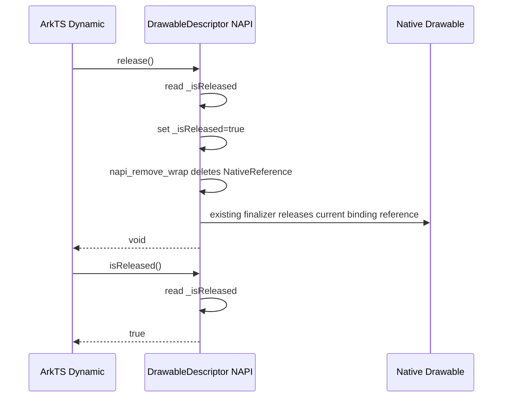
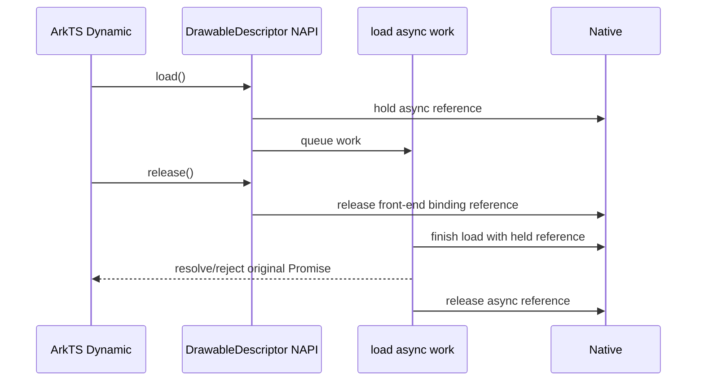
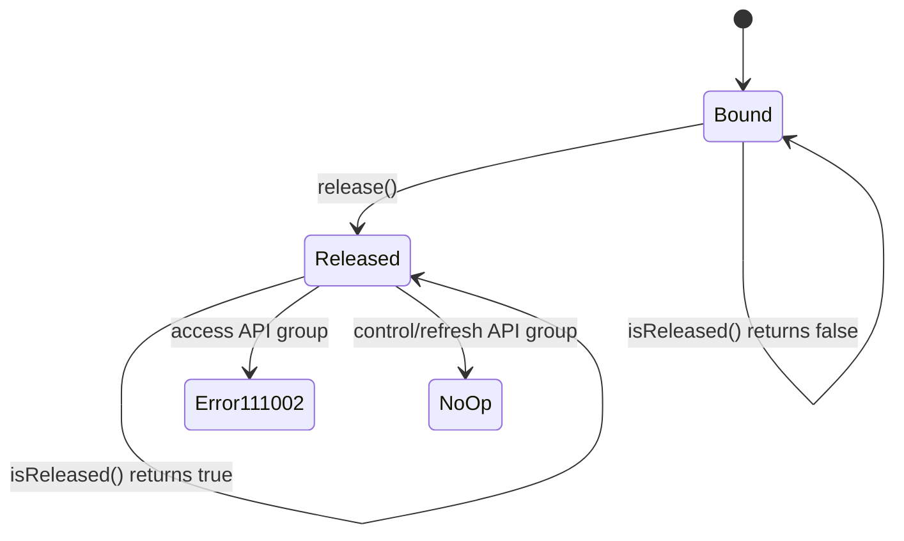
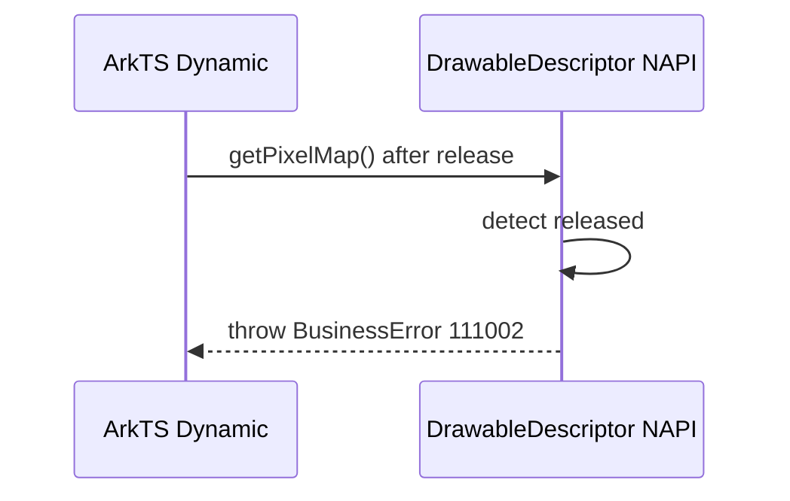

# 架构设计

> 本文档确认 DrawableDescriptor release/isReleased 增量的实现路径、模块边界和关键决策。状态为 Approved，可作为 execution-plan 输入。

## 设计元数据

| 字段 | 内容 |
|------|------|
| Design ID | DESIGN-drawable-descriptor-release-state |
| 关联需求 | `.codespec/changes/drawable-descriptor-release-state/proposal.md` |
| 关联 Epic | 无 |
| 目标 Feature | Func-04-01-03-Feat-01-delta |
| 复杂度 | 标准 |
| 目标版本 | API 26.0.0 |
| Owner | liyujie |
| 状态 | Approved |

## 需求基线

| 项 | 补充说明（如需） |
|----|------------------|
| Dynamic API 行为补齐 | SDK 已声明 `release()` / `isReleased()`，本次补齐 Dynamic NAPI 运行时。 |
| Static 不动 | Static 保持既有 `_isReleased` 降级行为，不改为 Dynamic 的 `BusinessError 111002`。 |
| C API 不动 | 不新增 C API，不修改 `OH_ArkUI_DrawableDescriptor_Dispose` 签名、结构布局和生命周期语义。 |
| 验证边界 | 不补 NAPI 单测，不强制 XTS；允许新增 previewer 可执行用例。 |

## 上下文和现状

### 涉及仓和模块

| 仓库 | 补充架构说明 |
|------|-------------|
| ace_engine | Dynamic `@ohos.arkui.drawableDescriptor` 运行时位于 `interfaces/inner_api/drawable_descriptor/js_drawable_descriptor.cpp/.h`，当前方法表缺少 `release/isReleased` 注册。 |
| ace_engine | Static ArkTS 实现位于 `frameworks/bridge/arkts_frontend/koala_projects/arkoala-arkts/arkui-ohos/@ohos.arkui.drawableDescriptor.ets`，已有 `_isReleased`、`release()` 和 `isReleased()`。 |
| ace_engine | NAPI/ANI bridge 位于 `interfaces/native/node/native_node_napi.cpp` / `native_node_ani.cpp`，released 对象应保持无法提取新 native descriptor。 |
| interface_sdk-js | Dynamic SDK 声明已在 `@ohos.arkui.drawableDescriptor.d.ts` 标注 API 26，本次不强制修改声明。 |

### 调用链层级分析

| 层 | 模块 | 职责 | 修改类型 |
|----|------|------|----------|
| ArkTS Dynamic SDK | `@ohos.arkui.drawableDescriptor.d.ts` | 对外声明 `release()` / `isReleased()` 及 release 后 `111002` 行为 | 不修改 |
| Dynamic NAPI binding | `interfaces/inner_api/drawable_descriptor/js_drawable_descriptor.cpp/.h` | 负责类方法注册、NAPI wrap 绑定、release 状态查询、访问型 `111002` guard、native 空返回 | 修改 |
| Drawable modifier bridge | `GetArkUIDrawableModifier()` 相关调用 | 管理新 core descriptor 的引用计数、加载、动画、Picture/HDR 等能力 | 复用，不新增接口 |
| Legacy Layered descriptor | `Napi::LayeredDrawableDescriptor` | Layered 旧对象直接通过 NAPI wrap 保存并由旧 destructor delete | 修改释放入口但不改合成语义 |
| NAPI/ANI native bridge | `native_node_napi.cpp` / `native_node_ani.cpp` | 从前端对象提取 `ArkUI_DrawableDescriptor*` | 仅验证/必要小修 |
| C API | `interfaces/native/drawable_descriptor.h`、`interfaces/native/node/drawable_descriptor.cpp` | C 侧句柄生命周期由 Dispose 管理 | 不修改 |
| Static ArkTS | `@ohos.arkui.drawableDescriptor.ets` | Static release/isReleased 已实现 | 不修改 |

**检查项：**
- [x] 调用链每一层都已覆盖（从最上层到最底层）
- [x] 每层职责边界清晰，无跨层违规调用
- [x] 每层修改类型明确

### 现状证据

| 证据 | 路径 | 设计含义 |
|------|------|----------|
| Dynamic SDK 声明 release/isReleased | `interface/sdk-js/api/@ohos.arkui.drawableDescriptor.d.ts:129`、`:160` | 声明已存在，本次是运行时补齐。 |
| Static release/isReleased 已实现 | `frameworks/bridge/arkts_frontend/koala_projects/arkoala-arkts/arkui-ohos/@ohos.arkui.drawableDescriptor.ets:55`、`:94`、`:104` | Static 不动，保留既有行为。 |
| Dynamic getPixelMap 使用 native | `interfaces/inner_api/drawable_descriptor/js_drawable_descriptor.cpp:621`、`:626` | 已接入 release 状态 guard，未 release 时继续按既有 native 路径取 PixelMap。 |
| Dynamic load 异步保存 native | `interfaces/inner_api/drawable_descriptor/js_drawable_descriptor.cpp:736`、`:757` | released 后新调用 reject `111002`；未 release 时已发起 load 使用短期引用保持。 |
| Dynamic loadSync 使用 native | `interfaces/inner_api/drawable_descriptor/js_drawable_descriptor.cpp:803`、`:808` | 已接入 release 状态 guard 和 111002。 |
| Dynamic 控制/刷新类 native 为空直接返回 | `interfaces/inner_api/drawable_descriptor/js_drawable_descriptor.cpp:586`、`:857`、`:1427`、`:1455` | SDK 未标错误码的 API 不额外检查 `_isReleased`；release 移除 wrap 后取不到 native，沿用既有无操作返回方向。 |
| Dynamic 方法表注册 release/isReleased | `interfaces/inner_api/drawable_descriptor/js_drawable_descriptor.cpp:1503`、`:1512`、`:1521`、`:1532`、`:1542` | 五类 descriptor 均注册公共生命周期方法。 |
| destructor 分两类释放 | `interfaces/inner_api/drawable_descriptor/js_drawable_descriptor.cpp:1032`、`:1038` | release 复用既有 finalizer 路径，由旧 Layered delete 与新 descriptor decreaseRef 分别对等释放。 |
| NAPI remove_wrap 删除 wrapper 引用 | `foundation/arkui/napi/native_engine/native_api.cpp:2290` 到 `:2316` | `napi_remove_wrap` 删除对象上的 wrapper 并 `delete ref`，可作为解除前端对象绑定的唯一入口。 |
| NativeReference 析构触发 finalizer | `foundation/arkui/napi/native_engine/impl/ark/ark_native_reference.cpp:116` 到 `:135`、`:254` 到 `:272` | `delete ref` 会调用已注册 finalizer，复用 `Destructor` / `NewDestructor` 的对等释放路径。 |
| NAPI bridge unwrap 失败返回已释放错误 | `interfaces/native/node/native_node_napi.cpp:360`、`:365` | release 后移除 wrap 可让 bridge 进入参数错误路径。 |
| C API Dispose 现状 | `interfaces/native/node/drawable_descriptor.cpp:66` | C API 生命周期保持不变。 |

### 适用架构规则

| Rule ID | 适用原因 | 设计结论 | 验证方式 |
|---------|----------|----------|----------|
| OH-ARCH-LAYERING | Dynamic SDK → NAPI binding → drawable modifier/core 是既有分层 | 只在 Dynamic NAPI binding 补齐前端对象生命周期，不把 release 状态下沉为 C API 或 core API。 | 架构评审 |
| OH-ARCH-API-LEVEL | 涉及 System API 运行时行为、Public C API 兼容 | System API 声明已存在；Public C API 不新增、不改 ABI。 | API 评审 / 头文件 diff |
| OH-ARCH-COMPONENT-BUILD | 修改 inner_api runtime 文件和可选 previewer 用例 | 不新增外部依赖；BUILD.gn 仅在新增 previewer 用例需要时调整。 | 构建验证 |
| OH-ARCH-ERROR-LOG | released 后指定 Dynamic API 返回 `111002` | 统一错误构造，错误码与 SDK 语义一致；无操作类 API 不记录误导性错误。 | previewer 行为验证 / 代码审查 |

## 不涉及项承接

| 维度 | 设计结论 |
|------|----------|
| 性能 | release 状态检查仅在 `release/isReleased` 和 SDK 标记 `111002` 的 Dynamic 访问型 API 调用入口执行；未标错误码的控制/刷新类 API 不增加额外 release 状态检查。 |
| 兼容性 | Dynamic 补齐 `111002`；Static 不动；C API 不动。 |
| API/SDK | SDK 声明已存在，本次补齐运行时；不新增 C API。 |
| 构建与部件 | 不新增系统模块依赖；如新增 previewer 用例，只涉及示例/测试构建。 |

## 关键设计决策

| 决策 ID | 问题 | 推荐方案 | 探索过的替代方案 | 取舍理由 | 影响 |
|---------|------|----------|-----------------|------|------|
| ADR-1 | release 状态保存在哪里？ | 在 Dynamic JS object 上保存 `_isReleased` 属性：对象创建后初始化为 `false`，首次 `release()` 设置为 `true`，`isReleased()` 直接读取该属性；wrap/native 是否存在只作为绑定解除和 bridge 防御状态。 | A: 在 core DrawableDescriptor 增加 released 字段；B: 只用 wrap/native 空值表达 released；C: 只置 JS 属性但不解除 wrap。 | core 字段无法覆盖旧 Layered 与前端对象绑定语义；只用 wrap/native 会让 `isReleased()` 每次依赖 unwrap，不够直观；只置属性不解除 wrap 会导致 bridge 仍可提取 native。JS 属性作为状态真相源，`napi_remove_wrap` 作为解绑动作，职责更清晰。 | 需要所有 Dynamic descriptor 创建路径初始化 `_isReleased=false`；`release/isReleased` 和 SDK 标记 `111002` 的访问型 API 读取 `_isReleased`；未标错误码的控制/刷新类 API 不额外读取 `_isReleased`，release 后通过 native 为空自然无操作；Layered 与非 Layered descriptor 的普通行为分流继续复用既有 `typeName`。 |
| ADR-2 | release 如何释放 native？ | `release()` 先读取 `_isReleased`；未释放时设置 `_isReleased=true`，再调用 `napi_remove_wrap`，由 NAPI 删除 `NativeReference` 并触发现有 finalizer 对等释放。 | A: 直接调用 destructor 但保留 wrap；B: `napi_remove_wrap` 后再手动按类型释放；C: 只置 `_isReleased` 不移除 wrap。 | 保留 wrap 会导致 bridge 仍可提取 native；remove_wrap 后再手动释放会与 finalizer 形成二次释放风险；只置状态不释放 native 无法达成提前释放。复用 NAPI finalizer 是与 GC 兜底一致的单一释放路径。 | release 本身不手动 delete/decreaseRef；旧 Layered 由 `Destructor` delete，新 descriptor 由 `NewDestructor` decreaseRef；重复 release 只读 `_isReleased` 后返回，避免无 wrap 时调用 `napi_remove_wrap` 创建空 wrapper。 |
| ADR-3 | 已发起 load 后 release 如何处理？ | `load()` 入队前对新 descriptor 增加一次 async 持有引用，Promise 完成后释放；前端 release 只释放前端绑定引用。 | A: release 后取消已发起 load；B: release 后直接释放 native 让 async 路径失败。 | 需求确认已发起 load 继续完成；直接释放会带来 use-after-release 风险。短期引用保持能保证安全完成且不重新绑定前端对象。 | 仅适用于 `load()` 入队成功后的 async context 生命周期。 |
| ADR-4 | release 后其他 native 访问 API 如何处理？ | SDK 标记错误码的访问型 API（`getPixelMap/getForeground/getBackground/getMask/loadSync/load`）读取 `_isReleased` 并返回 `111002`；未标错误码的 `invalidate/setHdrComposition/getAnimationController/setBlendMode` 不额外读取 `_isReleased`，通过 `napi_unwrap` 获取 native，取不到 native 即无操作返回。 | A: 所有方法都抛 `111002`；B: 所有方法都显式读取 `_isReleased` 后静默返回。 | 用户已确认分组语义；SDK 已列举的访问型 API 必须按 `111002`；未标错误码的控制/刷新型 API release 后不应增加开发者处理负担，native 绑定已移除时自然无操作即可。 | 需要访问型 guard 支持 throw/reject；控制/刷新类保持 native 空返回防御，不新增 release 状态分支。 |
| ADR-5 | Static 和 C API 是否同步改动？ | Static 不动，C API 不动；仅通过 design/spec 记录兼容边界。 | A: Static 改成 Dynamic 的 `111002`；B: 新增 C API release/isReleased。 | 用户已确认 Static 不动；C API 已有 Dispose，新增 API 有 ABI/API 风险且超出范围。 | 实现计划不得修改 SDK Static 文件和 C API 头文件。 |

## 设计骨架

### 骨架范围

| 骨架项 | 目标 | 不包含 | 验证方式 |
|--------|------|--------|----------|
| Dynamic 生命周期方法 | 注册并实现 `release()` / `isReleased()` | 不新增 SDK 声明 | 编译 + previewer 可执行用例 |
| Release 后访问分流 | 通过 JS object `_isReleased` 属性执行访问型 `111002` 分流；未标错误码的控制/刷新类通过 native 空返回实现无操作 | 不改变未 release 路径语义；不让无错误码 API 增加额外开发者处理负担 | 代码审查 + previewer 可执行用例 |
| Async load 引用保持 | 已发起 `load()` 后 release 仍安全完成 | 不取消已发起 Promise | previewer 可执行用例 |
| Bridge 兼容 | released 对象不能再提取新 native descriptor | 不使已提取 C 句柄失效 | 代码审查 |

### 骨架 Spec 拆分

| Task ID | 目标 | 受影响文件 | AC |
|---------|------|------------|-----|
| TASK-SKELETON-1 | Dynamic release/isReleased 生命周期骨架 | `interfaces/inner_api/drawable_descriptor/js_drawable_descriptor.cpp/.h` | AC-1.1, AC-1.2, AC-1.3 |
| TASK-SKELETON-2 | released 后访问分流与 async load 安全 | `interfaces/inner_api/drawable_descriptor/js_drawable_descriptor.cpp/.h` | AC-1.4, AC-1.5, AC-2.1, AC-2.2 |
| TASK-SKELETON-3 | 兼容边界和 previewer 用例 | previewer 可执行用例路径待 plan 确认 | AC-1.6, AC-3.1, AC-3.2, AC-3.3, AC-3.4, AC-3.5 |

## 后续 Task 拆分

| Task ID | 目标 | 受影响文件 | 依赖 |
|---------|------|------------|------|
| TASK-001 | 补齐 Dynamic `release/isReleased` 与 release 后访问分流 | `interfaces/inner_api/drawable_descriptor/js_drawable_descriptor.cpp/.h` | design.md + spec.md Approved |
| TASK-002 | 补齐已发起 load 后 release 的短期引用保持 | `interfaces/inner_api/drawable_descriptor/js_drawable_descriptor.cpp/.h` | TASK-001 |
| TASK-003 | 增加 previewer 可执行用例或替代验证资产 | previewer 用例路径由 execution-plan 最终确定 | TASK-001, TASK-002 |

## API 签名、Kit 与权限

### 新增 API

| API 签名 | 类型 | Kit | d.ts 位置 | 权限要求 | SysCap |
|----------|------|-----|-----------|----------|--------|
| `release(): void` | System | ArkUI | `interface/sdk-js/api/@ohos.arkui.drawableDescriptor.d.ts:143` | 无 | `SystemCapability.ArkUI.ArkUI.Full` |
| `isReleased(): boolean` | System | ArkUI | `interface/sdk-js/api/@ohos.arkui.drawableDescriptor.d.ts:160` | 无 | `SystemCapability.ArkUI.ArkUI.Full` |

### 变更/废弃 API

| 原有 API | 变更类型 | 新 API | 迁移说明 |
|----------|----------|--------|----------|
| `getPixelMap/getForeground/getBackground/getMask/loadSync/load` | release 后行为补齐 | N/A | Dynamic released 后抛出或 reject `BusinessError 111002`。 |
| `invalidate/setHdrComposition/getAnimationController/setBlendMode` | release 后行为补齐 | N/A | Dynamic released 后无操作返回。 |
| Static `release/isReleased` 相关行为 | 不变 | N/A | Static 不动，仍为 `undefined/-1` 降级返回。 |
| `OH_ArkUI_DrawableDescriptor_Dispose` | 不变 | N/A | C API 继续由调用方显式 Dispose。 |

## 构建系统影响

### BUILD.gn 变更

```
文件路径: interfaces/inner_api/drawable_descriptor/BUILD.gn
变更说明: 预计不需要修改；仅修改现有源文件。

文件路径: previewer 可执行用例所属 BUILD.gn
变更说明: 如 execution-plan 选择新增 previewer 用例，则按现有示例/SpecTest 组织方式补充。
```

### bundle.json 变更

无。不新增部件、不新增外部系统模块依赖。

---

## 可选设计扩展

### 数据流/控制流

| 步骤 | 调用方 | 被调用方 | 数据/接口 | 说明 |
|------|--------|----------|-----------|------|
| 1 | ArkTS Dynamic 调用方 | Dynamic NAPI binding | descriptor 创建 | 初始化 JS object 属性 `_isReleased=false`，并建立 NAPI wrap/native 绑定。 |
| 2 | ArkTS Dynamic 调用方 | Dynamic NAPI binding | `release()` | 读取 `_isReleased`；未释放时设置 `_isReleased=true`，再调用 `napi_remove_wrap` 解除绑定，并由 NAPI finalizer 释放对应 native 引用。 |
| 3 | ArkTS Dynamic 调用方 | Dynamic NAPI binding | `isReleased()` | 直接读取 JS object 属性 `_isReleased`，不访问后端业务对象。 |
| 4 | ArkTS Dynamic 调用方 | Dynamic NAPI binding | 访问型 API | 先读取 `_isReleased`；若已 released，抛出或 reject `111002`；否则走既有 native 路径。 |
| 5 | ArkTS Dynamic 调用方 | Dynamic NAPI binding | 控制/刷新型 API | 不额外读取 `_isReleased`；通过 `napi_unwrap` 取 native，若 release 后 native 为空则无操作返回，否则走既有 native 路径。 |
| 6 | Native bridge 调用方 | NAPI/ANI bridge | descriptor 提取 | release 已移除 wrap，released 对象不产生新的 native descriptor；已提取的 C 侧句柄不被前端 release 主动失效。 |

### 时序设计





### 算法与状态机



### 测试性设计

| 测试层级 | 测试目标 | Mock 策略 | 验证方式 |
|----------|----------|-----------|----------|
| Previewer 可执行用例 | release/isReleased、release 后访问分流、重复 release、已发起 load 后 release | 使用 previewer 可加载的 drawable/pixelmap 资源 | previewer 执行并记录结果 |
| 代码审查 | Static 不动、C API 不动、bridge released 对象边界 | N/A | 文件 diff 与源码路径核验 |
| 构建验证 | Dynamic runtime 编译通过 | N/A | ace_engine 目标构建 |

### 异常传播时序图



| 异常场景 | 触发层 | 传播路径 | 最终处理 |
|----------|--------|----------|----------|
| released 后访问型 API 调用 | Dynamic NAPI binding | NAPI binding → ArkTS 调用方 | 抛出或 reject `BusinessError 111002`。 |
| released 后控制/刷新型 API 调用 | Dynamic NAPI binding | NAPI binding | 无操作返回。 |
| released 对象被 bridge 提取 | NAPI/ANI bridge | bridge → Native 调用方 | 返回参数错误，不创建新 descriptor。 |

### 资源所有权矩阵

| 资源 | 创建方 | 持有方 | 销毁触发 | 实际释放 | 异常回收 |
|------|--------|--------|----------|----------|----------|
| Dynamic 新 descriptor native 绑定 | Dynamic constructor / modifier | 当前 ArkTS 对象 wrap | `release()` 或 GC finalizer | `napi_remove_wrap` 删除 `NativeReference` 后触发 `NewDestructor`，由 modifier decreaseRef 对等释放 | finalizer 兜底；release 与 GC 共用同一 finalizer 路径，避免二次释放 |
| Legacy Layered descriptor native 绑定 | Layered constructor | 当前 ArkTS 对象 wrap | `release()` 或 GC finalizer | `napi_remove_wrap` 删除 `NativeReference` 后触发 `Destructor` delete | finalizer 兜底；release 与 GC 共用同一 finalizer 路径，避免二次释放 |
| 已发起 load async 引用 | `load()` 调用 | async context | Promise complete | async context completion release | queue 失败时立即释放 |
| C 侧 `ArkUI_DrawableDescriptor*` | bridge 或 C API 创建 | C 调用方 | `OH_ArkUI_DrawableDescriptor_Dispose` | C API Dispose | 调用方负责，前端 release 不主动失效 |

### 接口参数规约

| 接口 | 参数 | 类型 | 合法范围 | 非法处理 | 边界说明 |
|------|------|------|----------|----------|----------|
| `release()` | N/A | N/A | 无参数 | 额外参数按 NAPI 默认规则忽略 | 重复调用无操作。 |
| `isReleased()` | N/A | N/A | 无参数 | 额外参数按 NAPI 默认规则忽略 | released 状态下仍可调用。 |

### 线程与并发模型

| 操作 | 发起线程 | 回调线程 | 跨进程边界 | 线程安全 | 重入约束 |
|------|----------|----------|------------|----------|----------|
| `release()` | ArkTS 调用线程 | N/A | 否 | `_isReleased` 属性检查保证幂等 | 允许重复调用 |
| `isReleased()` | ArkTS 调用线程 | N/A | 否 | 只读 `_isReleased` 属性 | 可重入 |
| `load()` async work | ArkTS 调用线程 | async work complete 回到 NAPI 回调 | 否 | async context 持有独立引用 | 已发起后允许 release |

**并发场景：**

| 场景 | 竞争对象 | 保护机制 | 预期行为 |
|------|----------|----------|----------|
| `load()` 入队后 `release()` | native descriptor 引用 | async context 短期引用 + 前端绑定引用分离 | Promise 安全完成，前端对象保持 released。 |
| 重复 `release()` | 当前前端对象 binding | `_isReleased` 属性幂等检查 | 第一次释放，后续无操作。 |

## 风险和开放问题

| 项 | 类型 | 影响 | 处理方式 | Owner |
|----|------|------|----------|-------|
| async load 引用泄漏 | 可靠性 | 中 | execution-plan 必须覆盖 queue 成功、queue 失败、complete 三条释放路径。 | liyujie |
| release 后访问归类遗漏 | API | 中 | execution-plan 必须列出所有访问 native 的 Dynamic 方法并逐项归类：SDK 标记错误码的访问型 API 读取 `_isReleased` 并返回 `111002`；未标错误码的控制/刷新类 API 通过 native 空返回无操作。 | liyujie |
| previewer 覆盖能力不足 | 测试 | 中 | 若 previewer 无法触达 bridge/C API 兼容边界，使用代码审查作为替代证据，并在 plan 中说明 N/A 理由。 | liyujie |

## 设计审批

- [x] 需求基线已确认，设计覆盖 P0/P1 AC
- [x] 不涉及项已承接，N/A 和展开项都有结论
- [x] 涉及仓和模块职责清楚
- [x] 调用链层级分析完整，每层覆盖到位
- [x] 适用架构规则已识别并形成设计结论
- [x] 分层和子系统边界合规
- [x] API 变更有签名、权限、错误码和兼容性说明
- [x] BUILD.gn/bundle.json 影响明确
- [x] 设计输出和后续 Task 拆分明确
- [x] 关键设计决策有理由和影响说明
- [x] 风险和开放问题有 Owner

**结论:** Approved，设计已由 liyujie 批准。
