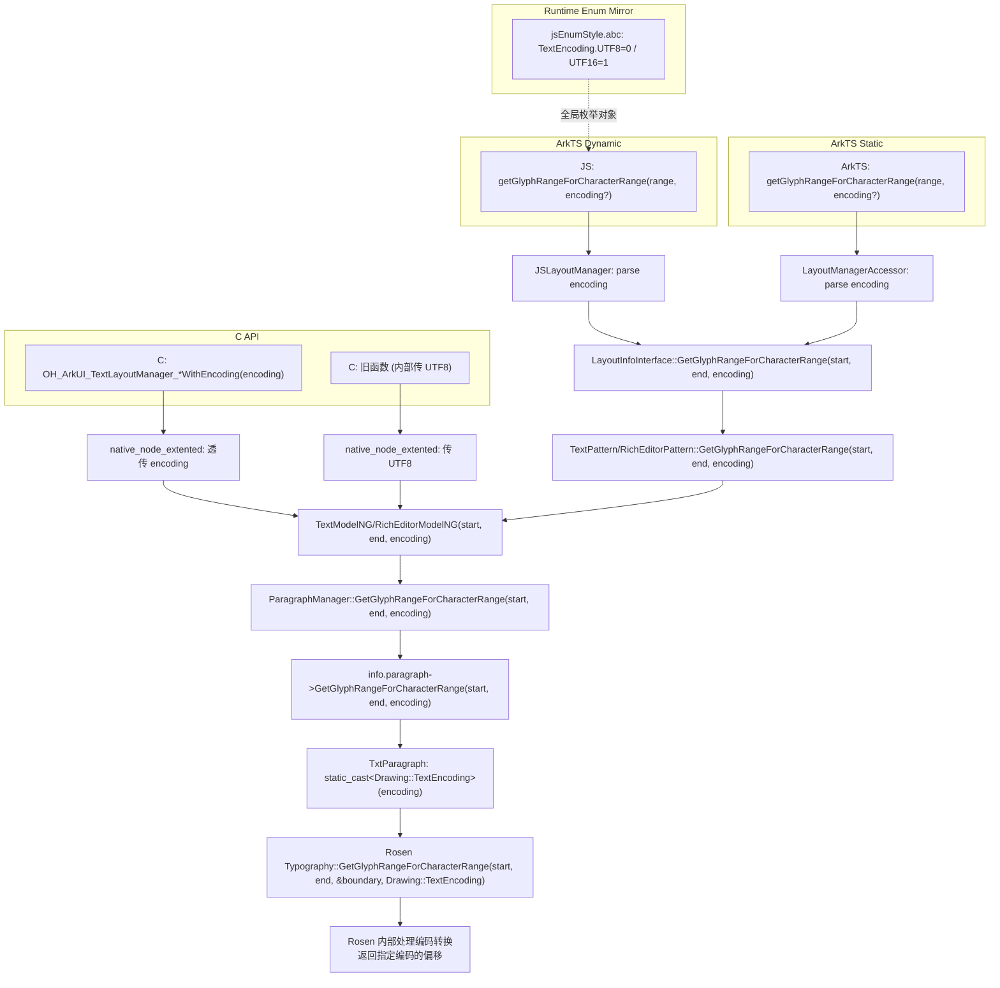

# 架构设计

## 设计元数据

| 字段 | 值 |
|------|-----|
| Design ID | issue-80085 |
| 目标 Feature | LayoutManager encoding 参数支持 + ParagraphManager 逻辑优化 |
| 变更类型 | new-on-legacy |
| 优先级 | P0 |

## 需求基线

为 LayoutManager 三接口增加 `encoding` 参数（UTF8/UTF16），使 UTF-16 编码可与 `getRectsForRange` 配套使用。同时重写 `ParagraphManager::GetGlyphRangeForCharacterRange` 和 `GetCharacterRangeForGlyphRange` 逻辑，修复编码混用 bug。

## 涉及仓和模块

| 仓库 | 模块路径 | 当前职责 | 本 Feature 影响 |
|------|----------|----------|----------------|
| ace_engine | `frameworks/core/components_ng/pattern/text/paragraph_manager.*` | 段落管理 + 偏移计算 | 三方法 +encoding 参数、逻辑重写、UTF-8/UTF-16 转换 |
| ace_engine | `frameworks/core/components_ng/render/paragraph.h` | Paragraph 抽象基类 | 三虚方法 +encoding 参数 |
| ace_engine | `frameworks/core/components_ng/render/adapter/txt_paragraph.*` | Rosen txt 适配 | 三方法 +encoding 参数（透传） |
| ace_engine | `frameworks/core/components_ng/pattern/text/layout_info_interface.h` | LayoutInfo 接口 | 三虚方法 +encoding 参数 |
| ace_engine | `frameworks/core/components_ng/pattern/text/text_pattern.*` | Text 组件 Pattern | 三 override +encoding |
| ace_engine | `frameworks/core/components_ng/pattern/rich_editor/rich_editor_pattern.*` | RichEditor Pattern | 三 override +encoding |
| ace_engine | `frameworks/core/components_ng/pattern/text/text_model_ng.cpp` | Text Model | +encoding 传递 |
| ace_engine | `frameworks/core/components_ng/pattern/rich_editor/rich_editor_model_ng.cpp` | RichEditor Model | +encoding 传递 |
| ace_engine | `frameworks/bridge/declarative_frontend/jsview/js_layout_manager.*` | JS bridge | 解析 encoding 参数 |
| ace_engine | `frameworks/bridge/declarative_frontend/engine/jsEnumStyle.js` | 动态前端运行时枚举镜像 | +`TextEncoding` 枚举镜像（`TEXT_ENCODING_UTF8=0`/`TEXT_ENCODING_UTF16=1`），供 ArkTS 应用代码运行期引用 `TextEncoding.TEXT_ENCODING_UTF8/UTF16` |
| ace_engine | `frameworks/core/interfaces/native/implementation/layout_manager_accessor.cpp` | 静态 modifier bridge | 解析 encoding 参数 |
| ace_engine | `frameworks/core/interfaces/native/node/node_text_modifier.cpp` | C API Text modifier 实现 | 三函数签名 +encoding，传给 TextModelNG |
| ace_engine | `frameworks/core/components_ng/pattern/rich_editor/bridge/rich_editor_dynamic_modifier.cpp` | C API RichEditor modifier 实现 | 三函数签名 +encoding，传给 RichEditorModelNG |
| ace_engine | `frameworks/core/interfaces/arkoala/arkoala_api.h` | C API 内部函数指针结构体 | ArkUITextModifier/ArkUIRichEditorModifier 三函数指针 +encoding |
| ace_engine | `interfaces/native/node/native_node_extented.cpp` | C API 公共函数实现 | 新增三个 *WithEncoding 函数（参数 `ArkUI_TextEncoding`），旧函数传 `ARKUI_TEXT_ENCODING_UTF8` |
| ace_engine | `interfaces/native/native_styled_string.h` | ace_engine 内部 C API 头 | 新增 `ArkUI_TextEncoding` 枚举 + 三个 *WithEncoding 函数声明 @since 26，与 `interface_sdk_c` 公共头保持一致 |
| ace_engine | `frameworks/core/components_ng/render/adapter/mock_paragraph.h` | 测试 mock | 更新 mock 签名 |
| ace_engine | `test/unittest/.../paragraph_manager_test_ng.cpp` | 测试 | +UTF16 测试 |
| ace_engine | `test/unittest/.../capi_*` | C API 测试 | +UTF16 *WithEncoding 测试 |
| interface_sdk_c | `arkui/ace_engine/native/styled_string.h` | 公共 C SDK 头（en） | 新增 `ArkUI_TextEncoding` 枚举（`ARKUI_TEXT_ENCODING_UTF8=0`/`ARKUI_TEXT_ENCODING_UTF16=1`）+ 三个 `*WithEncoding` 函数声明 @since 26.0.0 |
| interface_sdk_c | `zh-cn/arkui/ace_engine/native/styled_string.h` | 公共 C SDK 头（zh-cn） | 同上中文版 |
| interface_sdk_c | `arkui/ace_engine/native/libace.ndk.json` | NDK 符号导出表 | 新增三个 `*WithEncoding` 符号条目 `first_introduced: 26.0.0` |
| interface_sdk-js | `api/@internal/component/ets/text_common.d.ts` | 动态 API 声明（en） | 新增 `declare enum TextEncoding`（`TEXT_ENCODING_UTF8=0`/`TEXT_ENCODING_UTF16=1`）+ 三接口新增带 `encoding?: TextEncoding` 参数的方法重载（旧方法 @since 24 保留不变） |
| interface_sdk-js | `zh-cn/api/@internal/component/ets/text_common.d.ts` | 动态 API 声明（zh-cn） | 同上中文版 |
| interface_sdk-js | `api/arkui/component/textCommon.static.d.ets` | 静态 API 声明 | +`export declare enum TextEncoding`（`TEXT_ENCODING_UTF8=0`/`TEXT_ENCODING_UTF16=1`）+ 三接口新增带 `encoding?: TextEncoding` 参数的方法重载 |

## 调用链层级分析

| 层 | 类/文件 | 方法签名变更 |
|----|---------|-------------|
| JS bridge | `JSLayoutManager` (js_layout_manager.cpp) | 解析 args[2] encoding → 传给 LayoutInfoInterface |
| 运行时枚举镜像 | `jsEnumStyle.js` (jsEnumStyle.abc) | 引擎启动时 `PreloadJsEnums` 加载，新增 `TextEncoding` 全局对象，使应用代码 `TextEncoding.TEXT_ENCODING_UTF16` 在运行期可解析为 `1` |
| 接口 | `LayoutInfoInterface` (layout_info_interface.h) | `GetCharacterPositionAtCoordinate(x, y, encoding)` 等 |
| Pattern | `TextPattern` / `RichEditorPattern` | override +encoding |
| Model | `TextModelNG` / `RichEditorModelNG` | +encoding 传递 |
| 段落管理 | `ParagraphManager` (paragraph_manager.cpp) | +encoding 参数 + UTF-8/UTF-16 转换 + 逻辑重写 |
| 段落抽象 | `Paragraph` (paragraph.h) | 虚方法 +encoding |
| txt 适配 | `TxtParagraph` (txt_paragraph.cpp) | override +encoding（透传） |
| Rosen txt | `txt::Paragraph` | 不变（始终 UTF-8） |
| 静态 bridge | `LayoutManagerAccessor` (layout_manager_accessor.cpp) | 解析 `Opt_TextEncoding` 参数 |
| C API 公共函数 | `native_node_extented.cpp` | 旧函数传 `ARKUI_TEXT_ENCODING_UTF8`；新增 `*WithEncoding` 函数透传 `ArkUI_TextEncoding` |
| C API 公共头（ace_engine 内部） | `interfaces/native/native_styled_string.h` | 新增 `ArkUI_TextEncoding` 枚举 + `*WithEncoding` 函数声明 @since 26，与 `interface_sdk_c` 公共头保持一致 |
| C API 公共头（SDK） | `interface_sdk_c/.../styled_string.h` | 新增 `ArkUI_TextEncoding` 枚举（`ARKUI_TEXT_ENCODING_UTF8=0`/`ARKUI_TEXT_ENCODING_UTF16=1`）+ `*WithEncoding` 函数 @since 26.0.0；en/zh-cn 同步 |
| C API 符号导出表 | `interface_sdk_c/.../libace.ndk.json` | 新增 3 个 `*WithEncoding` 符号条目 `first_introduced: 26.0.0` |
| 动态 API 声明 | `interface_sdk-js/.../text_common.d.ts` | 新增 `declare enum TextEncoding`（`TEXT_ENCODING_UTF8=0`/`TEXT_ENCODING_UTF16=1`）+ 三接口新增带 `encoding?: TextEncoding` 的方法重载（旧方法 @since 24 保留）；en/zh-cn 同步 |
| 静态 API 声明 | `interface_sdk-js/.../textCommon.static.d.ets` | 新增 `export declare enum TextEncoding` + 三接口新增带 `encoding?: TextEncoding` 的方法重载 |
| C API 内部函数指针 | `arkoala_api.h` | `ArkUITextModifier`/`ArkUIRichEditorModifier` 三函数指针 +`ArkUI_Int32 encoding` |
| C API Text 实现 | `node_text_modifier.cpp` | 三函数签名 +encoding，`static_cast<TextEncoding>` 传给 TextModelNG |
| C API RichEditor 实现 | `rich_editor_dynamic_modifier.cpp` | 三函数签名 +encoding，`static_cast<TextEncoding>` 传给 RichEditorModelNG |

## 关键设计决策

| 决策 ID | 问题 | 推荐方案 | 取舍理由 |
|---------|------|----------|----------|
| ADR-1 | encoding 转换在哪层做？ | Rosen Typography 层做转换（透传） | Rosen `typography.h:176-181` 已原生支持 `TextEncoding` 参数，ace_engine 不重复造轮子；ArkUI 透传即可 |
| ADR-2 | Ace TextEncoding 与 Drawing::TextEncoding 如何对应？ | `static_cast<Drawing::TextEncoding>(encoding)` | 枚举值一致（UTF8=0, UTF16=1），`static_cast` 安全；Ace 仓不 include graphics 头文件做类型依赖，仅运行时 cast |
| ADR-3 | ParagraphManager 多段落逻辑如何处理 encoding？ | encoding 透传给每段 Paragraph 方法 | Rosen 按指定编码解释输入/输出偏移，ParagraphManager 只负责定位段落和累积结果 |
| ADR-4 | 是否改 Paragraph 虚方法签名？ | 改，用默认参数 `TextEncoding encoding = TextEncoding::UTF8` | 默认参数保证不传 encoding 的调用方不需要改；签名一致性最好 |
| ADR-5 | C API 是否支持 encoding？是否复用 graphics 仓 `OH_Drawing_TextEncoding`？ | 新增 `*WithEncoding` 函数，旧函数不变；C 侧新增 `ArkUI_TextEncoding` 枚举（不复用 graphics 仓枚举） | C API 旧函数（@since 24）签名不可变（版本兼容约束）。新增 `@since 26` 函数带 `ArkUI_TextEncoding` 参数，按 OpenHarmony C API 命名规范使用 `ARKUI_` 前缀（`ARKUI_TEXT_ENCODING_UTF8 = 0`、`ARKUI_TEXT_ENCODING_UTF16 = 1`），避免跨仓枚举依赖。内部函数指针签名可改（非公开 API）。值与 C++ `NG::TextEncoding`、graphics `OH_Drawing_TextEncoding` 数值一致（UTF8=0/UTF16=1），运行期可 `static_cast`。`interface_sdk_c` 公共头与 `ace_engine/interfaces/native` 内部头需保持声明一致。 |
| ADR-6 | TextEncoding 枚举定义在哪？ | `paragraph.h`（Ace::NG 命名空间） | 最低层头文件，Paragraph/TxtParagraph/ParagraphManager/LayoutInfoInterface 均可引用，无循环依赖 |
| ADR-7 | 动态前端运行时如何让应用代码引用 `TextEncoding.TEXT_ENCODING_UTF8/UTF16`？ | 在 `frameworks/bridge/declarative_frontend/engine/jsEnumStyle.js` 中镜像 `TextEncoding` 枚举（值名与 `text_common.d.ts` 完全一致） | `text_common.d.ts` 声明的 17 个兄弟 `declare enum`（TextDataDetectorType/TextVerticalAlign/TextContentAlign 等）均在 `jsEnumStyle.js` 中有运行时镜像；`jsEnumStyle.abc` 由引擎启动时 `PreloadJsEnums` 注入全局（`jsi_declarative_engine.cpp:248, 758, 955, 1784, 3748`），保证应用代码 `TextEncoding.TEXT_ENCODING_UTF16` 在运行期可解析为 `1`。不补此项会导致 `ReferenceError: TextEncoding is not defined`（取决于 ArkTS 编译器是否将枚举值内联，稳健做法必须镜像） |
| ADR-8 | C++ 内部枚举值名与公开 API 枚举值名不一致如何处理？ | C++ 用短名（`UTF8`/`UTF16`），JS 用前缀名（`TEXT_ENCODING_UTF8`/`TEXT_ENCODING_UTF16`），C API 用 `ARKUI_` 前缀名（`ARKUI_TEXT_ENCODING_UTF8`/`ARKUI_TEXT_ENCODING_UTF16`），三者数值一致 | 三套命名各跟随所在层的命名规范：内部 C++ `enum class` 短名便于内部使用；JS/TS `declare enum` 按 OpenHarmony TS 命名规范使用大写下划线前缀；C API 按 NDK `ARKUI_` 前缀规范。三层间通过 `static_cast` / 整数传递，无符号解析依赖。该不一致在 OpenHarmony 既有代码中已成惯例（如 `TextAlign` JS=`Start` vs C++=`START`），非本特性引入 |

## 详细设计

### 1. TextEncoding 枚举（paragraph.h）

```cpp
enum class TextEncoding : int32_t {
    UTF8 = 0,
    UTF16 = 1,
};
```

值与 `Drawing::TextEncoding`（`font_types.h`: UTF8=0, UTF16=1, UTF32=2, GLYPH_ID=3）一致，便于 `static_cast`。

### 2. TxtParagraph 透传 encoding 给 Rosen（txt_paragraph.cpp）

三方法将 Ace `TextEncoding` 转为 `Drawing::TextEncoding` 后传给 Rosen：

```cpp
PositionWithAffinity TxtParagraph::GetCharacterPositionAtCoordinate(
    const Offset& offset, TextEncoding encoding)
{
    auto result = paragrah->GetCharacterIndexByCoordinate(
        offset.GetX(), offset.GetY(),
        static_cast<Drawing::TextEncoding>(encoding));
    // ...
}

std::pair<TextRange, TextRange> TxtParagraph::GetGlyphRangeForCharacterRange(
    int32_t start, int32_t end, TextEncoding encoding)
{
    OHOS::Rosen::Boundary boundary(0, 0);
    auto result = paragrah->GetGlyphRangeForCharacterRange(
        static_cast<size_t>(start), static_cast<size_t>(end), &boundary,
        static_cast<Drawing::TextEncoding>(encoding));
    // ...
}
// GetCharacterRangeForGlyphRange 同理
```

> Rosen `Typography`（`typography.h:176-181`）已原生支持 `TextEncoding` 参数，内部处理编码转换。ArkUI 不做任何 UTF-8/UTF-16 转换。

### 3. ParagraphManager 透传 encoding（paragraph_manager.cpp）

三方法增加 `TextEncoding encoding` 参数，透传给 `info.paragraph->GetXxx(..., encoding)`：

```cpp
PositionWithAffinity ParagraphManager::GetCharacterPositionAtCoordinate(
    Offset offset, TextEncoding encoding)
{
    // ... 遍历段落定位 ...
    auto result = info.paragraph->GetCharacterPositionAtCoordinate(offset, encoding);
    finalResult.position_ = result.position_ + static_cast<size_t>(info.start);
    // ...
}
```

> `info.start`/`info.end` 为 UTF-16 码元偏移。当 encoding=UTF16 时，Rosen 返回 UTF-16 局部偏移，加 `info.start` 得到全局 UTF-16 偏移。当 encoding=UTF8 时，Rosen 返回 UTF-8 局部偏移，加 `info.start`（UTF-16）是原行为（向后兼容）。

### 4. GetGlyphRangeForCharacterRange 逻辑重写

优化点：去除死代码、encoding 透传、**同段落合并单次调用**、**`\n` 剥离偏移修复**：

```cpp
std::pair<TextRange, TextRange> ParagraphManager::GetGlyphRangeForCharacterRange(
    int32_t start, int32_t end, TextEncoding encoding)
{
    // ... 参数校验 ...
    TextRange glyphRange { .start = 0, .end = 0 };
    TextRange charRange { .start = 0, .end = 0 };
    int32_t glyphLength = 0, charLength = 0;
    bool isStart = true, isEnd = true;
    for (auto it = paragraphs_.begin(); it != paragraphs_.end(); ++it) {
        auto& info = *it;
        auto meta = ComputeParagraphMetadata(info, encoding, std::next(it) == paragraphs_.end());
        // char 边界用 effectiveCharLength（含 \n），glyph 局部偏移 clamp 到 actualCharEnd
        if (isStart && start >= charLength && start < charLength + meta.effectiveCharLength) {
            if (isEnd && end > charLength && end <= charLength + meta.effectiveCharLength) {
                auto localStart = std::min(start - charLength, meta.actualCharEnd);
                auto localEnd = std::min(end - charLength, meta.actualCharEnd);
                auto range = info.paragraph->GetGlyphRangeForCharacterRange(
                    localStart, localEnd, encoding);
                glyphRange.start = glyphLength + range.first.start;
                glyphRange.end   = glyphLength + range.first.end;
                charRange.start  = charLength  + range.second.start;
                charRange.end    = charLength  + range.second.end;
                return std::make_pair(glyphRange, charRange);
            }
            auto localStart = std::min(start - charLength, meta.actualCharEnd);
            auto range = info.paragraph->GetGlyphRangeForCharacterRange(
                localStart, meta.actualCharEnd, encoding);
            glyphRange.start = glyphLength + range.first.start;
            charRange.start  = charLength  + range.second.start;
            isStart = false;
        }
        if (!isStart && isEnd &&
            ((end > charLength && end <= charLength + meta.effectiveCharLength) ||
                (meta.isLastParagraph && end > charLength))) {
            auto localEnd = std::min(end - charLength, meta.actualCharEnd);
            auto range = info.paragraph->GetGlyphRangeForCharacterRange(0, localEnd, encoding);
            glyphRange.end = glyphLength + range.first.end;
            charRange.end  = charLength  + range.second.end;
            isEnd = false;
        }
        if (!isStart && !isEnd) return std::make_pair(glyphRange, charRange);
        if (meta.isLastParagraph) return std::make_pair(TextRange { -1, -1 }, TextRange { -1, -1 });
        glyphLength += meta.actualGlyphEnd + meta.strippedNewLineCount;
        charLength  += meta.actualCharEnd  + meta.strippedNewLineCount;
    }
    return {};
}
```

> **同段优化**：start 和 end 在同一段时，1 次元数据 + 1 次目标 = 2 次 Rosen 调用（原为 3 次）。

### 5. GetCharacterRangeForGlyphRange 逻辑重写

对称于第 4 节，glyph 边界用 `effectiveGlyphLength`（含 `\n` 虚拟位置），glyph 局部偏移 clamp 到 `actualGlyphEnd`：

```cpp
std::pair<TextRange, TextRange> ParagraphManager::GetCharacterRangeForGlyphRange(
    int32_t start, int32_t end, TextEncoding encoding)
{
    // ... 参数校验 ...
    for (auto it = paragraphs_.begin(); it != paragraphs_.end(); ++it) {
        auto& info = *it;
        auto meta = ComputeParagraphMetadata(info, encoding, std::next(it) == paragraphs_.end());
        // glyph 边界用 effectiveGlyphLength（含 \n 虚拟位置），glyph 局部偏移 clamp 到 actualGlyphEnd
        if (isStart && start >= glyphLength && start < glyphLength + meta.effectiveGlyphLength) {
            if (isEnd && end > glyphLength && end <= glyphLength + meta.effectiveGlyphLength) {
                auto localStart = std::min(start - glyphLength, meta.actualGlyphEnd);
                auto localEnd = std::min(end - glyphLength, meta.actualGlyphEnd);
                auto range = info.paragraph->GetCharacterRangeForGlyphRange(
                    localStart, localEnd, encoding);
                charRange.start  = charLength   + range.first.start;
                charRange.end    = charLength   + range.first.end;
                glyphRange.start = glyphLength  + range.second.start;
                glyphRange.end   = glyphLength  + range.second.end;
                return std::make_pair(charRange, glyphRange);
            }
            auto localStart = std::min(start - glyphLength, meta.actualGlyphEnd);
            auto range = info.paragraph->GetCharacterRangeForGlyphRange(
                localStart, meta.actualGlyphEnd, encoding);
            charRange.start  = charLength  + range.first.start;
            glyphRange.start = glyphLength + range.second.start;
            isStart = false;
        }
        if (!isStart && isEnd &&
            ((end > glyphLength && end <= glyphLength + meta.effectiveGlyphLength) ||
                (meta.isLastParagraph && end > glyphLength))) {
            auto localEnd = std::min(end - glyphLength, meta.actualGlyphEnd);
            auto range = info.paragraph->GetCharacterRangeForGlyphRange(0, localEnd, encoding);
            charRange.end  = charLength  + range.first.end;
            glyphRange.end = glyphLength + range.second.end;
            isEnd = false;
        }
        if (!isStart && !isEnd) return std::make_pair(charRange, glyphRange);
        if (meta.isLastParagraph) return std::make_pair(TextRange { -1, -1 }, TextRange { -1, -1 });
        charLength  += meta.actualCharEnd  + meta.strippedNewLineCount;
        glyphLength += meta.actualGlyphEnd + meta.strippedNewLineCount;
    }
    return {};
}
```

### 6. JS bridge（js_layout_manager.cpp）

```cpp
void JSLayoutManager::GetCharacterPositionAtCoordinate(const JSCallbackInfo& args)
{
    // ... 解析 x, y
    TextEncoding encoding = TextEncoding::UTF8;
    if (args.Length() >= 3 && args[2]->IsNumber()) {
        encoding = static_cast<TextEncoding>(args[2]->ToNumber<int32_t>());
    }
    auto value = layoutInfoInterface->GetCharacterPositionAtCoordinate(coordinateX, coordinateY, encoding);
    // ...
}
```

`getGlyphRangeForCharacterRange` 和 `getCharacterRangeForGlyphRange` 同理从 `args[1]` 解析 encoding。

### 7. 静态 modifier bridge（layout_manager_accessor.cpp）

静态 API 的 encoding 参数由 ArkTS 声明驱动，accessor 从 Ark_LayoutManager peer 的调用参数中解析。需要更新 `GetCharacterPositionAtCoordinateImpl` 等函数签名以接收 encoding 参数，并传递给 `handler->GetCharacterPositionAtCoordinate(x, y, encoding)`。

> **注意**：静态 API 的 accessor 函数签名由 `arkoala_generator` 生成，签名变更需同步更新生成器配置或手动适配。本次先手动适配 accessor 实现。

### 8. C API 公共函数与内部函数指针

#### 8.1 新增 C API 公共函数与枚举（native_styled_string.h）

新增 `ArkUI_TextEncoding` 枚举（不复用 graphics 仓 `OH_Drawing_TextEncoding`，按 OpenHarmony C API 命名规范使用 `ARKUI_` 前缀），并新增三个 `@since 26` 函数。声明需在两处保持一致：
- 公共 SDK 头：`interface_sdk_c/arkui/ace_engine/native/styled_string.h`（en）+ `zh-cn/.../styled_string.h`
- ace_engine 内部头：`interfaces/native/native_styled_string.h`

```c
typedef enum {
    ARKUI_TEXT_ENCODING_UTF8 = 0,
    ARKUI_TEXT_ENCODING_UTF16 = 1,
} ArkUI_TextEncoding;

ArkUI_ErrorCode OH_ArkUI_TextLayoutManager_GetCharacterPositionAtCoordinateWithEncoding(
    ArkUI_TextLayoutManager* layoutManager, double dx, double dy,
    ArkUI_TextEncoding encoding, OH_Drawing_PositionAndAffinity** outPos);

ArkUI_ErrorCode OH_ArkUI_TextLayoutManager_GetGlyphRangeForCharacterRangeWithEncoding(
    ArkUI_TextLayoutManager* layoutManager, OH_Drawing_Range* charRange,
    ArkUI_TextEncoding encoding,
    OH_Drawing_Range** outGlyphRange, OH_Drawing_Range** outActualCharRange);

ArkUI_ErrorCode OH_ArkUI_TextLayoutManager_GetCharacterRangeForGlyphRangeWithEncoding(
    ArkUI_TextLayoutManager* layoutManager, OH_Drawing_Range* glyphRange,
    ArkUI_TextEncoding encoding,
    OH_Drawing_Range** outCharRange, OH_Drawing_Range** outActualGlyphRange);
```

同时在 `interface_sdk_c/arkui/ace_engine/native/libace.ndk.json` 注册三个新符号 `first_introduced: 26.0.0`。

旧函数（`@since 24`）签名不变，内部调用函数指针时传 `ARKUI_TEXT_ENCODING_UTF8`。

#### 8.2 内部函数指针签名（arkoala_api.h）

`ArkUITextModifier` 和 `ArkUIRichEditorModifier` 中三处函数指针签名增加 `ArkUI_Int32 encoding`：

```cpp
// ArkUITextModifier (arkoala_api.h:4245-4249)
void* (*getCharacterPositionAtCoordinate)(ArkUINodeHandle node, ArkUI_Float64 dx, ArkUI_Float64 dy, ArkUI_Int32 encoding);
void (*getGlyphRangeForCharacterRange)(ArkUINodeHandle node, ArkUI_Int32 start, ArkUI_Int32 end, ArkUI_Int32 encoding, GlyphCharacterRange* range);
void (*getCharacterRangeForGlyphRange)(ArkUINodeHandle node, ArkUI_Int32 start, ArkUI_Int32 end, ArkUI_Int32 encoding, GlyphCharacterRange* range);
```

> `arkoala_api.h` 位于 `frameworks/core/interfaces/arkoala/`，非 `interfaces/native/`，不属于公开 API 硬边界。

#### 8.3 C API 实现（native_node_extented.cpp）

```cpp
// 旧函数：内部传 ARKUI_TEXT_ENCODING_UTF8
ArkUI_ErrorCode OH_ArkUI_TextLayoutManager_GetCharacterPositionAtCoordinate(
    ArkUI_TextLayoutManager* layoutManager, double dx, double dy,
    OH_Drawing_PositionAndAffinity** outPos)
{
    // ... 校验 ...
    auto encoding = static_cast<ArkUI_Int32>(ARKUI_TEXT_ENCODING_UTF8);
    *outPos = reinterpret_cast<OH_Drawing_PositionAndAffinity*>(
        fullImpl->getNodeModifiers()->getTextModifier()->getCharacterPositionAtCoordinate(
            node->uiNodeHandle, dx, dy, encoding));
    return ARKUI_ERROR_CODE_NO_ERROR;
}

// 新函数：透传 encoding
ArkUI_ErrorCode OH_ArkUI_TextLayoutManager_GetCharacterPositionAtCoordinateWithEncoding(
    ArkUI_TextLayoutManager* layoutManager, double dx, double dy,
    ArkUI_TextEncoding encoding, OH_Drawing_PositionAndAffinity** outPos)
{
    // ... 校验 ...
    auto arkEncoding = static_cast<ArkUI_Int32>(encoding);
    *outPos = reinterpret_cast<OH_Drawing_PositionAndAffinity*>(
        fullImpl->getNodeModifiers()->getTextModifier()->getCharacterPositionAtCoordinate(
            node->uiNodeHandle, dx, dy, arkEncoding));
    return ARKUI_ERROR_CODE_NO_ERROR;
}
```

> `ArkUI_TextEncoding` 与内部函数指针的 `ArkUI_Int32 encoding` 之间通过 `static_cast<ArkUI_Int32>(...)` 转换；与 C++ `NG::TextEncoding` 数值一致，无需进一步转换。`TEXT_ENCODING_UTF8`（graphics 仓枚举值）不再使用，被 `ARKUI_TEXT_ENCODING_UTF8` 取代。

#### 8.4 函数指针实现（node_text_modifier.cpp / rich_editor_dynamic_modifier.cpp）

```cpp
// node_text_modifier.cpp
void* GetCharacterPositionAtCoordinate(ArkUINodeHandle node, ArkUI_Float64 dx, ArkUI_Float64 dy, ArkUI_Int32 encoding)
{
    auto* frameNode = reinterpret_cast<FrameNode*>(node);
    CHECK_NULL_RETURN(frameNode, nullptr);
    auto aceEncoding = static_cast<TextEncoding>(encoding);
    PositionWithAffinity result = TextModelNG::GetCharacterPositionAtCoordinate(frameNode, dx, dy, aceEncoding);
    // ...
}
```

`rich_editor_dynamic_modifier.cpp` 中 `GetRichEditorCharacterPositionAtCoordinate` 等三函数同理。

### 9. 动态前端运行时枚举镜像（jsEnumStyle.js）

`interface_sdk-js/api/@internal/component/ets/text_common.d.ts` 新增的 `declare enum TextEncoding` 是公开 SDK 的 TypeScript 声明；动态前端运行期需要全局 `TextEncoding` 对象存在，应用代码 `TextEncoding.TEXT_ENCODING_UTF16` 才能解析为 `1`。该运行时镜像由 `frameworks/bridge/declarative_frontend/engine/jsEnumStyle.js` 提供：

- 编译路径：`frameworks/bridge/declarative_frontend/engine/jsi/BUILD.gn:42-66` 通过 `es2abc_gen_abc("gen_jsEnumStyle_abc")` 编译为 `jsEnumStyle.abc`
- 加载路径：`frameworks/bridge/declarative_frontend/engine/jsi/jsi_declarative_engine.cpp:248, 758, 955, 1784, 3748` 在引擎启动时 `EvaluateAbcFile(runtime, GetSystemPath("jsEnumStyle.abc"))` / `PreloadJsEnums(arkRuntime)` 注入全局
- 现有镜像：`text_common.d.ts` 中 17 个 `declare enum`（TextDataDetectorType/TextDeleteDirection/SuperscriptStyle/MenuType/AutoCapitalizationMode/TextMenuShowMode/KeyboardAppearance/FlipDirection/MaxLinesMode/TextChangeReason/KeyboardGradientMode/KeyboardFluidLightMode/TextDirection/TextVerticalAlign/TextContentAlign/StrokeJoinStyle/IncrementalUpdatePolicy）均已在 `jsEnumStyle.js` 中镜像，唯独 `TextEncoding` 缺失

新增镜像（紧邻 `TextVerticalAlign`、`TextContentAlign` 等 Text\* 枚举，遵循 `(function (X) { X[X[V = n] = 'V'; ... })(X || (X = {}));` 既有模式）。**值名必须与 `text_common.d.ts` 中的 `declare enum TextEncoding` 完全一致**（即 `TEXT_ENCODING_UTF8`/`TEXT_ENCODING_UTF16`，带前缀），否则应用代码引用 `TextEncoding.TEXT_ENCODING_UTF8` 在运行期会得到 `undefined`：

```js
let TextEncoding;
(function (TextEncoding) {
  TextEncoding[TextEncoding.TEXT_ENCODING_UTF8 = 0] = 'TEXT_ENCODING_UTF8';
  TextEncoding[TextEncoding.TEXT_ENCODING_UTF16 = 1] = 'TEXT_ENCODING_UTF16';
})(TextEncoding || (TextEncoding = {}));
```

> 数值 `0`/`1` 与 C++ 层 `NG::TextEncoding::UTF8/UTF16`、C API `ArkUI_TextEncoding::ARKUI_TEXT_ENCODING_UTF8/UTF16`、graphics 仓 `OH_Drawing_TextEncoding` 四方一致，便于 `static_cast` 和直接整数传递。值名按所在层命名规范各自不同（见 ADR-8）。

### 数据流总图



## 10. PARAGRAPH_CACHE 多段落 `\n` 剥离偏移修复

### 10.1 问题根因

当 Text 使用属性字符串 + `IncrementalUpdatePolicy::PARAGRAPH_CACHE` 时，`ParagraphUtil::ConstructParagraphSpanGroupForHash`（`paragraph_util.cpp:285-314`）按 `\n` 拆分多段落。对非末尾段落的最后 span 设置 `needRemoveNewLine=true`（`paragraph_util.cpp:300-303`），`SpanItem::GetSpanContent`（`span_node.cpp:1281-1293`）据此在构建段落时剥离末尾 `\n`：

```cpp
// span_node.cpp:1284-1285
if (needRemoveNewLine && !rawContent.empty()) {
    data = rawContent.substr(0, static_cast<int32_t>(rawContent.length()) - 1);
}
```

但 `spanTextLength` 和 `info.start`/`info.end` 基于 `child->content.length()`（含 `\n`）：

```cpp
// multiple_paragraph_layout_algorithm.cpp:1072-1073 / text_layout_algorithm.cpp:487-488
child->length = child->content.length();  // 含 \n
spanTextLength += static_cast<int32_t>(child->length);  // 含 \n
```

因此 `paragraphLength = info.end - info.start` 含 `\n`，但字体引擎实际文本不含 `\n`，`actualRange.first.end`（字体引擎返回的实际字符数）不含 `\n`。原 `ParagraphManager` 用 `actualRange.first.end` 累积 `charLength`，导致 `charLength` 比开发者视角偏移少 1（每个非末尾段落），后续段落边界匹配错位。

### 10.2 修复方案

**核心原则**：char 空间含 `\n`（与开发者视角一致），glyph 空间也含 `\n` 虚拟位置（`\n` 无字形但需预留 glyph 偏移位置以保持段间偏移一致）。`\n` 在 UTF-8（1 字节）、UTF-16（1 码元）、glyph（1 虚拟位置）三空间各占 1 位，因此 `strippedNewLineCount` 是**单位无关的纯计数**，加到任何 encoding 的 `charLength`/`glyphLength` 都正确。

**`strippedNewLineCount` 计算方式**（兼顾 UTF-8/UTF-16 正确性，无需额外 Rosen 调用或改 ParagraphInfo，不使用 `paragraphLength`）：
- **非末尾段**：固定为 `1`。所有分割路径（`ConstructParagraphSpanGroupForHash`、`ConstructParagraphSpanGroup`、`ConstructParagraphSpansMultiLine`）仅在 `\n` 处分割，非末尾段必剥离 1 个 `\n`。
- **末尾段**：固定为 `0`。末尾段不剥离 `\n`。

#### 10.2.1 通用元数据计算（两函数共用）

```cpp
struct ParagraphMetadata {
    int32_t actualCharEnd = 0;       // 字体引擎实际字符数（不含 \n），开发者 encoding 单位
    int32_t actualGlyphEnd = 0;      // 字体引擎实际字形数（不含 \n）
    int32_t strippedNewLineCount = 0; // 被剥离的 \n 个数（单位无关纯计数）
    int32_t effectiveCharLength = 0;  // actualCharEnd + strippedNewLineCount（含 \n，char 边界判定用）
    int32_t effectiveGlyphLength = 0; // actualGlyphEnd + strippedNewLineCount（含 \n 虚拟位置，glyph 边界判定用）
    bool isLastParagraph = false;
};

ParagraphMetadata ComputeParagraphMetadata(info, encoding, isLastParagraph) {
    auto paragraphLength = info.end - info.start;  // UTF-16 码元（仅用于元数据查询 glyph end，Rosen 会 clamp）
    auto actualRange = info.paragraph->GetCharacterRangeForGlyphRange(0, paragraphLength, encoding);
    meta.actualCharEnd = (actualRange.first.end == -1) ? 0 : actualRange.first.end;
    meta.actualGlyphEnd = (actualRange.second.end == -1) ? 0 : actualRange.second.end;
    meta.strippedNewLineCount = isLastParagraph ? 0 : 1;
    meta.effectiveCharLength = meta.actualCharEnd + meta.strippedNewLineCount;
    meta.effectiveGlyphLength = meta.actualGlyphEnd + meta.strippedNewLineCount;
    return meta;
}
```

> `paragraphLength` 仅用于元数据查询 `GetCharacterRangeForGlyphRange(0, paragraphLength, encoding)` 传入 glyph end，Rosen 自动 clamp 到实际字形数。**不用于边界判定或累积**。

#### 10.2.2 两函数对称修复

两函数完全对称，仅输入/输出维度不同：

| 维度 | GetGlyphRangeForCharacterRange | GetCharacterRangeForGlyphRange |
|------|-------------------------------|-------------------------------|
| 输入空间 | char（含 `\n`） | glyph（含 `\n` 虚拟位置） |
| 边界判定 | `meta.effectiveCharLength` | `meta.effectiveGlyphLength` |
| 局部偏移 clamp | `std::min(offset, meta.actualCharEnd)` | `std::min(offset, meta.actualGlyphEnd)` |
| charLength 累积 | `meta.actualCharEnd + meta.strippedNewLineCount` | 同左 |
| glyphLength 累积 | `meta.actualGlyphEnd + meta.strippedNewLineCount` | 同左 |

### 10.3 正确性论证

以文本 `"😀12345\n不带大概\nahdkjahkl"`（UTF-16 码元）为例：

| 段落 | info 范围 | actualCharEnd | actualGlyphEnd | strippedNewLineCount |
|------|----------|---------------|----------------|---------------------|
| Para 0 | [0, 8) | 7 | 7 | 1 |
| Para 1 | [8, 13) | 4 | 4 | 1 |
| Para 2 | [13, 22) | 9 | 9 | 0 |

**修复前**（`charLength += actualRange.first.end`, `glyphLength += actualRange.second.end`，不含 `\n`）：
- Para 0 后：charLength=7（缺 \n），glyphLength=7（缺 \n 虚拟位置）
- 开发者 offset 8（Para 1 起点）→ `8 >= 7 && 8 < 7+4=11` → 匹配到 Para 0（**错误**）

**修复后**（`charLength += actualCharEnd + strippedNewLineCount`, `glyphLength += actualGlyphEnd + strippedNewLineCount`，`strippedNewLineCount = isLastParagraph ? 0 : 1`）：
- Para 0 后：charLength=7+1=8（含 \n），glyphLength=7+1=8（7 实际 glyph + 1 \n 虚拟位置）
- 开发者 offset 8 → `8 >= 8 && 8 < 8+effectiveCharLength` → 匹配到 Para 1（**正确**）

**往返一致性**：`GetGlyphRangeForCharacterRange(5, 10)` → glyphRange、charRange；`GetCharacterRangeForGlyphRange(glyphRange.start, glyphRange.end)` → 往返一致。

### 10.4 `\n` 位置退化处理

当开发者 offset 恰好落在 `\n` 位置（char local offset = `meta.actualCharEnd`，或 glyph local offset = `meta.actualGlyphEnd`）：
- `std::min(offset, meta.actualCharEnd)` / `std::min(offset, meta.actualGlyphEnd)` 将 local offset clamp 到段末边界
- 字体引擎返回退化/空 range（该位置无字形）
- 不崩溃，不影响非 `\n` 位置的正确性

## 11. GetCharacterPositionAtCoordinate `info.start` 单位混用修复

### 11.1 问题根因

`GetCharacterPositionAtCoordinate` 在 y 坐标遍历找到目标段落后执行：

```cpp
// paragraph_manager.cpp:250
finalResult.position_ = result.position_ + static_cast<size_t>(info.start);
```

`info.start` 始终为 UTF-16 码元（源自 `spanTextLength`），但 `result.position_` 的单位取决于 encoding：

| encoding | `result.position_` 单位 | `info.start` 单位 | 求和结果 |
|----------|------------------------|-------------------|---------|
| UTF16 | UTF-16 码元 | UTF-16 码元 | ✓ 正确 |
| UTF8 | UTF-8 字节 | UTF-16 码元 | ✗ 单位混用 |

示例：文本 `"你好\n世界"`，点击 Para 1 '世'（local pos=0）：
- `result.position_ = 0`（UTF-8 字节），`info.start = 3`（UTF-16 码元），求和 = 3
- UTF-8 正确值 = 7（"你好\n" = 3+3+1 字节）

fallback（line 258）`finalResult.position_ = info.end` 同样是 UTF-16 码元，UTF-8 下错误。

### 11.2 修复方案

在 y 坐标遍历循环中累积 `charLength`（开发者 encoding 单位），替代直接用 `info.start`/`info.end`：

```cpp
PositionWithAffinity ParagraphManager::GetCharacterPositionAtCoordinate(
    Offset offset, TextEncoding encoding)
{
    // ... 参数校验 ...
    int32_t charLength = 0;
    for (auto it = paragraphs_.begin(); it != paragraphs_.end(); ++it) {
        auto& info = *it;
        bool isLastParagraph = std::next(it) == paragraphs_.end();
        if (LessOrEqual(offset.GetY(), info.paragraph->GetHeight()) || isLastParagraph) {
            auto result = info.paragraph->GetCharacterPositionAtCoordinate(offset, encoding);
            finalResult.position_ = result.position_ + static_cast<size_t>(charLength);
            finalResult.affinity_ = static_cast<TextAffinity>(result.affinity_);
            return finalResult;
        }
        // 累积：用元数据获取 actualCharEnd + strippedNewLineCount
        auto meta = ComputeParagraphMetadata(info, encoding, isLastParagraph);
        charLength += meta.actualCharEnd + meta.strippedNewLineCount;
        offset.SetY(offset.GetY() - info.paragraph->GetHeight());
    }
    // fallback：原 info.end 改为 charLength + actualCharEnd
    auto info = paragraphs_.back();
    auto result = info.paragraph->GetCharacterPositionAtCoordinate(offset, encoding);
    auto meta = ComputeParagraphMetadata(info, encoding, true);
    finalResult.position_ = static_cast<size_t>(charLength + meta.actualCharEnd);
    finalResult.affinity_ = static_cast<TextAffinity>(result.affinity_);
    return finalResult;
}
```

**代价**：目标段之前每段多 1 次元数据 Rosen 调用（`GetCharacterRangeForGlyphRange`）。当前循环仅遍历高度，不查元数据。

### 11.3 正确性论证

文本 `"你好\n世界"`，encoding=UTF8：

| 段落 | actualCharEnd (UTF-8 字节) | strippedNewLineCount |
|------|--------------------------|---------------------|
| Para 0 | 6 ("你好") | 1 |
| Para 1 | 6 ("世界") | 0 (末尾) |

点击 Para 1 '世'（local pos=0）：
- 修复前：`result.position_(0) + info.start(3)` = 3 ✗（UTF-16 码元混入）
- 修复后：`result.position_(0) + charLength(6+1=7)` = 7 ✓（UTF-8 字节偏移）

## 风险和开放问题

| 项 | 类型 | 影响 | 处理方式 | Owner |
|----|------|------|----------|-------|
| `GetCharacterPositionAtCoordinate` info.start 单位混用 | 正确性 | 高 | UTF-8 下 `info.start`（UTF-16 码元）与 `result.position_`（UTF-8 字节）混用。FR-11 修复：循环累积 `charLength`（actualCharEnd + strippedNewLineCount），替代 `info.start`/`info.end` | ArkUI SIG |
| `GetCharacterPositionAtCoordinate` 额外 Rosen 调用 | 性能 | 低 | 修复后目标段之前每段多 1 次元数据查询。`GetCharacterPositionAtCoordinate` 通常由点击/触摸触发，非热路径，性能影响可接受 | ArkUI SIG |
| 静态 API accessor 签名由生成器驱动 | 构建 | 低 | 本次手动适配 accessor，后续生成器同步 | ArkUI SIG |
| C API 内部函数指针签名变更 | 构建 | 低 | `arkoala_api.h` 非公开 API，签名变更不影响外部调用方；旧公共函数内部传 UTF8 | ArkUI SIG |
| C API 新函数 `OH_Drawing_TextEncoding` 枚举值与 Ace `TextEncoding` 不一致 | 正确性 | 低 | 两者 UTF8=0/UTF16=1 一致，`static_cast` 安全；但 `OH_Drawing_TextEncoding` 有 UTF32/GLYPH_ID 额外值，Ace 不支持，按 EX-1 无效值处理 | ArkUI SIG |
| Rosen Typography encoding 支持正确性 | 依赖 | 低 | Rosen `typography.h:176-181` 已声明支持，由 graphics 仓保证 | Graphics SIG |
| `\n` 剥离偏移修复影响非 PARAGRAPH_CACHE 场景 | 兼容 | 低 | 非 PARAGRAPH_CACHE 场景下无 `\n` 剥离，`strippedNewLineCount = 0`（末尾段）或 `1`（非末尾段但无实际剥离）。此时 `actualCharEnd + 0 = actualCharEnd`，`actualGlyphEnd + 0 = actualGlyphEnd`，与原行为等价。但非末尾段 `strippedNewLineCount = 1` 可能多加 1 — 需确认非 PARAGRAPH_CACHE 路径是否也有 \n 剥离。经验证 `ConstructParagraphSpanGroup` 仅在 \n 处分割，非末尾段必剥离 \n，故 `strippedNewLineCount = 1` 正确 | ArkUI SIG |
| `\n` 位置退化处理返回空 range | 兼容 | 低 | `\n` 无字形，返回空/退化 range 是合理行为；开发者可通过 actualCharRange 判断实际覆盖范围 | ArkUI SIG |
