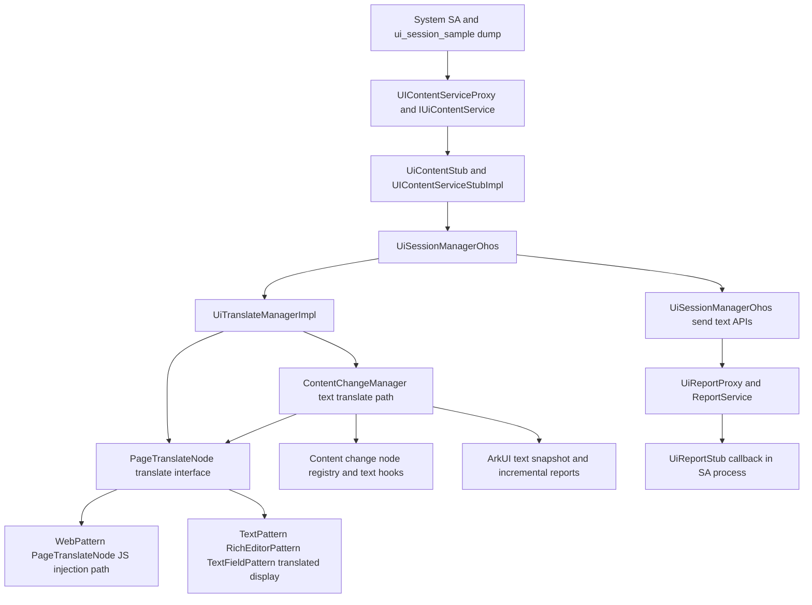
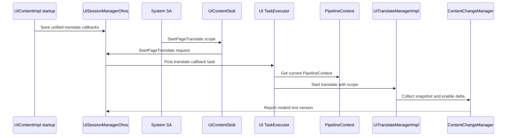
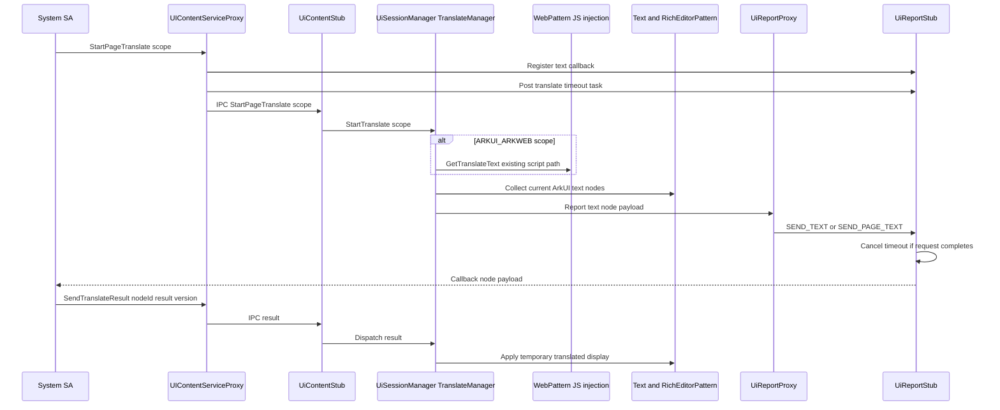
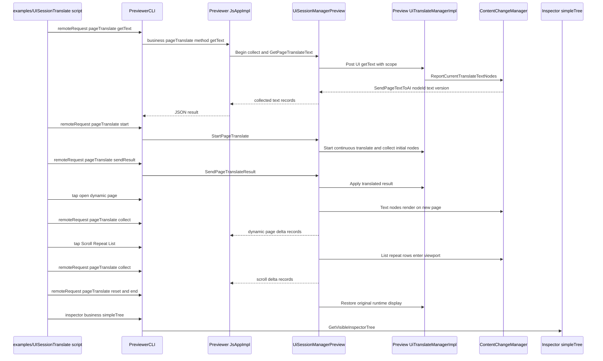
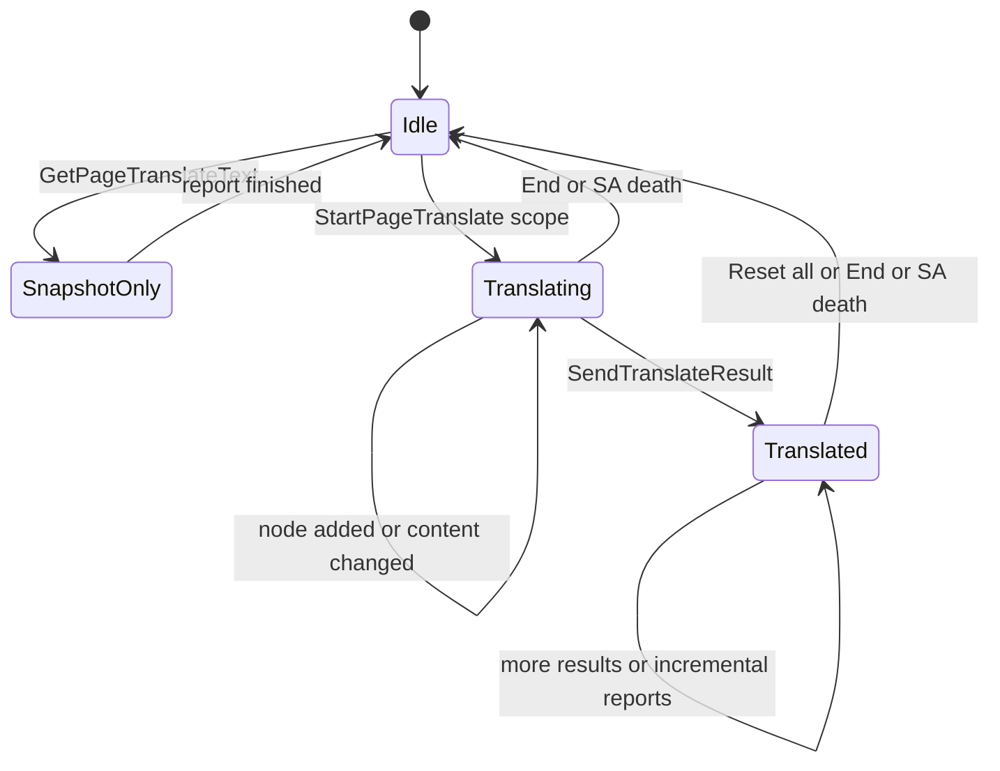

# 架构设计

## 设计元数据

| 字段 | 内容 |
|------|------|
| Design ID | DESIGN-UISESSION-ARKUI-TEXT-TRANSLATE |
| 关联需求 | `proposal.md` |
| 关联 Epic | N/A |
| 目标 Feature | FEAT-UISESSION-UNIFIED-TEXT-TRANSLATE |
| 复杂度 | 标准 + 安全/性能专项 |
| 目标版本 | 未指定，跟随需求基线 |
| Owner | ACE/Uisession/Text 模块 Owner |
| 状态 | Approved |

## 需求基线摘要

| 项 | 内容 |
|----|------|
| 问题陈述 | 现有 Uisession 连续翻译主要覆盖 Web。需要统一接口覆盖 Web 和 ArkUI 原生文本展示控件，并保持 Web 脚本注入能力兼容。 |
| 核心目标 | 单次获取页面文本、Start/End 连续翻译、Reset 恢复原文、范围入参、ArkUI 临时译文布局展示、SA 死亡恢复、模拟 SA dump 验证。 |
| 不做范围 | 不新增 ArkTS/Public API；不覆盖输入类控件用户可编辑文本、Canvas、自绘、OCR；TextInput 仅覆盖空内容时实际展示的 placeholder 提示文本；不重写 Web 脚本注入底层实现；不修改应用原始文本属性。 |
| P0 AC | AC-1 至 AC-12、AC-14、AC-14a、AC-15 至 AC-25 |

## 上下文和现状

### 涉及仓和模块

| 仓库 | 模块/路径 | 当前职责 | 本 Feature 影响 |
|------|-----------|----------|-----------------|
| ace_engine | `interfaces/inner_api/ui_session/ui_content_service_interface.h` | 定义 SA 可调用的 `IUiContentService` IPC 接口，现有 Web 翻译 transaction 位于 `GET_WEB_TRANSLATE_TEXT` 到 `END_WEB_TRANSLATE` | 新增统一文本翻译接口、参数模型和 transaction code，保留现有 Web 接口兼容 |
| ace_engine | `interfaces/inner_api/ui_session/ui_content_proxy.h` / `adapter/ohos/entrance/ui_session/ui_content_proxy.cpp` | SA 侧 proxy，注册 `UiReportStub` 回调并发起 IPC | 增加统一接口 proxy 方法，注册文本回调，发送范围入参 |
| ace_engine | `interfaces/inner_api/ui_session/ui_report_stub.h` / `adapter/ohos/entrance/ui_session/ui_report_stub.cpp` | 保存 SA 侧回调并接收 UI 上报 | 增加统一文本节点回调模型，或复用现有回调承载兼容格式 |
| ace_engine | `interfaces/inner_api/ui_session/ui_report_proxy.h` / `adapter/ohos/entrance/ui_session/ui_report_proxy.cpp` | UI 侧 report proxy，通过 `SEND_TEXT` 上报 Web 文本 | 增加统一文本节点上报接口或扩展 `SEND_TEXT` payload |
| ace_engine | `adapter/ohos/entrance/ui_content_impl.*` | UIContent 启动时把 inspector、Web 注册、content change、选中文本等 Uisession 回调保存到 `UiSessionManager`，回调执行时通过 `TaskExecutor` 切到 UI 线程访问 `PipelineContext` | 增加统一页面文本翻译的启动期回调注册，避免 IPC 入口直接跨线程访问 Pipeline |
| ace_engine | `adapter/ohos/entrance/ace_container.cpp` | 创建 `UiTranslateManagerImpl`，同时保存到 `UiSessionManager` 的 instanceId map 和当前 `PipelineContext` | 继续复用 translate manager 注入方式，统一翻译新增 ArkUI 分支不另建 manager |
| ace_engine | `adapter/ohos/entrance/ui_session/ui_session_manager_ohos.*` | 保存 report proxy、管理进程注册、分发 translate manager | 增加统一翻译状态管理；扩展 SA 死亡恢复逻辑 |
| ace_engine | `interfaces/inner_api/ui_session/ui_translate_manager.h` / `adapter/ohos/entrance/ace_translate_manager.cpp` | Web translate manager，遍历 listener、调用 WebPattern、回填结果、Reset | 扩展为 Web + ArkUI 文本节点统一管理；listener 容器统一保存 `WeakPtr<PageTranslateNode>`；Web 脚本注入 hook 迁移到 `PageTranslateNode`，仅 WebInfo/image 查询局部转回 `WebPattern` |
| ace_engine | `frameworks/core/pipeline_ng/pipeline_context.*` | 保存 `UiTranslateManagerImpl`，已持有 `ContentChangeManager` | 通过现有 `ContentChangeManager` 暴露 ArkUI 文本节点翻译收集/增量能力 |
| ace_engine | `frameworks/core/components_ng/manager/content_change_manager` | 已管理 content change 节点、Text AABB 收集、文本变化上报、dump 记录 | 增强为 ArkUI 文本翻译节点管理承载点，新增独立待翻译文本容器和独立注册/反注册入口管理节点、版本、增量上报和恢复；不得依赖 `AddOnContentChangeNode` / `RemoveOnContentChangeNode` 这类纯内容变化监听接口 |
| ace_engine | `frameworks/core/components_ng/pattern/text` | Text/Span/styled string 布局与绘制 | 增加可翻译文本提取、运行时译文展示、恢复原文、变化上报 |
| ace_engine | `frameworks/core/components_ng/pattern/rich_editor` | RichEditor 内容布局、只读/编辑态展示 | 增加只读展示内容的翻译节点能力 |
| ace_engine | `frameworks/core/components_ng/pattern/text_field` | TextInput/TextArea 输入内容和 placeholder 布局绘制 | 增加空内容 TextInput placeholder 提示文本的提取、运行时译文展示、恢复原文和 Inspector DFX；用户可编辑文本不进入翻译范围 |
| ace_engine | `frameworks/core/components_ng/pattern/web` | Web 文本翻译通过 JS 注入提取/回填 | `WebPattern` 继承 `PageTranslateNode`，统一接口的页面所有内容模式通过接口委托现有 Web JS 注入实现，不再依赖 `Pattern` 基类翻译虚函数 |
| ace_engine | `interfaces/inner_api/ui_session/ui_session_sample` | 模拟 SA dump 调用入口 | 增加 dump 命令覆盖新增接口和参数 |
| ace_engine | `adapter/preview/entrance` | Preview 运行环境的 container、translate manager、ui_session manager | 增加 Host Preview 环境下的统一页面翻译模拟入口，允许 PreviewerCLI 通过 `remoteRequest` 触发 getText/start/sendResult/reset/end |
| OpenHarmony | `ide/tools/previewer` | Previewer/PreviewerCLI host 工具 | 扩展 `remoteRequest` 通用业务分发与 timeout 参数，`pageTranslate` 业务模拟 Uisession 调用；`inspector --business simpleTree` 辅助抓取可见控件树 |
| ace_engine | `examples/UISessionTranslate` | 独立 Host Preview 测试应用与脚本 | 承载可预测 ArkUI 文本节点，脚本执行 getText、start、sendResult、reset、end 和 simpleTree 核对 |

### 当前实现基线与待补差距

| 位置 | 当前实现基线 | 待补差距 |
|------|--------------|----------|
| `interfaces/inner_api/ui_session/ui_content_service_interface.h:125` / `:419` | 已存在 `GET_PAGE_TRANSLATE_TEXT`、`START_PAGE_TRANSLATE`、`END_PAGE_TRANSLATE`、`RESET_PAGE_TRANSLATE`、`SEND_PAGE_TRANSLATE_RESULT`、`GET_CURRENT_ABILITY_LANGUAGE_INFO` transaction 和 `IUiContentService` 虚接口声明 | 不重复新增平行 transaction/接口；需要补齐参数校验、scope 语义、同步 language/region reply 语义、错误码和测试 |
| `frameworks/core/components_ng/manager/content_change_manager/content_change_manager.h:51` | 已存在 `StartTextTranslateReport`、`StopTextTranslateReport`、`ReportCurrentTranslateTextNodes`、`ReportTranslateTextNode`、`ApplyTranslateResult`、`ResetTranslateTextNode` 基础入口 | 需要把单次 snapshot 与连续翻译 active 状态解耦，补充 translate 专用容器隔离、实际绘制过滤、版本清理、纯 content change 互不影响和按需写入 |
| `frameworks/core/components_ng/pattern/text_field` | 已有 TextInput/TextArea 用户内容和 placeholder 展示分支 | 需要仅在 TextInput 内容为空且 placeholder 实际展示时提取 placeholder；译文作为运行时状态参与 placeholder 布局/绘制，原 placeholder 与用户 text 不变；一旦用户内容非空则不提取、不回填并清理临时 placeholder 译文 |
| `adapter/ohos/entrance/ui_session/ui_report_stub.cpp:586` | `HandlePageTranslateCallbackTimeout` 已能在 timeout 时清 callback | 需要增加 requestId 校验、通知 `UiSessionManagerOhos`/`UiTranslateManagerImpl` 做 End/Reset 级现场清理、取消 watchdog、定义迟到回调处理 |
| Web 翻译链路 | Web 内容翻译已通过现有脚本注入提取/回填实现 | 新统一接口的 `ARKWEB_ONLY`/`ARKUI_ARKWEB` 只委托和覆盖该能力，不重写脚本注入底层 |

### 适用架构规则

| Rule ID | 适用原因 | 设计结论 | 验证方式 |
|---------|----------|----------|----------|
| OH-ARCH-LAYERING | SA 通过 innerAPI 调用 ArkUI，ArkUI 通过 report 回调上报文本 | 保持 SA -> `IUiContentService` -> `UiSessionManager` -> `UiTranslateManager` -> Pattern 的方向；UI 上报走 `ReportService` | 代码审查、单测 |
| OH-ARCH-SUBSYSTEM | 涉及 ArkUI 内部模块与系统 SA | 不新增跨仓依赖，不引入新子系统 | 编译验证 |
| OH-ARCH-IPC-SAF | 涉及 SA IPC 和跨进程文本传输 | 新接口只在 Uisession innerAPI 内扩展；不新增 Public API 或应用权限 | IPC 单测、dump 验证 |
| OH-ARCH-API-LEVEL | 修改 innerAPI，不涉及 SDK d.ts | innerAPI 命名使用页面文本而非 Web-only 语义；老 Web 接口保留 | API 审查 |
| OH-ARCH-COMPONENT-BUILD | 可能新增源文件和测试 | BUILD.gn 按最小影响更新，只纳入 ace_engine 相关目标 | 构建 |
| OH-ARCH-ERROR-LOG | 文本内容敏感 | 对 SA 不输出正文以外多余 UI 内部字段；日志不输出正文，仅输出 nodeId、长度、范围、错误码，UI 内部可记录 changeType/sourceType | 单测/日志审查 |

## 不涉及项确认

| 维度 | 需求阶段结论 | 设计阶段处理方式 | 设计结论 |
|------|---------|-------------|----------|
| 性能 | 是 | 展开设计 | 增量上报去重；只在 Start 后按需写入 translate 容器；无连续翻译任务时不维护版本/hash/pending；译文变化才触发布局刷新 |
| 安全与权限 | 是 | 展开设计 | 沿用系统 SA innerAPI 边界；日志不打印正文；不新增权限 |
| 兼容性 | 是 | 展开设计 | 保留现有 Web 接口和脚本注入路径；新增统一接口覆盖 Web 能力 |
| API/SDK | 是 | 展开设计 | 只新增/扩展 innerAPI，不改 ArkTS/Public API |
| IPC/跨进程 | 是 | 展开设计 | 增加统一 request/result/report payload，明确范围入参 |
| 构建与部件 | 是 | 展开设计 | 预计只改 ace_engine 相关 BUILD.gn 和测试目标 |
| 数据迁移 | N/A | 保持 N/A | 无持久化数据 |

## 关键设计决策

| 决策 ID | 问题 | 推荐方案 | 探索过的替代方案 | 取舍理由 | 影响 |
|---------|------|----------|-----------------|------|------|
| ADR-1 | 新接口与现有 Web 接口关系 | 新增统一页面文本翻译接口，保留现有 Web-only 接口并让新接口在全页面模式复用 Web 脚本注入实现 | 直接改名替换 Web 接口；只新增 ArkUI-only 接口 | 保留兼容性，同时满足 SA 通过入参选择全页面或 ArkUI-only 的需求 | 增加 proxy/stub/report 数据模型，Web 逻辑不重写 |
| ADR-2 | 处理范围如何表达 | 使用 request 参数中的 `scope` bitmask，按节点来源类型组合，例如 `ARKWEB_ONLY`、`ARKUI_ONLY`、`ARKUI_ARKWEB`、`XCOMPONENT`、`CANVAS_NODE`；当前 SA 获取页面内容推荐使用 `ARKUI_ARKWEB`，`XCOMPONENT`/`CANVAS_NODE` 作为后续扩展保留字段 | 用 bool；拆成两个接口；单选 enum | bitmask 便于 SA 精确组合处理范围，也便于后续扩展三方框架或其他承载节点；一个统一接口减少 SA 调用分叉 | 需要定义参数校验、默认值和未知 bit 处理 |
| ADR-3 | 文本节点上报模型 | 对翻译 SA 暴露最小 payload：`nodeId`、`text`、`version`；`sourceType`、`changeType`、`scope` 仅作为 UI 内部调度/DFX 字段 | 继续沿用 `nodeId + string`；向 SA 暴露 sourceType/changeType；按控件类型分别定义结构 | 翻译 SA 只需要原文和回填校验版本即可完成翻译；减少接口耦合，避免 SA 依赖 UI 内部节点来源和变化类型 | report proxy/stub 的对外 callback payload 简化，内部仍可保留 DFX 字段 |
| ADR-4 | ArkUI 译文展示方式 | Pattern 保存临时译文状态，布局阶段优先使用译文内容，不更新原始 layout property / span / placeholder 内容 | 直接写回 `TextLayoutProperty::Content`、Span 内容或 TextInput placeholder 属性；用 overlay 覆盖绘制 | 运行时状态兼容性最好，Reset/End 可恢复原文；overlay 难以正确参与布局；TextInput 用户输入内容必须保持不被覆盖 | Text/RichEditor/TextField Pattern 需增加运行时 translate 状态和 dirty 标记 |
| ADR-5 | 连续翻译变化上报 | Start 后启用 manager 会话状态，文本节点只有在产生实际文本绘制或已绘制文本内容变化时向 manager 报告，空内容 TextInput placeholder 仅在实际展示时报告，manager 去重后通过 report proxy 上报 `nodeId/text/version` | SA 轮询；全量上报页面所有文本；向 SA 暴露 changeType；节点上树/占位布局即上报；上报 TextInput 用户输入内容 | 主动增量符合需求且 IPC 数据量可控；全量上报和占位布局提前上报都有性能风险；翻译 SA 无需感知变化原因；用户输入内容不跨进程传输 | 需要内容版本/哈希，changeType 仅保留为 UI 内部 DFX/去重字段；TextInput placeholder 与用户内容分支必须隔离 |
| ADR-6 | SA 死亡恢复 | 在现有 report death recipient 中对 translate 会话执行全量 Reset/End，恢复 Web 和 ArkUI 原文并停止上报 | 等下一次 SA 连接再恢复；只清理 callback | 防止译文残留和继续上报，符合异常恢复 AC | `UiSessionManagerOhos` 死亡监听需覆盖统一 translate process key |
| ADR-7 | 真机验证方式 | 在 `ui_session_sample` 新增 dump 命令覆盖统一接口、范围入参、回填、Reset/End | 只依赖单元测试；另写临时工具 | sample SA 已是现有调试入口，改动最小且便于终端复现 | 需要补 handler 和安全日志输出 |
| ADR-8 | ArkUI 文本节点管理边界 | 增强现有 `ContentChangeManager`，在其中新增独立待翻译文本容器和 translate 专用注册/反注册接口，由 `UiTranslateManagerImpl` 编排调用；Text/RichEditor/TextField Pattern 在自身上树/离树/文本绘制变化时调用 translate 专用入口，与纯 content change 监听入口隔离 | 新增 `TextTranslateNodeManager`；把所有 ArkUI 节点状态放进 `UiTranslateManagerImpl`；每个 Pattern 自己上报 IPC；直接复用 `AddOnContentChangeNode` / `RemoveOnContentChangeNode` 纯内容变化监听入口 | `ContentChangeManager` 已有文本展示类控件变化管理、Text AABB 收集、content change dump 和 taskExecutor，增强它能复用内部基础设施，避免新增小管理类；独立入口和独立容器可防止翻译监听改变原 content change detect 行为 | `ContentChangeManager` 增加 translate 专用入口、容器、节点版本、快照/增量接口和单测；纯 content change start/stop 不得清理或触发翻译容器，翻译 start/end 不得影响纯 content change 容器 |
| ADR-9 | 翻译请求 DFX 和超时清理 | 复用 `Connect` 传入的 `EventHandler`，在 `UiReportStub` 为翻译请求投递 timeout task；超时记录故障日志、清 callback、触发会话现场清理 | 不做超时；由 SA 自行超时；只清 callback 不清 UI 现场 | 现有 `GetInspectorTree` 已采用 EventHandler timeout 清 callback；翻译涉及临时 UI 状态，超时必须清理现场避免译文/会话残留 | 需要新增 translate timeout task name、注册/取消/超时处理函数和测试 |
| ADR-10 | Host Preview 验证方式 | 通过 PreviewerCLI `remoteRequest` 的 `business + method` 通用分发模拟 Uisession 调用，`pageTranslate/getText/start/collect/sendResult/reset/end/simulateTimeoutCleanup` 只作为 host 验证能力；`sendResult` 必须支持 `{"results":[...]}` 批量译文，一次请求回填多个节点；使用 `inspector --business simpleTree` 辅助核对真实节点和临时译文字段 | 只依赖真机 dump；为每个函数新增独立 PreviewerCLI 命令；把 preview 模拟命令暴露为产品接口；脚本按节点循环多次发送译文 | Preview 环境能快速验证 ArkUI 文本提取、连续翻译增量、译文批量回填、异常清理和恢复链路，减少真机 SA 依赖；通用 remoteRequest 避免命令膨胀；该能力明确限定为验证工具，不改变正式 innerAPI | 需要 `adapter/preview/entrance`、`ide/tools/previewer` 和 `examples/UISessionTranslate` 脚本配合，SDK 编译和 Host Preview 脚本作为 TASK-007 验证；脚本覆盖初始页面、动态新页面、List 滚动 repeat 文本进入视口、批量回填和 timeout cleanup |
| ADR-11 | Inspector 译文 DFX | 在 `PipelineContext::GetInspectorTree` 触发的文本类控件 JSON 组装中，若当前节点存在运行时临时译文，则额外输出 `translated` 字段；原 `content` 保持原文。TextInput placeholder 译文额外输出 `translatedPlaceholder`，原 `placeholder` 与当前 `text` 保持不变 | 将 `content` 或 `placeholder` 替换为译文；不输出译文；只在日志中输出 | 便于 DFX 和 Preview 对比确认译文是否真正进入临时展示状态，同时不破坏现有 inspector 依赖原始属性的行为；TextInput 用户内容不会被译文覆盖 | 只在临时译文存在时输出，字段内容属于用户可见文本，采集权限和使用边界与 inspector tree 保持一致 |
| ADR-12 | TextInput placeholder 边界 | 仅当 TextInput 当前用户内容为空且 placeholder 实际展示时，将 placeholder 作为可翻译展示文本；译文保存在 Pattern 运行时状态并用于 placeholder 布局/绘制，原 placeholder/text 不变；用户填充 text 不提取、不回填 | 翻译所有输入框内容；完全排除 placeholder；写回 placeholder 属性 | 满足预置提示文本可翻译，同时避免跨进程传输用户输入内容；与“运行时译文展示、不改原属性”原则一致 | TextFieldPattern 增加 placeholder 专用提取/译文/reset/inspector 字段，Preview 样例覆盖空 placeholder 与用户填充值排除 |
| ADR-13 | 译文 unicode 转义规范化 | `SendPageTranslateResult` 仅在翻译结果字段上兼容 `\\uXXXX` 字面量，进入 Web/ArkUI 回填前解码为 UTF-8；支持单条对象、顶层数组和 `results` 数组批量对象；已是 UTF-8 的译文保持不变，非法 unicode 转义保持原字面量 | 修改全局 JSON parser；要求 SA 必须只传 UTF-8；在 Pattern 层分别处理；只支持单节点回填 | sample dump、Windows shell、PreviewerCLI 等验证通路可能把中文转成双重转义字面量；统一在翻译结果入口处理，避免各 Pattern 重复处理，也避免改变其他 JSON 调用行为；批量回填可验证多个节点一起发送能力，避免脚本按节点多次发送掩盖协议缺口 | OHOS/Preview `ace_translate_manager` 复用同一 helper；Uisession UT 覆盖中文、合法/非法 `\\uXXXX`、surrogate pair、普通反斜杠路径和批量结果解析；Preview 脚本用批量 `results` 发送首屏/增量译文并断言中文渲染 |
| ADR-14 | 统一翻译节点抽象接口 | `PageTranslateNode` 承载 ArkUI 节点的 nodeId、可翻译文本提取、译文回填和 Reset；同时承载 Web 旧脚本注入翻译 hook 的默认空实现。`TextPattern`、`TextFieldPattern` 直接实现，`RichEditorPattern` 通过 `TextPattern` 复用，`WebPattern` 继承该接口并实现 Web hook；`ContentChangeManager` 与 `UiTranslateManagerImpl` 均只缓存 `WeakPtr<PageTranslateNode>` | 在 `Pattern` 基类增加或保留默认翻译虚函数；manager 缓存 `WeakPtr<FrameNode>` 后再取 Pattern；为每类控件写独立分发分支 | 避免扩大所有 Pattern 默认虚表；Web 旧能力和 ArkUI 原生控件走同一抽象，后续可翻译业务按需继承接口；manager 与具体控件解耦，UT 可用轻量接口桩覆盖版本、回填、Reset 分支 | 删除 `Pattern` 默认翻译虚接口；`WebPattern` 迁移到 `PageTranslateNode`；manager 注册/回填/Reset 均通过接口调用，WebInfo/image 等 Web 专属能力才局部 `DynamicCast<WebPattern>` |

## 图表规范

所有流程图、架构图、设计图和状态机图必须严格使用 Mermaid fenced code block 表达，格式为 <code>&#96;&#96;&#96;mermaid</code>；不得使用 ASCII/text 图、PlantUML、图片或混合语法。复杂图可拆成多个 Mermaid 图，节点文本保持短句，跨模块关系通过边和子图表达。

## 设计骨架

### 骨架范围

| 骨架项 | 目标 | 不包含 | 验证方式 |
|--------|------|--------|----------|
| API/接口骨架 | 新增统一文本翻译 request/result/report 数据结构、当前 Ability 语言地区查询数据结构和 `IUiContentService` 方法 | 完整文本解析与布局实现 | 编译 + IPC 单测 |
| 启动注册骨架 | 扩展 `UIContentImpl::InitUISessionManagerCallbacks` 注册统一翻译 UI 线程回调和当前 Ability 语言地区同步读取函数 | 完整翻译逻辑 | 启动/回调单测 |
| 模块骨架 | 扩展 `UiTranslateManagerImpl` 管理范围、状态、ArkUI listener、Web 委托 | 性能优化细节 | 单元测试 |
| Pattern 骨架 | Text/RichEditor/TextField 提供提取、临时译文、Reset 接口；TextField 仅处理空内容 TextInput placeholder | 全部复杂富文本边界、用户输入内容翻译 | Text/RichEditor/TextInput placeholder 单元测试 |
| Dump 骨架 | `ui_session_sample` 新增 dump handler 和参数解析 | 自动化脚本 | 真机 dump 手工验证 |
| Preview 骨架 | `examples/UISessionTranslate` 提供稳定 ArkUI 文本页面、动态页面和 List 滚动 repeat 文本场景，host 脚本通过 PreviewerCLI remoteRequest 触发统一翻译模拟能力 | 设备侧 binder 行为、正式 SA 进程 | Host Preview 脚本 |

### 骨架 Spec 拆分

| Task ID | 目标 | 受影响文件 | AC |
|---------|------|------------|-----|
| TASK-SKELETON-1 | 建立统一 innerAPI 和 IPC payload | `ui_content_service_interface.h`, `ui_content_proxy.*`, `ui_content_stub.*`, `ui_report_proxy.*`, `ui_report_stub.*` | AC-1, AC-2, AC-18, AC-21, AC-22 |
| TASK-SKELETON-2 | 建立 manager 会话状态、启动注册回调、Ability 语言地区读取和 Web 兼容委托 | `ui_content_impl.*`, `ace_container.cpp`, `ui_session_manager_ohos.*`, `ui_translate_manager.h`, `ace_translate_manager.*` | AC-4, AC-5, AC-8, AC-15, AC-16, AC-17, AC-21, AC-22 |
| TASK-SKELETON-3 | 增强 `ContentChangeManager` 并建立 ArkUI 文本翻译节点抽象接口 | `content_change_manager.*`, `page_translate_node.h`, `text_pattern.*`, `rich_editor_pattern.*`, `text_field_pattern.*`, `pipeline_context.*` | AC-6, AC-7, AC-9, AC-12 |
| TASK-SKELETON-4 | 增加模拟 SA dump 命令 | `ui_session_sample/ui_sa_service.*` | AC-18, AC-19, AC-20, AC-21, AC-22 |
| TASK-SKELETON-5 | 增加 Host Preview 验证入口、测试应用和脚本 | `adapter/preview/entrance`, `ide/tools/previewer`, `examples/UISessionTranslate` | AC-23, AC-24, AC-25 |

## 后续 Spec 拆分

| Spec | 目的 | 依赖 | 输出 |
|------|------|------|------|
| spec.md | 固化行为、AC、API 影响、验证映射 | 需求基线 + 本 Design | Feature 规格 |
| execution-plan.md | 将接口、manager、Pattern、dump、测试拆成可执行任务 | design/spec 审批 | Stage 3 计划 |

## 架构图



## 数据流/控制流

| 步骤 | 调用方 | 被调用方 | 数据/接口 | 说明 |
|------|--------|----------|-----------|------|
| 1 | SA | `UIContentServiceProxy` | `GetPageTranslateText(request, callback)` | 单次获取；request 包含 scope |
| 2 | SA | `UIContentServiceProxy` | `StartPageTranslate(request, callback)` | 启动连续翻译；注册 callback |
| 3 | Stub | `UiSessionManagerOhos` | request JSON/parcel | 校验参数，记录 translate process |
| 4 | Manager | `UiTranslateManagerImpl` | scope, continued flag | 全页面模式同时调 Web 和 ArkUI；ArkUI-only 只调 ArkUI |
| 5 | Web | `WebPattern` / `PageTranslateNode` | existing `GetTranslateText` hook | WebPattern 通过 `PageTranslateNode` 接口继续脚本注入提取 Web 文本 |
| 6 | ArkUI manager | `ContentChangeManager` | nodeId/text/version + internal DFX info | 使用 translate 专用待翻译文本容器，遍历/收集当前可翻译 ArkUI 文本节点，维护版本和去重 |
| 7 | UI | `UiReportProxy` | text node report | 上报给 `UiReportStub` 回调 |
| 8 | SA | `SendTranslateResult` | nodeId + result(s) + version | 回填译文 |
| 9 | Pattern | Layout/Paint | temporary translated content | 译文参与布局，不改原属性 |
| 10 | SA death/End/Reset | Manager/Pattern/Web | reset/end | 恢复原文并停止变化上报 |
| 11 | Timeout | `UiReportStub` / `UiSessionManagerOhos` | timeout task | 长时间未收到预期响应时记录故障日志，清 callback，触发 End/Reset 清理 |
| 12 | SA | `UIContentServiceProxy` / `UiSessionManagerOhos` | `GetCurrentAbilityLanguageInfo(language, region)` | 同步 IPC 获取当前 Ability 实例生效的 language/region，不触发页面遍历或翻译状态变更 |
| 13 | Host Preview script | `PreviewerCLI remoteRequest` | `business=pageTranslate`, `method=getText/start/collect/sendResult/reset/end` | 在 host 上模拟 Uisession 翻译调用，用于验证 ArkUI 文本提取、连续翻译增量、译文回填和恢复 |
| 14 | Host Preview script | `PreviewerCLI inspector` | `business=simpleTree` | 抓取 uisession 可见控件树，核对 getText 返回 nodeId 与真实 Text 节点一致 |

## 启动期 Uisession 回调注册增量设计

### 现有实现证据

| 代码位置 | 当前行为 | 对本设计的约束 |
|----------|----------|----------------|
| `adapter/ohos/entrance/ui_content_impl.cpp:2751` | UIContent 初始化时从 `pipeline` 取 `TaskExecutor`，调用 `InitUISessionManagerCallbacks(taskExecutor)` | 新增统一翻译回调也应在该启动阶段注册，保证 manager 在 SA IPC 到来前已有 UI 线程入口 |
| `adapter/ohos/entrance/ui_content_impl.cpp:6082` | `InitUISessionManagerCallbacks` 统一保存 inspector、Web pattern 注册、pixel/image、pageName、content change、selected text、stateMgmt、webInfo 等 Uisession callback | 新增回调应作为该函数的子步骤接入，保持 Uisession callback 初始化集中 |
| `adapter/ohos/entrance/ui_content_impl.cpp:6086` | inspector callback 使用 `weakTaskExecutor.Upgrade()`，再 `PostSyncTaskTimeout` 到 UI 线程访问 `PipelineContext` | 单次页面文本获取如果需要同步等待结果，可复用同步带超时模式，但必须明确 timeout 和现场清理 |
| `adapter/ohos/entrance/ui_content_impl.cpp:6102` | Web pattern 注册 callback 保存到 `UiSessionManager`，执行时 `PostTask` 到 UI 线程并调用 `pipeline->NotifyAllWebPattern(isRegister)` | `ARKUI_ARKWEB` 范围仍复用 Web 注册/通知链路，不从 ArkUI 文本链路重写 Web 注入 |
| `adapter/ohos/entrance/ui_content_impl.cpp:6643` | content change start/stop callback 保存到 `UiSessionManager`，执行时切到 UI 线程，遍历 containers 并调用 `ContentChangeManager::StartContentChangeReport/StopContentChangeReport` | ArkUI 文本连续翻译的 Start/End 可复用该“manager 保存 callback + UI 线程遍历 container + ContentChangeManager 执行”的模式 |
| `adapter/ohos/entrance/ace_container.cpp:2727` | 创建 `UiTranslateManagerImpl(taskExecutor_)` | 新能力继续扩展现有 translate manager，不增加独立小 manager |
| `adapter/ohos/entrance/ace_container.cpp:2734` | `UiSessionManager::SaveTranslateManager(uiTranslateManager, instanceId_)` 保存 instanceId 到 manager 映射 | SA 触发翻译时应通过当前 instanceId 找当前 translate manager，避免跨窗口误分发 |
| `adapter/ohos/entrance/ace_container.cpp:2737` | `pipeline->SaveTranslateManager(uiTranslateManager)` 将同一 manager 注入 `PipelineContext` | UI 线程侧可以从 `PipelineContext` 取 translate manager 并访问 Web/ArkUI 节点 |
| `adapter/ohos/entrance/ui_session/ui_session_manager_ohos.cpp:519` | `GetCurrentTranslateManager` 通过 current instanceId callback 从 map 中取当前 translate manager | 新统一接口需继续使用 current instanceId 分发，必要时扩展为 windowId/instanceId 显式入参 |
| `adapter/ohos/entrance/ui_session/ui_session_manager_ohos.cpp:173` | report remote 死亡监听中若 translate 进程死亡会 `ResetTranslate(-1)` 并清 process map | 统一翻译必须复用/扩展该死亡恢复入口，确保 ArkUI 临时译文和 ContentChangeManager 会话同步清理 |
| `adapter/ohos/entrance/ui_content_impl.cpp:1568` / `adapter/ohos/entrance/ui_content_impl.cpp:2287` | UIContent 从 Ability `ResourceManager` 的 `localeInfo` 读取 language/region/script，并写入 `AceApplicationInfo::SetLocale` | 新接口应返回当前 Ability 实例已生效 locale；实现时可复用当前实例 resource config 或 `AceApplicationInfo` 已生效字段，但不得读取系统全局语言替代实例配置 |
| `frameworks/core/common/ace_application_info.h:147` | `AceApplicationInfo` 已提供 `GetCountryOrRegion()`、`GetLanguage()`、`GetLocaleTag()` | 数据模型只需向 SA 暴露 language/region，script/localeTag 可作为内部 DFX 字段，不作为首期接口 payload |

### 新增回调边界

| 新增回调 | 注册位置 | 保存位置 | UI 线程动作 | 说明 |
|----------|----------|----------|-------------|------|
| `SaveGetPageTranslateTextFunction` | `UIContentImpl::InitUISessionManagerCallbacks` | `UiSessionManagerOhos` | 根据 scope 调 `UiTranslateManagerImpl` 收集 Web/ArkUI 快照；ArkUI 分支委托 `ContentChangeManager` | 单次获取能力，不开启连续上报状态 |
| `SaveStartPageTranslateFunction` | `UIContentImpl::InitUISessionManagerCallbacks` | `UiSessionManagerOhos` | 设置 translate session scope，收集当前节点并启动 ArkUI 增量监听；`ARKUI_ARKWEB` 同时通知 Web 走现有 Start | 连续翻译 Start 入口 |
| `SaveEndPageTranslateFunction` | `UIContentImpl::InitUISessionManagerCallbacks` | `UiSessionManagerOhos` | 停止 ArkUI 增量监听，清理临时译文状态；`ARKUI_ARKWEB`/Web scope 调现有 Web End/Reset | End 后恢复原文展示 |
| `SaveResetPageTranslateFunction` | `UIContentImpl::InitUISessionManagerCallbacks` | `UiSessionManagerOhos` | 按 nodeId 或 all 重置 Pattern 临时译文和 ContentChangeManager 版本状态 | 支持单节点和全量 reset |
| `SaveGetCurrentAbilityLanguageInfoFunction` | `UIContentImpl::InitUISessionManagerCallbacks` | `UiSessionManagerOhos` | 在当前 instance 的 UIContent/Container 上下文同步读取已生效 `language` 和 `region`，由 IPC reply 返回 SA | 不进入 translate manager，不读页面文本，不改变 Start/End/Reset 状态 |

新增翻译 callback 应遵循现有模式：只在 `UiSessionManagerOhos` 保存可调用函数，不保存 `PipelineContext` 强引用；执行时通过 `weakTaskExecutor` 投递到 UI 线程，并在 task 内部获取当前 `PipelineContext` 或遍历 `AceEngine::Get().NotifyContainers`。跨进程 IPC stub 只负责解析参数、记录 processId/requestId、调用 `UiSessionManager`，不得直接访问 Pattern 或 `ContentChangeManager`。当前 Ability 语言地区查询是只读简单查询能力，对 SA 暴露同步 IPC：proxy 使用同步 `SendRequest`，stub 在同一个 transaction 的 reply 中写回 `language/region` 和结果码；不注册 report callback，不投递 timeout/watchdog，也不得触发翻译现场清理。



## 时序设计



### Host Preview 验证时序



## 数据模型设计

```cpp
enum class TranslateContentScope : int32_t {
    ARKWEB_ONLY = 1 << 0,
    ARKUI_ONLY = 1 << 1,
    XCOMPONENT = 1 << 2,
    CANVAS_NODE = 1 << 3,
    ARKUI_ARKWEB = static_cast<int32_t>(ARKUI_ONLY) | static_cast<int32_t>(ARKWEB_ONLY),
    PAGE_ALL = static_cast<int32_t>(ARKUI_ARKWEB) | static_cast<int32_t>(XCOMPONENT) |
               static_cast<int32_t>(CANVAS_NODE),
};

enum class TranslateNodeSourceType : int32_t {
    ARKUI_TEXT = 0,
    ARKUI_RICH_EDITOR = 1,
    WEB = 2,
    ARKUI_TEXT_INPUT_PLACEHOLDER = 3,
};

enum class TranslateChangeType : int32_t {
    SNAPSHOT = 0,
    NODE_ADDED = 1,
    CONTENT_CHANGED = 2,
};

struct TranslateTextRequest {
    TranslateContentScope scope;
    std::string extraData;
};

struct TranslateTextNode {
    int32_t nodeId;
    std::string text;
    int64_t version;
};

struct TranslateTextNodeDfxInfo {
    int32_t nodeId;
    TranslateNodeSourceType sourceType;
    TranslateChangeType changeType;
    TranslateContentScope scope;
};

struct TranslateResult {
    int32_t nodeId;
    std::string translatedText;
    int64_t version;
};

struct AbilityLanguageInfo {
    std::string language;
    std::string region;
};
```

当前阶段仅实现 `ARKWEB_ONLY`、`ARKUI_ONLY`、`ARKUI_ARKWEB` 对应处理；`XCOMPONENT` 和 `CANVAS_NODE` 是已定义保留 bit，可被解析但不触发文本提取或回填。scope 包含未定义 bit 时必须返回参数错误，不进入会话、不注册 callback、不产生上报。

`AbilityLanguageInfo` 仅承载当前 Ability 实例实际生效的语言和地区。`language` 使用小写语言码，`region` 使用大写国家/地区码；如果实例配置包含 script 或完整 localeTag，可在 UI 内部 DFX 中记录，但首期不向 SA 暴露，避免 SA 依赖 UI 内部 locale fallback 细节。

**存储方案：**

| 数据类型 | 存储方式 | 位置 | 生命周期 |
|----------|----------|------|----------|
| 会话状态和 scope | 内存 | `UiTranslateManagerImpl` | Start 到 End/Reset/SA death |
| 原文属性 | 现有 LayoutProperty/Span/RichEditor 模型 | Pattern | 应用生命周期，不修改 |
| 临时译文 | Pattern 内存状态 | Text/RichEditor/TextField Pattern | 回填到 Reset/End/SA death；TextField placeholder 译文仅在用户内容为空时生效 |
| ArkUI 待翻译节点弱引用 | `WeakPtr<PageTranslateNode>` set/map | `ContentChangeManager` translate 专用容器 | 节点上树到离树；离树仅触发 UI 内部清理，不生成 changeType；与纯 content change 节点集合分离 |
| 内容版本/摘要 | Pattern/Manager 内存 | Text/RichEditor/TextField + `ContentChangeManager` | 用于回填校验和去重 |
| 翻译请求 DFX 状态 | 内存 + EventHandler task | `UiReportStub` | 从请求发起到回调完成/超时/取消 |

## 算法与状态机



关键算法：

| 算法 | 说明 |
|------|------|
| 页面文本收集 | 从当前 pipeline/page 根节点遍历，按 scope bitmask 过滤节点来源；未置位的来源不进入对应分支 |
| ArkUI 文本节点识别 | `ContentChangeManager` 从 `FrameNode` 获取 Pattern 后仅处理可 `DynamicCast<PageTranslateNode>` 的节点；当前实现覆盖 `Text`、其 Span/styled string 内容、`RichEditor` 只读展示内容，以及空内容 `TextInput` 当前实际展示的 placeholder 提示文本；排除 TextInput/TextArea 用户可编辑文本、Canvas；仅占位布局、没有实际文本绘制的节点不进入结果 |
| 内容变化去重 | `ContentChangeManager` 为每个节点记录 `version` 或 text hash；只有内容变化或首次上报才发送 |
| 实际绘制过滤 | Pattern 或 content change hook 需要提供“本帧/当前状态是否有实际文本绘制内容”的判断；snapshot 和增量上报共用该过滤条件，待后续首次真实绘制文本时按 `NODE_ADDED` 或 snapshot 规则上报 |
| 回填校验 | nodeId 存在且 version 匹配时应用；否则单条忽略。`SendPageTranslateResult` 接收单对象、顶层数组或 `{"results":[...]}`，批量中每个结果独立校验和应用。sourceType 可作为 UI 内部辅助校验，不要求 SA 传入或感知 |
| 临时译文布局 | Pattern 在 layout paragraph 构建时优先使用临时译文，Reset 清理后使用原模型文本；TextInput 仅在内容为空且 placeholder 分支布局/绘制时使用临时 placeholder 译文，用户输入内容非空时清理或忽略 placeholder 译文 |
| 译文编码处理 | `UiTranslateManagerImpl::SendPageTranslateResult` 解析单条或批量 `translatedText/text` 后先做 unicode 转义字面量解码，再进入 Web `SendTranslateResult` 和 ArkUI `ContentChangeManager::ApplyTranslateResult`；该处理不改变 nodeId/version 校验 |
| 死亡恢复 | SA report remote death 时调用统一 `ResetTranslate(-1)` 或等价全量恢复，清理 scope 和 callbacks |
| 超时恢复 | `UiReportStub` 通过 `EventHandler` 投递翻译请求超时任务；超时后清除 pending callback，记录非正文故障日志，并通知 manager 执行 End/Reset 级别现场清理 |

单次 `GetPageTranslateText` 必须使用局部临时收集结果。不得为了复用 `ReportTranslateTextNode` 而临时置 `textTranslateActive_ = true` 后把节点写入 `translateTextNodes_` / `translateTextVersions_` 等连续翻译容器；如果必须复用已有遍历函数，应拆出 `CollectTranslateTextSnapshot` 一类纯收集 helper，返回局部 node 列表，调用结束后不遗留 active flag、版本、pending 或弱引用缓存。

## Performance & Memory Budget

| 项 | 预算/约束 | 度量方式 |
|----|-----------|----------|
| Start 初始收集 | 只在 SA 请求时遍历当前页面；不在普通页面生命周期全量扫描 | 单测统计调用次数，必要时 trace |
| 增量上报 | 仅 Start 后启用；同一节点相同内容不重复上报 | manager 单测 |
| 按需写入 | 没有连续翻译任务时，ContentChangeManager 不写入 translate 专用容器、不计算 translate version/hash、不维护 pending、不投递 translate 延迟任务 | content_change_manager 单测/trace |
| 占位布局过滤 | 未实际绘制文本的占位节点不上报，减少 IPC；实际绘制后才进入 snapshot/增量。TextInput placeholder 只有在空内容且实际展示/绘制时进入翻译范围 | Text/RichEditor/TextInput placeholder/ContentChangeManager 单测 |
| 布局刷新 | 只在译文实际变化或 Reset 时 MarkDirty；不改原属性 | Pattern 单测 |
| IPC 文本大小 | 大文本统一复用现有 `LargeStringAshmem` 共享内存方式传输；普通小 payload 可继续走 parcel 字段 | IPC 单测/日志 |
| 内存 | 保存弱引用和临时字符串；End/Reset/SA death 后清理 | 单测检查状态为空 |

## 编译验证原则

Stage 3 实现中的编译验证遵循最小相关目标原则：修改了哪个模块，就优先编译该模块所属的 GN so/组件目标和对应测试目标；不默认要求每个任务都编译整个 `ace_engine`。只有跨多个核心模块、BUILD.gn 依赖不清晰、或局部目标无法覆盖链接关系时，才升级到 `--build-target ace_engine`。

| 修改范围 | 优先验证目标 |
|----------|--------------|
| `adapter/ohos/entrance/ui_session`、`ui_content_impl.*`、`ace_translate_manager.*` | 相关 ui_session/adapter 所属 so 目标，必要时补 `ace_engine` 链接验证 |
| `frameworks/core/components_ng/manager/content_change_manager` | content_change_manager 所属组件/so 目标和对应 unittest |
| `frameworks/core/components_ng/pattern/text` | `//arkui/ace_engine/frameworks/core/components_ng/pattern/text:text_pattern` 和 text unittest |
| `frameworks/core/components_ng/pattern/rich_editor` | RichEditor 所属 pattern/组件目标和 rich_editor unittest |
| `frameworks/core/components_ng/pattern/text_field` | TextField/TextInput 所属 pattern/组件目标和相关 text_field/text_input unittest |
| `interfaces/inner_api/ui_session/ui_session_sample` | sample 所属目标和真机 dump 验证 |
| `adapter/preview/entrance`、`ide/tools/previewer`、`examples/UISessionTranslate` | `ohos-sdk` 目标和 `examples/UISessionTranslate/tools/host_preview/run_page_translate.sh` |

## 代码复用原则

Stage 3 实现应减少重复代码。翻译节点和纯 content change 共享的底层判断或数据处理逻辑，应抽成职责单一的小函数复用，而不是复制分支实现；但不得为复用而新增独立小 manager 类。优先抽取的函数包括：节点有效性判断、实际文本绘制过滤、文本摘要/version 更新、弱引用清理、非正文 DFX 摘要生成、timeout/watchdog task 注册取消。

## DFX 设计

现有 `UIContentServiceProxy::Connect` 在连接时创建 `UiReportStub`，并通过 `report_->SetEventHandler(eventHandler)` 保存 SA 传入的 `EventHandler`。`GetInspectorTree` 已在注册回调后调用 `PostGetInspectorTreeCallbackRemoveTask(timeout)`，通过 EventHandler 投递超时任务；超时后 `HandleInspectorTreeCallbackTimeout` 清理 callback。统一翻译接口沿用该 DFX 模式。

大文本 IPC 统一复用现有 `LargeStringAshmem` 共享内存封装：`adapter/ohos/entrance/ui_session/include/large_string_ashmem.h` 定义 `WriteToAshmem`/`ReadFromAshmem`，`ui_report_proxy.cpp` 已用于 inspector/webInfo 大字符串写入 parcelable ashmem，`ui_report_stub.cpp` 已通过 `ReadParcelable<LargeStringAshmem>()` 读取。统一翻译文本 payload 遇到大文本时必须走该共享内存路径，不新增自定义分片协议。

译文等待 timeout 与请求 callback timeout 分开定义：请求 callback timeout 用于清 pending callback 和现场清理；原文发给 SA 后等待译文回填的 watchdog 默认 5s。若 5s 内未收到对应 `nodeId/version` 的 `SendTranslateResult` 且 SA 未死亡，只输出非正文告警日志和现场摘要，不强制 End/Reset，不清理会话，后续迟到译文仍按 `nodeId/version` 校验处理。

| 场景 | 设计 |
|------|------|
| 单次获取长时间无回调 | `GetPageTranslateText` 注册 callback 后生成 requestId 并投递 `PageTranslateTextCallbackTimeout`；超时按 requestId 清 callback，记录故障日志，触发一次性请求现场清理 |
| Start 后初始快照长时间无回调 | `StartPageTranslate` 生成新的 requestId 并投递初始快照超时任务；超时按 requestId 清 callback，调用 End/Reset 级别清理，停止后续上报 |
| 原文发出后长时间无译文 | manager 为已发送原文的 nodeId/version 投递 5s 译文等待 watchdog；SA 未死亡时只记录告警日志，不强制结束会话、不恢复原文、不阻塞后续译文 |
| 连续翻译长时间无 SA 结果 | manager 记录最近 SA 活跃时间；默认按单节点/批次 5s 译文等待 watchdog 输出告警；只有已无 callback 或远端死亡时才清理现场 |
| Inspector tree 译文取证 | `PipelineContext::GetInspectorTree` 采集文本类节点时，若 Text/RichEditor 节点正在展示运行时临时译文，在 `$attrs` 中同时保留原文 `content` 和译文 `translated`；若 TextInput placeholder 正在展示临时译文，保留原 `placeholder` 和当前 `text`，并输出 `translatedPlaceholder`，同时可输出 `translated` 便于通用脚本核对；无临时译文时不输出译文字段。该字段仅用于 DFX/Preview/调试取证，不改变布局属性、不作为 SA 回填依据 |
| SendTranslateResult 回填失败 | 单条失败记录 nodeId/version/errorCode，不打印正文；UI 内部可附带 sourceType；批量继续 |
| EventHandler 为空或投递失败 | 接口返回 `FAILED` 或记录 `LOGW/LOGE`，不得进入 pending 状态；已注册 callback 必须回滚 |
| 超时任务取消 | 收到预期回调且 requestId 匹配、对应译文回填、End、Reset、SA death 时移除对应 timeout/watchdog task，避免清理或告警下一次请求 |

建议新增 DFX API/方法：

```cpp
// UiReportStub 内部方法，命名以 Stage 3 评审为准。
bool RegisterTranslateTextCallback(const TranslateCallback& callback);
void UnregisterTranslateTextCallback();
int64_t GenerateTranslateRequestId();
void PostTranslateCallbackTimeoutTask(int64_t requestId, int32_t timeoutMs, TranslateRequestType type);
void CancelTranslateCallbackTimeoutTask();
void HandleTranslateCallbackTimeout(int64_t requestId);
void PostTranslateResultWatchdogTask(int32_t timeoutMs = 5000);
void CancelTranslateResultWatchdogTask(int32_t nodeId, int64_t version);
void HandleTranslateResultWatchdogTimeout();
```

DFX 日志要求：

| 日志点 | 必须包含 | 禁止包含 |
|--------|----------|----------|
| 请求发起 | requestId、scope、requestType、timeoutMs | 原文/译文 |
| 回调收到 | requestId、nodeId、textLength、part/count；UI 内部日志可附带 sourceType/changeType/scope | 原文/译文 |
| 超时 | requestId、scope、requestType、elapsedMs、cleanupResult | 原文/译文 |
| 译文等待告警 | requestId、nodeId、version、textLength、elapsedMs、saAlive、scope | 原文/译文 |
| 回填失败 | nodeId、version、errorCode；UI 内部日志可附带 sourceType | 原文/译文 |
| SA death | processId、activeSession、cleanupResult | 原文/译文 |

故障清理顺序：

1. 校验 timeout task 携带的 requestId 是否仍等于当前 pending requestId；不匹配说明是迟到 timeout，只记录安全日志并返回。
2. 取消当前翻译 timeout/watchdog task。
3. 清理 `UiReportStub` pending callback，避免后续迟到回调触发 SA。
4. 通知 `UiSessionManagerOhos` / `UiTranslateManagerImpl` 结束会话。
5. `ContentChangeManager` 清理 ArkUI 翻译节点版本状态，并批量调用 Pattern 清理临时译文。
6. Web 分支调用现有 End/Reset 翻译路径。
7. 输出非正文故障日志。

迟到回调规则：任何 callback 或 report 到达 `UiReportStub` 时必须携带或能映射到当前 requestId。若 requestId 已超时、已取消或不匹配当前 pending requestId，必须丢弃业务回调，只输出不含正文的 `requestId/status` 日志；不得重新注册 callback、不得重新进入 Start 状态、不得覆盖新的 session。

## 测试性设计

| 测试层级 | 测试目标 | Mock 策略 | 验证方式 |
|----------|----------|-----------|----------|
| Uisession 单测 | proxy/stub 参数、scope、callback、death reset | mock `IUiContentService`/report proxy | `./build.sh --product-name rk3568 --build-target unittest` |
| Ability 语言地区单测 | 当前实例 language/region 返回、空 locale、instance 缺失、不影响翻译状态 | mock `UiSessionManager` current instance callback 和 locale provider | Uisession/adapter 单测 |
| IPC 单测 | 大文本翻译 payload 走 `LargeStringAshmem` 写入和读取 | mock report proxy/stub parcel | Uisession/adapter 单测 |
| DFX 单测 | timeout task 投递/取消、超时清 callback、现场清理、5s 译文等待告警 | mock EventHandler / fake timeout | Uisession/adapter 单测 |
| Manager 单测 | `ARKUI_ARKWEB`、`ARKUI_ONLY`、`ARKWEB_ONLY` 和组合 bitmask 分发、去重、Reset、SA death 清理；XComponent/Canvas 保留 bit 不触发当前处理 | mock Web/Text FrameNode | Uisession/adapter 单测 |
| ContentChangeManager translate 单测 | ArkUI 文本节点注册/反注册、页面遍历、版本去重、Reset 清理、占位布局不上报；TextInput placeholder 展示时纳入、用户内容非空时排除 | mock Text/RichEditor/TextField FrameNode | content_change_manager 单测 |
| Text Pattern 单测 | 临时译文布局展示、不改原属性、Reset、无实际文本绘制时不上报 | 构造 Text/Span/styled string | text pattern test |
| RichEditor 单测 | 只读展示内容提取和临时译文、无实际文本绘制时不上报 | 构造 readonly RichEditor | rich editor test |
| TextInput placeholder 单测 | 空内容 placeholder 提取、临时译文布局/绘制、Inspector `translatedPlaceholder`、用户填充值不提取不回填 | 构造 TextFieldPattern | text field/input test |
| Web 回归 | 页面所有内容模式复用脚本注入路径 | mock WebPattern callback | Web pattern/translate test |
| 真机验证 | dump 命令触发新增接口、参数、回填和当前 Ability 语言地区查询 | `ui_session_sample` | hidumper/dump + hilog |
| Host Preview 验证 | PreviewerCLI 模拟 getText/start/collect/sendResult/reset/end，sendResult 使用单次批量 `results` 回填多个节点，simpleTree 对照真实 nodeId 和临时译文字段，截图对比原文/译文状态 | `examples/UISessionTranslate` 稳定文本页面、动态页面、List 滚动 repeat 文本进入视口 | `examples/UISessionTranslate/tools/host_preview/run_page_translate.sh` |
| 编码兼容验证 | SA/脚本下发 `\\uXXXX` 字面量译文，回填后 inspector 和截图展示真实中文；非法转义保持字面量不崩溃 | Uisession 单测 + Preview 首屏标题译文 | `ui_content_stub_unittest` + Host Preview 脚本 |

## 风险和开放问题

| 项 | 类型 | 影响 | 处理方式 | Owner |
|----|------|------|----------|-------|
| 统一 payload 采用结构化 parcel 还是 JSON 字符串 | API/IPC | 中 | Stage 3 前按现有 Uisession 风格评审；优先结构化字段，复杂扩展可用 JSON `extraData` | Uisession Owner |
| RichEditor 编辑态是否完全排除 | 行为 | 中 | 本需求仅“只读展示内容”；实现中必须检查只读状态或展示模式 | RichEditor Owner |
| Web/ArkUI nodeId 映射方案 | 数据模型 | 中 | 首期确定使用 UI 侧全局 translateNodeId 对 SA 暴露：ArkUI 取 FrameNode id 映射到 translateNodeId，ArkWeb 节点由 Web 分支分配同一全局空间 id；UI 内部保存 translateNodeId -> sourceType/nativeId 映射用于回填分发。对 SA payload 仍只有 nodeId/text/version，不暴露 sourceType | Uisession Owner |
| 大文本 IPC 传输 | 性能 | 低 | 统一复用现有 `LargeStringAshmem` 共享内存方式，不新增分片协议 | Uisession Owner |
| 多 SA 注册 translate callback | 可靠性 | 中 | 沿用现有 processMap 语义，同一 translate 会话明确单 owner；后续需求再扩展多 SA | Uisession Owner |
| 超时后迟到回调误触发 | DFX/可靠性 | 中 | timeout 清 callback 并使用 requestId 校验，迟到回调只记录安全日志 | Uisession Owner |

## `ContentChangeManager` 增强边界

不新增 `TextTranslateNodeManager`。ArkUI 原生文本翻译节点管理融合进现有 `ContentChangeManager`，但必须新增 translate 专用入口和待翻译文本容器，例如 `ReportTranslateTextNode`、`translateTextNodes_`、`translateNodeVersions_`、`pendingTranslateNodes_` 一类接口/状态。该容器只保存 `WeakPtr<PageTranslateNode>`，不保存具体控件 Pattern 或 `FrameNode` 翻译业务对象；`FrameNode` 只作为页面遍历和可见区域判断的入口。该容器可复用 `ContentChangeManager` 内部 Text AABB 收集、Vsync 结束处理、延迟任务和 dump 记录能力，但不得直接复用 `AddOnContentChangeNode` / `RemoveOnContentChangeNode`、纯 content change detect 的运行时监听集合和配置，确保翻译监听与纯内容变化监听互不影响。

| 职责 | 说明 |
|------|------|
| 节点注册/反注册 | 在 `ContentChangeManager` 内新增 translate 专用入口和待翻译文本容器，保存 `Text` / readonly `RichEditor` / 空内容 TextInput placeholder 对应 `PageTranslateNode` 弱引用；由支持翻译的 Pattern 继承 `PageTranslateNode` 并在文本实际绘制或内容变化时上报，不使用 `AddOnContentChangeNode` / `RemoveOnContentChangeNode`。只有 translate active 时才写入 translate 专用容器。节点离树时只清理 UI 内部缓存、临时译文和 pending 状态，不作为变化类型上报 |
| 页面遍历收集 | 增加 translate snapshot 接口，根据当前 page/root 收集 ArkUI 原生可翻译文本节点快照；过滤仅占位布局、未实际绘制文本的节点 |
| 文本版本管理 | 在 translate mode 下为节点维护 version/hash，用于变化去重和回填校验 |
| 增量上报生成 | Start 后复用现有文本实际绘制和文本变化触发点，结合节点级内容变化生成 `NODE_ADDED` / `CONTENT_CHANGED` 内部变化原因；对 SA 仍只发送 `nodeId/text/version`；仅占位布局不上报 |
| 临时译文恢复 | Reset/End/SA death/timeout 时批量调用 Pattern 清理临时译文状态，并清理 translate 版本状态 |
| DFX dump | 扩展现有 `ContentChangeDumpManager`，记录 translate register/report/reset/timeout 的非正文摘要 |
| 监听隔离 | 纯 content change 的 start/stop/config 只影响原 content change 容器；translate start/end/reset 只影响 translate 专用容器。两类监听可同时开启，任一方停止不得清空另一方节点、配置、延迟任务或 dump 状态 |
| 按需开销 | translate inactive 时触发点只做常量级开关判断后返回，不写容器、不计算文本、不计算 hash/version、不投递 watchdog/延迟任务；GetPageTranslateText 单次快照可临时遍历收集，但不得留下连续监听状态 |
| 小函数复用 | translate 容器和纯 content change 容器需要共享节点有效性、实际绘制过滤、文本摘要/version、弱引用清理、dump 摘要等逻辑时，应抽成私有小函数复用，避免复制粘贴；小函数不得改变两类容器的独立状态边界 |

| 非职责 | 归属 |
|--------|------|
| IPC proxy/stub、transaction code、parcel | `UIContentServiceProxy` / `UiContentStub` |
| SA callback 保存和 report IPC | `UiReportStub` / `UiReportProxy` |
| Web 脚本注入提取/回填 | `WebPattern` 现有实现 |
| scope 编排和 Web/ArkUI 分发 | `UiTranslateManagerImpl` |
| 翻译结果业务含义和翻译服务 | 系统 SA |

## 设计审批

- [x] 需求基线已确认，设计覆盖 P0/P1 AC
- [x] 不涉及项已承接，N/A 和展开项都有结论
- [x] 涉及仓和模块职责清楚
- [x] 适用架构规则已识别并形成设计结论
- [x] 分层和子系统边界合规
- [x] API 变更有签名、权限、错误码和兼容性说明
- [x] BUILD.gn/bundle.json 影响明确
- [x] 骨架 Spec 和后续 Spec 拆分明确
- [x] 关键设计决策有理由和影响说明
- [x] 风险和开放问题有 Owner

**结论:** 通过。用户已于 2026-05-15 approve，进入 Stage 3 计划阶段。
