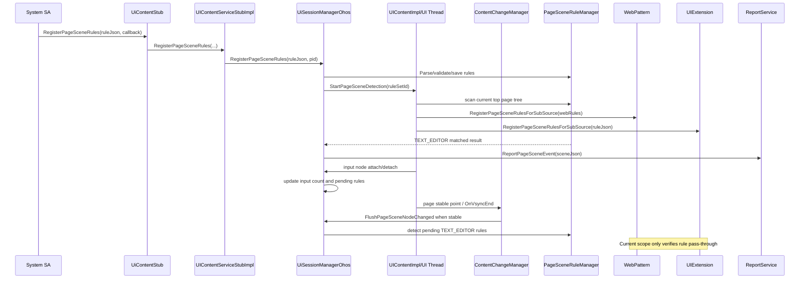

# Design

## 状态

Stage 2 Specify/Design 已完成首版设计。Stage 3 已进入实现与验证阶段；截至 2026-07-06，PageScene 分支已完成 ArkUI 宿主 `TEXT_EDITOR` 基础链路、PageScene-only 稳定点调度和相关 host UT 补充。本文保留设计意图，并记录实现阶段确认的架构边界。

## 设计输入

- Stage 1 已冻结首批场景 `TEXT_EDITOR`：当前页面或子内容源内文本输入类控件数量大于等于 2 时上报。
- 能力独立于 `ContentChange` / `ComponentChange`，不复用其事件语义；但 PageScene 检测时机复用 `ContentChangeManager` 的页面级稳定点。
- 文本输入类控件上下树只维护页面输入控件计数并挂起待检测规则；实际场景命中检查必须等页面稳定后执行，避免频繁中间态上报。
- 已上报过命中的规则在后续页面稳定点检查时不再命中，需要额外上报一次 `TEXT_EDITOR_EXIT` 退出事件；退出后连续未命中不重复上报。
- SA 通过 UISession innerAPI 下发 `ruleJson`，由宿主 ArkUI 保存规则、执行宿主树匹配、向 Web / UIExtension 下发规则，并通过宿主 UISession 统一上报 SA。
- 默认不上报文本正文和完整控件树；上报结果必须包含 `currentPageName`、`source.type`、`nodes[].rect`、`nodes[].focusable`。

## 源码事实

| 事实 | 源码位置 |
|------|----------|
| UISession innerAPI transaction code 定义在 `IUiContentService` enum 中，当前末尾为 `GET_CURRENT_ABILITY_LANGUAGE_INFO`。 | `interfaces/inner_api/ui_session/ui_content_service_interface.h:82` |
| `IUiContentService` 页面翻译类新增接口在当前主线采用默认 `FAILED` 实现，可作为新增可选能力的兼容写法参考。 | `interfaces/inner_api/ui_session/ui_content_service_interface.h:427` |
| `ReportService` 是 SA 接收宿主上报的远端接口，当前已有 `SendContentChange`、`ReportGetStateMgmtInfo`、`SendWebInfoRequestResult`、`SendPageText` 等回调。 | `interfaces/inner_api/ui_session/ui_content_service_interface.h:454` |
| IPC 入口 `UiContentStub::OnRemoteRequest` 先校验 SA token 和 interface token，再按 code 分发。 | `adapter/ohos/entrance/ui_session/ui_content_stub.cpp:42` |
| StubImpl 当前负责把注册/查询请求转发给 `UiSessionManager`，例如组件变化注册会设置注册状态和 mask。 | `adapter/ohos/entrance/ui_session/ui_content_stub_impl.cpp:51` |
| `UiSessionManager` 保存回调类型、`processMap_`、事件注册计数等跨线程状态。 | `interfaces/inner_api/ui_session/ui_session_manager.h:44`、`interfaces/inner_api/ui_session/ui_session_manager.h:277` |
| OHOS 实现保存 pid 到 `ReportService` remote object 的映射，事件上报时遍历 `reportObjectMap_`。 | `adapter/ohos/entrance/ui_session/ui_session_manager_ohos.h:150`、`adapter/ohos/entrance/ui_session/ui_session_manager_ohos.cpp:63` |
| `UIContentImpl::InitUISessionManagerCallbacks` 负责注册访问 Pipeline / Web / ContentChange 等 UI 线程回调。 | `adapter/ohos/entrance/ui_content_impl.cpp:6209` |
| ContentChange 启动检测通过 `UIContentImpl` 投递到 UI 线程并遍历容器调用 Manager，是本能力注册后首次扫描的时机参考。 | `adapter/ohos/entrance/ui_content_impl.cpp:6817`、`frameworks/core/components_ng/manager/content_change_manager/content_change_manager.cpp:246` |
| Pipeline VSync 尾部只调用 `ContentChangeManager::OnVsyncEnd(rootRect)`，不直接调用 PageScene flush。 | `frameworks/core/pipeline_ng/pipeline_context.cpp:1357` |
| `ContentChangeManager::OnVsyncEnd` 在 ContentChange 关闭但 PageScene 注册时仍可进入，并在 PageScene 注册态下调用 `FlushPageSceneNodeChanged`。 | `frameworks/core/components_ng/manager/content_change_manager/content_change_manager.cpp:450` |
| Page/Scroll/Swiper/Dialog 稳定点在 PageScene-only 注册时会调用 `NotifyPageSceneContentChanged`，但只有 ContentChange 注册时才发送具体 ContentChange 事件。 | `frameworks/core/components_ng/manager/content_change_manager/content_change_manager.cpp:335` |
| Text/Image 具体控件 ContentChange 路径仍受 `IsContentChangeDetectEnable` 控制，不作为 PageScene-only 检测入口。 | `frameworks/core/components_ng/manager/content_change_manager/content_change_manager.cpp:427`、`frameworks/core/components_ng/manager/content_change_manager/content_change_manager.cpp:718` |
| 文本输入相关 ArkUI tag 已存在：`TextInput` / `TextArea` 由 `TextFieldModelNG` 创建，`Search` 和 `RichEditor` 分别由对应 Model 创建。 | `frameworks/core/components_ng/pattern/text_field/text_field_model_ng.cpp:45`、`frameworks/core/components_ng/pattern/search/search_model_ng.cpp:101`、`frameworks/core/components_ng/pattern/rich_editor/rich_editor_model_ng.cpp:27` |

## 总体架构



分层职责：

| 层 | 责任 |
|----|------|
| `IUiContentService` / proxy / stub | 暴露 SA 注册、反注册、主动查询接口；完成 parcel 序列化、token 校验和参数读取。 |
| `UIContentServiceStubImpl` | 做轻量参数非空校验，转发到 `UiSessionManager`；不访问节点树。 |
| `UiSessionManagerOhos` | 维护 pid、`ruleSetId`、远端回调、规则状态、去重节流状态；负责向 SA 回调上报。 |
| `UIContentImpl` | 注册 UI 线程回调；触发当前页面初始扫描、文本输入类控件上下树增量维护、Web/UIExtension 规则下发。 |
| `ContentChangeManager` | 作为页面稳定点调度承载者。PageScene-only 注册时允许 Page/Scroll/Swiper/Dialog 稳定点和 VSync 尾部触发 PageScene 检测，但不发送 ContentChange 事件。 |
| `PageSceneRuleManager` | 解析校验 `ruleJson`，按 `sceneType/operator/source` 分发匹配逻辑，生成规范上报 JSON。 |
| `PageSceneInputCountTracker` | 维护当前页面内可见输入类控件集合和数量；注册/查询时初始化，上下树时按规则增量更新并挂起待检测规则，页面稳定后再触发上报。 |
| ArkUI matcher | 识别文本输入类 tag，计算 rect/focusable/visible，并把节点状态交给 `PageSceneInputCountTracker`。 |
| Web / UIExtension subsource | 当前范围仅接收宿主透传的规则生命周期请求；不设计、不实现、不验证子来源内部匹配和命中结果回传。 |

## UISession 接口设计

### SA 调用接口

在 `interfaces/inner_api/ui_session/ui_content_service_interface.h` 中追加 transaction code：

```cpp
REGISTER_PAGE_SCENE_RULES,
UNREGISTER_PAGE_SCENE_RULES,
GET_PAGE_SCENE,
```

新增 innerAPI：

```cpp
using PageSceneEventCallback = std::function<void(const std::string& sceneJson)>;

virtual int32_t RegisterPageSceneRules(
    const std::string& ruleJson, const PageSceneEventCallback& eventCallback)
{
    return FAILED;
}

virtual int32_t UnregisterPageSceneRules(const std::string& ruleSetId)
{
    return FAILED;
}

virtual int32_t GetPageScene(
    const std::string& ruleJsonOrRuleSetId, const PageSceneEventCallback& eventCallback)
{
    return FAILED;
}
```

设计约束：

- 参考页面翻译接口，新增虚接口采用默认 `FAILED` 实现，降低不完整平台实现的编译风险。
- `eventCallback` 不通过 IPC 直接序列化为函数；proxy/stub 侧仍以 `ReportService` remote object 承载回调。入参语义用于 SA 侧 API 表达：注册成功后，命中事件通过 `ReportService::ReportPageSceneEvent(sceneJson)` 转发到该 callback。
- `RegisterPageSceneRules` 成功后保存 pid 到 `processMap_["pageScene"]`，并以 `(pid, ruleSetId)` 维护注册规则。
- `UnregisterPageSceneRules` 删除指定 pid 下规则；当 pid 不再持有任何规则时从 `processMap_["pageScene"]` 移除。
- `GetPageScene` 支持传入已注册 `ruleSetId` 或一次性 `ruleJson`；一次性规则不落长期注册状态，只触发一次扫描并通过本次 callback 返回。

### 接口 DFX 与并发保护

首版按 SA 进程维度维护状态，不允许同一 SA 高并发重复调用破坏规则状态。建议在 `UiSessionManagerOhos` 中用 `pageSceneStateMutex_` 保护以下状态：

| 状态 | Key | 说明 |
|------|-----|------|
| `registeredRuleSet` | `pid` | 已注册且未注销的规则集。首版同一 pid 同时只允许一个页面场景规则集。 |
| `pendingGetRequest` | `pid` | 主动查询未返回状态。用于阻止同一 SA 在前一次 Get 未完成时再次 Get。 |
| `operationInProgress` | `pid` / `ruleSetId` | 注册、反注册、Get 状态迁移保护，避免并发交叉写入。 |
| `reportDedupState` | `pid + ruleSetId + ruleId + source` | 最近上报签名和时间，用于去重与节流。 |

接口行为：

| 接口 | 禁止场景 | 返回/处理 | 状态要求 |
|------|----------|-----------|----------|
| `RegisterPageSceneRules` | 同一 pid 已有未注销规则 | 返回重复注册错误，不覆盖旧规则，不下发新规则 | 成功时写入 `registeredRuleSet`，失败不改状态 |
| `RegisterPageSceneRules` | 同一 pid 正在注册/反注册/Get 同一规则 | 返回请求忙错误或串行化执行；首选返回 busy，避免阻塞 IPC 线程 | 所有出口释放 `operationInProgress` |
| `UnregisterPageSceneRules` | ruleSetId 为空或 pid 未注册该规则 | 返回参数错误或未注册错误，不触发子来源反注册 | 未注册场景不影响其他 pid |
| `UnregisterPageSceneRules` | 同一 pid 正在 Get | 返回请求忙错误或先取消 pending Get；首版建议返回 busy，由 SA 稍后重试 | 不允许清理过程中仍回调旧 Get |
| `GetPageScene` | 同一 pid 已有 pending Get | 返回请求忙错误，不启动 ArkUI 扫描和子来源查询 | pending 只在回调完成、超时或 SA 死亡时清理 |
| `GetPageScene` | 参数非法或 ruleSetId 不存在 | 返回参数错误或未注册错误 | 不写入 pending |
| `ReportPageSceneEvent` | 命中签名与上次相同且未超过最小间隔 | 丢弃本次上报，只保留必要调试摘要 | 不更新 SA 可见结果 |
| 子来源规则透传接口 | Web/UIExtension 控件不存在或透传失败 | 来源级失败隔离，不回滚宿主 ArkUI 注册 | 日志标记 source 和错误码 |

超时和恢复：

- `GetPageScene` 需要设置内部超时；超时后清理 `pendingGetRequest`，并通过回调或错误日志返回失败摘要。
- SA 进程死亡或 UISession 断开时，必须清理该 pid 的 `registeredRuleSet`、`pendingGetRequest`、`operationInProgress`、`reportDedupState`，并向已下发规则的 Web/UIExtension 发送反注册。
- 所有接口日志只能输出 pid、ruleSetId、ruleId、source、错误码、matchedCount 等摘要，禁止输出输入文本正文和完整控件树。

### SA 上报回调

在 `ReportService` 中追加：

```cpp
virtual void ReportPageSceneEvent(const std::string& sceneJson) {}
```

回调路由：

- `UiSessionManagerOhos::ReportPageSceneEvent(pid, sceneJson)` 优先向发起该规则的 pid 上报，避免把不同 SA 的规则结果广播给所有 `ReportService`。
- 当前范围只有 ArkUI 宿主来源触发 `ReportPageSceneEvent`。Web / UIExtension 命中结果回传不在本阶段设计、实现和验证范围内。
- 日志仅打印 `ruleSetId`、`ruleId`、`sceneType`、`matchedCount`、错误码和结果长度，不打印文本正文和完整树；`includeText=true` 的完整回调结果只能通过 callback 或 sample `-tofile` 验证。

## ruleJson 解析和状态模型

新增 `PageSceneRuleManager`，首选位置为 `frameworks/core/components_ng/manager/page_scene/`；跨进程状态仍在 `UiSessionManager` 保存。

核心结构：

| 结构 | 字段 | 说明 |
|------|------|------|
| `PageSceneRuleSet` | `ruleSetId`、`globalConfig`、`sourceConfig`、`rules`、`webRulesRaw` | 一次 `ruleJson` 解析结果；`webRulesRaw` 仅保存原始 JSON 片段用于 Web 透传。 |
| `PageSceneRule` | `ruleId`、`sceneType`、`scope`、`selector`、`condition`、`report`、`policy` | 单条规则。 |
| `PageSceneSubscription` | `pid`、`ruleSetId`、`PageSceneEventCallback` 语义标识、`PageSceneRuleSet` | SA 注册态。 |
| `PageSceneReportState` | `lastReportTime`、`lastPageName`、`lastNodeSignature`、`lastMatched` | 命中去重、节流和命中到退出的状态转换。 |
| `PageSceneNodeInfo` | `nodeId`、`nodeType`、`focusable`、`rect`、可选 `text` | 命中节点摘要；仅 `report.includeText=true` 时采集并上报 `text`，字段值优先为用户已输入文本，输入为空时为框内占位提示文本。 |
| `PageSceneInputCountTracker` | `currentPageName`、`visibleInputNodes`、`visibleInputCount`、`threshold`、`rule snapshot` | ArkUI 宿主 `TEXT_EDITOR` 场景状态维护类。 |

校验规则：

| 字段 | 校验 |
|------|------|
| `ruleSetId` / `ruleId` | 非空，长度建议不超过 128，字符限制为字母、数字、`_`、`-`。 |
| `sceneType` | 首版仅支持 `TEXT_EDITOR`；未知场景按规则级失败处理，不影响其他规则。 |
| `condition.operator` | 首版仅支持 `COUNT_GTE`，即 `COUNT Greater Than or Equal`。 |
| `condition.threshold` | 首版必须大于 0；`TEXT_EDITOR` 推荐值为 2。 |
| `selector.nodeTypes` | 首版只允许文本输入类白名单：`TextInput`、`TextArea`、`Search`、`RichEditor`。 |
| `report.includeText` | 默认 false，不上报文本正文；配置 true 时 ArkUI 宿主来源在命中节点 `nodes[]` 中上报 `text`，字段值优先为用户已输入文本，输入为空时为框内占位提示文本。 |
| 完整控件树 | 本阶段不设计完整树上报，不提供完整树上报开关。 |
| `policy.minReportIntervalMs` | 小于 0 时按默认 500ms 修正；最大值建议限制，避免长期无响应。 |
| `webRules` | 可选字段。仅当 Web 来源启用时生效；宿主只校验其为可透传 JSON 值并保存原文，不解析内部字段，不参与 ArkUI 匹配。 |

扩展方式：

- 新增场景：增加 `sceneType` 枚举和对应 matcher，不改变上层 IPC。
- 新增条件：增加 `condition.operator` 解析分支，例如 `COUNT_EQ`、`ANY_MATCH`。
- 新增来源：扩展 `source.type` 和 subsource adapter，不改变宿主统一上报格式。

## ArkUI TEXT_EDITOR 匹配设计

### 匹配时机

| 时机 | 触发条件 | 行为 |
|------|----------|------|
| 首次注册后 | `policy.reportOnRegister=true` | 在 UI 线程扫描当前页面顶部控件树，初始化 `PageSceneInputCountTracker` 的可见输入控件集合和数量。 |
| 文本输入类控件上树 | `policy.reportOnTextInputAttached=true` | 若节点满足规则过滤条件，则加入 tracker 并更新可见输入控件数量；挂起待检测规则，不立即上报。 |
| 文本输入类控件下树 | 已注册 `TEXT_EDITOR` 规则 | 从 tracker 移除该节点并更新数量，挂起待检测规则；若稳定点检查发现已上报命中的规则不再命中，则补发一次 `TEXT_EDITOR_EXIT`。 |
| 可见性/可获焦/rect 变化 | 已注册 `TEXT_EDITOR` 规则且节点仍在树上 | 按当前规则重新判断该节点是否计入 tracker，并更新节点摘要。 |
| 页面稳定点 | 页面切换结束、滚动结束、Swiper/Tabs 切换结束、弹窗显示隐藏结束或 VSync 末尾确认稳定 | 对已挂起的待检测规则执行匹配和上报。滚动、Swiper 滚动、页面转场中必须延后。 |
| Text/Image 具体控件 ContentChange | 仅注册 PageScene、未注册 ContentChange | 不作为 PageScene-only 检测入口；这些事件仍属于 ContentChange 具体控件能力。 |
| 主动查询 | SA 调用 `GetPageScene` | 按传入规则或已注册规则执行一次初始化扫描，得到当前计数和命中结果；一次性规则不改变长期注册状态。 |
| 子来源规则透传 | 规则允许 Web / UIExtension 来源参与 | 宿主把规则生命周期请求透传到对应控件；不等待、不消费子来源匹配结果。 |

### 场景状态维护类

首版新增 `PageSceneInputCountTracker`，建议放在 `frameworks/core/components_ng/manager/page_scene/`。该类只维护 ArkUI 宿主页面的 `TEXT_EDITOR` 场景状态；Web/UIExtension 当前仅接收规则透传，不要求维护或回传场景状态。

职责：

| 方法/能力 | 输入 | 行为 |
|-----------|------|------|
| `Initialize(rule, pageRoot)` | `PageSceneRule`、当前页面根节点 | 全量扫描一次当前页面，建立 `visibleInputNodes` 和 `visibleInputCount`。 |
| `OnInputNodeAttached(frameNode)` | 文本输入类节点 | 按 `selector`、`onlyVisible`、`includeUnfocusableTextInput` 判断是否计入；计入后更新数量并挂起待检测规则。 |
| `OnInputNodeDetached(nodeId)` | 节点 ID | 从 `visibleInputNodes` 删除该节点并更新数量。 |
| `OnInputNodeVisibilityChanged(frameNode)` | 文本输入类节点 | 重新计算该节点是否可见、是否在屏幕范围内，决定加入、更新或删除。 |
| `OnInputNodeFocusableChanged(frameNode)` | 文本输入类节点 | 当规则不计入不可获焦控件时，重新判断该节点是否计数。 |
| `BuildMatchedResult()` | 当前 tracker 状态 | 当 `visibleInputCount >= threshold` 时，按 `report` 配置生成命中节点摘要。 |
| `Reset(pageName/ruleSetId)` | 页面或规则变更 | 清空当前集合、计数、去重签名。 |

核心状态：

```cpp
struct PageSceneInputNodeState {
    int32_t nodeId = -1;
    std::string nodeType;
    bool visible = false;
    bool focusable = false;
    RectF rect;
};

class PageSceneInputCountTracker {
public:
    void Initialize(const PageSceneRule& rule, const RefPtr<FrameNode>& pageRoot);
    std::optional<PageSceneMatchResult> OnInputNodeAttached(const RefPtr<FrameNode>& node);
    void OnInputNodeDetached(int32_t nodeId);
    std::optional<PageSceneMatchResult> OnInputNodeVisibilityChanged(const RefPtr<FrameNode>& node);
    std::optional<PageSceneMatchResult> OnInputNodeFocusableChanged(const RefPtr<FrameNode>& node);
    void Reset(const std::string& pageName, const std::string& ruleSetId);

private:
    std::unordered_map<int32_t, PageSceneInputNodeState> visibleInputNodes_;
    int32_t visibleInputCount_ = 0;
};
```

设计规则：

- tracker 维护的是“页面内符合当前规则的可见输入类控件数量”，不是所有输入类控件数量。
- `visibleInputNodes_` 只保存可计数节点；节点不可见、屏外、不可获焦且规则不计入时，不放入集合。
- 上树事件只对文本输入类 tag 进入 tracker；非输入类节点忽略。
- 下树事件必须删除节点，防止已销毁控件继续贡献计数。
- 页面切换、规则反注册、SA 死亡或重新初始化扫描时必须 `Reset`。
- 当数量从低于阈值变为大于等于阈值时只挂起待检测规则；命中上报必须在页面稳定点执行，并受 `deduplicate` 和 `minReportIntervalMs` 控制。
- 当已上报命中的规则在稳定点检查时从命中态变为未命中态，需要上报一次 `TEXT_EDITOR_EXIT`；退出事件清理命中态，不受命中去重和最小命中上报间隔抑制，连续未命中不重复上报。
- 稳定判定至少包含普通滚动、Swiper 滚动和页面转场状态；任一状态未结束时不得 flush PageScene 待检测规则。

### 控件识别

首版 ArkUI 文本输入类控件使用 tag 白名单：

- `V2::TEXTINPUT_ETS_TAG`
- `V2::TEXTAREA_ETS_TAG`
- `V2::SEARCH_ETS_TAG`，如扫描到内部 `SearchField`，需要归一为宿主 `Search`
- `V2::RICH_EDITOR_ETS_TAG`

### 过滤和节点信息

| 字段/规则 | 设计 |
|-----------|------|
| 可见性 | `scope.onlyVisible=true` 时过滤不可见、尺寸为空、与屏幕可见区域无交集的节点。 |
| 可获焦 | 通过节点 `FocusHub` / event hub 能力判断 `focusable`；`globalConfig.includeUnfocusableTextInput=false` 时不可获焦节点不参与计数。 |
| rect | 使用节点相对窗口的可见区域坐标，单位与现有 Inspector /布局坐标保持一致；当前只要求 ArkUI 宿主节点 rect。 |
| currentPageName | 复用 UISession 当前页面名回调链路；上报前由宿主补齐。 |
| node signature | 由 `source.type + currentPageName + ruleSetId + ruleId + sorted(nodeId/nodeType/rect)` 生成，用于去重。 |

### 命中逻辑

```text
Register/Get:
    tracker.Initialize(rule, pageRoot)
    if tracker.visibleInputCount >= rule.threshold:
        ReportPageSceneEvent(tracker.BuildMatchedResult())

Input attached/detached:
    tracker.UpdateInputNodeCount(frameNode/nodeId)
    UiSessionManager.MarkPendingPageSceneRule(rule)

Stable point / OnVsyncEnd:
    if not scrolling and not swiperScrolling and not transitioning:
        for rule in pendingRules:
            result = tracker.BuildMatchedResult(rule)
            if result.matched and PassDeduplicateAndThrottle:
                ReportPageSceneEvent(result.sceneJson)
            else if not result.matched and HadReportedMatched(rule):
                ReportPageSceneEvent(result.BuildExitSceneJson(eventName="TEXT_EDITOR_EXIT"))
                ClearReportedMatched(rule)
```

实现边界：

- `PipelineContext` 不直接依赖 `UiSessionManager::FlushPageSceneNodeChanged`，只调用 `ContentChangeManager::OnVsyncEnd`。
- `ContentChangeManager` 内部根据 `UiSessionManager::GetPageSceneRulesRegistered` 决定是否进入 PageScene 检测分支。
- Page/Scroll/Swiper/Dialog 稳定点在 PageScene-only 注册时只触发 PageScene 检测，不生成 ContentChange 上报。
- Text/Image 具体 ContentChange 事件不触发 PageScene-only 检测，避免把具体控件变化误当作页面稳定点。

## Web / UIExtension 规则透传边界

当前特性对 Web 和 UIExtension 只做宿主到控件的规则透传通路设计，不做子来源内部规则解析、场景匹配、命中结果回传、宿主补齐来源信息或端到端验证。

### 宿主到子来源透传接口

宿主 ArkUI 在 SA 注册规则后，按 `sourceConfig` 和规则级 `scope` 判断是否向子内容源透传：

```cpp
void RegisterPageSceneRulesForSubSource(const std::string& subSourceRules);
void UnregisterPageSceneRulesForSubSource(const std::string& ruleSetId);
void GetPageSceneForSubSource(const std::string& ruleJsonOrRuleSetId);
```

透传约束：

- Web 来源启用时，宿主只向 Web 控件透传 `ruleJson.webRules`，不透传整份 ArkUI 场景规则；`webRules` 具体规格不在本特性中设计。
- 宿主不解析 Web DOM 或 UIExtension 内部控件树。
- `RegisterPageSceneRulesForSubSource` 只要求宿主能找到页面内对应控件并调用透传入口；不要求 Web/UIExtension 消费规则后产生任何结果。
- `UnregisterPageSceneRulesForSubSource` 只要求宿主把 `ruleSetId` 透传给已下发过规则的控件，用于生命周期对齐。
- `GetPageSceneForSubSource` 当前仅作为查询请求透传，不要求子来源返回匹配结果，不参与 `GetPageScene` 的完成条件。
- Web / UIExtension 内部匹配、节点 rect/focusable 计算、`source.type=WEB/UI_EXTENSION` 的最终上报格式和验证均延期到后续特性。

## 错误处理和恢复

| 场景 | 处理 |
|------|------|
| 非 SA 调用 | 沿用 `UiContentStub::OnRemoteRequest` 的 token 校验，返回失败。 |
| `ruleJson` 非法 | 返回参数错误，不保存规则，不触发扫描和子来源下发。 |
| `eventCallback` 语义为空或未连接 `ReportService` | 返回失败；sample 侧要求先 `Connect`。 |
| 重复注册 | 同一 SA 已注册未注销时返回重复注册错误，不覆盖已有规则，不触发子来源下发。 |
| 主动查询并发 | 同一 SA 已有 `GetPageScene` 未返回时返回请求忙错误，不启动新扫描。 |
| 反注册与查询并发 | 首版返回请求忙错误或串行化；实现必须保证清理中的规则不会继续产生旧回调。 |
| 部分规则不支持 | 规则级失败，不影响同一 ruleSet 内其他合法规则；上报/日志只给摘要。 |
| SA 进程死亡 | 清理 pid 下所有 `PageSceneSubscription`、去重状态，并向已下发过规则的 Web/UIExtension 控件透传反注册。 |
| Web / UIExtension 透传失败 | 记录来源级摘要错误，不影响 ArkUI 宿主来源匹配；不要求重试或验证子来源内部状态。 |
| 节流命中 | 不上报重复事件，保留最近命中状态用于后续差异判断。 |

## 测试与验证设计

| 类型 | 覆盖点 |
|------|--------|
| ruleJson 单元测试 | 合法 TEXT_EDITOR、非法 JSON、未知 sceneType、未知 operator、阈值非法、`includeText=false/true`、`includeText=true` 时输出用户输入文本或占位提示文本、无完整树上报字段。 |
| ArkUI tracker 单元测试 | `PageSceneInputCountTracker` 初始化扫描、输入类控件上树计数增加、下树计数减少、可见性/可获焦变化、阈值跨越后挂起检测、命中后跌出阈值补发一次退出事件。 |
| ContentChangeManager 稳定点单元测试 | PageScene-only 注册下 VSync 尾部 flush、Page/Scroll/Dialog 稳定点触发、Swiper 延迟到 VSync、Swiper 滚动中不 flush、Text/Image 不触发 PageScene-only。 |
| ArkUI matcher 单元测试 | 0/1/2 个文本输入控件、不可见过滤、不可获焦过滤、rect/focusable 输出、Search/RichEditor 归一。 |
| UISession IPC 单元测试 | 注册、重复注册、反注册、主动查询、Get pending busy、非法参数、未 Connect、pid 隔离、死亡清理。 |
| 并发和 DFX 测试 | 并发 Register、Register 与 Unregister 交叉、Get 未返回再次 Get、反注册后旧回调不再上报。 |
| Web 透传验证 | 仅验证宿主对 Web 控件的 `webRules` 注册透传、反注册、查询请求透传入口被调用；不验证 `webRules` 内部规格、Web 内部匹配和上报。 |
| UIExtension 透传验证 | 仅验证宿主对 UIExtension 控件的规则注册、反注册、查询请求透传入口被调用；不验证 UIExtension 内部匹配和上报。 |
| sample/hidumper | 新增 `RegisterPageSceneRules`、`GetPageScene`、`UnregisterPageSceneRules` 命令，日志只输出摘要和文件路径。 |

建议 Stage 3 任务顺序：

1. 补齐 IPC / ReportService / proxy / stub / sample 的骨架。
2. 实现 `PageSceneRuleManager` 解析校验和 JSON 构造。
3. 实现 ArkUI `TEXT_EDITOR` matcher、`PageSceneInputCountTracker` 与 UI 线程回调，输入类控件上下树仅维护计数和待检测规则。
4. 实现 `ContentChangeManager` 稳定点调度，确保 PageScene-only 注册也能在页面稳定后检测，Pipeline 不直接依赖 PageScene flush。
5. 实现 Web / UIExtension 规则透传通路，不实现子来源匹配和回传。
6. 增加单元测试、sample 验证和隐私日志检查。

## Design Gate 结论

Stage 2 设计已覆盖新增接口、规则模型、状态模型、ArkUI 匹配、Web/UIExtension 规则透传边界、错误恢复、隐私约束和验证计划。允许进入 Stage 3 实现拆解；Web 和 UIExtension 的内部匹配、上报回传和端到端验证均作为明确延期项，不阻塞首批 `TEXT_EDITOR` 场景验证。
