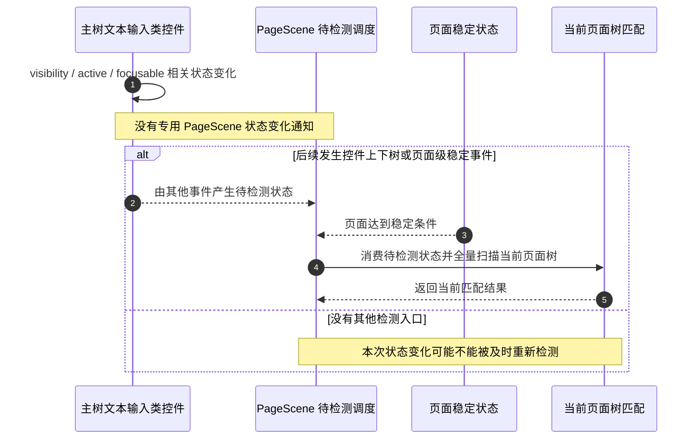
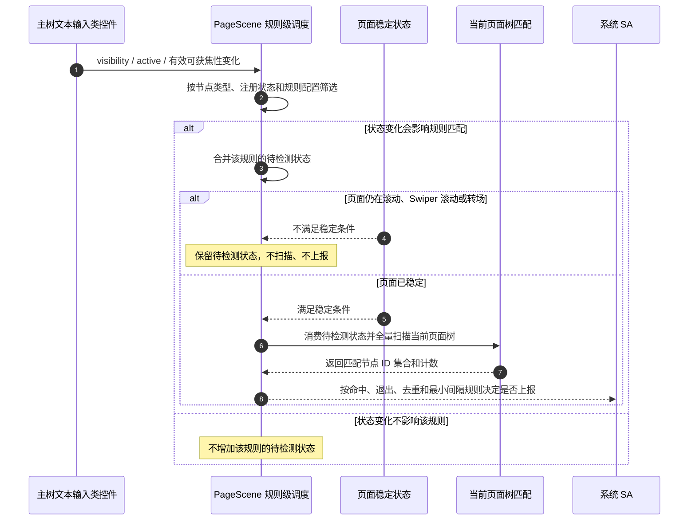

# 特性规格

## UISession 页面场景规则化感知能力

> 特性规格，驱动代码实现 | 模板参考: sdd-spec-optimization/spec-suggested.md

## 概述

| 属性 | 值 |
|------|-----|
| 需求编号 | REQ-UISESSION-PAGE-SCENE-AWARENESS |
| 特性名称 | UISession 页面场景规则化感知能力 |
| 特性编号 | FEAT-UISESSION-PAGE-SCENE-AWARENESS |
| 需求来源 | 内部/系统 SA 场景感知需求 |
| 提出人 | 用户 |
| 优先级 | P0 |
| 目标版本 | TBD |
| SIG 归属 | SIG_ArkUI |
| 状态 | Baselined |
| 复杂度 | 标准 + 安全/DFX专项 |
| 创建日期 | 2026-06-18 |
| 最后更新 | 2026-08-10 |

## 本次变更范围

| 类型 | 内容 | 说明 |
|------|------|------|
| ADDED | UISession 页面场景规则注册、反注册、主动查询和上报 | 面向系统 SA 的 innerAPI，不新增 ArkTS/Public API |
| ADDED | `ruleJson` 场景规则描述 | 首版支持 `TEXT_EDITOR` 和 `COUNT_GTE`；预留 Web 专用 `webRules` |
| ADDED | Web / UIExtension 规则透传 | 宿主到 Web / UIExtension 控件的规则生命周期透传通路 |
| ADDED | DFX 防重复和防并发契约 | 已注册未注销不可重复注册；已有 Get 请求未返回不可再次 Get |
| MODIFIED | UISession `ReportService` 回调能力 | 新增页面场景命中结果回调，不改变已有事件语义 |
| MODIFIED | PageScene 稳定点检测调度 | 输入类控件上下树及会影响规则匹配的可见性相关状态、有效可获焦性变化只合并受影响规则的待检测状态；页面稳定后全量扫描当前页面树并上报命中或已命中后的退出事件 |
| MODIFIED | PageScene 文本输入类控件状态变化触发 | 主树文本输入类控件的 `visibility`、`active` 和有效可获焦性变化可触发规则级重检；不改变控件显示、激活或焦点系统本身的行为 |
| REMOVED | 无 | 不废弃现有 UISession 能力 |

## 本次状态通知增量摘要

本节只描述本次 `visibility` / `active` / 有效可获焦性状态通知带来的行为差异。页面切换、滚动、Swiper/Tabs 切换和弹窗等页面级稳定事件的原有调度语义不变。

| 对比维度 | 修改前 | 修改后 |
|----------|--------|--------|
| 文本输入类控件状态变化入口 | 控件仅改变 `visibility`、`active` 或可获焦相关状态时，没有专用 PageScene 状态通知；只有后续上下树或页面级稳定事件才能间接触发重新检测 | 主树文本输入类控件发生相关状态变化时，先判断该变化是否可能改变各条规则的匹配结果，仅把受影响规则合并为待检测状态 |
| 可见性规则 | 状态变化本身不按 `scope.onlyVisible` 定向挂起规则 | `visibility` 变化影响 `onlyVisible=true` 的规则；`active` 变化只影响 `onlyVisible=true` 的规则 |
| 可获焦规则 | 控件从不可获焦变为可获焦，或反向变化，不会因该变化本身定向挂起规则 | 仅当变化前后的有效可获焦性结果不同，且规则配置 `includeUnfocusableTextInput=false` 时挂起；控件自身可获焦、父级可获焦和 enabled 状态均按最终有效结果判断 |
| `visibility` 与可获焦性的交叉影响 | 未专门处理 | `visibility` 同时参与有效可获焦性计算，因此当 `onlyVisible=true` 或 `includeUnfocusableTextInput=false` 任一条件成立时，该规则均需重新检测 |
| 重复状态变化 | 依赖其他检测入口 | 同一规则在稳定前收到多次相关状态变化时合并为一个待检测状态，不按事件次数重复扫描 |
| 页面稳定门控 | 已有待检测状态只在页面稳定后执行匹配 | 语义保持不变：不稳定时不消费待检测状态；稳定后才消费并全量扫描当前页面树 |
| 扫描策略 | 页面稳定点全量扫描当前页面树 | 保持全量扫描；本次未引入文本输入候选索引、增量计数或逐节点可见区域变化通知 |

### 修改前行为 UML



### 修改后行为 UML



## 输入文档

| 文档 | 路径 | 状态 |
|------|------|------|
| Requirement | `.codespec/changes/ui-session-page-scene-awareness/proposal.md` | Baselined |
| Design | `.codespec/changes/ui-session-page-scene-awareness/design.md` | Designed |
| Define Gate | `.codespec/changes/ui-session-page-scene-awareness/evidence/gates/gate-define.md` | Passed |
| Design Gate | `.codespec/changes/ui-session-page-scene-awareness/evidence/gates/gate-design.md` | Passed |

## 用户故事

### US-1: SA 注册页面场景规则

**作为** 系统 SA，**我想要** 通过 UISession 注册页面场景规则并提供接收上报的回调，**以便** ArkUI 能识别页面场景并把命中结果回传 SA，同时宿主可把规则透传给 Web / UIExtension 控件。

| AC编号 | 验收标准 | 类型 |
|--------|----------|------|
| AC-1.1 | GIVEN SA 已通过 UISession 连接宿主应用，WHEN SA 调用 `RegisterPageSceneRules(ruleJson, eventCallback)` 且 `ruleJson` 合法、`eventCallback` 非空、当前 SA 无未注销页面场景规则，THEN 宿主保存规则并返回成功，后续命中结果通过回调返回 | 正常 |
| AC-1.2 | GIVEN SA 已连接宿主应用，WHEN `ruleJson` 非法或 `eventCallback` 为空，THEN 接口返回参数错误，不保存规则，不触发匹配 | 异常 |
| AC-1.3 | GIVEN 同一 SA 已成功注册页面场景规则且未调用 `UnregisterPageSceneRules`，WHEN 再次调用 `RegisterPageSceneRules` 注册新规则，THEN 接口返回重复注册错误，不覆盖已有规则，不触发子来源下发 | 异常 |
| AC-1.4 | GIVEN 合法规则允许 Web 来源参与且 `ruleJson.webRules` 存在，WHEN 注册成功，THEN 宿主向页面内 Web 控件原样透传 `webRules` | 正常 |
| AC-1.5 | GIVEN 合法规则允许 UIExtension 来源参与，WHEN 注册成功，THEN 宿主向页面内 UIExtension 控件下发原始 `ruleJson` | 正常 |

### US-2: 首次注册后检测 TEXT_EDITOR 场景

**作为** 系统 SA，**我想要** 注册规则后立即获知当前页面是否命中文本编辑类场景，**以便** SA 能在接入后快速感知当前页面状态。

| AC编号 | 验收标准 | 类型 |
|--------|----------|------|
| AC-2.1 | GIVEN 规则中 `policy.reportOnRegister=true`，WHEN `RegisterPageSceneRules` 注册成功，THEN 宿主立即扫描当前页面顶部控件树并执行 `TEXT_EDITOR` 匹配 | 正常 |
| AC-2.2 | GIVEN 当前页面顶部控件树中命中文本输入类控件数量大于等于 `condition.threshold`，WHEN 执行 `TEXT_EDITOR` 匹配，THEN 宿主通过 `ReportPageSceneEvent` 上报 `TEXT_EDITOR` 场景结果 | 正常 |
| AC-2.3 | GIVEN `scope.onlyVisible=true`，WHEN 执行 `TEXT_EDITOR` 匹配，THEN 不可见或与当前页面窗口范围无交集的控件不参与计数；本阶段不逐层计算滚动容器裁剪 | 边界 |
| AC-2.4 | GIVEN `globalConfig.includeUnfocusableTextInput=false`，WHEN 执行 `TEXT_EDITOR` 匹配，THEN 不可获焦文本输入类控件不参与计数 | 边界 |

### US-3: 文本输入类控件上下树和匹配状态变化后稳定检测

**作为** 系统 SA，**我想要** 文本输入类控件上下树或其规则相关状态变化后在页面稳定点重新扫描并匹配，**以便** 节点是否参与匹配或节点 ID 集合变化能够形成新的场景状态。

| AC编号 | 验收标准 | 类型 |
|--------|----------|------|
| AC-3.1 | GIVEN 已注册 `TEXT_EDITOR` 规则，WHEN 文本输入类控件上树，或主树文本输入类控件发生 `visibility`、`active`、有效可获焦性变化，THEN 宿主仅按下方“状态变化影响矩阵”合并受影响规则的待检测状态；页面稳定后全量扫描当前页面树并重新执行规则过滤 | 正常 |
| AC-3.2 | GIVEN `policy.deduplicate=true` 且同一规则的命中节点 ID 列表已上报，WHEN 节点仅发生坐标变化且仍满足 `onlyVisible`，THEN 不重复上报 | 边界 |
| AC-3.3 | GIVEN 已注册 `TEXT_EDITOR` 规则，WHEN 上下树、`onlyVisible=true` 时移入/移出屏幕，或相关状态变化导致节点是否参与匹配发生变化，且页面已稳定，THEN 重新应用规则检测并允许上报新的状态 | 正常 |
| AC-3.4 | GIVEN 已注册 `TEXT_EDITOR` 规则，WHEN 文本输入类控件下树，THEN 宿主挂起待检测规则；页面稳定后通过全量扫描自然排除已下树节点 | 边界 |
| AC-3.5 | GIVEN 已注册 `TEXT_EDITOR` 规则且同一规则曾上报过命中事件，WHEN 后续页面稳定点检查发现当前页面不再满足规则，THEN 宿主额外上报一次场景退出事件 `TEXT_EDITOR_EXIT`；若此前未上报过命中或已上报过退出，则不得重复上报退出事件 | 正常 |

状态变化影响矩阵：

| `scope.onlyVisible` | `includeUnfocusableTextInput` | `visibility` 变化 | `active` 变化 | 有效可获焦性变化 |
|---------------------|---------------------------------|-------------------|---------------|--------------------|
| `true` | `false` | 增加待检测状态 | 增加待检测状态 | 增加待检测状态 |
| `true` | `true` | 增加待检测状态 | 增加待检测状态 | 不增加 |
| `false` | `false` | 增加待检测状态 | 不增加 | 增加待检测状态 |
| `false` | `true` | 不增加 | 不增加 | 不增加 |

矩阵约束：

- `visibility` 既可能改变可见性过滤结果，也可能改变有效可获焦性，因此采用 `onlyVisible || !includeUnfocusableTextInput` 联合判断。
- `active` 只参与 `onlyVisible` 的可见节点判断，不作为有效可获焦性的组成条件。
- 有效可获焦性是控件最终是否可获焦的结果。控件自身可获焦、父级可获焦或 enabled 状态发生变化，但变化前后最终结果相同，均不得由有效可获焦性路径增加待检测状态。
- 状态变化通知只处理当前位于主树上的文本输入类控件。控件矩形或与当前窗口可见区域的交集变化仍由既有页面稳定事件触发重检，不属于本次新增的逐节点状态通知。

### US-4: SA 主动查询当前页面场景

**作为** 系统 SA，**我想要** 主动查询一次当前页面场景结果，**以便** 不等待上树事件也能获得当前匹配状态。

| AC编号 | 验收标准 | 类型 |
|--------|----------|------|
| AC-4.1 | GIVEN SA 已连接宿主应用，WHEN SA 调用 `GetPageScene(ruleJsonOrRuleSetId, eventCallback)` 且参数合法、`eventCallback` 非空、当前 SA 无未完成 `GetPageScene` 请求，THEN 宿主执行一次匹配并通过回调返回本次结果 | 正常 |
| AC-4.2 | GIVEN 主动查询规则允许 Web 或 UIExtension 来源参与，WHEN SA 调用 `GetPageScene`，THEN 宿主可通过 `GetPageSceneForSubSource` 向对应控件透传查询请求 | 正常 |
| AC-4.3 | GIVEN `GetPageScene` 参数非法或 `eventCallback` 为空，WHEN SA 发起主动查询，THEN 接口返回参数错误，不触发匹配 | 异常 |
| AC-4.4 | GIVEN 同一 SA 已有 `GetPageScene` 请求尚未返回结果，WHEN 再次调用 `GetPageScene`，THEN 接口返回请求忙错误，不启动新的扫描或子来源查询 | 异常 |

### US-5: Web / UIExtension 规则透传边界

**作为** 系统 SA，**我想要** 宿主把页面场景规则生命周期请求透传给 Web / UIExtension 控件，**以便** 后续阶段可在子来源内部扩展场景匹配。

| AC编号 | 验收标准 | 类型 |
|--------|----------|------|
| AC-5.1 | GIVEN 合法规则允许 Web 来源参与且 `ruleJson.webRules` 存在，WHEN 注册规则成功，THEN 宿主向页面内 Web 控件透传 `webRules` | 正常 |
| AC-5.2 | GIVEN 合法规则允许 UIExtension 来源参与，WHEN 注册规则成功，THEN 宿主向页面内 UIExtension 控件透传原始 `ruleJson` | 正常 |
| AC-5.3 | GIVEN 已向 Web 或 UIExtension 透传过规则，WHEN SA 调用 `UnregisterPageSceneRules(ruleSetId)` 或 SA 死亡，THEN 宿主向对应控件透传反注册请求 | 恢复 |
| AC-5.4 | GIVEN SA 调用 `GetPageScene` 且规则允许 Web 或 UIExtension 来源参与，WHEN 宿主发起当前页面查询，THEN 宿主向对应控件透传查询请求 | 边界 |

### US-5A: SA 反注册页面场景规则

**作为** 系统 SA，**我想要** 反注册已注册的页面场景规则，**以便** 宿主停止后续检测和上报并释放该 SA 相关状态。

| AC编号 | 验收标准 | 类型 |
|--------|----------|------|
| AC-5A.1 | GIVEN SA 已成功注册页面场景规则，WHEN SA 调用 `UnregisterPageSceneRules(ruleSetId)` 且 `ruleSetId` 匹配当前注册规则，THEN 宿主删除该规则、待检测状态和去重缓存，并返回成功 | 正常 |
| AC-5A.2 | GIVEN SA 未注册页面场景规则或传入 `ruleSetId` 为空/不匹配，WHEN SA 调用 `UnregisterPageSceneRules(ruleSetId)`，THEN 接口返回参数错误或未注册错误，不影响其他 SA 已注册规则 | 异常 |
| AC-5A.3 | GIVEN SA 已成功反注册页面场景规则，WHEN 后续页面文本输入类控件上树、下树、相关状态变化或页面稳定点到达，THEN 宿主不得再因该规则上报 PageScene 事件 | 恢复 |

### US-6: 上报结果脱敏

**作为** 终端用户，**我想要** 页面场景感知默认不泄露输入文本，**以便** 场景感知满足隐私和安全边界。

| AC编号 | 验收标准 | 类型 |
|--------|----------|------|
| AC-6.1 | GIVEN 规则中 `report.includeText=false`，WHEN 上报 `TEXT_EDITOR` 场景结果，THEN 上报结果不得包含输入文本正文 | 安全 |
| AC-6.2 | GIVEN 规则中 `report.includeText=true`，WHEN 上报 `TEXT_EDITOR` 场景结果，THEN 每个命中文本输入类控件在 `nodes[]` 中携带 `text` 字段，字段值优先为用户已输入文本，输入为空时为框内占位提示文本 | 正常 |
| AC-6.3 | GIVEN 规则中 `report.includeRect=true`，WHEN 上报节点摘要，THEN 每个上报节点包含 `rect.x`、`rect.y`、`rect.width`、`rect.height` | 正常 |
| AC-6.4 | GIVEN 规则中 `report.includeFocusable=true`，WHEN 上报节点摘要，THEN 每个上报节点包含 `focusable` 字段 | 正常 |

### US-7: 页面稳定点触发 PageScene 检测

**作为** 开发者，**我想要** PageScene 的场景命中检查统一收敛到 ContentChangeManager 已有页面稳定点，**以便** Pipeline 不感知 PageScene 规则，同时 PageScene-only 注册也能在页面稳定后检测命中。

| AC编号 | 验收标准 | 类型 |
|--------|----------|------|
| AC-7.1 | GIVEN 仅注册了 PageScene、未注册 ContentChange，WHEN 页面切换结束、滚动结束、Swiper/Tabs 切换结束或弹窗显示隐藏结束，THEN 宿主仍应触发 PageScene 待检测规则检查；不得上报 ContentChange 事件 | 正常 |
| AC-7.2 | GIVEN 文本输入类控件上下树或相关状态变化后存在待检测规则，WHEN 当前仍处于普通滚动、Swiper 滚动或页面转场中，THEN 不消费该待检测状态、不扫描、不触发 PageScene 上报，等待后续稳定点或 VSync 末尾再检查 | 边界 |
| AC-7.3 | GIVEN 仅注册了 PageScene、未注册 ContentChange，WHEN 只发生 Text/Image 具体控件 ContentChange 事件，THEN 不以这些具体控件事件作为 PageScene-only 检测入口 | 边界 |
| AC-7.4 | GIVEN Pipeline 执行 VSync 尾部逻辑，WHEN 需要处理 PageScene 待检测规则，THEN Pipeline 只调用 `ContentChangeManager::OnVsyncEnd`；PageScene 规则判断和 `FlushPageSceneNodeChanged` 封装在 ContentChangeManager / UiSessionManager 内部 | 架构 |

### US-8: DFX 防并发与生命周期约束

**作为** 开发者和测试工程师，**我想要** 明确接口重复调用、并发调用和异常恢复行为，**以便** 实现和测试不遗漏边界场景。

| AC编号 | 验收标准 | 类型 |
|--------|----------|------|
| AC-8.1 | GIVEN 同一 SA 已注册规则未注销，WHEN 继续注册任何新规则，THEN 返回重复注册错误，已有规则保持有效 | 异常 |
| AC-8.2 | GIVEN 同一 SA 有 `GetPageScene` 请求未完成，WHEN 再次发起 `GetPageScene`，THEN 返回请求忙错误，不触发新扫描 | 异常 |
| AC-8.3 | GIVEN `UnregisterPageSceneRules(ruleSetId)` 正在执行，WHEN 同一 SA 并发注册或查询同一 `ruleSetId`，THEN 后进入的请求返回请求忙错误或等待前序操作完成后按最新状态处理；实现必须保证状态不交叉污染 | 恢复 |
| AC-8.4 | GIVEN SA 进程死亡或 UISession 连接断开，WHEN 宿主检测到死亡，THEN 清理该 SA 的规则、待返回 Get 状态、去重缓存和子来源下发状态 | 恢复 |

## 规则定义

| 规则ID | 类型 | 触发条件 | 预期行为 | 边界/约束 | 关联AC |
|--------|------|----------|----------|-----------|--------|
| R-1 | 行为 | SA 首次调用 `RegisterPageSceneRules` 且参数合法 | 保存规则并建立回调路由 | 同一 SA 同一时间只允许一个已注册规则集 | AC-1.1 |
| R-2 | 异常 | `ruleJson` 非法、回调为空或未连接 `ReportService` | 返回参数错误或连接错误，不保存规则 | 不触发 ArkUI 扫描和子来源下发 | AC-1.2 |
| R-3 | 异常 | 已注册未注销时再次注册 | 返回重复注册错误，不覆盖已有规则 | 防高并发重复注册 | AC-1.3, AC-8.1 |
| R-4 | 行为 | `policy.reportOnRegister=true` 且注册成功 | 全量扫描当前页面顶部控件树并执行规则匹配 | 只采集规则所需字段 | AC-2.1 |
| R-5 | 行为 | 页面内符合规则的可见输入类控件数量大于等于阈值 | 上报 `TEXT_EDITOR` | 首版阈值为 2，operator 为 `COUNT_GTE` | AC-2.2 |
| R-6 | 边界 | `scope.onlyVisible=true` | 不可见或与当前页面窗口范围无交集的控件不参与计数 | `onlyVisible=false` 时屏外节点仍参与；本阶段不逐层计算滚动容器裁剪 | AC-2.3 |
| R-7 | 边界 | `includeUnfocusableTextInput=false` | 不可获焦文本输入类控件不参与计数 | 默认 false | AC-2.4 |
| R-8 | 行为 | 文本输入类控件上树 | 挂起对应规则的待检测任务，稳定点全量扫描当前页面树 | 不维护候选索引或增量计数 | AC-3.1 |
| R-9 | 边界 | 命中节点 ID 列表与上次相同且开启去重 | 不重复上报 | rect、页面名和文本不参与重复状态判断 | AC-3.2 |
| R-10 | 行为 | 上下树或屏幕范围过滤导致命中节点 ID 列表变化 | 页面稳定后重新应用规则并允许上报 | 仍需满足最小上报间隔 | AC-3.3 |
| R-10A | 边界 | 文本输入类控件下树 | 挂起待检测规则，稳定点全量扫描时排除已下树节点 | 不维护候选索引或增量计数 | AC-3.4 |
| R-10B | 行为 | 同一规则已上报过命中，后续稳定点检查不再命中 | 上报一次 `TEXT_EDITOR_EXIT`，`matched=false`，`matchedCount` 为当前计数；上报后清理命中态，后续未命中不重复上报退出 | 退出事件不受命中去重和最小命中上报间隔抑制；再次命中后可重新上报 `TEXT_EDITOR` | AC-3.5 |
| R-10C | 行为 | 主树文本输入类控件的 `visibility` 发生变化 | 当 `onlyVisible=true` 或 `includeUnfocusableTextInput=false` 时，合并该规则的待检测状态 | 可见性同时影响可见过滤和有效可获焦性；两个条件均不满足时不增加 | AC-3.1, AC-3.3 |
| R-10D | 行为 | 主树文本输入类控件的 `active` 发生变化 | 仅为 `onlyVisible=true` 的规则合并待检测状态 | `active` 不参与有效可获焦性过滤 | AC-3.1, AC-3.3 |
| R-10E | 行为 | 主树文本输入类控件的有效可获焦性结果发生变化 | 仅为 `includeUnfocusableTextInput=false` 的规则合并待检测状态 | 控件自身可获焦、父级可获焦和 enabled 状态均比较变化前后的最终有效结果；结果不变时不增加 | AC-3.1, AC-3.3 |
| R-10F | 边界 | 状态变化不影响规则使用的过滤维度，或同一规则在稳定前重复收到相关状态变化 | 不为不相关规则增加待检测状态；相关规则只保留一个待检测状态 | `onlyVisible=false` 且 `includeUnfocusableTextInput=true` 时，三类状态变化均不增加该规则的待检测状态 | AC-3.1 |
| R-11 | 行为 | SA 调用合法 `GetPageScene` 且无未完成请求 | 执行一次匹配并回调本次结果 | 一次性规则不落长期注册状态 | AC-4.1 |
| R-12 | 异常 | 已有 `GetPageScene` 未返回时再次 Get | 返回请求忙错误，不启动新扫描 | 防高并发重复查询 | AC-4.4, AC-8.2 |
| R-13 | 行为 | 规则允许 Web 来源参与且 `webRules` 存在 | 宿主向 Web 控件透传 `webRules` 及反注册/查询请求 | `webRules` 按原始 JSON 值透传 | AC-1.4, AC-4.2, AC-5.1, AC-5.3, AC-5.4 |
| R-14 | 行为 | 规则允许 UIExtension 来源参与 | 宿主向 UIExtension 控件透传注册、反注册或查询请求 | 原始 `ruleJson` 生命周期透传 | AC-1.5, AC-4.2, AC-5.2, AC-5.3, AC-5.4 |
| R-15 | 边界 | Web / UIExtension 控件不存在或透传失败 | 记录来源级摘要错误，不影响 ArkUI 宿主匹配 | ArkUI 宿主匹配独立完成 | AC-5.1, AC-5.2, AC-5.3, AC-5.4 |
| R-16 | 边界 | `includeText=false` | ArkUI 宿主来源不上报输入文本正文 | 日志同样不得打印正文 | AC-6.1 |
| R-16A | 行为 | `includeText=true` | ArkUI 宿主来源在命中节点 `nodes[]` 中上报 `text` 字段，优先上报用户已输入文本，输入为空时上报框内占位提示文本 | 日志仍只打印摘要；sample 通过 `-tofile` 保存完整结果用于验证 | AC-6.2 |
| R-17 | 行为 | `includeRect=true` / `includeFocusable=true` | ArkUI 宿主来源上报节点包含 rect / focusable | rect 包含 x/y/width/height | AC-6.3, AC-6.4 |
| R-18 | 恢复 | 反注册、SA 死亡或连接断开 | 清理规则、待返回请求、去重缓存、子来源状态 | 不影响其他 SA 状态 | AC-8.3, AC-8.4 |
| R-19 | 行为 | PageScene 已注册且页面级稳定点到达 | `ContentChangeManager` 调用 `NotifyPageSceneContentChanged` / `FlushPageSceneNodeChanged` 检查待检测规则 | PageScene-only 时不得发送 ContentChange 事件 | AC-7.1 |
| R-20 | 边界 | 上下树或相关状态变化已产生待检测规则，但页面仍滚动、Swiper 滚动或转场 | 不消费待检测状态，不执行扫描和上报；待页面稳定后再检测 | 防频繁生命周期或状态变化导致中间态上报，并确保不稳定期间的待检测状态不丢失 | AC-7.2 |
| R-21 | 架构 | Pipeline VSync 尾部 | 只调用 `ContentChangeManager::OnVsyncEnd(rootRect)` | Pipeline 不直接依赖 UiSessionManager PageScene flush 接口 | AC-7.4 |
| R-22 | 边界 | 仅发生 Text/Image 具体控件 ContentChange 事件 | 不触发 PageScene-only 检测 | Text/Image 路径仍由 `IsContentChangeDetectEnable` 控制 | AC-7.3 |
| R-23 | 恢复 | SA 调用合法 `UnregisterPageSceneRules(ruleSetId)` | 删除当前 SA 的已注册规则、待检测规则和去重状态，后续不再按该规则上报 | 子来源已下发规则时同步反注册；不影响其他 SA | AC-5A.1, AC-5A.3 |
| R-24 | 异常 | `UnregisterPageSceneRules` 入参为空、未注册或与当前 SA 注册规则不匹配 | 返回参数错误或未注册错误，不清理其他 SA 状态 | 不触发子来源反注册 | AC-5A.2 |

规则质量要求：每条规则必须可复现、可观测、边界明确、关联 AC 完整，且触发条件之间不得产生冲突。

## ruleJson 规格

```json
{
  "version": 1,
  "ruleSetId": "default_scene_rules",
  "globalConfig": {
    "includeUnfocusableTextInput": false
  },
  "sourceConfig": {
    "arkui": true,
    "web": true,
    "uiExtension": true
  },
  "webRules": {
    "reserved": true
  },
  "rules": [
    {
      "ruleId": "text_editor_rule_001",
      "sceneType": "TEXT_EDITOR",
      "enabled": true,
      "scope": {
        "onlyVisible": true,
        "includeWeb": true,
        "includeUIExtension": true
      },
      "selector": {
        "nodeTypes": ["TextInput", "TextArea", "Search", "RichEditor"]
      },
      "condition": {
        "operator": "COUNT_GTE",
        "threshold": 2
      },
      "report": {
        "eventName": "TEXT_EDITOR",
        "includeNodeIds": true,
        "includeNodeTypes": true,
        "includeRect": true,
        "includeFocusable": true,
        "includeText": false
      },
      "policy": {
        "reportOnRegister": true,
        "minReportIntervalMs": 500,
        "deduplicate": true
      }
    }
  ]
}
```

| 字段 | 说明 |
|------|------|
| `version` | ruleJson 规格版本。首版为整数 `1`，用于后续规则格式演进时进行兼容性约定 |
| `ruleSetId` | 规则集 ID，用于注册、反注册和查询 |
| `globalConfig.includeUnfocusableTextInput` | 是否将不可获焦文本输入类控件纳入匹配计数 |
| `sourceConfig.arkui` / `web` / `uiExtension` | 是否启用对应来源 |
| `webRules` | Web 专用预留规则。当 `sourceConfig.web=true` 或规则级 `scope.includeWeb=true` 时生效，宿主原样透传给 Web 控件 |
| `scope.onlyVisible` | 是否过滤不可见或不在屏幕范围内的控件 |
| `selector.nodeTypes` | 参与统计的文本输入类控件类型 |
| `condition.operator` | 首版支持 `COUNT_GTE`，表示 `COUNT Greater Than or Equal` |
| `condition.threshold` | 首版 `TEXT_EDITOR` 场景为 2 |
| `report.includeRect` / `includeFocusable` | 是否上报位置大小和可获焦状态 |
| `report.includeText` | 默认 false，不上报文本正文；配置 true 时每个命中文本输入类控件在 `nodes[]` 中携带 `text`，优先为用户已输入文本，输入为空时为框内占位提示文本 |
| `policy.minReportIntervalMs` / `deduplicate` | 最小上报间隔和重复命中去重 |

## 上报规格

宿主 ArkUI 来源上报示例：

```json
{
  "ruleSetId": "default_scene_rules",
  "ruleId": "text_editor_rule_001",
  "sceneType": "TEXT_EDITOR",
  "eventName": "TEXT_EDITOR",
  "currentPageName": "LoginPage",
  "source": {
    "type": "ARKUI",
    "hostNodeId": -1
  },
  "matched": true,
  "matchedCount": 2,
  "nodes": [
    {
      "nodeId": 12,
      "nodeType": "TextInput",
      "focusable": true,
      "rect": {
        "x": 24.0,
        "y": 128.0,
        "width": 320.0,
        "height": 48.0
      }
    },
    {
      "nodeId": 13,
      "nodeType": "TextArea",
      "focusable": true,
      "rect": {
        "x": 24.0,
        "y": 192.0,
        "width": 320.0,
        "height": 96.0
      }
    }
  ]
}
```

当 `report.includeText=true` 时，ArkUI 宿主来源上报的每个文本输入类控件额外携带 `text` 字段；字段值优先为用户已输入文本，输入为空时为框内占位提示文本。默认 `includeText=false` 时不输出该字段。示例：

```json
{
  "ruleSetId": "default_scene_rules",
  "ruleId": "text_editor_rule_001",
  "sceneType": "TEXT_EDITOR",
  "eventName": "TEXT_EDITOR",
  "currentPageName": "LoginPage",
  "source": {
    "type": "ARKUI",
    "hostNodeId": -1
  },
  "matched": true,
  "matchedCount": 2,
  "nodes": [
    {
      "nodeId": 12,
      "nodeType": "TextInput",
      "focusable": true,
      "text": "account"
    },
    {
      "nodeId": 13,
      "nodeType": "TextArea",
      "focusable": true,
      "text": "input password"
    }
  ]
}
```

当已注册规则曾上报过 `TEXT_EDITOR` 命中事件，后续页面稳定点检查发现该规则不再命中时，ArkUI 宿主来源额外上报一次场景退出事件。退出事件沿用 `sceneType=TEXT_EDITOR`，`eventName=TEXT_EDITOR_EXIT`，`matched=false`，`matchedCount` 为当前参与统计的文本输入类控件数量，`nodes[]` 为当前参与统计的节点摘要。无论当前数量是否达到阈值，`nodes[]` 均表示当前参与统计的文本输入类控件摘要。退出事件只表示“该规则从已命中态转为未命中态”，主动 `GetPageScene` 返回未命中结果时仍使用 `eventName=TEXT_EDITOR`。

本阶段端到端上报验证来源为 ArkUI 宿主；Web / UIExtension 对应能力为规则生命周期透传。

## API 变更分析

### 新增 API

| API 名称 | 开放范围 | 入参概要 | 返回值 | 错误码范围 | 功能描述 | 关联 AC |
|----------|----------|----------|--------|------------|----------|---------|
| `RegisterPageSceneRules` | System innerAPI | `ruleJson`、`PageSceneEventCallback` | `int32_t` | 成功、参数错误、重复注册、请求忙、IPC 错误 | 注册页面场景规则 | AC-1.1, AC-1.2, AC-1.3 |
| `UnregisterPageSceneRules` | System innerAPI | `ruleSetId` | `int32_t` | 成功、参数错误、未注册、请求忙、IPC 错误 | 反注册页面场景规则 | AC-5A.1, AC-5A.2, AC-5A.3, AC-8.3, AC-8.4 |
| `GetPageScene` | System innerAPI | `ruleJsonOrRuleSetId`、`PageSceneEventCallback` | `int32_t` | 成功、参数错误、请求忙、IPC 错误 | 主动查询一次页面场景 | AC-4.1, AC-4.3, AC-4.4 |
| `ReportPageSceneEvent` | ReportService callback | `sceneJson` | void | 无返回错误码 | UI 侧向 SA 回传 ArkUI 宿主来源场景命中或退出结果 | AC-2.2, AC-3.5 |

API 签名、transaction、proxy/stub 和内部接口挂载点见 `design.md`。

### 内部子来源接口

| 接口 | 来源/目标 | 功能 | 关联 AC |
|------|-----------|------|---------|
| `RegisterPageSceneRulesForSubSource` | 宿主到 Web / UIExtension | Web 透传 `webRules`；UIExtension 透传规则生命周期请求 | AC-1.4, AC-1.5, AC-5.1, AC-5.2 |
| `UnregisterPageSceneRulesForSubSource` | 宿主到 Web / UIExtension | 释放指定规则集 | AC-8.4 |
| `GetPageSceneForSubSource` | 宿主到 Web / UIExtension | 透传一次查询请求 | AC-4.2, AC-5.4 |

## 验收追溯

| AC | 关联规则 | 关联 Task | 验证方式 | 证据 |
|----|----------|-----------|----------|------|
| AC-1.1 - AC-1.5 | R-1, R-2, R-3, R-13, R-15 | TASK-001, TASK-002, TASK-004, TASK-005 | 单测/集成/sample | Stage 3 填写 |
| AC-2.1 - AC-2.4 | R-4, R-5, R-6, R-7 | TASK-002, TASK-003 | 单测/集成 | Stage 3 填写 |
| AC-3.1 - AC-3.5 | R-8, R-9, R-10, R-10A - R-10F, R-19, R-20 | TASK-003, TASK-007 | 单测/集成 | Stage 3 填写 |
	| AC-4.1 - AC-4.4 | R-11, R-12, R-13 | TASK-001, TASK-002, TASK-003, TASK-004 | 单测/集成/sample | Stage 3 填写 |
	| AC-5.1 - AC-5.4 | R-13, R-14, R-15 | TASK-004, TASK-005 | 单测/mock | Stage 3 填写 |
	| AC-5A.1 - AC-5A.3 | R-18, R-23, R-24 | TASK-001, TASK-002, TASK-004, TASK-005, TASK-007 | 单测/sample/mock | Stage 3 填写 |
	| AC-6.1 - AC-6.4 | R-16, R-16A, R-17 | TASK-002, TASK-003 | 单测/隐私检查 | Stage 3 填写 |
| AC-7.1 - AC-7.4 | R-19, R-20, R-21, R-22 | TASK-003, TASK-007 | 单测/代码检查 | Stage 3 填写 |
| AC-8.1 - AC-8.4 | R-3, R-12, R-18 | TASK-001, TASK-002, TASK-007 | 单测/并发测试/死亡清理测试 | Stage 3 填写 |

## 验证映射

| 编号 | 对应规格项 | 验证方式 | 验证重点 |
|------|------------|----------|----------|
| VM-1 | R-1, R-3 | 单元测试 | 注册成功、重复注册失败且不覆盖旧规则 |
| VM-2 | R-4 - R-7 | 单元测试/集成测试 | 首次扫描、阈值、可见性、可获焦过滤 |
| VM-3 | R-8 - R-10F, R-19, R-20 | 单元测试/集成测试 | 上下树和相关状态变化的规则级挂起、四种规则配置组合、有效可获焦性前后值判断、稳定前 pending 合并与保留、稳定点全量扫描、节点 ID 列表变化重报、坐标变化去重、最小上报间隔、已命中后跌出阈值上报一次退出事件 |
| VM-4 | R-11, R-12 | 单元测试/并发测试 | 主动查询成功、未返回再次查询返回 busy |
| VM-5 | R-13 - R-15 | mock/单元测试 | Web/UIExtension 规则注册、反注册、查询请求透传 |
| VM-6 | R-16, R-16A, R-17 | 单元测试/日志检查 | `includeText=false` 不输出正文、`includeText=true` 输出节点用户输入文本或占位提示文本、rect/focusable 输出 |
	| VM-7 | R-18, R-23, R-24 | 单元测试/死亡监听测试/sample | 反注册、SA 死亡、连接断开后的清理，反注册后不再上报 |
| VM-8 | R-21, R-22 | 单元测试/代码检查 | Pipeline 不直接 flush PageScene；Text/Image 具体事件不触发 PageScene-only 检测 |

## 兼容性声明

- **已有 API 行为变更:** 否。
- **已有组件视觉、激活和焦点行为变更:** 否；本次只增加 PageScene 内部重检通知，不改变状态设置结果和焦点切换语义。
- **PageScene 检测时机变更:** 是；主树文本输入类控件发生规则相关的可见性或有效可获焦性变化后，可新增待检测状态并在页面稳定后重检。
- **配置文件格式变更:** 否。
- **数据存储格式变更:** 否。
- **最低支持版本:** TBD。
- **API 版本号策略:** System innerAPI，版本策略随 UISession 内部接口管理。

## 架构约束

| 关键约束 | 约束说明 | 影响 AC |
|----------|----------|---------|
| 仅允许系统 SA 调用 | 沿用 UISession native SA token 和 interface token 校验 | AC-1.1, AC-4.1 |
| 场景感知独立于 ContentChange / ComponentChange | 不把已有能力作为语义载体；只复用 ContentChangeManager 的页面级稳定点调度 | AC-1.1, AC-2.1, AC-3.1, AC-7.1 |
| 状态变化按规则配置裁剪 | 文本输入类控件状态变化只影响使用对应过滤维度的规则；不相关规则不得增加待检测状态 | AC-3.1, AC-3.3 |
| 有效可获焦性变化判定 | 可获焦相关原始状态变化前后，只有最终有效可获焦性结果不同才触发该维度的重检 | AC-3.1, AC-3.3 |
| 待检测状态受稳定点门控 | 状态变化可在任意帧合并待检测状态；滚动、Swiper 滚动或转场期间不得消费，稳定后才允许匹配 | AC-3.1, AC-7.2 |
| Pipeline 不感知 PageScene 规则 | VSync 尾部只进入 `ContentChangeManager::OnVsyncEnd`，规则判断和 flush 封装在 ContentChangeManager / UiSessionManager 内 | AC-7.4 |
| 具体控件 ContentChange 事件隔离 | Text/Image 具体控件事件不作为 PageScene-only 的检测入口 | AC-7.3 |
| 单 SA 单注册态 | 已注册未注销前不允许再次注册新规则 | AC-1.3, AC-8.1 |
| 单 SA 单 Get 进行态 | 已有主动查询未返回前不允许再次 Get | AC-4.4, AC-8.2 |
| 子来源透传隔离 | Web/UIExtension 透传失败不影响宿主 ArkUI 匹配 | AC-1.4, AC-1.5, AC-5.1, AC-5.2, AC-5.4 |
| 文本输出边界 | 默认不上报文本正文；`includeText=true` 时仅在回调 JSON 中输出命中节点的用户输入文本或占位提示文本；日志不得打印正文 | AC-6.1, AC-6.2 |

## 非功能性需求

| 类型 | 指标/阈值 | 验证方式 | 证据 |
|------|-----------|----------|------|
| 性能 | 同一规则命中事件上报间隔不小于 `policy.minReportIntervalMs`；相同命中集合不重复上报；退出事件每次命中态到未命中态只上报一次 | 单元测试/集成测试 | Stage 3 填写 |
| 性能 | 本阶段不引入候选索引优化；上下树和相关状态变化按规则配置裁剪并合并待检测状态，同一规则在稳定前不因重复事件执行多次扫描；稳定点仍允许全量扫描当前页面树 | 单元测试/集成测试 | Stage 3 填写 |
| 内存 | 反注册或 SA 死亡后释放规则、回调、pending Get、去重缓存和子来源状态 | 单元测试/泄漏检查 | Stage 3 填写 |
| 安全 | 非 SA 调用被拒绝；ArkUI 宿主来源默认不上报文本正文，`includeText=true` 时仅回调/文件验证路径携带用户输入文本或占位提示文本，日志不打印正文 | 单元测试/安全检查 | Stage 3 填写 |
| 可靠性 | Web/UIExtension 规则透传失败不影响 ArkUI 宿主匹配；并发注册/Get 不破坏状态 | mock/并发测试 | Stage 3 填写 |
| 可测试性 | sample/hidumper 可观察 ruleId、sceneType、source、matchedCount 等脱敏摘要 | sample 验证 | Stage 3 填写 |
| 自动化维测 | 注册、重复注册、Get busy、反注册、死亡清理、Web/UIExtension 规则透传均可自动化验证 | 自动化测试 | Stage 3 填写 |
| 定界定位 | 日志可根据 ruleSetId、ruleId、source、错误码区分宿主匹配问题与子来源透传问题 | hilog/错误码检查 | Stage 3 填写 |

## 多设备适配声明

| 设备类型 | 行为差异 | 规格/约束 | 验证方式 | 证据 |
|----------|----------|-----------|----------|------|
| 手机 | 无差异 | 按当前窗口可见区域计算 `onlyVisible` 和 `rect` | 集成测试 | Stage 3 填写 |
| 平板 | 多窗口场景需验证当前宿主窗口 | `currentPageName`、rect、可见性以当前窗口为准 | 集成测试 | Stage 3 填写 |
| PC | 窗口尺寸和焦点状态变化较多 | 验证 rect 与 focusable 更新 | 集成测试 | Stage 3 填写 |

## 全局特性影响

| 特性 | 适用？ | 结论 | 关联场景 |
|------|--------|------|----------|
| 大字体 | 否 | 不改变 UI 显示；rect 随布局结果上报 | AC-6.3 |
| 多窗口/分屏 | 是 | 以当前宿主窗口上下文计算页面名、可见性和 rect | AC-2.3, AC-6.3 |

## Spec 自审清单

- [x] 所有 AC 使用 GIVEN/WHEN/THEN，可独立测试。
- [x] 范围边界明确：首版 `TEXT_EDITOR`、`COUNT_GTE`、Web/UIExtension 仅规则透传。
- [x] 明确 DFX 防重复注册、防并发 Get、反注册/死亡清理。
- [x] AC 与统一规则表交叉一致。
- [x] 文本输出边界明确：默认不上报文本正文，`includeText=true` 时节点携带用户输入文本或占位提示文本。
- [x] `visibility`、`active`、有效可获焦性三类状态变化的规则影响矩阵、pending 合并和稳定点消费语义明确。

## context-references

```yaml
context-queries:
  - repo: "OpenHarmony/foundation/arkui/ace_engine"
    query: "UISession ReportService UiContentStub UiSessionManager UIContentImpl ContentChangeManager"
```

## 术语表

| 术语 | 定义 |
|------|------|
| UISession | ArkUI 在应用进程内提供给系统 SA、调试工具和 AI 能力的内部 UI 会话通道 |
| SA | System Ability，系统服务侧调用方 |
| ruleJson | SA 下发的页面场景规则 JSON |
| TEXT_EDITOR | 首批页面场景类型，表示当前页面或子内容源存在 2 个及以上文本输入类控件 |
| COUNT_GTE | `COUNT Greater Than or Equal`，命中节点数量大于等于阈值 |
| SubSource | Web 或 UIExtension 等由宿主控件承载的子内容源 |
| 稳定点 | 页面切换、滚动、Swiper/Tabs 切换、弹窗显示隐藏等完成后，或 VSync 尾部确认无滚动/转场/Swiper 滚动时执行场景检测的时机 |
| 有效可获焦性 | 控件在自身可获焦、父级可获焦、enabled、可见性及祖先可见性等条件共同作用后的最终可获焦结果；本次状态通知以变化前后最终结果是否不同为准 |
| 待检测状态（pending） | 已确定需要在后续稳定点重新执行的规则集合；同一规则重复加入时合并，不稳定期间保留，稳定后消费并执行匹配 |
