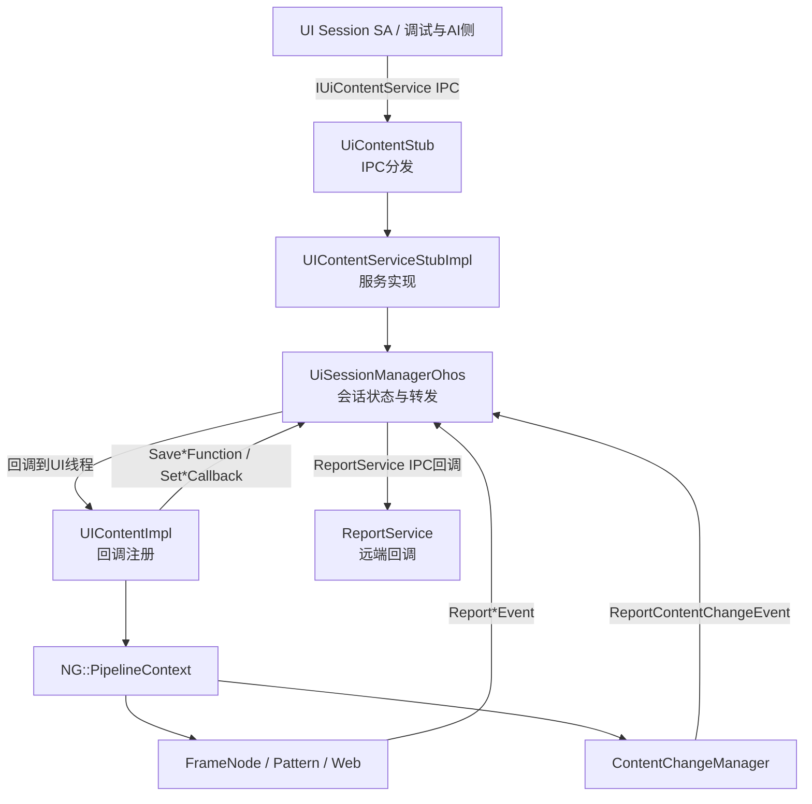
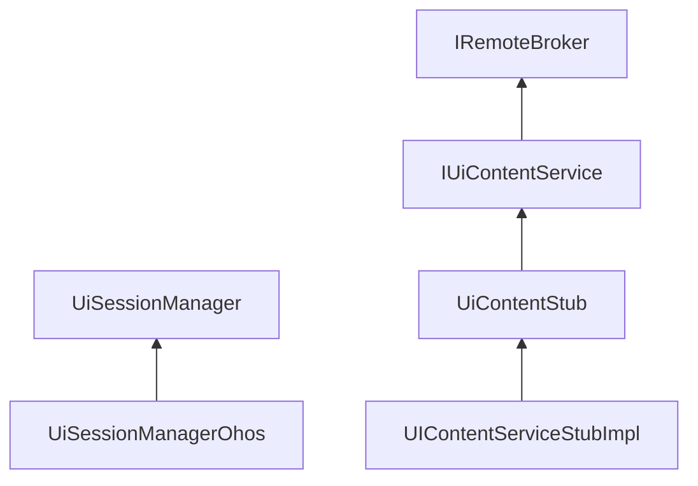
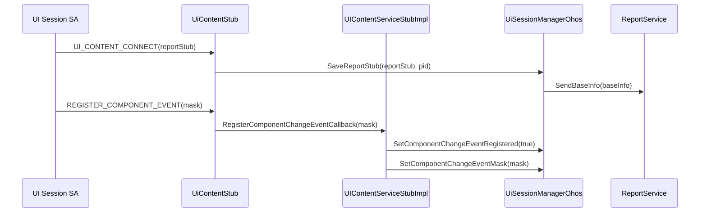
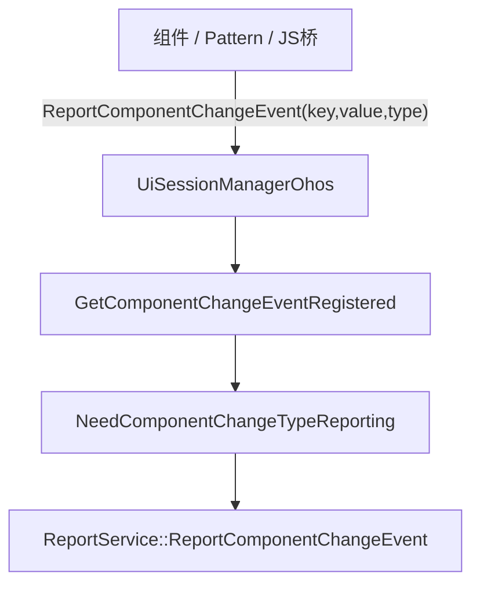
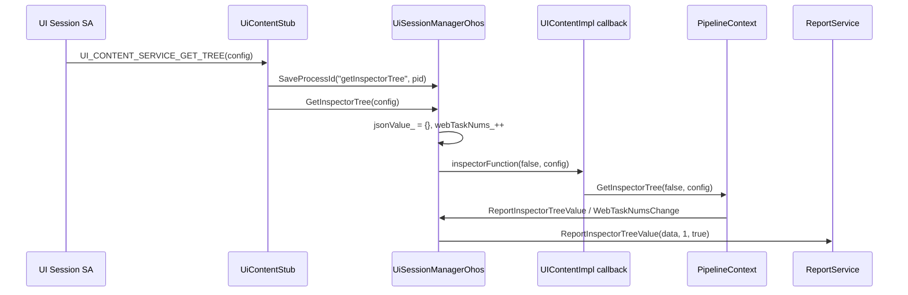
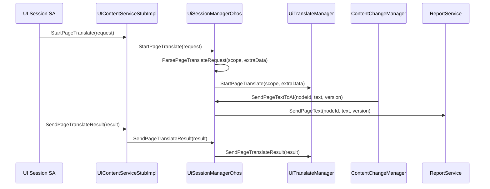
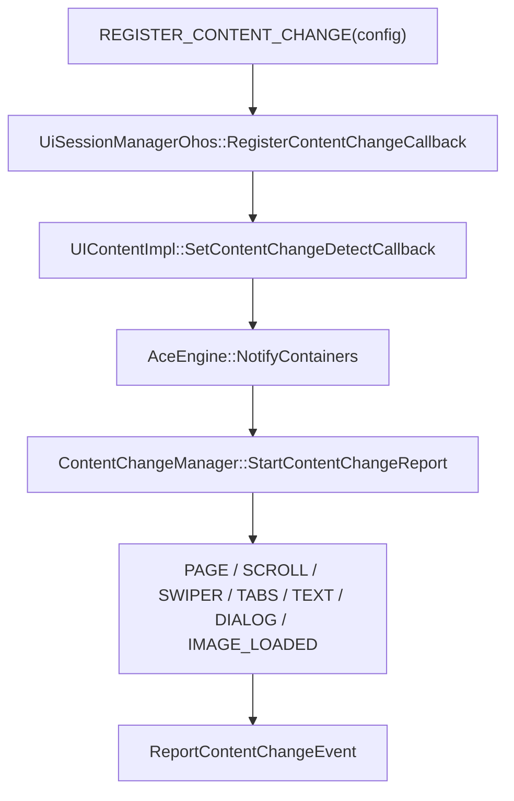
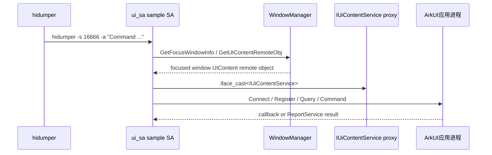
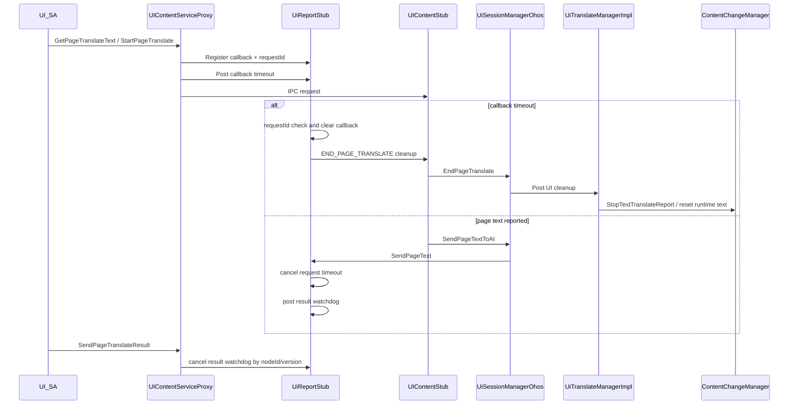

# UISession UI会话知识库

> 文档版本：v1.0
> 更新时间：2026-06-13
> 源码版本：OpenHarmony ace_engine (master 分支)

## 概述

### 定位与职责

- 系统定位：UISession 是 ArkUI 在应用进程内提供给系统 SA、调试工具和 AI 能力的内部 UI 会话通道，负责将跨进程请求转换为 Pipeline、组件树、Web、翻译和内容变化检测的内部操作。
- 核心职责：
  1. 通过 `IUiContentService` 暴露跨进程内部服务，完成连接、注册、查询和控制请求分发。
  2. 通过 `UiSessionManager` 保存事件注册状态、回调函数、远端 `ReportService` 对象和请求进程集合。
  3. 上报点击、搜索、文本变化、路由、组件变化、滚动、生命周期、选中文本、Web 输入、内容变化等事件。
  4. 支持 InspectorTree、可见树、HitTest、状态管理信息、页面名、图片、Web 信息查询。
  5. 支持 Web 翻译、页面翻译、页面文本发送 AI、翻译结果回写、指定文本偏移查询与高亮。

### 设计目标

| 目标 | 说明 |
|------|------|
| 跨进程隔离 | `UiContentStub::OnRemoteRequest` 先校验调用方 token 为 native SA，再校验 interface token。 |
| 按需上报 | 事件注册使用原子计数；组件变化事件还通过 `ComponentEventType` mask 控制上报类型。 |
| UI线程收敛 | `UIContentImpl` 保存的回调通过 `TaskExecutor` 投递到 UI 线程，再访问 `PipelineContext` 和节点树。 |
| 多实例翻译 | `UiSessionManagerOhos` 通过当前 instanceId 回调从 `translateManagerMap_` 选择 `UiTranslateManager`。 |
| 大数据保护 | HitTest 信息按 `ONCE_IPC_SEND_DATA_MAX_SIZE` 分段回传，InspectorTree 用 Web 任务计数聚合异步 Web 子树。 |

### 与其他模块的交互关系



## 架构设计

### 类继承关系



### 核心接口

| 方法 | 功能 | 源码位置 |
|------|------|---------|
| `UiSessionManager::GetInstance()` | 返回进程内 UISession 单例，OHOS 实现为静态 `UiSessionManagerOhos`。 | `adapter/ohos/entrance/ui_session/ui_session_manager_ohos.cpp:57` |
| `UiContentStub::OnRemoteRequest()` | IPC 统一入口，完成 SA/token 校验并按 transaction code 分发。 | `adapter/ohos/entrance/ui_session/ui_content_stub.cpp:42` |
| `UIContentServiceStubImpl::RegisterComponentChangeEventCallback()` | 注册组件变化事件并设置组件事件 mask。 | `adapter/ohos/entrance/ui_session/ui_content_stub_impl.cpp:51` |
| `UiSessionManagerOhos::ReportComponentChangeEvent()` | 根据远端对象、注册状态和 mask 过滤后上报组件变化 JSON。 | `adapter/ohos/entrance/ui_session/ui_session_manager_ohos.cpp:115` |
| `UiSessionManagerOhos::GetInspectorTree()` | 初始化 InspectorTree 聚合 JSON，触发保存的 Pipeline 查询回调。 | `adapter/ohos/entrance/ui_session/ui_session_manager_ohos.cpp:360` |
| `UiSessionManagerOhos::GetPageTranslateText()` | 解析页面翻译请求，并投递到当前 `UiTranslateManager`。 | `adapter/ohos/entrance/ui_session/ui_session_manager_ohos.cpp:819` |
| `UiSessionManagerOhos::StartPageTranslate()` | 校验请求后记录页面翻译会话 scope 与 started 状态。 | `adapter/ohos/entrance/ui_session/ui_session_manager_ohos.cpp:837` |
| `UIContentImpl::InitializeCallback()` | 注册 InspectorTree、Web、图片、页面名、HitTest、内容变化等回调。 | `adapter/ohos/entrance/ui_content_impl.cpp:6180` |
| `ContentChangeManager::StartContentChangeReport()` | 开启内容变化检测，修正非法阈值并通知已注册节点。 | `frameworks/core/components_ng/manager/content_change_manager/content_change_manager.cpp:247` |

### 核心数据结构

| 成员/结构 | 类型 | 说明 | 源码位置 |
|------|------|------|------|
| `processMap_` | `std::map<std::string, std::set<int32_t>>` | 按能力记录等待回调的请求进程，如 `getInspectorTree`、`translate`、`contentChange`。 | `interfaces/inner_api/ui_session/ui_session_manager.h:270` |
| `reportObjectMap_` | `std::map<int32_t, sptr<IRemoteObject>>` | 保存调用进程 pid 到远端 `ReportService` 对象的映射。 | `adapter/ohos/entrance/ui_session/ui_session_manager_ohos.h:156` |
| `*EventRegisterProcesses_` | `std::atomic<int32_t>` | 各事件注册计数，大于 0 表示该类事件需要上报。 | `interfaces/inner_api/ui_session/ui_session_manager.h:272` |
| `componentChangeEventMask_` | `uint32_t` | 组件变化事件类型过滤 mask。 | `interfaces/inner_api/ui_session/ui_session_manager.h:277` |
| `jsonValue_` / `webTaskNums_` | JSON 指针 / 原子计数 | InspectorTree 聚合容器和 Web 子任务计数。 | `interfaces/inner_api/ui_session/ui_session_manager.h:299` |
| `translateManagerMap_` | `std::map<int32_t, std::shared_ptr<UiTranslateManager>>` | 按 instanceId 保存翻译管理器。 | `interfaces/inner_api/ui_session/ui_session_manager.h:304` |
| `pageTranslateScope_` / `pageTranslateStarted_` | `int32_t` / `bool` | 页面连续翻译会话状态。 | `adapter/ohos/entrance/ui_session/ui_session_manager_ohos.h:153` |
| `ParamConfig` | struct | 控制 InspectorTree 是否包含交互、无障碍、Web、UIExtension 等信息。 | `interfaces/inner_api/ui_session/param_config.h:23` |
| `ContentChangeConfig` | struct | 控制内容变化检测最小间隔、文本比例、图片尺寸和延迟上报时间。 | `interfaces/inner_api/ui_session/param_config.h:47` |

## 核心流程

### 流程 1：SA 连接与事件注册



`ConnectInner` 从 `MessageParcel` 读取远端 `reportStub`，用调用方真实 pid 保存到 Manager，并立即发送 baseInfo；组件事件注册由 Stub 读取 mask 后传给服务实现。源码：`adapter/ohos/entrance/ui_session/ui_content_stub.cpp:266`、`adapter/ohos/entrance/ui_session/ui_content_stub.cpp:307`、`adapter/ohos/entrance/ui_session/ui_content_stub_impl.cpp:51`。

### 流程 2：组件变化事件上报



`UiSessionManagerOhos::ReportComponentChangeEvent` 遍历 `reportObjectMap_`。只有 `ReportService` 非空、组件变化已注册且 `componentChangeEventMask_ & eventType` 非 0 时，才构造 JSON 并调用远端 `ReportComponentChangeEvent`。源码：`adapter/ohos/entrance/ui_session/ui_session_manager_ohos.cpp:115`、`adapter/ohos/entrance/ui_session/ui_session_manager_ohos.cpp:340`。

### 流程 3：InspectorTree 查询与 Web 子树聚合



`UIContentImpl` 注册的 InspectorTree 回调用 `PostSyncTaskTimeout` 切到 UI 线程查询 Pipeline；Manager 用 `jsonValue_` 收集 Web 子树，通过 `webTaskNums_` 归零触发最终回调。源码：`adapter/ohos/entrance/ui_content_impl.cpp:6182`、`adapter/ohos/entrance/ui_session/ui_session_manager_ohos.cpp:360`、`adapter/ohos/entrance/ui_session/ui_session_manager_ohos.cpp:412`。

### 流程 4：页面翻译与 AI 文本通道



页面翻译请求支持 JSON 形式的 `scope` 与 `extraData`，scope 非数字或非法时返回 `PARAM_INVALID`。连续翻译通过 `pageTranslateScope_` 和 `pageTranslateStarted_` 保存会话状态；页面文本由 `ContentChangeManager` 计算版本后发给 `processMap_["translate"]` 中的远端进程。源码：`adapter/ohos/entrance/ui_session/ui_session_manager_ohos.cpp:31`、`adapter/ohos/entrance/ui_session/ui_session_manager_ohos.cpp:837`、`frameworks/core/components_ng/manager/content_change_manager/content_change_manager.cpp:376`、`adapter/ohos/entrance/ui_session/ui_session_manager_ohos.cpp:903`。

### 流程 5：内容变化检测



注册内容变化回调后，`UIContentImpl` 在 UI 线程遍历所有容器并启动各自的 `ContentChangeManager`。后续页面跳转、滚动结束、Swiper/Tabs 切换、弹窗显示隐藏、文本面积变化等事件会被转换成 `ChangeType` 上报。源码：`adapter/ohos/entrance/ui_session/ui_content_stub_impl.cpp:292`、`adapter/ohos/entrance/ui_content_impl.cpp:6784`、`frameworks/core/components_ng/manager/content_change_manager/content_change_manager.cpp:561`。

### 流程 6：ui_session_sample 验证链路



`interfaces/inner_api/ui_session/ui_session_sample` 提供一个 SystemAbility 示例 `ui_sa`，SA ID 固定为 `16666`。它通过当前焦点窗口 ID 向 WindowManager 获取应用进程暴露的 `IUiContentService` 远端对象，再按 `hidumper` 参数分发到 `DUMP_MAP` 中的验证命令。源码：`interfaces/inner_api/ui_session/ui_session_sample/ui_sa_interface.h:22`、`interfaces/inner_api/ui_session/ui_session_sample/ui_sa_service.cpp:167`、`interfaces/inner_api/ui_session/ui_session_sample/ui_sa_service.cpp:241`。

## 关键特性

### 事件注册计数与组件事件 mask

- `SetClickEventRegistered`、`SetComponentChangeEventRegistered` 等方法通过原子计数增减注册进程数。源码：`adapter/ohos/entrance/ui_session/ui_session_manager_ohos.cpp:236`、`adapter/ohos/entrance/ui_session/ui_session_manager_ohos.cpp:272`。
- `Get*EventRegistered()` 统一通过 `load() > 0` 判断是否存在消费者。源码：`adapter/ohos/entrance/ui_session/ui_session_manager_ohos.cpp:315`。
- 组件事件 mask 定义在 `ComponentEventType`，覆盖手势、选择、动画、滚动、文本输入、弹窗、图片、Picker、Swiper、Web、Menu、Sheet、Modal、Video 等类型。源码：`interfaces/inner_api/ui_session/param_config.h:56`。

### IPC 安全入口

`UiContentStub::OnRemoteRequest` 只接受 native SA 调用；非 SA 调用或 interface token 不匹配时直接返回 `-1`。源码：`adapter/ohos/entrance/ui_session/ui_content_stub.cpp:29`、`adapter/ohos/entrance/ui_session/ui_content_stub.cpp:42`。

### UI 线程回调注册

`UIContentImpl::InitializeCallback` 一次性注册 InspectorTree、Web 注册通知、图片查询、页面名、命令、HitTest、内容变化、文本偏移、高亮、选中文本、状态管理、Web 信息等回调。多数回调通过 `TaskExecutor` 投递 UI 线程执行，避免跨线程直接访问 Pipeline 和节点树。源码：`adapter/ohos/entrance/ui_content_impl.cpp:6180`、`adapter/ohos/entrance/ui_content_impl.cpp:6306`、`adapter/ohos/entrance/ui_content_impl.cpp:6371`、`adapter/ohos/entrance/ui_content_impl.cpp:6871`。

### 翻译管理器按实例选择

OHOS 实现通过 `SaveTranslateManager` 将 `UiTranslateManager` 写入 `translateManagerMap_`，通过 `SaveGetCurrentInstanceIdCallback` 获取当前 instanceId，再由 `GetCurrentTranslateManager` 找到对应翻译管理器。源码：`adapter/ohos/entrance/ui_session/ui_session_manager_ohos.cpp:610`、`adapter/ohos/entrance/ui_session/ui_session_manager_ohos.cpp:617`、`adapter/ohos/entrance/ui_session/ui_session_manager_ohos.cpp:629`。

### 内容变化检测阈值

`ContentChangeConfig` 默认值为最小上报间隔 100ms、文本面积比例 0.15、图片最小宽高 100px、过渡后延迟 600ms；`StartContentChangeReport` 会对非法比例或负数阈值回退到默认值。源码：`interfaces/inner_api/ui_session/param_config.h:47`、`frameworks/core/components_ng/manager/content_change_manager/content_change_manager.cpp:247`。

### DFX 与鲁棒性设计

UISession 的 DFX 重点是跨进程 callback 不悬挂、翻译临时态不残留、超时/死亡路径不打印正文。页面翻译特性分支将默认页面翻译 timeout 固化为 5000ms，并复用 `Connect` 传入的 `EventHandler` 投递延时任务。源码：`lushi/translate:interfaces/inner_api/ui_session/ui_content_service_interface.h:40`、`lushi/translate:interfaces/inner_api/ui_session/ui_content_service_interface.h:41`、`lushi/translate:adapter/ohos/entrance/ui_session/ui_content_proxy.cpp:134`、`lushi/translate:adapter/ohos/entrance/ui_session/ui_content_proxy.cpp:160`。



| 场景 | 机制 | 清理/降级行为 | 关键源码 |
|------|------|---------------|----------|
| Connect 后 DFX handler 建立 | `UIContentServiceProxy::Connect` 在 IPC 成功后 `report_->SetEventHandler(eventHandler)` | 后续 InspectorTree、页面翻译 callback timeout、译文 watchdog 都依赖该 handler；handler 为空时相关 timeout 投递失败并清 pending | `lushi/translate:adapter/ohos/entrance/ui_session/ui_content_proxy.cpp:154`、`lushi/translate:adapter/ohos/entrance/ui_session/ui_content_proxy.cpp:160`、`lushi/translate:adapter/ohos/entrance/ui_session/ui_report_stub.cpp:645` |
| 页面翻译请求发起 | `SendPageTranslateRequest` 校验 callback/request，通过 `UiReportStub::RegisterPageTranslateTextCallback` 注册 `PageTranslateTextCallback`，再按单次 Get 需要注册 timeout cleanup callback | callback 为空或 scope 非法返回 `PARAM_INVALID`；同一 report 已有未完成 Get/Start callback 时注册失败并返回 `LAST_UNFINISH`，该注册函数以 mutex 保护，避免多线程高频重复请求进入 manager 链路；timeout cleanup callback 发送 `END_PAGE_TRANSLATE` | `lushi/translate:adapter/ohos/entrance/ui_session/ui_content_proxy.cpp:691`、`lushi/translate:adapter/ohos/entrance/ui_session/ui_content_proxy.cpp:717`、`lushi/translate:adapter/ohos/entrance/ui_session/ui_content_proxy.cpp:723` |
| timeout 任务投递失败 | `PostPageTranslateCallbackRemoveTask` 通过 weak `EventHandler` 投递延时任务 | handler 为空或投递失败时清 `pageTranslateTextCallback_`、`pageTranslateTimeoutCallback_` 和 `pageTranslateContinuous_`，proxy 返回 `FAILED`，避免请求进入半注册状态 | `lushi/translate:adapter/ohos/entrance/ui_session/ui_report_stub.cpp:496`、`lushi/translate:adapter/ohos/entrance/ui_session/ui_report_stub.cpp:508`、`lushi/translate:adapter/ohos/entrance/ui_session/ui_report_stub.cpp:528` |
| callback timeout | timeout task 携带 `requestId` 调用 `HandlePageTranslateCallbackTimeout` | requestId 过期说明是旧任务，直接忽略；当前请求超时时清 callback 和连续标志，并按需触发 cleanup callback | `lushi/translate:adapter/ohos/entrance/ui_session/ui_report_stub.cpp:584`、`lushi/translate:adapter/ohos/entrance/ui_session/ui_report_stub.cpp:618`、`lushi/translate:adapter/ohos/entrance/ui_session/ui_report_stub.cpp:623` |
| 单次请求完成 | `SendPageTranslateResult` IPC 成功后，proxy 取消可解析 nodeId/version 的 result watchdog，并调用 `UiReportStub::FinishPageTranslateTextRequest` | 非连续 Get 释放页面翻译 callback 和 timeout callback，允许下一次 Get/Start；连续 Start 下该释放函数保持 no-op，直到 End/SA death/清理路径注销 callback | `lushi/translate:adapter/ohos/entrance/ui_session/ui_content_proxy.cpp:1253`、`lushi/translate:adapter/ohos/entrance/ui_session/ui_content_proxy.cpp:1272`、`lushi/translate:adapter/ohos/entrance/ui_session/ui_report_stub.cpp:595` |
| 原文已发出但译文长时间未回 | `SendPageText` 正常回调 SA 后为 `nodeId/version` 投递 result watchdog | watchdog 仅输出不含正文的 nodeId/version 告警；不强制结束连续翻译，不恢复原文，迟到译文仍按 nodeId/version 校验 | `lushi/translate:adapter/ohos/entrance/ui_session/ui_report_stub.cpp:541`、`lushi/translate:adapter/ohos/entrance/ui_session/ui_report_stub.cpp:640`、`lushi/translate:adapter/ohos/entrance/ui_session/ui_report_stub.cpp:825` |
| 译文回填成功发送 | `SendPageTranslateResult` 解析 result 中可识别的 nodeId/version identity | IPC 发送成功后取消对应 result watchdog；单次 Get 释放 callback 并解除并发限制；解析失败不影响 IPC 失败返回码，但无法取消 watchdog | `lushi/translate:adapter/ohos/entrance/ui_session/ui_content_proxy.cpp:1253`、`lushi/translate:adapter/ohos/entrance/ui_session/ui_content_proxy.cpp:1258`、`lushi/translate:adapter/ohos/entrance/ui_session/ui_content_proxy.cpp:1272` |
| 当前 Ability 语言地区查询 | `GetCurrentAbilityLanguageInfo` 在 proxy 侧使用同步 in-flight guard，再发送 `GET_CURRENT_ABILITY_LANGUAGE_INFO` IPC | 上一笔同步查询未返回前重复调用返回 `LAST_UNFINISH`，不得重复发送 IPC；`SendRequest` 返回或错误路径自动释放 guard；不注册 report callback、不改变翻译会话状态 | `lushi/translate:adapter/ohos/entrance/ui_session/ui_content_proxy.cpp:1296`、`lushi/translate:adapter/ohos/entrance/ui_session/ui_content_stub.cpp:713`、`lushi/translate:adapter/ohos/entrance/ui_session/ui_session_manager_ohos.cpp:948` |
| End/Reset 主动清理 | `EndPageTranslate` 清会话 scope 后投递 UI 线程；`ResetPageTranslate` 按 nodeId 或全量投递 UI 线程 | ArkWeb 分支复用旧 Reset；ArkUI 分支调用 `ContentChangeManager::StopTextTranslateReport` 或 `ResetTranslateTextNode` 恢复运行时译文 | `lushi/translate:adapter/ohos/entrance/ui_session/ui_session_manager_ohos.cpp:860`、`lushi/translate:adapter/ohos/entrance/ace_translate_manager.cpp:194`、`lushi/translate:frameworks/core/components_ng/manager/content_change_manager/content_change_manager.cpp:345` |
| SA/report 进程死亡 | `SaveReportStub` 为 SA report remote 增加 `UiReportProxyRecipient` 死亡监听 | 若死亡进程是唯一 translate owner，则调用 `ResetTranslate(-1)` 和 `ResetPageTranslate(-1)`，清 `pageTranslateStarted_` / `pageTranslateScope_`，并从 report/process map 删除该 pid | `lushi/translate:adapter/ohos/entrance/ui_session/ui_session_manager_ohos.cpp:208`、`lushi/translate:adapter/ohos/entrance/ui_session/ui_session_manager_ohos.cpp:215`、`lushi/translate:adapter/ohos/entrance/ui_session/ui_session_manager_ohos.cpp:224` |
| UIContent remote 死亡 | `UiContentProxyRecipient::OnRemoteDied` 和 `UiReportProxyRecipient::OnRemoteDied` 是通用死亡回调包装 | 透传到注册的 handler，由上层清理缓存的 remote object 或 report object | `lushi/translate:adapter/ohos/entrance/ui_session/ui_content_proxy.cpp:1304`、`lushi/translate:adapter/ohos/entrance/ui_session/ui_report_proxy.cpp:448` |

页面翻译 Get/Start 的高频调用限制方法：

1. 以 `UiReportStub::RegisterPageTranslateTextCallback` 作为唯一并发闸门。该函数在 `pageTranslateCallbackMutex_` 保护下判断 `pageTranslateTextCallback_` 是否为空；若不为空，说明同一 `report` 连接上仍存在未完成 Get/Start 请求，注册失败。
2. `UIContentServiceProxy::SendPageTranslateRequest` 必须先完成 callback 注册，再发送 `GET_PAGE_TRANSLATE_TEXT` 或 `START_PAGE_TRANSLATE` IPC。注册失败时直接返回 `LAST_UNFINISH`，不得发送 IPC，不得进入 `UiSessionManagerOhos`，不得触发页面遍历或连续翻译启动。
3. 不在 `UiSessionManagerOhos` 或 `ContentChangeManager` 再维护一套 Get/Start pending 变量。manager 只处理已经通过 report callback 闸门的合法请求，避免状态重复和并发竞争面扩大。
4. 单次 Get 的释放点是 `SendPageTranslateResult` 成功发送后调用 `UiReportStub::FinishPageTranslateTextRequest`、请求 timeout cleanup、IPC 发送失败或连接/死亡清理。释放后下一次 Get/Start 才能注册 callback。
5. 连续 Start 的 callback 生命周期跨越初始快照和后续增量；`FinishPageTranslateTextRequest` 在连续模式下保持 no-op，直到 `EndPageTranslate`、SA death/连接断开或清理路径调用 `UnregisterPageTranslateTextCallback`。因此 Start 期间重复 Get/Start 都返回 `LAST_UNFINISH`。
6. SA 侧应对 Get/Start 做节流，不用高频重复 Get/Start 模拟批处理；多个节点译文应通过一次 `SendPageTranslateResult` 的 `results` 数组批量回填。

当前 Ability 语言地区查询的高频调用限制方法：

1. `GetCurrentAbilityLanguageInfo` 是同步 IPC 简单查询，不注册 `ReportService` callback，因此不能复用页面翻译的 callback 闸门。
2. 在 `UIContentServiceProxy::GetCurrentAbilityLanguageInfo` 入口创建 proxy 侧 in-flight guard。guard 用原子状态记录当前同步查询是否在途；若上一笔查询尚未从 `Remote()->SendRequest` 返回，新的查询直接返回 `LAST_UNFINISH`。
3. guard 必须覆盖写 parcel、`SendRequest`、读取 reply 和错误返回全过程，通过析构或等价 RAII 自动释放，确保写 parcel 失败、IPC 失败、远端返回失败时不会长期阻塞后续查询。
4. 该限制不进入 `UiSessionManagerOhos`，不改变 `getAbilityLanguageInfoCallback_`，不影响页面翻译 Get/Start/End/Reset 状态。

清理顺序建议保持如下不变量：

1. 先校验 requestId，过期 timeout 或迟到 callback 不得影响新请求。
2. 再移除 pending callback 和 timeout/watchdog task，避免二次触发。
3. 最后通知 manager 执行 End/Reset，并切 UI 线程恢复 Pattern 运行时译文。
4. 所有 DFX 日志只打印 requestId、nodeId、version、长度、scope、processId 和错误码，不打印原文/译文正文。

## 代码组织

```text
ace_engine/
├── interfaces/inner_api/ui_session/
│   ├── ui_content_service_interface.h
│   ├── ui_session_manager.h
│   ├── ui_content_stub*.h
│   ├── ui_report_*.h
│   ├── ui_translate_manager.h
│   ├── ui_session_sample/
│   └── param_config.h
├── adapter/ohos/entrance/ui_session/
│   ├── ui_session_manager_ohos.h/.cpp
│   ├── ui_content_stub.cpp
│   ├── ui_content_stub_impl.cpp
│   ├── ui_content_proxy.cpp
│   ├── ui_report_proxy.cpp
│   └── ui_session_json_util.cpp
├── adapter/ohos/entrance/ui_content_impl.cpp
└── frameworks/core/components_ng/manager/content_change_manager/
    ├── content_change_manager.h
    └── content_change_manager.cpp
```

### 核心文件索引

| 文件 | 路径 | 说明 |
|------|------|------|
| IPC 接口 | `interfaces/inner_api/ui_session/ui_content_service_interface.h` | `IUiContentService` transaction code、回调类型、翻译结构和服务方法。 |
| Manager 抽象接口 | `interfaces/inner_api/ui_session/ui_session_manager.h` | UISession 单例入口、默认虚接口、注册状态和回调成员。 |
| 参数配置 | `interfaces/inner_api/ui_session/param_config.h` | InspectorTree、HitTest、内容变化、组件事件 mask 配置。 |
| OHOS Manager | `adapter/ohos/entrance/ui_session/ui_session_manager_ohos.cpp` | 事件上报、进程映射、翻译、图片、内容变化、状态管理转发。 |
| IPC Stub | `adapter/ohos/entrance/ui_session/ui_content_stub.cpp` | SA 调用校验、transaction 分发、pid 保存和 parcel 解析。 |
| Stub 实现 | `adapter/ohos/entrance/ui_session/ui_content_stub_impl.cpp` | 将跨进程接口转成 `UiSessionManager` 调用。 |
| 回调注册 | `adapter/ohos/entrance/ui_content_impl.cpp` | 将 Manager 回调绑定到 UI 线程、Pipeline、FrameNode 和翻译管理器。 |
| 内容变化 | `frameworks/core/components_ng/manager/content_change_manager/content_change_manager.cpp` | 内容变化检测、翻译文本版本、事件聚合与上报。 |
| Sample SA | `interfaces/inner_api/ui_session/ui_session_sample/` | 构建 `ui_sa` 示例 SystemAbility，用 `hidumper -s 16666 -a` 触发 UISession 验证命令。 |

## 性能与优化

| 优化策略 | 说明 | 效果 |
|---------|------|------|
| 按需上报 | 注册计数为 0 或组件 mask 未命中时不发送相关事件。 | 降低无消费者场景下 JSON 构造和 IPC 回调成本。 |
| InspectorTree Web 聚合 | `webTaskNums_` 归零后才调用 `ReportInspectorTreeValue`。 | 避免 Web 子树异步填充未完成时提前返回。 |
| HitTest 分段发送 | HitTest 数据按 `ONCE_IPC_SEND_DATA_MAX_SIZE` 切片并标记最后一段。 | 避免单次 IPC 数据过大。 |
| 内容变化节流 | `minReportTime`、`reportDelayTime`、滚动/过渡状态共同控制上报窗口。 | 降低连续滚动、过渡、文本变化带来的重复上报。 |
| 页面翻译版本过滤 | 文本 hash 未变化时返回 `-1` 跳过发送，变化后递增 version。 | 降低重复文本发送给 AI 的成本。 |

## 调试指南

- IPC 入口：断点 `adapter/ohos/entrance/ui_session/ui_content_stub.cpp:42`，检查 code、SA token、interface token。
- 连接链路：断点 `adapter/ohos/entrance/ui_session/ui_content_stub.cpp:266` 和 `adapter/ohos/entrance/ui_session/ui_session_manager_ohos.cpp:208`。
- 事件注册：断点 `adapter/ohos/entrance/ui_session/ui_content_stub_impl.cpp:30` 到 `adapter/ohos/entrance/ui_session/ui_content_stub_impl.cpp:80`。
- 组件事件过滤：断点 `adapter/ohos/entrance/ui_session/ui_session_manager_ohos.cpp:115` 和 `adapter/ohos/entrance/ui_session/ui_session_manager_ohos.cpp:340`。
- InspectorTree：断点 `adapter/ohos/entrance/ui_content_impl.cpp:6182`、`adapter/ohos/entrance/ui_session/ui_session_manager_ohos.cpp:360`、`adapter/ohos/entrance/ui_session/ui_session_manager_ohos.cpp:429`。
- 页面翻译：断点 `adapter/ohos/entrance/ui_session/ui_session_manager_ohos.cpp:819`、`adapter/ohos/entrance/ui_session/ui_session_manager_ohos.cpp:837`、`adapter/ohos/entrance/ui_session/ui_session_manager_ohos.cpp:903`。
- 页面翻译 DFX：断点 `adapter/ohos/entrance/ui_session/ui_content_proxy.cpp:691`、`adapter/ohos/entrance/ui_session/ui_report_stub.cpp:496`、`adapter/ohos/entrance/ui_session/ui_report_stub.cpp:618`、`adapter/ohos/entrance/ui_session/ui_report_stub.cpp:640`。
- 页面翻译高频调用限制：断点 `adapter/ohos/entrance/ui_session/ui_content_proxy.cpp:717` 和 `adapter/ohos/entrance/ui_session/ui_report_stub.cpp:568`；重复 Get/Start 时应在 callback 注册阶段返回 `LAST_UNFINISH`，不应进入 `UiSessionManagerOhos::GetPageTranslateText` 或 `StartPageTranslate`。
- 当前 Ability 语言查询高频调用限制：断点 `adapter/ohos/entrance/ui_session/ui_content_proxy.cpp:1296`；上一笔 `GetCurrentAbilityLanguageInfo` 同步 IPC 未返回时，重复调用应返回 `LAST_UNFINISH`，不应进入 `UiContentStub::GetCurrentAbilityLanguageInfoInner`。
- 死亡恢复：断点 `adapter/ohos/entrance/ui_session/ui_session_manager_ohos.cpp:208`，确认 report remote 死亡时是否执行 `ResetTranslate(-1)`、`ResetPageTranslate(-1)` 并清理 `processMap_`。
- 内容变化：非 release 版本可通过 Pipeline dump 参数 `-contentChange` 查看 `ContentChangeManager::DumpInfo()`，入口在 `frameworks/core/pipeline_ng/pipeline_context.cpp:4382`。

### 使用 ui_session_sample 验证

#### 构建与部署

`ui_session_sample` 由 `interfaces/inner_api/ui_session:ui_session_example` group 拉起，实际构建 `ui_session_sample:ui_sa`。`ui_sa` 目标会生成示例 SA 共享库、SA profile 和 init 配置：`libui_sa.z.so`、`16666.json`、`ui_sa.cfg`。源码：`interfaces/inner_api/ui_session/BUILD.gn:82`、`interfaces/inner_api/ui_session/ui_session_sample/BUILD.gn:17`、`interfaces/inner_api/ui_session/ui_session_sample/BUILD.gn:41`。

从 OpenHarmony 根目录构建：

```bash
./build.sh --product-name rk3568 --build-target //foundation/arkui/ace_engine/interfaces/inner_api/ui_session:ui_session_example
```

部署到设备或镜像后，确认 profile 和 init 配置生效：

```bash
hdc shell hidumper -ls | grep 16666
hdc shell ps -ef | grep ui_sa
```

若是在已有开发板上临时验证，需要手动推送 `ui_sa` 库和配置。`ui_sa.cfg` 指定 `sa_main` 按 `/system/profile/16666.json` 拉起，profile 中 `libpath` 为 `libui_sa.z.so`，因此库需要放到系统可加载路径，当前真机验证使用 `/system/lib64/platformsdk/`。源码：`interfaces/inner_api/ui_session/ui_session_sample/ui_sa.cfg:3`、`interfaces/inner_api/ui_session/ui_session_sample/ui_sa.cfg:4`、`interfaces/inner_api/ui_session/ui_session_sample/16666.json:5`、`interfaces/inner_api/ui_session/ui_session_sample/16666.json:6`。

```bash
# 1. 查找本地构建产物，也可用 out/rk3568 全局 find 确认实际路径。
find out/rk3568 -name libui_sa.z.so -o -name 16666.json -o -name ui_sa.cfg

# 2. 设备侧准备临时目录和可写系统分区。不同产品镜像 remount 命令可能略有差异。
hdc shell mount -o rw,remount /
hdc shell mkdir -p /data/sofiles

# 3. 推送库和配置文件。
hdc file send <path-to-libui_sa.z.so> /data/sofiles/libui_sa.z.so
hdc shell cp /data/sofiles/libui_sa.z.so /system/lib64/platformsdk/libui_sa.z.so
hdc file send interfaces/inner_api/ui_session/ui_session_sample/16666.json /system/profile/16666.json
hdc file send interfaces/inner_api/ui_session/ui_session_sample/ui_sa.cfg /system/etc/init/ui_sa.cfg

# 4. 补充 SA 账号和组。重复执行前先 grep，避免重复追加。
hdc shell "grep -q '^ui_sa:' /system/etc/group || echo 'ui_sa:x:16666:' >> /system/etc/group"
hdc shell "grep -q '^ui_sa:' /system/etc/passwd || echo 'ui_sa:x:16666:::16666:::/bin/false' >> /system/etc/passwd"

# 5. 开发板验证可临时放宽 SELinux，并创建 sample 输出目录。
hdc shell "sed -i 's/^SELINUX=.*/SELINUX=permissive/g' /system/etc/selinux/config"
hdc shell "cat /system/etc/selinux/config | grep SELINUX="
hdc shell mkdir -p /data/service/el1/public/ui_sa
hdc shell chown ui_sa:ui_sa /data/service/el1/public/ui_sa
hdc shell chmod 770 /data/service/el1/public/ui_sa

# 6. 重启后确认 SA 已注册。
hdc shell reboot
hdc shell power-shell wakeup
hdc shell "power-shell setmode 602"
hdc shell hidumper -ls | grep 16666
hdc shell ps -ef | grep ui_sa
```

若 `hdc` 只能在 Windows 主机上执行，可先用 `scp -P 2222` 把本地构建产物复制到 Windows 主机，再在 Windows 侧执行同样的 `hdc file send` / `hdc shell` 命令；不要把个人密码写入仓内文档或脚本。

若需要保存树文件，必须先确保 sample 写入目录存在并归属 `ui_sa`：

```bash
hdc shell mkdir -p /data/service/el1/public/ui_sa
hdc shell chown ui_sa:ui_sa /data/service/el1/public/ui_sa
```

#### 调用方式

sample 通过 `hidumper -s 16666 -a "<命令> [参数...]"` 驱动。`UiSaService::Dump` 会取当前焦点窗口，调用 `WindowManager::GetUIContentRemoteObj` 获取该窗口的 `IUiContentService`，因此验证前需要保证目标 ArkUI 应用窗口处于焦点。源码：`interfaces/inner_api/ui_session/ui_session_sample/ui_sa_service.cpp:210`、`interfaces/inner_api/ui_session/ui_session_sample/ui_sa_service.cpp:241`。

常用命令：

```bash
# 验证前先让目标 ArkUI 应用窗口处于前台焦点；重启后建议先点亮并保持常亮。
hdc shell power-shell wakeup
hdc shell "power-shell setmode 602"

# 建立连接，触发 IUiContentService::Connect
hdc shell hidumper -s 16666 -a "Connect"

# 获取可见 InspectorTree；末尾 -tofile 时保存到 /data/service/el1/public/ui_sa/arkui_tree_*.json
hdc shell hidumper -s 16666 -a "GetVisibleInspectorTree"
hdc shell hidumper -s 16666 -a "GetVisibleInspectorTree true false true true false -tofile"

# 获取当前页面名
hdc shell hidumper -s 16666 -a "GetCurrentPageName"

# 注册/取消组件变化事件；无参数表示 COMPONENT_EVENT_ALL，x 表示 COMPONENT_EVENT_NONE，其余数字按 ComponentEventType bit 位组合
hdc shell hidumper -s 16666 -a "RegisterComponentChangeEventCallback"
hdc shell hidumper -s 16666 -a "RegisterComponentChangeEventCallback 1 4 5"
hdc shell hidumper -s 16666 -a "UnregisterComponentChangeEventCallback"

# 注册内容变化检测；不带参数使用 ContentChangeConfig 默认值，末尾 -tofile 时保存 simpleTree
hdc shell hidumper -s 16666 -a "RegisterContentChangeCallback"
hdc shell hidumper -s 16666 -a "RegisterContentChangeCallback 100 0.15 x 100 100 600 -tofile"
hdc shell hidumper -s 16666 -a "UnregisterContentChangeCallback"

# 查询图片与 Web 信息
hdc shell hidumper -s 16666 -a "GetCurrentImagesShowing"
hdc shell hidumper -s 16666 -a "GetWebInfoByRequest <webId> RequestArkWebDomTree"

# 文本选择与文本内容能力
hdc shell hidumper -s 16666 -a "RegisterSelectTextEventCallback"
hdc shell hidumper -s 16666 -a "GetSpecifiedContentOffsets <nodeId> hello\\wworld"
hdc shell hidumper -s 16666 -a "HighlightSpecifiedContent <nodeId> hello\\wworld"
```

翻译特性分支新增页面翻译和当前 Ability 语言地区 dump 命令。`GetPageTranslateText` / `StartPageTranslate` 可直接传 scope 数字，也可传完整 JSON；不传参数时默认 `{"scope":3}`，即 `ARKUI_ARKWEB`。sample 日志只打印 `nodeId`、`textLen`、`version` 和结果码，不打印正文。源码：`lushi/translate:interfaces/inner_api/ui_session/ui_session_sample/ui_sa_service.cpp:54`、`lushi/translate:interfaces/inner_api/ui_session/ui_session_sample/ui_sa_service.cpp:57`、`lushi/translate:interfaces/inner_api/ui_session/ui_session_sample/ui_sa_service.cpp:136`、`lushi/translate:interfaces/inner_api/ui_session/ui_session_sample/ui_sa_service.cpp:570`。

```bash
# 单次获取页面文本：2=ARKUI_ONLY，3=ARKUI_ARKWEB。
hdc shell hidumper -s 16666 -a "GetPageTranslateText 2"
hdc shell hidumper -s 16666 -a "GetPageTranslateText 3"
hdc shell 'hidumper -s 16666 -a "GetPageTranslateText {\"scope\":3,\"extraData\":\"{}\"}"'

# 连续翻译：Start 后初始节点和后续变化通过 callback 打印摘要。
hdc shell hidumper -s 16666 -a "StartPageTranslate 3"

# 批量回填译文。nodeId/version 必须来自 GetPageTranslateText 或 StartPageTranslate 日志。
hdc shell 'hidumper -s 16666 -a "SendPageTranslateResult {\"results\":[{\"nodeId\":<nodeId1>,\"version\":<version1>,\"translatedText\":\"译文1\"},{\"nodeId\":<nodeId2>,\"version\":<version2>,\"translatedText\":\"译文2\"}]}"'

# 指定节点恢复；不带 nodeId 时全量恢复。
hdc shell hidumper -s 16666 -a "ResetPageTranslate <nodeId>"
hdc shell hidumper -s 16666 -a "ResetPageTranslate"

# 结束连续翻译，停止增量上报并恢复原文展示。
hdc shell hidumper -s 16666 -a "EndPageTranslate"

# 同步查询当前 Ability 实例生效语言和地区。
hdc shell hidumper -s 16666 -a "GetCurrentAbilityLanguageInfo"
```

命令来源为 `UiSaService::DUMP_MAP`。当前主线 sample 覆盖 `Connect`、`GetVisibleInspectorTree`、`GetCurrentPageName`、`SendCommand`、`SendCommandAsync`、`RegisterContentChangeCallback`、`GetCurrentImagesShowing`、`GetImagesById`、`GetWebInfoByRequest`、`RegisterComponentChangeEventCallback`、`ExeAppAIFunction`、`GetWebViewCurrentLanguage`、`StartWebViewTranslate`、`GetStateMgmtInfo`、文本变化、选中文本、文本偏移和高亮等入口；翻译特性分支额外覆盖 `GetPageTranslateText`、`StartPageTranslate`、`EndPageTranslate`、`ResetPageTranslate`、`SendPageTranslateResult`、`GetCurrentAbilityLanguageInfo`。源码：`interfaces/inner_api/ui_session/ui_session_sample/ui_sa_service.cpp:167`、`lushi/translate:interfaces/inner_api/ui_session/ui_session_sample/ui_sa_service.cpp:162`。

#### 结果确认

- 日志确认：各 handler 使用 `LOGI` 输出带固定 tag 的结果，例如 `[GetVisibleInspectorTree]`、`[ContentChangeManager]`、`[ComponentChangeEvent]`、`[GetWebInfoByRequest]`。源码：`interfaces/inner_api/ui_session/ui_session_sample/ui_sa_service.cpp:283`、`interfaces/inner_api/ui_session/ui_session_sample/ui_sa_service.cpp:347`、`interfaces/inner_api/ui_session/ui_session_sample/ui_sa_service.cpp:471`。
- 文件确认：`GetVisibleInspectorTree -tofile` 保存 `arkui_tree_*.json`，`RegisterContentChangeCallback ... -tofile` 保存 `arkui_simpleTree_*.json`，`GetWebInfoByRequest <webId> RequestArkWebDomTree` 保存 `arkweb_tree_*.json`，目录均为 `/data/service/el1/public/ui_sa/`。源码：`interfaces/inner_api/ui_session/ui_session_sample/ui_sa_service.cpp:37`、`interfaces/inner_api/ui_session/ui_session_sample/ui_sa_service.cpp:283`、`interfaces/inner_api/ui_session/ui_session_sample/ui_sa_service.cpp:347`、`interfaces/inner_api/ui_session/ui_session_sample/ui_sa_service.cpp:442`。
- 页面翻译确认：`GetPageTranslateText` 日志应出现 `[GetPageTranslateText] result=0` 和至少一条 `nodeId/textLen/version`；`StartPageTranslate` 后新增上树或内容变化节点应继续出现 `[StartPageTranslate] nodeId=...` 摘要；`SendPageTranslateResult` 应出现 `[SendPageTranslateResult] result=0`；`ResetPageTranslate` / `EndPageTranslate` 后可通过 `GetVisibleInspectorTree -tofile` 对比是否恢复原文。源码：`lushi/translate:interfaces/inner_api/ui_session/ui_session_sample/ui_sa_service.cpp:570`、`lushi/translate:interfaces/inner_api/ui_session/ui_session_sample/ui_sa_service.cpp:581`、`lushi/translate:interfaces/inner_api/ui_session/ui_session_sample/ui_sa_service.cpp:608`。

## 常见问题

1. 问题：组件调用 `ReportComponentChangeEvent` 后 SA 侧没有收到。
   原因：需要同时满足远端 `ReportService` 存在、组件变化事件已注册、mask 命中当前 `eventType`。
   解决：检查 `RegisterComponentChangeEventCallback` 传入的 mask，以及 `GetComponentChangeEventRegistered()` 和 `NeedComponentChangeTypeReporting()`。

2. 问题：InspectorTree 查询无结果。
   原因：`processMap_["getInspectorTree"]` 中没有请求进程、`inspectorFunction_` 未注册，或 Web 子树任务计数未归零。
   解决：检查 `ConnectInner`、`GetInspectorTreeInner`、`SaveInspectorTreeFunction`、`WebTaskNumsChange` 链路。

3. 问题：页面翻译请求返回 `PARAM_INVALID`。
   原因：请求 JSON 中的 `scope` 不是数字，或 scope 未通过 `PageTranslateRequestUtil::IsTranslateScopeValid` 校验。
   解决：检查请求格式，非 JSON 请求会被当作 `extraData`，JSON 请求需保证 `scope` 合法。

4. 问题：内容变化注册后没有 TEXT 上报。
   原因：文本变化采集会跳过滚动、过渡、空矩形、未与 root 相交、未达到文本面积比例阈值或最小上报间隔内的变化。
   解决：检查 `ContentChangeConfig.textContentRatio`、`minReportTime`、当前滚动/过渡状态和 `StopTextAABBCollecting` 条件。

## 扩展指南

### 如何在 UISession 上新增能力

1. 在 `interfaces/inner_api/ui_session/ui_content_service_interface.h` 增加 transaction code 和 `IUiContentService` 方法；这是内部 IPC 契约变更，需要评估兼容性。
2. 在 `UiContentStub::OnRemoteRequest` 增加 code 分发，并实现对应 `*Inner` 方法解析 `MessageParcel`。
3. 在 `UIContentServiceStubImpl` 中将服务方法转发到 `UiSessionManager`。
4. 在 `UiSessionManager` 增加虚接口与必要状态，在 `UiSessionManagerOhos` 中实现 OHOS 侧逻辑。
5. 如需访问 Pipeline 或节点树，在 `UIContentImpl::InitializeCallback` 或相关初始化路径注册回调，并通过 `TaskExecutor` 投递到 UI 线程。
6. 如需远端结果回调，更新 `ReportService` 相关 proxy/stub，并维护 `processMap_` 中对应能力 key 的请求进程集合。
7. 补充 `test/mock/interfaces/inner_api/ui_session/mock_ui_session_manager.*` 和相关单元测试。

### 如何新增本应用进程 dump 注入能力

当新能力只用于调试、验证或对当前应用进程注入一次性动作时，优先复用应用进程已有 dump 链路，不必先扩展 `IUiContentService` IPC 契约。链路为 `UIContentImpl::DumpInfo` 接收参数并用 `PostSyncTaskTimeout` 切到 UI 线程，调用 `AceContainer::Dump`，再由 `AceContainer::DumpInfo` 依次分发给 `AceView::Dump`、`AceContainer::OnDumpInfo`、RS dump 和 `PipelineContext::Dump`。源码：`adapter/ohos/entrance/ui_content_impl.cpp:4568`、`adapter/ohos/entrance/ui_content_impl.cpp:4582`、`adapter/ohos/entrance/ace_container.cpp:2494`、`adapter/ohos/entrance/ace_container.cpp:2512`。

新增 dump 参数时按以下边界处理：

1. 在 `PipelineContext::OnDumpInfo` 或更靠近所属模块的 dump 分发点新增稳定参数，例如 `-contentChange` 这类以 `-` 开头的命令；调试专用能力应使用 `#ifndef IS_RELEASE_VERSION` 隔离。源码：`frameworks/core/pipeline_ng/pipeline_context.cpp:4329`、`frameworks/core/pipeline_ng/pipeline_context.cpp:4562`。
2. dump 处理必须在 UI 线程内快速完成。OHOS `UIContentImpl::DumpInfo` 当前超时为 1500ms，长耗时逻辑应拆为异步状态采集或仅触发动作，不应阻塞 dump 调用线程。源码：`adapter/ohos/entrance/ui_content_impl.cpp:4581`。
3. 参数需要显式防递归和防误触发。`UIContentImpl::DumpInfo` 已检查参数中是否包含当前 pid，避免跨进程 dump 回环；新增参数不要复用通用词，避免与系统 hidumper 或现有 Pipeline 参数冲突。源码：`adapter/ohos/entrance/ui_content_impl.cpp:4570`。
4. 输出应走 `DumpLog` 或 `info`，敏感内容只打印长度、id、version、错误码等摘要；涉及文本、图片或应用数据时不要默认打印正文。
5. 动态组件或 UIExtension 需要透传到宿主 UIContent 时，复用 `NotifyUieDump -> UIContentImpl::DumpInfo` 链路，避免单独开 IPC 旁路。源码：`adapter/ohos/entrance/dynamic_component/dynamic_component_renderer_impl.cpp:1124`、`adapter/ohos/entrance/dynamic_component/dynamic_component_renderer_impl.cpp:1128`。

本应用 dump 注入适合验证“当前进程内部状态是否正确变化”。如果能力需要由系统 SA 长期持有状态、跨进程回调、死亡恢复或权限校验，仍应按上一节扩展 UISession innerAPI，并用 dump 只做辅助验证入口。

### 如何补充 ui_session_sample 验证手段

`ui_session_sample` 是面向端到端真机验证的最小 SystemAbility。新增 UISession 能力时，除单元测试外，应同步补充 sample dump 命令，让验证人员可以通过 `hidumper -s 16666 -a "<命令> [参数]"` 触发真实 SA 到应用进程的 IPC 链路。sample 的入口是 `UiSaService::Dump`，它读取焦点窗口 ID，通过 WindowManager 获取 `IUiContentService` remote object，然后按 `DUMP_MAP` 调用 handler。源码：`interfaces/inner_api/ui_session/ui_session_sample/ui_sa_service.cpp:167`、`interfaces/inner_api/ui_session/ui_session_sample/ui_sa_service.cpp:219`、`interfaces/inner_api/ui_session/ui_session_sample/ui_sa_service.cpp:241`。

新增 sample 命令的建议步骤：

1. 在 `ui_sa_service.h` 声明 `HandleXxx`，在 `ui_sa_service.cpp` 的 `DUMP_MAP` 注册命令名到 handler。命令名应与 innerAPI 能力名一致，便于从日志反查。源码：`interfaces/inner_api/ui_session/ui_session_sample/ui_sa_service.h:40`、`interfaces/inner_api/ui_session/ui_session_sample/ui_sa_service.h:67`、`interfaces/inner_api/ui_session/ui_session_sample/ui_sa_service.cpp:167`。
2. handler 内只做参数解析、调用 `IUiContentService`、打印结构化结果。callback 类接口应输出固定 tag、result、id、version、长度和结束标识，不打印正文；需要落盘时沿用 `-tofile` 模式写到 `/data/service/el1/public/ui_sa/`。
3. 需要依赖 callback timeout、watchdog 或死亡监听的能力，验证前必须先执行 `Connect`。`HandleConnect` 会把 sample 的 `eventHandler_` 传给 `IUiContentService::Connect`，后续 timeout 任务才能投递。源码：`interfaces/inner_api/ui_session/ui_session_sample/ui_sa_service.cpp:273`、`interfaces/inner_api/ui_session/ui_session_sample/ui_sa_service.cpp:279`。
4. 验证脚本应覆盖正常请求、非法参数、批量输入、回调完成、超时清理、remote death 或 End/Reset 清理等分支；页面类能力还要在目标 ArkUI 应用处于前台焦点后执行，因为 sample 按焦点窗口获取 remote object。源码：`interfaces/inner_api/ui_session/ui_session_sample/ui_sa_service.cpp:246`、`interfaces/inner_api/ui_session/ui_session_sample/ui_sa_service.cpp:249`。
5. 构建目标统一使用 `//foundation/arkui/ace_engine/interfaces/inner_api/ui_session:ui_session_example`。临时推送验证时同步推 `libui_sa.z.so`、`16666.json`、`ui_sa.cfg`，并确认 `hidumper -ls | grep 16666` 能看到 sample SA。源码：`interfaces/inner_api/ui_session/BUILD.gn:82`、`interfaces/inner_api/ui_session/ui_session_sample/BUILD.gn:17`、`interfaces/inner_api/ui_session/ui_session_sample/BUILD.gn:41`。

新增能力的交付检查项：

1. 文档中列出 sample 命令、参数格式、预期日志 tag 和失败返回。
2. 真机验证至少包含一次 `Connect`、一次目标能力调用和一次恢复/取消路径。
3. 若命令会生成文件，验证 `/data/service/el1/public/ui_sa/` 的权限和文件名规则。
4. 若能力涉及翻译、文本或截图等敏感数据，sample 日志不得输出完整业务正文。
