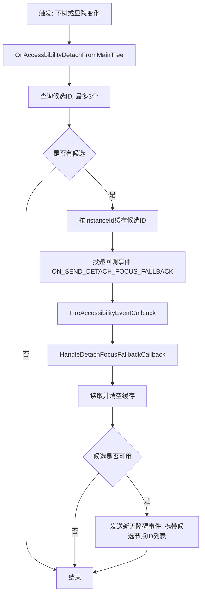
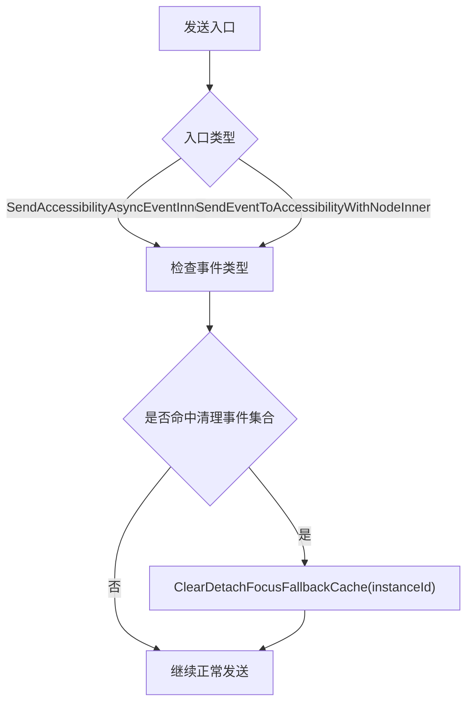
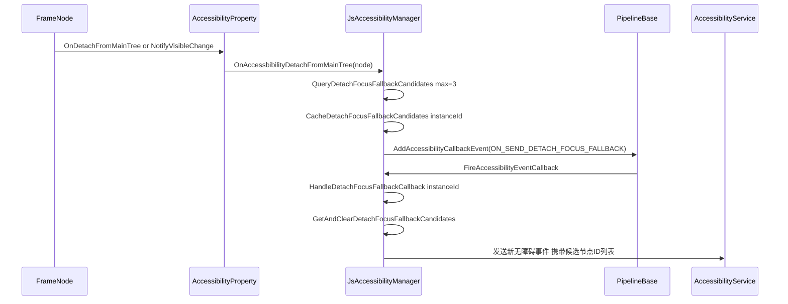
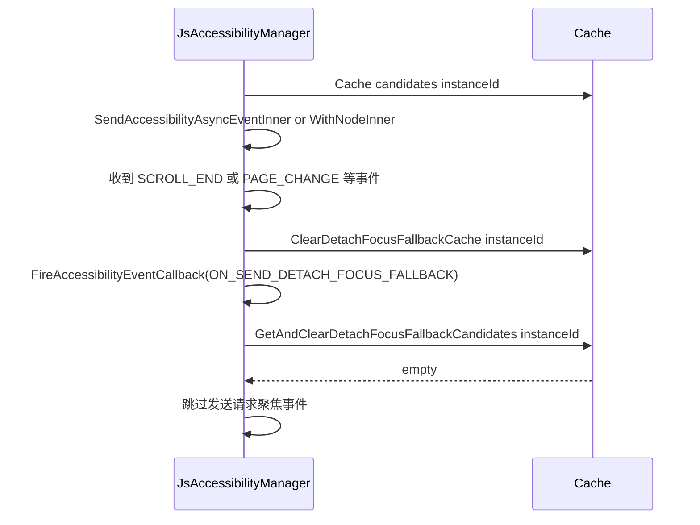

# 无障碍走焦与键盘走焦联动设计（下树/显隐变化）

> 说明：本文当前描述的是**主动聚焦过渡方案**。  
> 最终方案应为：发送新的无障碍事件，并在事件中携带候选节点ID列表。  
> 从实现角度看，仅需替换文中流程末尾“发送request focus”的最后一步为“发送新无障碍事件(携带候选ID)”。

## 1. 目标

在以下场景增强无障碍体验：

1. 当前无障碍聚焦节点下树（`FrameNode::OnDetachFromMainTree`）
2. 当前无障碍聚焦节点显隐变更为不可见（`FrameNode::NotifyVisibleChange`）

增强目标：在焦点节点消失后，提前准备候选节点并异步触发无障碍主动聚焦请求，降低“空焦点窗口”。

## 2. 当前代码实现概述

### 2.1 触发入口

1. 下树入口：
   `AccessibilityProperty::OnAccessibilityDetachFromMainTree()`
   -> `JsAccessibilityManager::OnAccessbibilityDetachFromMainTree(...)`

2. 显隐入口：
   `FrameNode::NotifyVisibleChange(VISIBLE -> 非VISIBLE)`
   且节点当前为 a11y focus 时，调用
   `AccessibilityManager::OnAccessbibilityDetachFromMainTree(...)`

### 2.2 候选查询与缓存

`JsAccessibilityManager::NotifyAccessibilityFocusDetachOrInvisible(...)` 执行：

1. 查询最多 3 个候选 `accessibilityId`（去重 + 可见性过滤）
   - `GetNextFocusNodeByManager`（nextFocus 映射）
   - `GetPrevFocusNodeByManager`（prevFocus 反向映射）
   - `FindCandidateByFocusMove(FORWARD)` 迭代补齐
2. 按 `instanceId` 缓存候选列表
   - 缓存结构：`detachFocusFallbackCache_[instanceId] = vector<int64_t>`
3. 投递回调事件（先投任务，后消费缓存）
   - `AddAccessibilityCallbackEvent(ON_SEND_DETACH_FOCUS_FALLBACK, instanceId)`

### 2.3 回调消费与事件发送

`FireAccessibilityEventCallback(...)` 收到 `ON_SEND_DETACH_FOCUS_FALLBACK` 后：

1. `HandleDetachFocusFallbackCallback(instanceId)` 读取并清空缓存
2. 依次取候选节点尝试发送主动聚焦请求
3. 发送方式（最终方案）：
   - 发送新的无障碍事件（携带候选节点ID列表）
   - 由无障碍服务侧基于候选ID完成最终聚焦决策

注意：当前实现不在本地直接执行 `ActAccessibilityFocus`，而是发送无障碍请求事件。

### 2.4 缓存清理规则

在以下事件类型出现时，清除当前 `instanceId` 的缓存：

- `PAGE_CHANGE`
- `CHANGE`
- `PAGE_OPEN`
- `PAGE_CLOSE`
- `SCROLLING_EVENT`
- `SCROLL_END`
- `SCROLL_START`

清理路径覆盖两个发送入口：

1. `SendAccessibilityAsyncEventInner(...)`
2. `SendEventToAccessibilityWithNodeInner(...)`

## 3. 流程图

### 3.1 主流程（缓存 + 回调消费）

### 3.2 缓存清理流程

## 4. 时序图

### 4.1 下树/显隐触发到回调消费

### 4.2 竞争场景：滚动/页面事件先到导致缓存失效

## 5. 与键盘走焦方案对比

| 维度 | 键盘走焦 | 本方案（无障碍） |
|---|---|---|
| 触发时机 | `FocusHub::RemoveSelf` 链路 | 下树/显隐触发后进入 a11y 回调链路 |
| 目标选择 | FocusHub 内部线性/空间规则 | next/prev + focus-move，最多缓存3个候选ID |
| 生效方式 | 引擎内部直接切换焦点 | 发送新无障碍事件（携带候选节点ID） |
| 异步策略 | 同步焦点切换为主 | 先缓存后回调消费 |
| 抗干扰 | 依赖当前焦点树状态 | 页面/滚动等关键事件会主动清缓存 |

## 6. 线程与并发说明

1. 触发与候选查询：UI线程。
2. 缓存容器：`detachFocusFallbackCache_`，使用互斥锁保护。
3. 回调消费：通过 `FireAccessibilityEventCallback` 进入 UI 线程处理。
4. 清缓存策略：在两个发送入口统一按事件类型清理，避免过期候选被消费。

## 7. 关键代码位置

1. `frameworks/core/accessibility/accessibility_manager.h`
   - `AccessibilityCallbackEventId::ON_SEND_DETACH_FOCUS_FALLBACK`
2. `frameworks/core/components_ng/base/frame_node.cpp`
   - `NotifyVisibleChange(...)` 中显隐触发桥接
3. `adapter/ohos/osal/js_accessibility_manager.h`
   - 缓存结构与处理函数声明
4. `adapter/ohos/osal/js_accessibility_manager.cpp`
   - `NotifyAccessibilityFocusDetachOrInvisible(...)`
   - `QueryDetachFocusFallbackCandidates(...)`
   - `HandleDetachFocusFallbackCallback(...)`
   - `SendRequestFocusToCandidate(...)`（withNode发送）
   - `IsDetachFocusCacheClearEvent(...)`
   - `SendAccessibilityAsyncEventInner(...)` / `SendEventToAccessibilityWithNodeInner(...)` 清缓存
