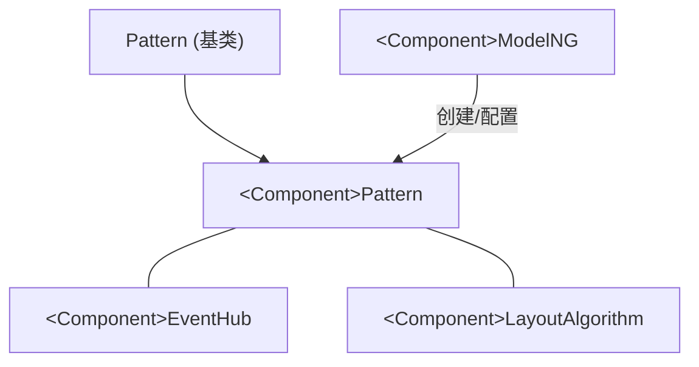
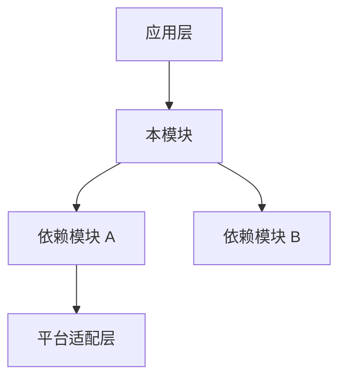
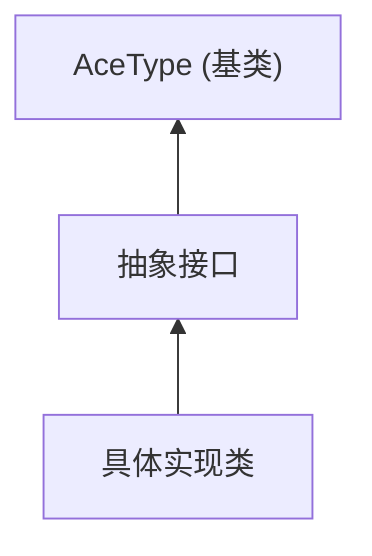
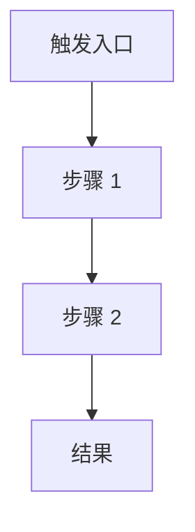

# Knowledge Base Template

> 文档版本：v3.0
> 更新时间：2026-05-30

用于新增知识库文档时快速复制。本模板对齐当前仓库规范：

- 文件命名：`XXX_Knowledge_Base.md` 或 `XXX_Knowledge_Base_CN.md`
- 存放目录：`docs/pattern/<component>/`、`docs/sdk/`、`docs/architecture/` 等
- 索引维护：同步更新 `docs/knowledge_base_INDEX.json`

## 模板选择

| 类型 | 适用对象 | 模板 | 存放目录 | INDEX `type` |
|------|---------|------|---------|-------------|
| **组件类** | 可在 ArkTS 中直接使用的 UI 组件（Text、Button、List…） | [1A) 组件类模板](#1a-组件类模板) | `docs/pattern/<component>/` | `component` |
| **框架类** | 引擎内部子系统/机制，不直接暴露为组件（ThemeManager、Layout Framework、Pipeline、手势系统…） | [1B) 框架类模板](#1b-框架类模板) | `docs/architecture/`、`docs/layout/`、`docs/common/` 等 | `feature` |

> 区分标准：如果有 `<Component>Attribute` / `<Component>Modifier` 对外 API → 组件类；否则 → 框架类。

## API 范式说明（组件类适用）

ArkUI 组件存在多套对外 API 调用面，知识库文档和索引必须覆盖全部涉及的范式：

| 范式 | 声明文件位置 | 说明 |
|------|-------------|------|
| **Dynamic API** | `@internal/component/ets/<component>.d.ts` | ArkTS 动态版组件类型定义，全局可用无需 import |
| **Static API** | `arkui/component/<component>.static.d.ets` | ArkTS 静态版组件声明，`Component + Attribute + Options` 三段式 |
| **Modifier API (Dynamic)** | `arkui/<Component>Modifier.d.ts` | SDK 侧 Modifier 声明（动态版） |
| **Modifier API (Static)** | `arkui/<Component>Modifier.static.d.ets` | SDK 侧 Modifier 声明（静态版） |
| **CAPI / NDK** | `interfaces/native/node/<component>_native_impl.h` | C 语言原生接口，用于 NDK 场景 |
| **NAPI** | `interfaces/napi/kits/<module>/` | `@ohos.*` 模块的 NAPI 实现 |

详见 [docs/api/ArkUI_API_Paradigm_Knowledge_Base_CN.md](api/ArkUI_API_Paradigm_Knowledge_Base_CN.md)。

---

## 1A) 组件类模板

```markdown
# <Component Name> <组件名>知识库

> 文档版本：v1.0
> 更新时间：YYYY-MM-DD
> 源码版本：OpenHarmony ace_engine (master 分支)

## 概述

- 组件定位：
- 典型使用场景：
- 与相近组件差异：

## 目录结构

```text
OpenHarmony/foundation/arkui/ace_engine/frameworks/core/components_ng/pattern/<component>/
├── <component>_pattern.h/.cpp
├── <component>_model_ng.h/.cpp
├── <component>_layout_property.h/.cpp
└── ...
```

## 核心类继承关系

使用 Mermaid graph 描述继承与组合关系：



> 按实际继承关系替换节点，多重继承用多条边表示。

## Pattern层详解

- 生命周期入口（如 `OnAttachToFrameNode` / `OnModifyDone`）
- 关键状态变量
- 事件处理流程

示例（请替换为真实代码与行号）：
Source: `OpenHarmony/foundation/arkui/ace_engine/frameworks/core/components_ng/pattern/<component>/<component>_pattern.cpp:123`

## Model层详解

- 对外接口
- 属性写入路径
- 与 Pattern/Property 的协作

## API 清单

### API 声明路径

| 范式 | 声明文件 | 是否涉及 |
|------|---------|---------|
| Dynamic API | `OpenHarmony/interface/sdk-js/api/@internal/component/ets/<component>.d.ts` | ✅ / ❌ |
| Static API | `OpenHarmony/interface/sdk-js/api/arkui/component/<component>.static.d.ets` | ✅ / ❌ |
| Modifier API (Dynamic) | `OpenHarmony/interface/sdk-js/api/arkui/<Component>Modifier.d.ts` | ✅ / ❌ |
| Modifier API (Static) | `OpenHarmony/interface/sdk-js/api/arkui/<Component>Modifier.static.d.ets` | ✅ / ❌ |
| CAPI / NDK | `OpenHarmony/foundation/arkui/ace_engine/interfaces/native/node/<component>_native_impl.h` | ✅ / ❌ |
| NAPI | `OpenHarmony/foundation/arkui/ace_engine/interfaces/napi/kits/<module>/` | ✅ / ❌ |

### 属性接口清单

列出组件对外暴露的全部属性接口（以 Dynamic API `<Component>Attribute` 为主轴，对照各范式覆盖情况）：

| 属性接口 | 参数类型 | Dynamic | Static | Modifier | CAPI | 说明 |
|---------|---------|:-------:|:------:|:--------:|:----:|------|
| `exampleProp` | `number \| string` | ✅ | ✅ | ✅ | ✅ | 示例属性 |
| `exampleEvent` | `(value: T) => void` | ✅ | ✅ | ❌ | ❌ | 示例事件 |

> 按 **字体/排版 → 布局/溢出 → 装饰/效果 → 交互/功能 → 事件回调** 分组排列。
> 只填实际存在的属性，不留占位行。

### 构造参数

如果组件有构造参数（`Options`），列出：

| 参数 | 类型 | 必填 | 说明 |
|------|------|:----:|------|
| `exampleParam` | `string` | ✅ | 示例参数 |

### 关联的 `@ohos.arkui.*` 模块 API

如有关联的 `@ohos.arkui.*` 或 `@ohos.*` 模块 API（如 controller、observer 等），列出：

| 模块 | 路径 | 说明 |
|------|------|------|
| N/A | — | 不涉及 |

## 关键实现细节

- 布局/绘制关键路径
- 边界条件与异常分支
- 性能与缓存策略

## 使用示例

### ArkTS Dynamic 示例

```ts
// 示例代码（请替换为可运行示例）
@Entry
@Component
struct Example {
  build() {
    // ...
  }
}
```

### ArkTS Static 示例（如适用）

```ts
// Static 范式示例（如无差异可标注"同 Dynamic"）
```

## 调试指南

- 关键日志点
- 常见断点位置
- 排查流程

## 常见问题

1. 问题：
   结论：
2. 问题：
   结论：
```

---

## 1B) 框架类模板

框架类知识库描述引擎内部子系统或机制，不直接暴露为 ArkTS 组件 API。
参考文档：[ThemeManager_Architecture_CN.md](architecture/ThemeManager_Architecture_CN.md)。

```markdown
# <SystemName> <系统名称>知识库

> 文档版本：v1.0
> 更新时间：YYYY-MM-DD
> 源码版本：OpenHarmony ace_engine (master 分支)

## 概述

### 定位与职责

- 系统定位：（一句话描述该子系统在 ArkUI 中的角色）
- 核心职责：
  1. 职责 1
  2. 职责 2

### 设计目标

| 目标 | 说明 |
|------|------|
| 高性能 | （缓存、延迟加载等策略） |
| 可扩展 | （扩展点和插件机制） |
| 线程安全 | （多线程策略） |

### 与其他模块的交互关系



## 架构设计

### 类继承关系



### 核心接口

列出关键的公开方法签名和职责。

| 方法 | 功能 | 源码位置 |
|------|------|---------|
| `Method()` | 说明 | file.cpp:行号 |

### 核心数据结构

列出关键的内部数据成员和缓存结构。

| 成员 | 类型 | 说明 |
|------|------|------|
| `cache_` | `unordered_map<K, V>` | 用途 |

## 核心流程

### 流程 1：初始化/加载



### 流程 2：核心操作

（同上格式，描述最关键的 2-3 个流程）

## 关键特性

### 特性 1

- 工作原理
- 关键代码位置

### 特性 2

（按实际特性补充）

## 代码组织

```text
ace_engine/frameworks/core/...
├── 核心实现文件
├── 接口定义
└── 相关文件
```

### 核心文件索引

| 文件 | 路径 | 说明 |
|------|------|------|
| 接口 | `frameworks/core/...` | 抽象接口 |
| 实现 | `frameworks/core/...` | 核心实现 |

## 性能与优化

| 优化策略 | 说明 | 效果 |
|---------|------|------|
| 缓存 | 缓存结构和命中策略 | 减少重复构建 |
| 延迟加载 | 按需构建 | 减少启动开销 |

## 调试指南

- 关键日志 TAG
- 常见断点位置
- 排查流程

## 常见问题

1. 问题：
   原因：
   解决：
2. 问题：
   原因：
   解决：

## 扩展指南

### 如何在该框架上新增功能

（步骤 1~N，附代码骨架）
```

### 组件类 vs 框架类模板差异

| 章节 | 组件类 | 框架类 |
|------|--------|--------|
| 概述 | 组件定位 + 使用场景 | 定位/职责 + 设计目标 + 交互关系 |
| 核心结构 | Pattern/Model/EventHub 三件套 | 接口/实现/数据结构 |
| API 清单 | Dynamic/Static/Modifier/CAPI 跨范式表 | **无**（内部 C++ 接口，列方法签名即可） |
| 流程 | 创建→布局→渲染 | 自定义核心流程（初始化/查询/切换等） |
| 示例 | ArkTS Dynamic/Static 示例 | **无 ArkTS 示例**（C++ 扩展示例） |
| 性能 | 关键实现细节中简述 | 独立章节（缓存分析/内存/耗时） |
| 扩展指南 | 无 | 如何在框架上新增功能 |

---

## 2) 索引条目模板（`knowledge_base_INDEX.json`）

### 组件类条目

```json
{
  "name": "<ComponentName>",
  "name_cn": "<组件中文名>",
  "category": "basic | container | selector | shape | media | data_display | rich_text | advanced",
  "type": "component",
  "keywords": ["关键词1（5-15个）"],
  "aliases": ["别名1（2-5个）"],
  "file_path": "pattern/<component>/<Component>_Knowledge_Base[_CN].md",
  "source_paths": {
    "pattern": "OpenHarmony/foundation/arkui/ace_engine/frameworks/core/components_ng/pattern/<component>/<component>_pattern.cpp",
    "model": "OpenHarmony/foundation/arkui/ace_engine/frameworks/core/components_ng/pattern/<component>/<component>_model_ng.cpp"
  },
  "api_paths": {
    "dynamic": "OpenHarmony/interface/sdk-js/api/@internal/component/ets/<component>.d.ts",
    "static": "OpenHarmony/interface/sdk-js/api/arkui/component/<component>.static.d.ets",
    "modifier": "OpenHarmony/interface/sdk-js/api/arkui/<Component>Modifier.d.ts",
    "modifier_static": "OpenHarmony/interface/sdk-js/api/arkui/<Component>Modifier.static.d.ets",
    "capi": "OpenHarmony/foundation/arkui/ace_engine/interfaces/native/node/<component>_native_impl.h"
  },
  "last_updated": "YYYY-MM-DD"
}
```

### 框架类条目

```json
{
  "name": "<SystemName>",
  "name_cn": "<系统中文名>",
  "category": "system",
  "type": "feature",
  "keywords": ["关键词1（5-15个）"],
  "aliases": ["别名1（2-5个）"],
  "file_path": "architecture/<SystemName>_Architecture[_CN].md",
  "source_paths": {
    "interface": "OpenHarmony/foundation/arkui/ace_engine/frameworks/core/..._interface.h",
    "impl": "OpenHarmony/foundation/arkui/ace_engine/frameworks/core/..._impl.cpp"
  },
  "api_paths": {},
  "last_updated": "YYYY-MM-DD"
}
```

> 框架类的 `api_paths` 通常为空或仅含 `ndk` 等内部接口路径。`source_paths` 的 key 按实际角色命名（如 `interface`/`impl`/`manager`/`storage` 等），不必遵循组件类的 `pattern`/`model` 约定。

---

## 3) 提交前检查

```bash
# 索引 JSON 校验
python3 -m json.tool docs/knowledge_base_INDEX.json > /dev/null && echo "Valid JSON"

# 文档计数
find docs -name "*_Knowledge_Base*.md" -type f | wc -l

# 检索冒烟
python3 docs/kb_search.py --list-all
python3 docs/kb_search.py <ComponentName> --field name
```

注意：

- 代码路径统一使用 `OpenHarmony/` 前缀。
- 不要写本地绝对路径（如 `/home/...`）。
- 代码片段必须来自实际源码，避免假设性实现。
- `api_paths` 只填实际存在的路径，缺失的范式直接省略对应 key。
