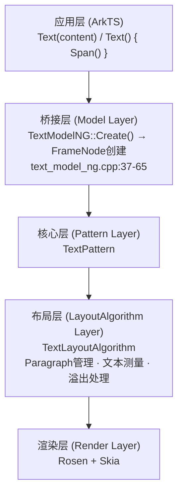
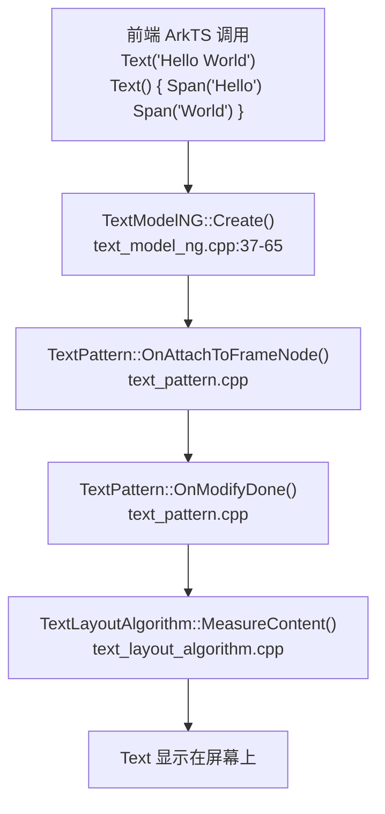
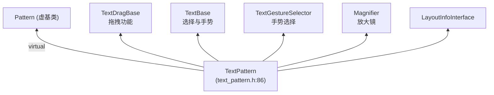
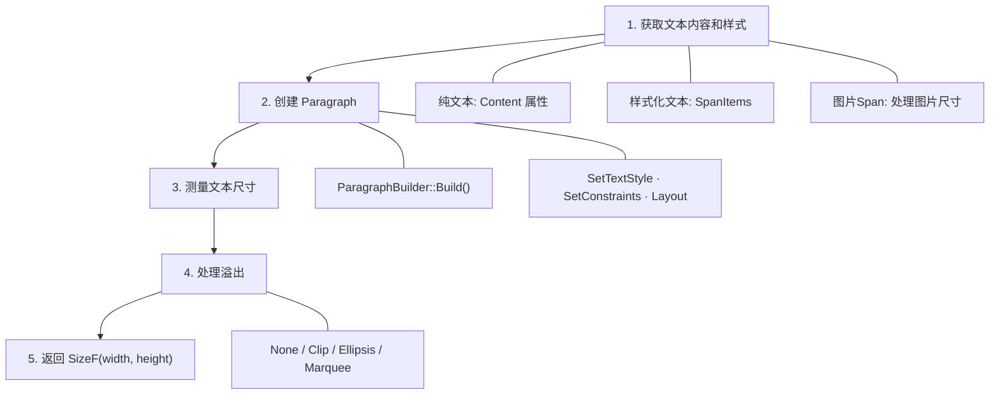
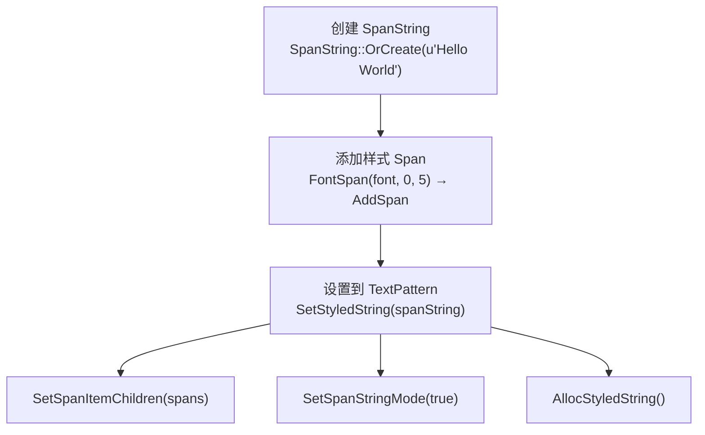
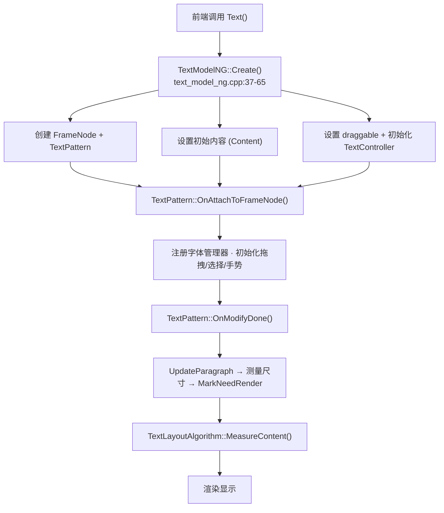
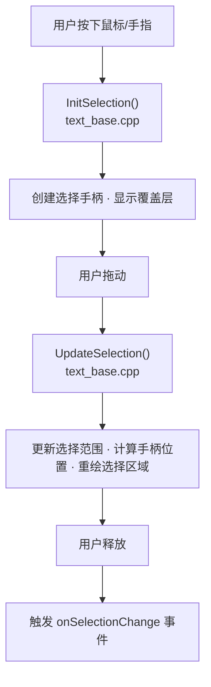

# ArkUI Text 组件完整知识库

> **文档版本**：v4.0
> **更新时间**：2026-06-01
> **源码版本**：OpenHarmony ace_engine (master 分支)

---

## 📚 目录

1. [概述](#概述)
2. [完整调用链](#完整调用链)
3. [目录结构](#目录结构)
4. [核心类继承关系](#核心类继承关系)
5. [Pattern层详解](#pattern层详解)
6. [Model层详解](#model层详解)
7. [布局算法](#布局算法)
8. [属性系统](#属性系统)
9. [事件系统](#事件系统)
10. [主题系统](#主题系统)
11. [Span系统](#span系统)
12. [文本选择](#文本选择)
13. [AI实体识别](#ai实体识别)
14. [文本拖拽](#文本拖拽)
15. [跑马灯动画](#跑马灯动画)
16. [执行流程](#执行流程)
17. [API清单](#api-清单)
18. [关键实现细节](#关键实现细节)
19. [使用示例](#使用示例)
20. [调试指南](#调试指南)
21. [附录](#附录)

---

## 概述

### 组件定位

**Text 组件**是 OpenHarmony ArkUI 框架中的**文本显示组件**，用于显示纯文本和样式化文本，支持丰富的文本样式、文本选择、AI实体识别、拖拽等功能。

### 技术架构



### 代码规模

| 项目 | 数量 |
|-----|------|
| 核心文件 | 约 40 个文件 |
| 核心代码 | 约 15,000+ 行 C++ 代码 |
| Pattern文件 | text_pattern.h (1375行), text_pattern.cpp |
| Model文件 | text_model_ng.h/cpp |
| 属性文件 | text_layout_property.h (200+行) |

### 功能特性

| 功能类别 | 具体功能 |
|---------|---------|
| **文本显示** | 纯文本、样式化文本(Span)、图片Span、符号Span |
| **文本样式** | 字体、颜色、装饰、阴影、大小写转换、字符间距 |
| **文本选择** | 鼠标拖拽、触摸手势、键盘选择、复制/剪切/粘贴 |
| **AI实体识别** | 电话号码、URL、邮箱、地址、日期时间 |
| **文本拖拽** | 纯文本、样式化Span、图片、AI识别实体 |
| **溢出处理** | 裁剪、省略号、跑马灯动画 |
| **其他功能** | 无障碍支持、主题适配、文本自适应 |

---

## 完整调用链

### 创建流程调用链



**各阶段执行细节**：

- **TextModelNG::Create()**：获取 ViewStackProcessor → ClaimNodeId → GetOrCreateFrameNode → 创建 TextPattern → 更新 Content → 设置 draggable/textController → Push(frameNode)
- **OnAttachToFrameNode()**：注册 FontManager → 注册 Surface 变化回调 → 初始化拖拽/选择/手势识别
- **OnModifyDone()**：UpdateParagraph → 测量文本尺寸 → MarkNeedRender → 处理 SpanString 模式
- **MeasureContent()**：获取内容和样式 → CreateParagraphAndLayout → paragraph->Layout → 计算最终尺寸

### 关键代码片段

**① Model层创建** - `text_model_ng.cpp:37-65`
```cpp
void TextModelNG::Create(const std::u16string& content)
{
    auto* stack = ViewStackProcessor::GetInstance();
    CHECK_NULL_VOID(stack);
    auto nodeId = stack->ClaimNodeId();
    ACE_LAYOUT_SCOPED_TRACE("Create[%s][self:%d]", V2::TEXT_ETS_TAG, nodeId);

    // 创建 Text FrameNode，使用 lambda 工厂函数创建 TextPattern
    auto frameNode = FrameNode::GetOrCreateFrameNode(
        V2::TEXT_ETS_TAG, nodeId,
        []() { return AceType::MakeRefPtr<TextPattern>(); });
    ACE_UINODE_TRACE(frameNode);
    stack->Push(frameNode);

    // 更新文本内容属性
    ACE_UPDATE_LAYOUT_PROPERTY(TextLayoutProperty, Content, content);

    // 设置 draggable（首次构建时）
    if (frameNode->IsFirstBuilding()) {
        auto pipeline = frameNode->GetContext();
        CHECK_NULL_VOID(pipeline);
        auto draggable = pipeline->GetDraggable<TextTheme>();
        frameNode->SetDraggable(draggable);
        auto gestureHub = frameNode->GetOrCreateGestureEventHub();
        CHECK_NULL_VOID(gestureHub);
        gestureHub->SetTextDraggable(true);
    }

    // 初始化 TextController
    auto textPattern = frameNode->GetPattern<TextPattern>();
    CHECK_NULL_VOID(textPattern);
    textPattern->SetTextController(AceType::MakeRefPtr<TextController>());
    textPattern->GetTextController()->SetPattern(WeakPtr(textPattern));
    textPattern->ClearSelectionMenu();
}
```

**② SpanString创建** - `text_model_ng.cpp:72-86`
```cpp
void TextModelNG::Create(const RefPtr<SpanStringBase>& spanBase)
{
    // 首先创建空的 Text FrameNode
    TextModelNG::Create(u"");
    auto frameNode = ViewStackProcessor::GetInstance()->GetMainFrameNode();
    CHECK_NULL_VOID(frameNode);
    auto textPattern = frameNode->GetPattern<TextPattern>();
    CHECK_NULL_VOID(textPattern);

    // 转换为 SpanString 并设置到 Pattern
    auto spanString = AceType::DynamicCast<SpanString>(spanBase);
    if (spanString) {
        auto spans = spanString->GetSpanItems();
        textPattern->SetSpanItemChildren(spans);  // 设置Span子项
        textPattern->SetSpanStringMode(true);      // 标记为SpanString模式
        textPattern->AllocStyledString();         // 分配样式化字符串
    }
}
```

**③ 文本颜色设置** - `text_model_ng.cpp:151-164`
```cpp
void TextModelNG::SetTextColor(const Color& value)
{
    auto frameNode = ViewStackProcessor::GetInstance()->GetMainFrameNode();
    CHECK_NULL_VOID(frameNode);
    auto textLayoutProperty = frameNode->GetLayoutProperty<TextLayoutProperty>();
    CHECK_NULL_VOID(textLayoutProperty);

    // 更新布局属性中的文本颜色
    textLayoutProperty->UpdateTextColorByRender(value);

    // 更新渲染上下文的前景色
    ACE_UPDATE_RENDER_CONTEXT(ForegroundColor, value);
    ACE_RESET_RENDER_CONTEXT(RenderContext, ForegroundColorStrategy);
    ACE_UPDATE_RENDER_CONTEXT(ForegroundColorFlag, true);

    // 通知 Pattern 更新字体颜色
    auto textPattern = frameNode->GetPattern<TextPattern>();
    CHECK_NULL_VOID(textPattern);
    textPattern->UpdateFontColor(value);

    // 标记用户设置了颜色
    ACE_UPDATE_LAYOUT_PROPERTY(TextLayoutProperty, TextColorFlagByUser, true);
}
```

---

## 目录结构

```
components_ng/pattern/text/
├── text_pattern.h/cpp                    # Pattern层：业务逻辑 (1375行)
├── text_model.h                          # Model接口定义
├── text_model_ng.h/cpp                   # NG实现
├── text_model_static.h/cpp               # Static实现
├── text_layout_property.h/cpp            # 布局属性 (200+行)
├── text_styles.h/cpp                     # 样式定义
├── text_base.h/cpp                       # 文本组件基类
├── text_event_hub.h                      # 事件处理
├── text_layout_algorithm.h/cpp           # 布局算法
├── text_select_overlay.h/cpp             # 选择手柄处理逻辑
├── text_content_modifier.h/cpp           # 内容修饰器
├── text_controller.h/cpp                 # 文本控制器
├── span/                                 # Span相关文件
│   ├── span_string.h/cpp                 # 属性字符串 (StyleString) 实现
│   ├── span_object.h/cpp                 # 属性字符串处理逻辑
│   ├── mutable_span_string.h/cpp         # 可变属性字符串实现
│   └── tlv_util.h/cpp                    # TLV 编码/解码
├── span_node.h/cpp                       # Span节点实现
├── text_layout_adapter/                  # 布局适配实现目录
│   └── text_layout_adapter.cpp           # 适配实现
├── text_layout_adapter.h                 # 适配器声明
└── base_text_select_overlay.h/cpp        # 基础选择覆盖层
```

**相关路径**：
- Pattern层：`frameworks/core/components_ng/pattern/text/`
- 拖拽功能：`frameworks/core/components_ng/pattern/text_drag/`
- 主题定义：`frameworks/core/components/text/text_theme.h`
- 段落渲染：`frameworks/core/components_ng/render/paragraph.h`

---

## 核心类继承关系



**TextPattern 多重继承（源码）**：
```cpp
// text_pattern.h:86-91
class ACE_FORCE_EXPORT TextPattern : public virtual Pattern,
                    public TextDragBase,
                    public TextBase,
                    public TextGestureSelector,
                    public Magnifier,
                    public LayoutInfoInterface {
    DECLARE_ACE_TYPE(TextPattern, Pattern, TextDragBase, TextBase, TextGestureSelector, Magnifier);
};
```

---

## Pattern层详解

### TextPattern 类

**位置**：`frameworks/core/components_ng/pattern/text/text_pattern.h`

**继承关系**：
```cpp
// text_pattern.h:86-91
class ACE_FORCE_EXPORT TextPattern : public virtual Pattern,
                    public TextDragBase,
                    public TextBase,
                    public TextGestureSelector,
                    public Magnifier,
                    public LayoutInfoInterface
```

**核心成员变量**：

| 变量 | 类型 | 说明 | 源码位置 |
|-----|------|------|---------|
| `paragraphManager_` | RefPtr\<ParagraphManager\> | 段落管理器 | text_pattern.h |
| `textDetectMgr_` | RefPtr\<TextDetectManager\> | AI实体识别管理器 | text_pattern.h |
| `textSelector_` | RefPtr\<TextSelector\> | 文本选择器 | text_pattern.h |
| `styledString_` | RefPtr\<StyledString\> | 样式化字符串 | text_pattern.h |
| `spans_` | std::list\<RefPtr\<SpanItem\>\> | Span项列表 | text_pattern.h |
| `textController_` | RefPtr\<TextController\> | 文本控制器 | text_pattern.h |
| `contentModifier_` | RefPtr\<TextContentModifier\> | 内容修饰器 | text_pattern.h |
| `isSelected_` | bool | 是否被选中 | text_pattern.h |

**核心方法**：

| 方法 | 功能 | 源码位置 |
|-----|------|---------|
| `OnAttachToFrameNode()` | 附加到节点树 | text_pattern.cpp |
| `OnDetachFromFrameNode()` | 从节点树分离 | text_pattern.cpp |
| `OnModifyDone()` | 修改完成回调 | text_pattern.cpp |
| `SetStyledString()` | 设置样式化文本 | text_pattern.cpp |
| `UpdateParagraph()` | 更新段落 | text_pattern.cpp |
| `HandleClick()` | 处理点击 | text_pattern.cpp |
| `InitSelection()` | 初始化选择 | text_base.cpp |
| `SetTextSelection()` | 设置文本选择范围 | text_base.cpp |

### TextDragBase 类

**位置**：`frameworks/core/components_ng/pattern/text_drag/text_drag_base.h`

**说明**：文本拖拽基类，被 TextPattern 和 TextFieldPattern 继承

**核心方法**：

| 方法 | 功能 | 源码位置 |
|-----|------|---------|
| `IsTextArea()` | 是否为文本区域 | text_drag_base.h |
| `GetTextRect()` | 获取文本矩形 | text_drag_base.h |
| `GetTextBoxes()` | 获取文本框列表 | text_drag_base.h |
| `OnDragNodeFloating()` | 拖拽节点浮动回调 | text_drag_base.h |
| `CloseSelectOverlay()` | 关闭选择覆盖层 | text_drag_base.h |
| `CreateHandles()` | 创建选择手柄 | text_drag_base.h |

### TextBase 类

**位置**：`frameworks/core/components_ng/pattern/text/text_base.h`

**说明**：文本基类，继承自 SelectOverlayClient，处理文本选择和手势

**核心方法**：

| 方法 | 功能 | 源码位置 |
|-----|------|---------|
| `InitSelection()` | 初始化选择 | text_base.cpp |
| `UpdateSelection()` | 更新选择范围 | text_base.cpp |
| `SetTextSelection()` | 设置选择范围 | text_base.cpp |
| `GetSelection()` | 获取选择范围 | text_base.cpp |
| `ResetSelection()` | 清除选择 | text_base.cpp |
| `CopySelection()` | 复制选中内容 | text_base.cpp |

### TextGestureSelector 类

**位置**：`frameworks/core/components_ng/pattern/text/text_base.h:82-143`

**说明**：文本手势选择器，处理触摸手势选择

**核心方法**：

| 方法 | 功能 | 源码位置 |
|-----|------|---------|
| `StartGestureSelection()` | 开始手势选择 | text_base.h |
| `DoGestureSelection()` | 执行手势选择 | text_base.cpp |
| `EndGestureSelection()` | 结束手势选择 | text_base.h |
| `CancelGestureSelection()` | 取消手势选择 | text_base.h |

---

## Model层详解

### TextModelNG 类

**位置**：`frameworks/core/components_ng/pattern/text/text_model_ng.h`

**核心创建方法**：

| 方法 | 功能 | 源码位置 |
|-----|------|---------|
| `Create(const std::u16string&)` | 创建纯文本 | text_model_ng.cpp:37 |
| `Create(const std::string&)` | 创建纯文本(UTF8) | text_model_ng.cpp:67 |
| `Create(const RefPtr\<SpanStringBase\>&)` | 创建样式化文本 | text_model_ng.cpp:72 |
| `CreateFrameNode()` | 创建FrameNode | text_model_ng.cpp:88 |

**字体样式方法**：

| 方法 | 功能 | 源码位置 |
|-----|------|---------|
| `SetFont()` | 设置字体(简写) | text_model_ng.cpp:116 |
| `SetFontSize()` | 设置字体大小 | text_model_ng.cpp:133 |
| `SetTextColor()` | 设置文字颜色 | text_model_ng.cpp:151 |
| `SetFontWeight()` | 设置字体粗细 | text_model_ng.cpp:268 |
| `SetFontFamily()` | 设置字体族 | text_model_ng.cpp:283 |
| `SetItalicFontStyle()` | 设置斜体样式 | text_model_ng.cpp:233 |

**文本布局方法**：

| 方法 | 功能 | 源码位置 |
|-----|------|---------|
| `SetTextAlign()` | 设置文本对齐 | text_model_ng.cpp |
| `SetTextOverflow()` | 设置文本溢出 | text_model_ng.cpp |
| `SetMaxLines()` | 设置最大行数 | text_model_ng.cpp |
| `SetLineHeight()` | 设置行高 | text_model_ng.cpp |
| `SetTextDecoration()` | 设置文本装饰 | text_model_ng.cpp |
| `SetLetterSpacing()` | 设置字符间距 | text_model_ng.cpp |
| `SetTextCase()` | 设置文本转换 | text_model_ng.cpp |

---

## 布局算法

### TextLayoutAlgorithm 类

**位置**：`frameworks/core/components_ng/pattern/text/text_layout_algorithm.h`

**继承关系**：
```cpp
class TextLayoutAlgorithm : public MultipleParagraphLayoutAlgorithm,
                            public TextAdaptFontSizer
```

### MeasureContent 方法详解

**源码位置**：`text_layout_algorithm.cpp`

**执行流程**：



### Paragraph 管理

**ParagraphManager** 负责管理文本段落的创建和更新：

```cpp
// 源码位置：text_layout_algorithm.h:50-53
TextLayoutAlgorithm(std::list<RefPtr<SpanItem>> spans,
                    RefPtr<ParagraphManager> paragraphManager_,
                    bool isSpanStringMode,
                    const TextStyle& textStyle,
                    const bool isMarquee = false);
```

---

## 属性系统

### TextLayoutProperty 属性清单

**位置**：`text_layout_property.h`

**内容属性**：

| 属性 | 类型 | 更新标志 | 默认值 | 源码位置 |
|-----|------|---------|--------|---------|
| `Content` | std::u16string | PROPERTY_UPDATE_MEASURE | u"" | text_layout_property.h |

**字体样式属性**：

| 属性 | 类型 | 更新标志 | 默认值 | 源码位置 |
|-----|------|---------|--------|---------|
| `FontSize` | Dimension | PROPERTY_UPDATE_MEASURE | 16fp | text_layout_property.h:162 |
| `TextColor` | Color | PROPERTY_UPDATE_MEASURE_SELF | 黑色 | text_layout_property.h:163 |
| `FontWeight` | FontWeight | PROPERTY_UPDATE_MEASURE | Normal | text_layout_property.h:166 |
| `VariableFontWeight` | int32_t | PROPERTY_UPDATE_MEASURE | - | text_layout_property.h:167 |
| `FontFamily` | std::vector\<std::string\> | PROPERTY_UPDATE_MEASURE | 系统字体 | text_layout_property.h:168 |
| `ItalicFontStyle` | FontStyle | PROPERTY_UPDATE_MEASURE | Normal | text_layout_property.h:165 |
| `TextShadow` | std::vector\<Shadow\> | PROPERTY_UPDATE_MEASURE | {} | text_layout_property.h:164 |
| `FontFeature` | FONT_FEATURES_LIST | PROPERTY_UPDATE_MEASURE | {} | text_layout_property.h:169 |
| `LetterSpacing` | Dimension | PROPERTY_UPDATE_MEASURE | 0 | text_layout_property.h:177 |

**布局属性**：

| 属性 | 类型 | 更新标志 | 默认值 | 源码位置 |
|-----|------|---------|--------|---------|
| `TextAlign` | TextAlign | PROPERTY_UPDATE_MEASURE | Start | text_layout_property.h:191 |
| `TextOverflow` | TextOverflow | PROPERTY_UPDATE_MEASURE | None | text_layout_property.h:193 |
| `MaxLines` | uint32_t | PROPERTY_UPDATE_MEASURE | Infinity | text_layout_property.h:195 |
| `LineHeight` | Dimension | PROPERTY_UPDATE_MEASURE | - | text_layout_property.h:184 |
| `LineSpacing` | Dimension | PROPERTY_UPDATE_MEASURE | - | text_layout_property.h:185 |
| `TextDecoration` | std::vector\<TextDecoration\> | PROPERTY_UPDATE_MEASURE | {} | text_layout_property.h:170 |
| `TextDecorationColor` | Color | PROPERTY_UPDATE_MEASURE | - | text_layout_property.h:172 |
| `TextDecorationStyle` | TextDecorationStyle | PROPERTY_UPDATE_MEASURE | Solid | text_layout_property.h:173 |
| `TextCase` | TextCase | PROPERTY_UPDATE_MEASURE | Normal | text_layout_property.h:174 |
| `BaselineOffset` | Dimension | PROPERTY_UPDATE_MEASURE | - | text_layout_property.h:190 |
| `WordBreak` | WordBreak | PROPERTY_UPDATE_MEASURE | - | text_layout_property.h:200 |
| `TextIndent` | Dimension | PROPERTY_UPDATE_MEASURE | - | text_layout_property.h:199 |

**跑马灯属性**：

```cpp
// 源码：text_layout_property.h:113-123
struct TextMarqueeOptions {
    ACE_DEFINE_PROPERTY_GROUP_ITEM(TextMarqueeStart, bool);         // 是否启动跑马灯
    ACE_DEFINE_PROPERTY_GROUP_ITEM(TextMarqueeStep, double);        // 每次滚动距离
    ACE_DEFINE_PROPERTY_GROUP_ITEM(TextMarqueeLoop, int32_t);       // 循环次数(-1为无限)
    ACE_DEFINE_PROPERTY_GROUP_ITEM(TextMarqueeDirection, MarqueeDirection); // 滚动方向
    ACE_DEFINE_PROPERTY_GROUP_ITEM(TextMarqueeDelay, int32_t);      // 启动延迟
    ACE_DEFINE_PROPERTY_GROUP_ITEM(TextMarqueeFadeout, bool);       // 是否淡入淡出
    ACE_DEFINE_PROPERTY_GROUP_ITEM(TextMarqueeStartPolicy, MarqueeStartPolicy);
    ACE_DEFINE_PROPERTY_GROUP_ITEM(TextMarqueeUpdatePolicy, MarqueeUpdatePolicy);
    ACE_DEFINE_PROPERTY_GROUP_ITEM(TextMarqueeSpacing, CalcDimension); // 滚动间距
};
```

**用户设置标志**：
- `TextColorFlagByUser` - 用户是否设置了文字颜色
- `TextFontSizeSetByUser` - 用户是否设置了字体大小

---

## 事件系统

### TextEventHub 类

**位置**：`frameworks/core/components_ng/pattern/text/text_event_hub.h`

**核心事件**：

| 事件 | 类型 | 说明 |
|-----|------|------|
| `onClick` | std::function\<void(GestureEvent&)\> | 点击事件 |
| `onLongPress` | std::function\<void(GestureEvent&)\> | 长按事件 |
| `onCopy` | std::function\<void(const std::u16string&)\> | 复制事件 |
| `onCut` | std::function\<void(const std::u16string&)\> | 剪切事件 |
| `onPaste` | std::function\<void(const std::u16string&)\> | 粘贴事件 |
| `onSelectionChange` | std::function\<void(int32_t, int32_t)\> | 选择变化事件 |

---

## 主题系统

### TextTheme 主题属性

**位置**：`frameworks/core/components/text/text_theme.h`

**主题属性**：
| 属性 | 默认值 | 说明 |
|-----|--------|------|
| `textColor` | 黑色 | 文字颜色 |
| `fontSize` | 16fp | 默认字体大小 |
| `fontFamily` | 系统字体 | 默认字体族 |
| `fontWeight` | FontWeight::NORMAL | 默认字体粗细 |

---

## Span系统

### 概述

**Span** 和 **StyledString** 是 ArkUI 中展示富文本样式的核心机制，允许在单个 Text 组件中为不同的文本段落设置不同的样式。

**术语对照表**：
| ArkTS API | 内部 C++ | 说明 |
|-----------|--------------|-------------|
| `Span()` | `SpanNode` | Span 文本片段组件 |
| `StyledString` / `spanString` | `SpanString` | 样式化字符串容器 |
| `span_object` | `SpanObject` 层级 | 样式对象（FontSpan等）|

### Span 类型体系

#### SpanItemType（SpanItem 类型）

**源码位置**：`text_styles.h`

| 枚举值 | 描述 | 使用场景 |
|--------|------|---------|
| `SpanItemType::NORMAL` | 普通文本 Span | 最常用的文本片段 |
| `SpanItemType::IMAGE` | 图片 Span | 内联图片 |
| `SpanItemType::SYMBOL` | 符号 Span | Symbol 符号 |
| `SpanItemType::CustomSpan` | 自定义可绘制 Span | 自定义绘制内容 |
| `SpanItemType::PLACEHOLDER` | 占位符 Span | 占位用途 |

#### SpanType（样式 Span 类型）

**源码位置**：`span/span_object.h:35-50`

| 枚举值 | 数值 | 对应类 | 描述 |
|--------|------|--------|------|
| `SpanType::Font` | 0 | `FontSpan` | 字体样式（大小、颜色、粗细、字体族） |
| `SpanType::Decoration` | 1 | `DecorationSpan` | 文本装饰（下划线、删除线等） |
| `SpanType::BaselineOffset` | 2 | `BaselineOffsetSpan` | 基线偏移 |
| `SpanType::LetterSpacing` | 3 | `LetterSpacingSpan` | 字符间距 |
| `SpanType::TextShadow` | 4 | `TextShadowSpan` | 文本阴影 |
| `SpanType::LineHeight` | 5 | `LineHeightSpan` | 行高 |
| `SpanType::BackgroundColor` | 6 | `BackgroundColorSpan` | 背景颜色 |
| `SpanType::Url` | 7 | `UrlSpan` | URL 链接 |
| `SpanType::HalfLeading` | 8 | `HalfLeadingSpan` | 半行前导模式 |
| `SpanType::Gesture` | 100 | `GestureSpan` | 点击/长按事件 |
| `SpanType::ParagraphStyle` | 200 | `ParagraphStyleSpan` | 段落级样式 |
| `SpanType::Image` | 300 | `ImageSpan` | 图片 Span |
| `SpanType::CustomSpan` | 400 | `CustomSpan` | 自定义可绘制 |
| `SpanType::ExtSpan` | 500 | `ExtSpan` | 扩展 Span |

### SpanItem 结构详解

**源码位置**：`text_styles.h`

```cpp
struct SpanItem {
    std::string content;                   // 文本内容
    TextStyle fontStyle;                   // 字体样式
    TextLineStyle textLineStyle;           // 行样式
    SpanItemType spanItemType;             // 类型
    std::function<void()> onClick;         // 点击事件
    std::function<void()> onLongPress;     // 长按事件
    std::function<void(bool)> onHover;     // 悬停事件
    BackgroundStyle backgroundStyle;       // 背景样式
    std::string urlAddress;                // 链接URL
};
```

### SpanString（StyledString）详解

**源码位置**：`span/span_string.h:35-143`

#### 核心数据结构

```cpp
class SpanString : public SpanStringBase {
    // 基础文本内容
    std::u16string text_;

    // 按类型分组的样式 Span 映射
    std::unordered_map<SpanType, std::list<RefPtr<SpanBase>>> spansMap_;

    // SpanItem 列表
    std::list<RefPtr<NG::SpanItem>> spans_;

    // 关联的 FrameNode
    WeakPtr<NG::FrameNode> frameNode_;

    // 背景样式的组 ID
    int32_t groupId_;
};
```

#### 关键方法

| 方法 | 功能 | 源码位置 |
|------|------|----------|
| `Create()` | 从文本创建 SpanString | span_string.cpp |
| `AddSpan()` | 向范围 [start, end) 添加样式 Span | span_string.cpp |
| `RemoveSpan()` | 移除指定类型的 Span | span_string.cpp |
| `GetSpans()` | 获取范围 [start, end) 内的 Spans | span_string.cpp |
| `GetSubSpanString()` | 提取子字符串及样式 | span_string.cpp |
| `EncodeTlv()` | TLV 序列化 | span_string.cpp |
| `DecodeTlv()` | TLV 反序列化 | span_string.cpp |
| `UpdateSpansMap()` | 更新 spansMap_ | span_string.cpp |

#### 创建 SpanString 的流程



### SpanObject 层级体系

#### SpanBase 基类

**源码位置**：`span/span_object.h:104-126`

```cpp
class SpanBase : public virtual AceType {
    int32_t start_;  // 起始索引（包含）
    int32_t end_;    // 结束索引（不包含）

    // 虚方法
    virtual bool IsAttributesEqual(const RefPtr<SpanBase>& other) const = 0;
    virtual RefPtr<SpanBase> GetSubSpan(int32_t start, int32_t end) = 0;
    virtual SpanType GetSpanType() const = 0;
    virtual void ApplyToSpanItem(const RefPtr<NG::SpanItem>& spanItem,
                                 SpanOperation operation) const = 0;
};
```

#### 具体 Span 类

##### 1. FontSpan（字体样式）

**源码位置**：`span/span_object.h:128-149`

```cpp
class FontSpan : public SpanBase {
    Font font_;  // 包含 fontSize, fontWeight, textColor, fontFamily 等

    // 应用到 SpanItem
    void ApplyToSpanItem(const RefPtr<NG::SpanItem>& spanItem,
                         SpanOperation operation) const override {
        if (operation == SpanOperation::ADD) {
            AddSpanStyle(spanItem);
            AddColorResourceObj(spanItem);
        } else {
            RemoveSpanStyle(spanItem);
        }
    }
};
```

**使用示例**：
```cpp
Font font;
font.fontSize = Dimension(20, DimensionUnit::VP);
font.fontWeight = FontWeight::BOLD;
font.textColor = Color::RED;
font.fontFamilies = {"HarmonyOS Sans", "Roboto"};

auto fontSpan = MakeRefPtr<FontSpan>(font, 0, 5);  // 应用到范围 [0, 5)
spanString->AddSpan(fontSpan);
```

##### 2. DecorationSpan（文本装饰）

**源码位置**：`span/span_object.h:151-200`

```cpp
class DecorationSpan : public SpanBase {
    std::vector<TextDecoration> types_;           // 装饰类型列表
    std::optional<Color> color_;                  // 装饰颜色
    std::optional<TextDecorationStyle> style_;    // 装饰样式
    std::optional<float> lineThicknessScale_;     // 线条粗细缩放
    std::optional<TextDecorationOptions> options_; // 装饰选项
    RefPtr<ResourceObject> colorResObj_;          // 颜色资源对象
};
```

**支持的多重装饰**：
```cpp
std::vector<TextDecoration> types = {
    TextDecoration::UNDERLINE,
    TextDecoration::LINE_THROUGH
};

auto decorationSpan = MakeRefPtr<DecorationSpan>(
    types,                    // 同时有下划线和删除线
    Color::BLUE,              // 蓝色装饰
    TextDecorationStyle::DOTTED,  // 点状样式
    1.5f,                     // 线条粗细 1.5 倍
    0,                        // start
    10                        // end
);
spanString->AddSpan(decorationSpan);
```

##### 3. ImageSpan（图片 Span）

**源码位置**：`span/span_object.h:317-334`

```cpp
class ImageSpan : public SpanBase {
    ImageSpanOptions imageOptions_;  // 图片配置
};
```

**ImageSpanOptions 结构**（`text_styles.h:164-199`）：
```cpp
struct ImageSpanOptions : SpanOptionBase {
    std::optional<int32_t> offset;           // 插入位置
    std::optional<std::string> image;        // 图片路径
    std::optional<std::string> bundleName;   // Bundle 名称
    std::optional<std::string> moduleName;   // Module 名称
    std::optional<RefPtr<PixelMap>> imagePixelMap;  // PixelMap
    std::optional<ImageSpanAttribute> imageAttribute;  // 图片属性
};
```

**ImageSpanAttribute 结构**（`text_styles.h:106-136`）：
```cpp
struct ImageSpanAttribute {
    std::optional<ImageSpanSize> size;              // 宽高
    std::optional<VerticalAlign> verticalAlign;     // 垂直对齐
    std::optional<ImageFit> objectFit;             // 适配模式
    std::optional<MarginProperty> marginProp;       // 外边距
    std::optional<BorderRadiusProperty> borderRadius;  // 圆角
    std::optional<PaddingProperty> paddingProp;     // 内边距
    bool syncLoad = false;                          // 同步加载
    bool supportSvg2 = false;                       // 支持 SVG2
    std::optional<std::vector<float>> colorFilterMatrix;  // 颜色滤镜
};
```

**使用示例**：
```cpp
ImageSpanOptions options;
options.offset = 5;
options.image = "common/icon.png";

ImageSpanAttribute attr;
attr.size = ImageSpanSize{
    CalcDimension(30.0, DimensionUnit::VP),   // width
    CalcDimension(30.0, DimensionUnit::VP)    // height
};
attr.verticalAlign = VerticalAlign::CENTER;
attr.objectFit = ImageFit::COVER;
attr.borderRadius = BorderRadiusProperty{
    CalcDimension(8.0, DimensionUnit::VP)
};

options.imageAttribute = attr;

auto imageSpan = MakeRefPtr<ImageSpan>(options);
spanString->AddSpan(imageSpan);
```

##### 4. CustomSpan（自定义绘制 Span）

**源码位置**：`span/span_object.h:336-362`

```cpp
class CustomSpan : public SpanBase {
    std::optional<std::function<CustomSpanMetrics(CustomSpanMeasureInfo)>> onMeasure_;
    std::optional<std::function<void(NG::DrawingContext&, CustomSpanOptions)>> onDraw_;
};
```

**CustomSpanMeasureInfo**（`text_styles.h:29-31`）：
```cpp
struct CustomSpanMeasureInfo {
    float fontSize = 0.0f;  // 当前字体大小，用于参考
};
```

**CustomSpanMetrics**（`text_styles.h:40-43`）：
```cpp
struct CustomSpanMetrics {
    float width = 0.0f;             // 自定义内容的宽度
    std::optional<float> height;    // 自定义内容的高度（可选）
};
```

**CustomSpanOptions**（`text_styles.h:33-38`）：
```cpp
struct CustomSpanOptions {
    float x = 0.0f;           // 绘制起始 x 坐标
    float lineTop = 0.0f;     // 行顶 y 坐标
    float lineBottom = 0.0f;  // 行底 y 坐标
    float baseline = 0.0f;    // 基线 y 坐标
};
```

**使用示例**：
```cpp
auto customSpan = MakeRefPtr<CustomSpan>();

// 设置测量回调
customSpan->SetOnMeasure([](CustomSpanMeasureInfo info) -> CustomSpanMetrics {
    CustomSpanMetrics metrics;
    metrics.width = info.fontSize * 2.0f;  // 宽度为字体大小的 2 倍
    metrics.height = info.fontSize * 1.5f; // 高度为字体大小的 1.5 倍
    return metrics;
});

// 设置绘制回调
customSpan->SetOnDraw([](NG::DrawingContext& context, CustomSpanOptions options) {
    // 使用 Rosen Drawing API 绘制自定义内容
    auto canvas = context.GetCanvas();
    Paint paint;
    paint.SetColor(Color::BLUE);
    canvas->DrawCircle(
        options.x + 20,
        options.baseline,
        20,
        paint
    );
});

customSpan->UpdateStartIndex(10);
customSpan->UpdateEndIndex(15);

spanString->AddSpan(customSpan);
```

##### 5. GestureSpan（手势 Span）

**源码位置**：`span/span_object.h:243-274`

```cpp
class GestureSpan : public SpanBase {
    GestureStyle gestureInfo_;  // 包含 onClick, onLongPress, onTouch
    int32_t gestureSpanId_ = -1;  // 手势 Span ID
};
```

**GestureStyle 结构**（`span/object.h:93-102`）：
```cpp
struct GestureStyle {
    std::optional<GestureEventFunc> onClick;
    std::optional<GestureEventFunc> onLongPress;
    std::optional<std::function<void(TouchEventInfo&)>> onTouch;
};
```

**使用示例**：
```cpp
GestureStyle gestureStyle;
gestureStyle.onClick = [](GestureEventInfo* info) {
    // 处理点击事件
    printf("Span clicked at (%f, %f)\n", info->GetLocalLocation().GetX(),
           info->GetLocalLocation().GetY());
};

gestureStyle.onLongPress = [](GestureEventInfo* info) {
    // 处理长按事件
};

auto gestureSpan = MakeRefPtr<GestureSpan>(gestureStyle, 0, 5);
spanString->AddSpan(gestureSpan);
```

##### 6. 其他 Span 类型

| Span 类 | 描述 | 关键属性 |
|---------|------|----------|
| `BaselineOffsetSpan` | 基线偏移 | `baselineOffset` (Dimension) |
| `LetterSpacingSpan` | 字符间距 | `letterSpacing` (Dimension) |
| `TextShadowSpan` | 文本阴影 | `textShadow` (vector\<Shadow\>) |
| `LineHeightSpan` | 行高 | `lineHeight` (Dimension) |
| `BackgroundColorSpan` | 背景颜色 | `textBackgroundStyle` |
| `UrlSpan` | URL 链接 | `urlAddress` (string) |
| `ParagraphStyleSpan` | 段落样式 | `align`, `maxLines`, `wordBreak` 等 |
| `HalfLeadingSpan` | 半行前导 | `halfLeading` (bool) |

### ArkTS API 使用示例

#### Span 子组件

```typescript
@Entry
@Component
struct SpanExample {
  build() {
    Column() {
      // 基础 Span 使用
      Text() {
        Span('Hello ')
          .fontSize(16)
          .fontColor(Color.Black)
        Span('World')
          .fontSize(20)
          .fontColor(Color.Red)
          .fontWeight(FontWeight.Bold)
          .onClick(() => {
            console.log('Red World clicked!')
          })
      }
      .width('100%')
      .height(50)

      // 带装饰的 Span
      Text() {
        Span('Underline Text')
          .fontSize(18)
          .decoration({
            type: TextDecorationType.Underline,
            color: Color.Blue
          })
      }

      // 图片 Span
      Text() {
        ImageSpan($r('app.media.icon'))
          .width(30)
          .height(30)
          .verticalAlign(ImageVerticalAlignment.CENTER)
        Span('Text after image')
          .fontSize(16)
      }
    }
  }
}
```

#### StyledString API

```typescript
@Entry
@Component
struct StyledStringExample {
  @State styledString: StyledString = new StyledString('Hello World')

  aboutToAppear() {
    // 创建 StyledString
    this.styledString = new StyledString('Hello World')

    // 应用字体样式到 "Hello"
    let fontStyle = new TextStyle()
    fontStyle.fontColor = Color.Red
    fontStyle.fontSize = 20
    fontStyle.fontWeight = FontWeight.Bold
    this.styledString.addStyle(fontStyle, 0, 5)

    // 应用装饰样式到 "World"
    let decorationStyle = new TextDecorationStyle()
    decorationStyle.decorationType = TextDecorationType.Underline
    decorationStyle.decorationColor = Color.Blue
    this.styledString.addStyle(decorationStyle, 6, 11)
  }

  build() {
    Column() {
      // 使用 StyledString
      Text() {
        TextSpan(this.styledString)
      }
      .fontSize(16)

      // 动态更新
      Button('Update Style')
        .onClick(() => {
          let newStyle = new TextStyle()
          newStyle.fontColor = Color.Green
          this.styledString.addStyle(newStyle, 6, 11)  // 更新 "World"
        })
    }
  }
}
```

### TLV 编码/解码

**SpanString 支持 TLV（Type-Length-Value）序列化**，用于跨进程传输和持久化存储。

**源码位置**：`span/tlv_util.h/cpp`

```cpp
// 序列化
std::vector<uint8_t> buffer;
spanString->EncodeTlv(buffer);

// 反序列化
auto decodedSpanString = SpanString::DecodeTlv(buffer);
```

**支持的 TLV 类型**：
| TLV Type | 说明 |
|----------|------|
| TLV_TYPE_TEXT | 文本内容 |
| TLV_TYPE_SPAN_LIST | Span 列表 |
| TLV_TYPE_SPAN_ITEM | 单个 SpanItem |
| TLV_TYPE_FONT_SPAN | FontSpan |
| TLV_TYPE_DECORATION_SPAN | DecorationSpan |
| TLV_TYPE_IMAGE_SPAN | ImageSpan |
| TLV_TYPE_GESTURE_SPAN | GestureSpan |
| ... | 其他 Span 类型 |

---

## 文本选择

### 选择模式

| 模式 | 描述 |
|------|-------------|
| `TextSelectableMode::NONE` | 不可选择 |
| `TextSelectableMode::SELECTABLE` | 可选择 |

### 选择方法

| 方法 | 功能 | 源码位置 |
|-----|------|---------|
| `InitSelection()` | 初始化选择 | text_base.cpp |
| `UpdateSelection()` | 更新选择范围 | text_base.cpp |
| `SetTextSelection()` | 设置选择范围 | text_base.cpp |
| `GetSelection()` | 获取选择范围 | text_base.cpp |
| `ResetSelection()` | 清除选择 | text_base.cpp |
| `CopySelection()` | 复制选中内容 | text_base.cpp |

---

## AI实体识别

### 识别类型

| 类型 | 描述 |
|------|-------------|
| `TextDataDetectType::PHONE_NUMBER` | 电话号码 |
| `TextDataDetectType::URL` | URL链接 |
| `TextDataDetectType::EMAIL` | 邮箱地址 |
| `TextDataDetectType::ADDRESS` | 地址 |
| `TextDataDetectType::DATE_TIME` | 日期时间 |

### TextDetectConfig 配置

```cpp
struct TextDetectConfig {
    std::string types;          // 识别类型，如 "phoneNum,url,email"
    Color entityColor;           // 实体颜色
    TextDecoration entityDecorationType;  // 实体装饰
};
```

---

## 文本拖拽

### 拖拽支持类型

| 类型 | 描述 |
|------|-------------|
| 纯文本 | 普通文本内容 |
| 样式化Span | 带样式的文本 |
| 图片Span | 图片内容 |
| AI识别实体 | 被识别的实体 |

### 拖拽方法

| 方法 | 功能 |
|-----|------|
| `OnDragStart()` | 处理拖拽开始 |
| `OnDragMove()` | 处理拖拽移动 |
| `OnDragEnd()` | 处理拖拽结束 |
| `AddUdmfData()` | 添加UDMF数据 |

---

## 跑马灯动画

### TextMarqueeOptions 配置

```cpp
struct TextMarqueeOptions {
    bool textMarqueeStart = true;               // 是否启动跑马灯
    double textMarqueeStep = 100.0;             // 每次滚动距离
    int32_t textMarqueeLoop = -1;               // 循环次数（-1为无限）
    MarqueeDirection textMarqueeDirection = MarqueeDirection::LEFT;  // 滚动方向
};
```

### 滚动方向

| 方向 | 描述 |
|------|-------------|
| `MarqueeDirection::LEFT` | 向左滚动 |
| `MarqueeDirection::RIGHT` | 向右滚动 |

---

## 执行流程

### 创建流程



### 选择流程



---

## API 清单

### API 声明路径

| 范式 | 声明文件 | 是否涉及 |
|------|---------|---------|
| Dynamic API | `OpenHarmony/interface/sdk-js/api/@internal/component/ets/text.d.ts` | ✅ |
| Static API | `OpenHarmony/interface/sdk-js/api/arkui/component/text.static.d.ets` | ✅ |
| Modifier API (Dynamic) | `OpenHarmony/interface/sdk-js/api/arkui/TextModifier.d.ts` | ✅ (继承 TextAttribute) |
| Modifier API (Static) | `OpenHarmony/interface/sdk-js/api/arkui/TextModifier.static.d.ets` | ✅ (实现 TextAttribute) |
| CAPI / NDK | `OpenHarmony/foundation/arkui/ace_engine/interfaces/native/node/text_native_impl.h` + `native_node.h` 中 `NODE_TEXT_*` 枚举 | ✅ |
| NAPI | — | ❌ |

### 构造参数

```typescript
Text(content?: string | Resource, value?: TextOptions)
```

| 参数 | 类型 | 必填 | 说明 |
|------|------|:----:|------|
| `content` | `string \| Resource` | ❌ | 文本内容，空时可通过 Span 子组件填充 |
| `value` | `TextOptions` | ❌ | 可选配置（如 controller） |

### 属性接口清单

以 Dynamic API `TextAttribute`（`text.d.ts:189`）为主轴，对照各范式覆盖情况。

#### 字体与排版

| 属性接口 | 参数类型 | Dynamic | Static | Modifier | CAPI | 说明 |
|---------|---------|:-------:|:------:|:--------:|:----:|------|
| `font` | `Font, FontSettingOptions?` | ✅ | ✅ | ✅ | ✅ `NODE_TEXT_FONT` | 字体综合设置 |
| `fontColor` | `ResourceColor` | ✅ | ✅ | ✅ | ✅ (通用属性) | 字体颜色 |
| `fontSize` | `number \| string \| Resource` | ✅ | ✅ | ✅ | ✅ (通用属性) | 字体大小 |
| `fontStyle` | `FontStyle` | ✅ | ✅ | ✅ | ✅ (通用属性) | 斜体 |
| `fontWeight` | `number \| FontWeight \| ResourceStr` | ✅ | ✅ | ✅ | ✅ (通用属性) | 字重 |
| `fontFamily` | `string \| Resource` | ✅ | ✅ | ✅ | ✅ (通用属性) | 字体族 |
| `fontFeature` | `string` | ✅ | ✅ | ✅ | ✅ `NODE_TEXT_FONT_FEATURE` | OpenType 字体特性 |
| `fontVariations` | `Array<FontVariation>` | ✅ | ✅ | ✅ | ❌ | 可变字体轴 |
| `letterSpacing` | `number \| ResourceStr` | ✅ | ✅ | ✅ | ✅ `NODE_TEXT_LETTER_SPACING` | 字间距 |
| `lineHeight` | `number \| string \| Resource` | ✅ | ✅ | ✅ | ✅ `NODE_TEXT_LINE_HEIGHT` | 行高 |
| `lineSpacing` | `LengthMetrics` | ✅ | ✅ | ✅ | ✅ `NODE_TEXT_LINE_SPACING` | 行间距 |
| `minLineHeight` | `LengthMetrics \| undefined` | ✅ | ✅ | ✅ | ✅ `NODE_TEXT_MIN_LINE_HEIGHT` | 最小行高 |
| `maxLineHeight` | `LengthMetrics \| undefined` | ✅ | ✅ | ✅ | ✅ `NODE_TEXT_MAX_LINE_HEIGHT` | 最大行高 |
| `lineHeightMultiple` | `number \| undefined` | ✅ | ✅ | ✅ | ✅ `NODE_TEXT_LINE_HEIGHT_MULTIPLE` | 行高倍数 |
| `textIndent` | `Length` | ✅ | ✅ | ✅ | ✅ `NODE_TEXT_INDENT` | 首行缩进 |
| `textCase` | `TextCase` | ✅ | ✅ | ✅ | ✅ `NODE_TEXT_CASE` | 大小写转换 |
| `baselineOffset` | `number \| ResourceStr` | ✅ | ✅ | ✅ | ✅ `NODE_TEXT_BASELINE_OFFSET` | 基线偏移 |
| `halfLeading` | `boolean` | ✅ | ✅ | ✅ | ✅ `NODE_TEXT_HALF_LEADING` | 半行距模式 |
| `includeFontPadding` | `Optional<boolean>` | ✅ | ✅ | ✅ | ✅ `NODE_TEXT_INCLUDE_FONT_PADDING` | 包含字体内边距 |

#### 布局与溢出

| 属性接口 | 参数类型 | Dynamic | Static | Modifier | CAPI | 说明 |
|---------|---------|:-------:|:------:|:--------:|:----:|------|
| `textAlign` | `TextAlign` | ✅ | ✅ | ✅ | ✅ `NODE_TEXT_ALIGN` | 对齐方式 |
| `textVerticalAlign` | `Optional<TextVerticalAlign>` | ✅ | ✅ | ✅ | ✅ `NODE_TEXT_VERTICAL_ALIGN` | 垂直对齐 |
| `textContentAlign` | `Optional<TextContentAlign>` | ✅ | ✅ | ✅ | ✅ `NODE_TEXT_CONTENT_ALIGN` | 内容对齐 |
| `textOverflow` | `TextOverflowOptions` | ✅ | ✅ | ✅ | ✅ `NODE_TEXT_OVERFLOW` | 溢出处理 |
| `maxLines` | `number` | ✅ | ✅ | ✅ | ✅ `NODE_TEXT_MAX_LINES` | 最大行数 |
| `minLines` | `Optional<number>` | ✅ | ✅ | ✅ | ✅ `NODE_TEXT_MIN_LINES` | 最小行数 |
| `wordBreak` | `WordBreak` | ✅ | ✅ | ✅ | ✅ `NODE_TEXT_WORD_BREAK` | 断词策略 |
| `lineBreakStrategy` | `LineBreakStrategy` | ✅ | ✅ | ✅ | ❌ | 换行策略 |
| `ellipsisMode` | `EllipsisMode` | ✅ | ✅ | ✅ | ✅ `NODE_TEXT_ELLIPSIS_MODE` | 省略号位置 |
| `heightAdaptivePolicy` | `TextHeightAdaptivePolicy` | ✅ | ✅ | ✅ | ✅ `NODE_TEXT_HEIGHT_ADAPTIVE_POLICY` | 高度自适应策略 |
| `minFontSize` | `number \| string \| Resource` | ✅ | ✅ | ✅ | ✅ `NODE_TEXT_MIN_FONT_SIZE` | 自适应最小字号 |
| `maxFontSize` | `number \| string \| Resource` | ✅ | ✅ | ✅ | ✅ `NODE_TEXT_MAX_FONT_SIZE` | 自适应最大字号 |
| `minFontScale` | `number \| Resource` | ✅ | ✅ | ✅ | ❌ | 最小缩放比例 |
| `maxFontScale` | `number \| Resource` | ✅ | ✅ | ✅ | ❌ | 最大缩放比例 |
| `optimizeTrailingSpace` | `Optional<boolean>` | ✅ | ✅ | ✅ | ✅ `NODE_TEXT_OPTIMIZE_TRAILING_SPACE` | 优化尾随空格 |
| `compressLeadingPunctuation` | `Optional<boolean>` | ✅ | ✅ | ✅ | ✅ `NODE_TEXT_COMPRESS_LEADING_PUNCTUATION` | 压缩前导标点 |
| `fallbackLineSpacing` | `Optional<boolean>` | ✅ | ✅ | ✅ | ✅ `NODE_TEXT_FALLBACK_LINE_SPACING` | 回退行距 |
| `orphanCharOptimization` | `Optional<boolean>` | ✅ | ✅ | ✅ | ❌ | 孤字优化 |

#### 装饰与效果

| 属性接口 | 参数类型 | Dynamic | Static | Modifier | CAPI | 说明 |
|---------|---------|:-------:|:------:|:--------:|:----:|------|
| `decoration` | `DecorationStyleInterface` | ✅ | ✅ | ✅ | ✅ `NODE_TEXT_DECORATION` | 文本装饰线 |
| `textShadow` | `ShadowOptions \| Array<ShadowOptions>` | ✅ | ✅ | ✅ | ✅ `NODE_TEXT_TEXT_SHADOW` | 文本阴影 |
| `shaderStyle` | `ShaderStyle` | ✅ | ✅ | ✅ | ❌ | 着色器样式 |
| `contentTransition` | `Optional<ContentTransition>` | ✅ | ✅ | ✅ | ❌ | 内容过渡动画 |

#### 交互与功能

| 属性接口 | 参数类型 | Dynamic | Static | Modifier | CAPI | 说明 |
|---------|---------|:-------:|:------:|:--------:|:----:|------|
| `copyOption` | `CopyOptions` | ✅ | ✅ | ✅ | ✅ `NODE_TEXT_COPY_OPTION` | 复制能力 |
| `draggable` | `boolean` | ✅ | ✅ | ✅ | ❌ | 是否可拖拽 |
| `selection` | `number, number` | ✅ | ✅ | ✅ | ✅ `NODE_TEXT_TEXT_SELECTION` | 文本选中范围 |
| `caretColor` | `ResourceColor` | ✅ | ✅ | ✅ | ❌ | 光标颜色 |
| `selectedBackgroundColor` | `ResourceColor` | ✅ | ✅ | ✅ | ✅ `NODE_TEXT_SELECTED_BACKGROUND_COLOR` | 选中背景色 |
| `textSelectable` | `TextSelectableMode` | ✅ | ✅ | ✅ | ❌ | 文本可选模式 |
| `privacySensitive` | `boolean` | ✅ | ✅ | ✅ | ❌ | 隐私敏感 |
| `enableDataDetector` | `boolean` | ✅ | ✅ | ✅ | ✅ `NODE_TEXT_ENABLE_DATA_DETECTOR` | 启用数据检测 |
| `dataDetectorConfig` | `TextDataDetectorConfig` | ✅ | ✅ | ✅ | ✅ `NODE_TEXT_ENABLE_DATA_DETECTOR_CONFIG` | 数据检测配置 |
| `enableAutoSpacing` | `Optional<boolean>` | ✅ | ✅ | ✅ | ❌ | 中英文自动间距 |
| `enableHapticFeedback` | `boolean` | ✅ | ✅ | ✅ | ❌ | 触觉反馈 |
| `editMenuOptions` | `EditMenuOptions` | ✅ | ✅ | ✅ | ✅ `NODE_TEXT_EDIT_MENU_OPTIONS` | 编辑菜单选项 |
| `bindSelectionMenu` | — | ❌ | ✅ | ❌ | ✅ `NODE_TEXT_BIND_SELECTION_MENU` | 绑定选择菜单 |
| `textDirection` | `TextDirection \| undefined` | ✅ | ✅ | ✅ | ✅ `NODE_TEXT_DIRECTION` | 文本方向 |
| `selectedDragPreviewStyle` | `SelectedDragPreviewStyle \| undefined` | ✅ | ✅ | ✅ | ✅ `NODE_TEXT_SELECTED_DRAG_PREVIEW_STYLE` | 选中拖拽预览样式 |

#### 跑马灯

| 属性接口 | 参数类型 | Dynamic | Static | Modifier | CAPI | 说明 |
|---------|---------|:-------:|:------:|:--------:|:----:|------|
| `marqueeOptions` | `Optional<TextMarqueeOptions>` | ✅ | ✅ | ✅ | ✅ `NODE_TEXT_MARQUEE_OPTIONS` | 跑马灯配置 |

#### 事件回调

| 属性接口 | 参数类型 | Dynamic | Static | Modifier | CAPI | 说明 |
|---------|---------|:-------:|:------:|:--------:|:----:|------|
| `onCopy` | `Callback` | ✅ | ✅ | ❌ | ✅ `NODE_TEXT_ON_COPY` | 复制回调 |
| `onWillCopy` | `Callback<string, boolean>` | ✅ | ✅ | ❌ | ✅ `NODE_TEXT_ON_WILL_COPY` | 复制前回调 |
| `onTextSelectionChange` | `(start: number, end: number) => void` | ✅ | ✅ | ❌ | ✅ `NODE_TEXT_ON_TEXT_SELECTION_CHANGE` | 选中范围变化回调 |
| `onMarqueeStateChange` | `Callback<MarqueeState>` | ✅ | ✅ | ❌ | ❌ | 跑马灯状态变化回调 |

### 关联的 `@ohos.arkui.*` 模块 API

| 模块 | 路径 | 说明 |
|------|------|------|
| N/A | — | Text 组件无关联模块 API，controller 通过构造参数 `TextOptions` 传入 |

---

## 调试指南

### Dump信息

Text 组件提供了完整的调试信息输出功能，通过 hidumper 工具可以查看组件的详细状态。

**源码位置**：`text_pattern.cpp` 中的 `DumpInfo()` 方法

### 常见问题排查

#### 问题1：文本不显示

**症状**：Text 组件创建后在页面上看不到内容

**可能原因及解决方案**：

| 原因 | 检查方法 | 解决方案 |
|-----|---------|---------|
| content 为空字符串 | 检查文本内容 | 设置非空内容或添加 Span |
| 字体颜色与背景色相同 | 检查颜色配置 | 设置不同的文字颜色 |
| 组件尺寸为0 | 检查宽高设置 | 设置有效的宽高 |
| opacity 为0 | 检查透明度 | 设置合理的 opacity 值 |
| visibility 为 false | 检查可见性 | 设置 visibility 为 Visibility.Visible |

#### 问题2：样式未生效

**症状**：设置的字体颜色、大小等样式没有显示

**可能原因及解决方案**：

| 原因 | 检查方法 | 解决方案 |
|-----|---------|---------|
| Span 样式覆盖 | 检查 Span 样式 | 在 Span 上单独设置样式 |
| 样式优先级问题 | 检查样式应用顺序 | 调整样式设置顺序 |
| 主题覆盖 | 检查主题配置 | 设置用户标志 |
| 样式属性名错误 | 检查API名称 | 使用正确的属性名 |

#### 问题3：文本溢出异常

**症状**：文本没有按预期截断或显示省略号

**可能原因及解决方案**：

| 原因 | 检查方法 | 解决方案 |
|-----|---------|---------|
| 未设置 maxLines | 检查 maxLines 值 | 设置 maxLines |
| 未设置 textOverflow | 检查溢出配置 | 设置 textOverflow |
| 宽度未限制 | 检查组件宽度 | 设置有效的 width |
| 文本内容包含换行符 | 检查文本内容 | 移除换行符或调整 maxLines |

#### 问题4：跑马灯不滚动

**症状**：设置了 Marquee 溢出但文本不滚动

**可能原因及解决方案**：

| 原因 | 检查方法 | 解决方案 |
|-----|---------|---------|
| 文本未超出宽度 | 检查文本长度 | 使用更长的文本或减少宽度 |
| 未设置 maxLines(1) | 检查 maxLines | 设置 maxLines(1) |
| step 值为0 | 检查 marqueeOptions | 设置非零 step 值 |
| loop 值为0 | 检查 marqueeOptions | 设置 loop 为 -1 或正数 |

---

## 附录

### 相关文件索引

| 文件 | 路径 | 说明 |
|-----|------|------|
| text_pattern.h | frameworks/core/components_ng/pattern/text/ | Pattern类定义 (1375行) |
| text_pattern.cpp | frameworks/core/components_ng/pattern/text/ | Pattern实现 |
| text_model_ng.h | frameworks/core/components_ng/pattern/text/ | NG Model定义 |
| text_model_ng.cpp | frameworks/core/components_ng/pattern/text/ | NG Model实现 |
| text_layout_property.h | frameworks/core/components_ng/pattern/text/ | 布局属性定义 (200+行) |
| text_layout_algorithm.h | frameworks/core/components_ng/pattern/text/ | 布局算法定义 |
| text_base.h | frameworks/core/components_ng/pattern/text/ | 文本基类定义 |
| text_event_hub.h | frameworks/core/components_ng/pattern/text/ | 事件处理 |
| text_drag_base.h | frameworks/core/components_ng/pattern/text_drag/ | 拖拽基类定义 |
| text_theme.h | frameworks/core/components/text/ | 主题定义 |
| span_string.h | frameworks/core/components_ng/pattern/text/span/ | SpanString定义 |
| paragraph.h | frameworks/core/components_ng/render/ | 段落渲染 |

### 相关组件

- `RichEditorPattern`: 富文本编辑器（继承自 TextPattern）
- `TextFieldPattern`: 文本输入框
- `SearchPattern`: 搜索输入框
- `TextClockPattern`: 文本时钟
- `TextTimerPattern`: 文本计时器

### 版本历史

| 版本 | 日期 | 更新内容 |
|-----|------|---------|
| v1.0 | 2026-02-02 | 初始版本，基于 ace_engine master 分支 |
| v2.0 | 2026-02-03 | 深度扩充版，添加完整调用链、源码位置、详细代码片段 |
| v3.0 | 2026-02-03 | 添加 Span 和 StyledString 系统深入内容，包含 SpanType 枚举、SpanObject 层级、ArkTS API 示例 |
| v4.0 | 2026-05-30 | API 清单重构：按模板新增跨范式属性对照表（Dynamic/Static/Modifier/CAPI），修正 TextPattern 继承关系（新增 Magnifier、LayoutInfoInterface） |
