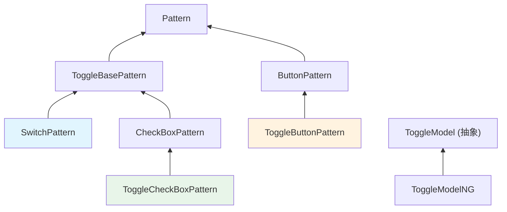
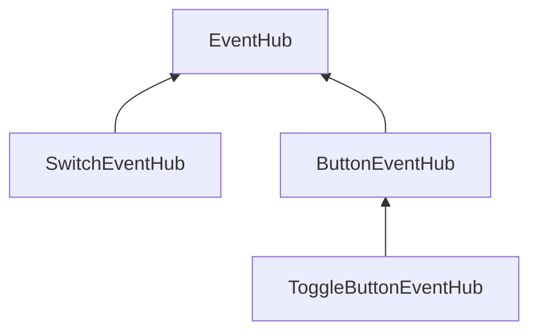
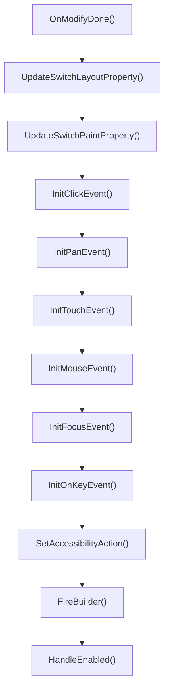
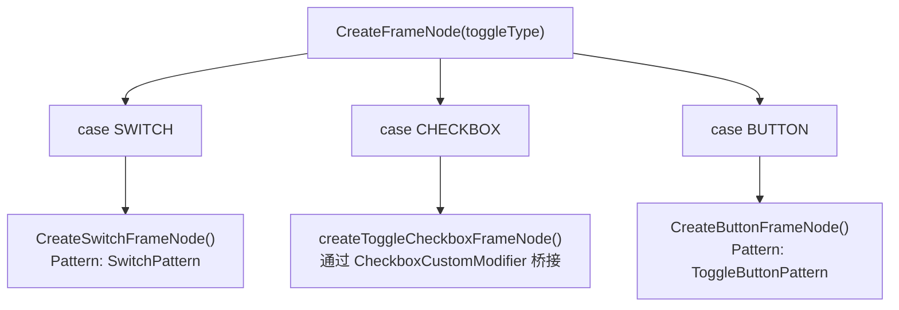

# Toggle 开关组件知识库

> **文档版本**: v1.0
> **更新时间**: 2026-05-31
> **源码版本**: OpenHarmony ace_engine (master 分支)
> **组件标签**: `TOGGLE_ETS_TAG`

---

## 目录

1. [概述](#概述)
2. [目录结构](#目录结构)
3. [核心类继承关系](#核心类继承关系)
4. [Pattern层详解](#pattern层详解)
5. [Model层详解](#model层详解)
6. [API 清单](#api-清单)
7. [关键实现细节](#关键实现细节)
8. [使用示例](#使用示例)
9. [调试指南](#调试指南)
10. [常见问题](#常见问题)

---

## 概述

- **组件定位**: Toggle 是 ArkUI 的开关/选择组件，通过 `ToggleType` 统一入口提供三种外观形态——Switch（滑块开关）、Checkbox（复选框）、Button（按钮），共享同一个 `TOGGLE_ETS_TAG` 节点标签。
- **典型使用场景**: 设置页开关、功能启用/禁用、多选项勾选、可切换的按钮状态。
- **与相近组件差异**: Toggle 是一个组件家族统一入口，内部根据 `ToggleType` 分发到三种完全不同的 Pattern 实现。Checkbox 组件是独立组件，ToggleCheckbox 是 Toggle(type=Checkbox) 的内部实现，两者共享 CheckBoxPattern 基类。

### ToggleType 枚举

| 类型 | 值 | 描述 |
|------|---|------|
| `CHECKBOX` | 0 | 复选框样式 |
| `SWITCH` | 1 | 滑块开关样式（默认） |
| `BUTTON` | 2 | 按钮样式，支持子组件 |

### API 版本支持

| 范式 | 初始版本 |
|------|---------|
| Dynamic API | API 8 |
| Static API | API 23 static |
| Modifier API (Dynamic) | API 12 |
| Modifier API (Static) | API 23 static |
| CAPI / NDK | 有限支持 |

---

## 目录结构

Toggle 组件的源码分布在三个目录中，对应三种 ToggleType：

```text
OpenHarmony/foundation/arkui/ace_engine/frameworks/core/components_ng/pattern/
├── toggle/                                    # Toggle 统一入口 + Switch 类型
│   ├── toggle_model.h                         # ToggleModel 抽象接口，ToggleType 枚举
│   ├── toggle_model_ng.h/cpp                  # NG Model 实现，按 ToggleType 分发创建
│   ├── toggle_model_static.h/cpp              # ArkTS 静态版 Model
│   ├── toggle_base_pattern.h/cpp              # ToggleBasePattern 基类
│   ├── toggle_theme_wrapper.h                 # ToggleButton 主题（Token 适配）
│   ├── switch_pattern.h/cpp                   # Switch 类型 Pattern
│   ├── switch_event_hub.h/cpp                 # Switch 事件定义
│   ├── switch_paint_property.h/cpp            # Switch 绘制属性
│   ├── switch_layout_algorithm.h/cpp          # Switch 布局算法
│   ├── switch_paint_method.h/cpp              # Switch 绘制方法
│   ├── switch_modifier.h                      # Switch 渲染修改器（动画）
│   ├── switch_accessibility_property.h/cpp    # Switch 无障碍
│   └── switch_theme_wrapper.h                 # Switch 主题（Token 适配）
├── checkbox/                                  # Checkbox 类型
│   ├── toggle_checkbox_pattern.h              # ToggleCheckBoxPattern（继承 CheckBoxPattern）
│   └── toggle_checkbox_accessibility_property.h # ToggleCheckbox 无障碍
└── button/                                    # Button 类型
    ├── toggle_button_pattern.h/cpp            # ToggleButtonPattern（继承 ButtonPattern）
    ├── toggle_button_model_ng.h/cpp           # ToggleButton Model
    ├── toggle_button_event_hub.h              # ToggleButton 事件
    ├── toggle_button_paint_property.h/cpp     # ToggleButton 绘制属性
    └── toggle_button_accessibility_property.cpp # ToggleButton 无障碍
```

---

## 核心类继承关系



> **关键架构特征**: Switch 和 Checkbox 共享 `ToggleBasePattern` 继承树；Button 类型继承自独立的 `ButtonPattern`，不经过 `ToggleBasePattern`。三种类型使用同一个 `TOGGLE_ETS_TAG` 标签。

### EventHub 继承



---

## Pattern层详解

### ToggleBasePattern

**源码**: `OpenHarmony/foundation/arkui/ace_engine/frameworks/core/components_ng/pattern/toggle/toggle_base_pattern.h:23`

最小化基类，主要职责是在 ToggleType 切换时管理子节点迁移：

| 方法 | 说明 |
|------|------|
| `MountToHolder(child)` | 将子节点挂载到 holder 节点 |
| `GetOrCreateHolderNode()` | 懒创建一个隐藏的 FrameNode（tag="ToggleBase"），用于 type 切换时暂存子节点 |

### SwitchPattern

**源码**: `OpenHarmony/foundation/arkui/ace_engine/frameworks/core/components_ng/pattern/toggle/switch_pattern.h:36`

Switch 类型的完整实现，具有自定义布局、绘制和丰富的交互动画。

#### 生命周期

| 方法 | 位置 | 说明 |
|------|------|------|
| `OnAttachToFrameNode()` | switch_pattern.cpp:76 | 设置 alphaOffscreen=true |
| `OnModifyDone()` | switch_pattern.cpp:112 | 主初始化入口 |
| `OnDirtyLayoutWrapperSwap()` | switch_pattern.cpp:84 | 捕获 width/height，更新热区 |
| `OnAfterModifyDone()` | switch_pattern.cpp:373 | 记录 isOn 到 NodeDataCache |
| `OnColorConfigurationUpdate()` | switch_pattern.h:123 | 颜色配置变更响应 |

#### OnModifyDone 流程



#### 关键状态变量

| 变量 | 类型 | 说明 |
|------|------|------|
| `isOn_` | `optional<bool>` | 开关状态 |
| `currentOffset_` | `float` | 动画位置偏移 |
| `dragOffsetX_` | `float` | 拖拽偏移 |
| `isTouch_` / `isHover_` / `isFocus_` | `bool` | 交互状态 |
| `isDragEvent_` | `bool` | 是否正在拖拽 |
| `direction_` | `TextDirection` | RTL 支持 |
| `width_` / `height_` | `float` | 测量尺寸 |
| `makeFunc_` | `optional<SwitchMakeCallback>` | ContentModifier 构建器 |
| `paintMethod_` | `RefPtr<SwitchPaintMethod>` | 绘制方法实例 |

#### 事件处理

- **点击**: `OnClick()` 切换 `isOn_`，更新颜色，触发 OnChange
- **拖拽**: `InitPanEvent()` 注册水平拖拽手势，`HandleDragEnd()` 根据中点阈值判断切换方向（RTL 感知）
- **触摸**: 控制 `touchHoverType_` 驱动覆盖层动画
- **按键**: KEY_FUNCTION 触发点击

### ToggleButtonPattern

**源码**: `OpenHarmony/foundation/arkui/ace_engine/frameworks/core/components_ng/pattern/button/toggle_button_pattern.h:29`

继承 `ButtonPattern`，不使用自定义绘制方法，通过 RenderContext 背景色变化实现切换效果。

#### 与 SwitchPattern 的关键差异

| 特性 | SwitchPattern | ToggleButtonPattern |
|------|-------------|-------------------|
| 继承 | ToggleBasePattern | ButtonPattern |
| 拖拽手势 | 支持（PanEvent） | 不支持 |
| 布局算法 | SwitchLayoutAlgorithm | Button 默认布局 |
| 渲染方式 | SwitchModifier 自定义绘制 | RenderContext 背景色 |
| 子组件 | 不支持（AtomicNode=false 但隐藏子节点） | 支持（文本/图标） |
| 按钮样式 | N/A | ROUNDED_RECTANGLE (API>=18) / CAPSULE |
| 焦点/悬停 | 自定义 overlay | 缩放动画 |
| 响应按键 | KEY_FUNCTION | SPACE / ENTER |

#### OnModifyDone 流程

1. `InitParameters()` — 读取 ToggleTheme 颜色/尺寸
2. 根据 isOn 状态更新背景色（selectedColor / bgColor）
3. `HandleOnOffStyle()` — 管理边框、阴影、文本样式
4. `InitEvent()` — 注册点击、触摸、悬停、按键事件

### ToggleCheckBoxPattern

**源码**: `OpenHarmony/foundation/arkui/ace_engine/frameworks/core/components_ng/pattern/checkbox/toggle_checkbox_pattern.h:29`

继承 `CheckBoxPattern`，是一个薄封装层。Checkbox 的布局、绘制、事件处理全部复用 `CheckBoxPattern`。

主要新增：
- 自定义 `ToggleCheckBoxAccessibilityProperty`
- `OnInjectionEvent()` / `ReportInjectionResult()` — 注入测试支持

---

## Model层详解

### ToggleModel

**源码**: `OpenHarmony/foundation/arkui/ace_engine/frameworks/core/components_ng/pattern/toggle/toggle_model.h:50`

统一抽象接口，定义所有 Toggle 属性的 Set 方法。

### ToggleModelNG

**源码**: `OpenHarmony/foundation/arkui/ace_engine/frameworks/core/components_ng/pattern/toggle/toggle_model_ng.cpp`

#### Create 分发逻辑

`CreateFrameNode()` (toggle_model_ng.cpp:82) 根据 ToggleType 分发：



- **Switch** (toggle_model_ng.cpp:287): 直接创建 `SwitchPattern` FrameNode。API >= 26 且 Material 启用时应用 `UiMaterialStyle::ULTRA_THIN`。
- **Checkbox** (toggle_model_ng.cpp:276): 委托 `NodeModifier::GetCheckboxCustomModifier()->createToggleCheckboxFrameNode()`，Checkbox 模块独立编译，通过 C API Modifier 桥接访问。
- **Button** (toggle_model_ng.cpp:299): 直接创建 `ToggleButtonPattern` FrameNode。

#### Type 切换

`Create()` (toggle_model_ng.cpp:36) 支持运行时切换 ToggleType：若现有 FrameNode 的 Pattern 与请求的 type 不匹配，调用 `ReCreateFrameNode()` 销毁旧节点、创建新节点并迁移子组件。

#### 属性写入路径

ToggleModelNG 的 Set 方法通过 `InstanceOf` 判断当前 Pattern 类型，将属性写入对应的 PaintProperty：

| 方法 | Switch | Checkbox | Button |
|------|--------|----------|--------|
| `SetSelectedColor()` | `SwitchPaintProperty::SelectedColor` | `CheckBoxPaintProperty::SelectedColor` | `ToggleButtonPaintProperty::SelectedColor` |
| `SetSwitchPointColor()` | `SwitchPaintProperty::SwitchPointColor` | — | — |
| `SetBackgroundColor()` | — | — | `ToggleButtonPaintProperty::BackgroundColor` |
| `SetPointRadius()` | `SwitchPaintProperty::PointRadius` | — | — |
| `SetUnselectedColor()` | `SwitchPaintProperty::UnselectedColor` | — | — |
| `SetTrackBorderRadius()` | `SwitchPaintProperty::TrackBorderRadius` | — | — |

---

## API 清单

### API 声明路径

| 范式 | 声明文件 | 是否涉及 |
|------|---------|---------|
| Dynamic API | `OpenHarmony/interface/sdk-js/api/@internal/component/ets/toggle.d.ts` | ✅ |
| Static API | `OpenHarmony/interface/sdk-js/api/arkui/component/toggle.static.d.ets` | ✅ |
| Modifier API (Dynamic) | `OpenHarmony/interface/sdk-js/api/arkui/ToggleModifier.d.ts` | ✅ |
| Modifier API (Static) | `OpenHarmony/interface/sdk-js/api/arkui/ToggleModifier.static.d.ets` | ✅ |
| CAPI / NDK | `OpenHarmony/foundation/arkui/ace_engine/interfaces/native/native_node.h` | ✅（有限） |
| NAPI | — | ❌ |

### 构造参数

| 参数 | 类型 | 必填 | 说明 |
|------|------|:----:|------|
| `type` | `ToggleType` | ✅ | 开关类型：Checkbox / Switch / Button |
| `isOn` | `boolean` | ❌ | 初始状态，默认 false。Static 范式额外支持 `Bindable<boolean>` |

### 属性接口清单

以 Dynamic API `ToggleAttribute` 为主轴，对照各范式覆盖情况：

**通用属性**

| 属性接口 | 参数类型 | Dynamic | Static | Modifier | CAPI | 适用 Type | 说明 |
|---------|---------|:-------:|:------:|:--------:|:----:|-----------|------|
| `selectedColor` | `ResourceColor` | ✅ | ✅ | ✅ | ✅ | 全部 | 选中态背景色 |
| `switchPointColor` | `ResourceColor` | ✅ | ✅ | ✅ | ✅ | Switch | 滑块圆点颜色 |
| `switchStyle` | `SwitchStyle` | ✅ | ✅ | ✅ | ❌ | Switch | 开关样式（含多个子属性） |
| `onChange` | `(isOn: boolean) => void` | ✅ | ✅ | ✅ | ✅ | 全部 | 状态变更回调 |
| `contentModifier` | `ContentModifier<ToggleConfiguration>` | ✅ | ✅ | ✅ | ❌ | Switch | 自定义内容修饰器 |

**SwitchStyle 子属性**

| 子属性 | 参数类型 | Dynamic | Static | CAPI | 说明 |
|--------|---------|:-------:|:------:|:----:|------|
| `pointRadius` | `number \| Resource` | ✅ | ✅ | ❌ | 自定义圆点半径 |
| `unselectedColor` | `ResourceColor` | ✅ | ✅ | ✅ | 未选中态轨道颜色 |
| `pointColor` | `ResourceColor` | ✅ | ✅ | ❌ | 圆点颜色（覆盖 switchPointColor） |
| `trackBorderRadius` | `number \| Resource` | ✅ | ✅ | ❌ | 轨道圆角半径 |

**Static 范式独有**

| 属性接口 | 版本 | 说明 |
|---------|------|------|
| `setToggleOptions(options)` | @since 26.0.0 staticonly | 运行时更新构造参数 |
| `attributeModifier(modifier)` | @since 23 static | 显式声明（Dynamic 从 CommonMethod 继承） |

### CAPI 枚举

| 枚举 | 值 | 类型 | 说明 |
|------|---|------|------|
| `ARKUI_NODE_TOGGLE` | 5 | 节点类型 | Toggle 节点标识 |
| `NODE_TOGGLE_SELECTED_COLOR` | — | `value[0].u32` 0xARGB | 选中态背景色 |
| `NODE_TOGGLE_SWITCH_POINT_COLOR` | — | `value[0].u32` 0xARGB | 滑块圆点颜色 |
| `NODE_TOGGLE_VALUE` | — | `value[0].i32` bool | 开关状态 |
| `NODE_TOGGLE_UNSELECTED_COLOR` | — | `value[0].u32` 0xARGB | 未选中态背景色 |
| `NODE_TOGGLE_ON_CHANGE` | — | `data[0].i32` 1/0 | 状态变更事件 |

### ToggleConfiguration（ContentModifier 参数）

| 字段 | 类型 | Dynamic | Static | 说明 |
|------|------|:-------:|:------:|------|
| `isOn` | `boolean` | ✅ | ✅ | 当前开关状态 |
| `enabled` | `boolean` | ✅ | ❌ | 是否可用 |
| `triggerChange` | `Callback<boolean>` | ✅ | ✅ | 触发状态变更 |

### 关联的 `@ohos.arkui.*` 模块 API

| 模块 | 路径 | 说明 |
|------|------|------|
| N/A | — | 不涉及 |

---

## 关键实现细节

### 三种 Pattern 的渲染差异

| 维度 | Switch | Checkbox | Button |
|------|--------|----------|--------|
| 绘制方式 | `SwitchModifier` 自定义绘制（Canvas） | `CheckBoxModifier` 自定义绘制 | `RenderContext` 背景色 |
| 布局算法 | `SwitchLayoutAlgorithm`（宽高比约束） | `CheckBoxLayoutAlgorithm` | ButtonPattern 默认布局 |
| 动画 | InterpolatingSpring 弹簧动画 | CheckBox 勾选动画 | 无切换动画 |
| 交互手势 | 点击 + 水平拖拽（PanEvent） | 点击 | 点击 |

### Switch 动画系统

Switch 有分层动画：

1. **滑块位移动画**: InterpolatingSpring 弹簧曲线（stiffness=305, damping=24），duration=150ms
2. **颜色切换动画**: `ColorAnimationDuration` 控制轨道/圆点颜色过渡
3. **触摸/悬停覆盖**: `touchHoverType_` 驱动透明覆盖层的 alpha 动画
4. **长按 Material 效果**（API >= 26, 高端设备）: 400ms 长按后创建 frosted glass 毛玻璃叠加层（`dragFrameNode_`, `dragPointNode_`, `blurCoverNode_`），包含模糊和亮度混合
5. **长按缩放效果**（低端设备）: 独立弹簧曲线（stiffness=224, damping=12），圆点缩放因子 0.78→1.56

### Switch 属性系统

**SwitchPaintProperty** (switch_paint_property.h:46):

| 属性 | 更新标志 | 说明 |
|------|---------|------|
| `IsOn` | `PROPERTY_UPDATE_MEASURE` | 触发重新布局 |
| `SelectedColor` | 绘制更新 | 选中轨道颜色 |
| `SwitchPointColor` | 绘制更新 | 圆点颜色 |
| `PointRadius` | 绘制更新 | 自定义圆点半径 |
| `UnselectedColor` | 绘制更新 | 未选中轨道颜色 |
| `TrackBorderRadius` | 绘制更新 | 轨道圆角 |
| `Duration` (AnimationStyle) | — | 动画时长 |
| `Curve` (AnimationStyle) | — | 动画曲线 |

**ToggleButtonPaintProperty** (toggle_button_paint_property.h:29):

| 属性 | 更新标志 | 说明 |
|------|---------|------|
| `IsOn` | `PROPERTY_UPDATE_RENDER` | 仅触发重绘（不重新布局） |
| `SelectedColor` | 绘制更新 | 选中态颜色 |
| `BackgroundColor` | 绘制更新 | 未选中态颜色 |

### ToggleButton 样式管理

ToggleButtonPattern 管理多种视觉状态：

- **边框**: `HandleBorderAndShadow()` — 选中/未选中态不同边框宽度和颜色
- **阴影**: Normal / Focus 两套阴影值
- **文本**: 配置 fontSize, textColor, margin, marquee 溢出
- **焦点**: `HandleFocusStyle()` — 焦点态背景色区分 checked/unchecked
- **按钮类型**: API >= 18 使用 `ROUNDED_RECTANGLE`，更早版本使用 `CAPSULE`

### ToggleType 运行时切换

ToggleModelNG::Create() 支持运行时变更 ToggleType。当检测到已有 FrameNode 的 Pattern 类型与请求不匹配时：

1. `ReCreateFrameNode()` 销毁旧节点
2. 按新 type 创建新 FrameNode
3. 迁移子组件到新节点
4. `ToggleBasePattern::GetOrCreateHolderNode()` 提供过渡暂存

### 主题系统

| 主题 | 适用 Type | Token 覆盖 |
|------|-----------|-----------|
| `SwitchThemeWrapper` | Switch | `pointColor_` = `CompBackgroundPrimaryContrary`, `activeColor_` = `CompBackgroundEmphasize` |
| `ToggleThemeWrapper` | Button | `backgroundColor_` = `CompBackgroundTertiary`, `checkedColor_` = `CompEmphasizeSecondary` |
| CheckBoxTheme | Checkbox | 复用 Checkbox 组件主题 |

### 无障碍

三种类型都报告 `IsCheckable()=true`，通过 `ActionSelect`/`ActionClearSelection` 支持无障碍切换：

| Pattern | 类 | ToggleType 报告值 |
|---------|---|------------------|
| Switch | `SwitchAccessibilityProperty` | "1" (SWITCH) |
| Checkbox | `ToggleCheckBoxAccessibilityProperty` | 继承 CheckBoxAccessibilityProperty |
| Button | `ToggleButtonAccessibilityProperty` | — |

---

## 使用示例

### ArkTS Dynamic 示例

```ts
@Entry
@Component
struct ToggleExample {
  build() {
    Column({ space: 20 }) {
      // Switch 类型
      Toggle({ type: ToggleType.Switch, isOn: true })
        .selectedColor('#007DFF')
        .switchPointColor('#FFFFFF')
        .switchStyle({
          pointRadius: 10,
          trackBorderRadius: 15,
          unselectedColor: '#E5E5E5'
        })
        .onChange((isOn: boolean) => {
          console.info('Switch state: ' + isOn)
        })

      // Checkbox 类型
      Toggle({ type: ToggleType.Checkbox, isOn: false })
        .selectedColor('#007DFF')
        .onChange((isOn: boolean) => {
          console.info('Checkbox state: ' + isOn)
        })

      // Button 类型（支持子组件）
      Toggle({ type: ToggleType.Button, isOn: false }) {
        Text('Wi-Fi').fontSize(14)
      }
      .selectedColor('#007DFF')
      .onChange((isOn: boolean) => {
        console.info('Button state: ' + isOn)
      })
    }
  }
}
```

### ArkTS Static 示例

Static 范式用法基本一致，额外支持 `Bindable<boolean>` 双向绑定和 `setToggleOptions()`：

```ts
Toggle({ type: ToggleType.Switch, isOn: true })
  .selectedColor('#007DFF')
  .switchPointColor('#FFFFFF')
  .onChange((isOn: boolean) => {
    console.info('Switch state: ' + isOn)
  })
```

---

## 调试指南

### 关键日志点

- Switch 状态变更: 在 `SwitchPattern::OnClick()` (switch_pattern.cpp) 中观察 `isOn_` 变化
- Button 状态变更: 在 `ToggleButtonPattern::OnModifyDone()` (toggle_button_pattern.cpp:60) 中观察 isOn 读取与事件触发
- Type 切换: `ToggleModelNG::Create()` (toggle_model_ng.cpp:36) 的 ReCreateFrameNode 路径

### 常见断点位置

| 断点 | 文件:行 | 说明 |
|------|--------|------|
| Switch 点击 | `switch_pattern.cpp` — `OnClick()` | 观察状态切换逻辑 |
| Switch 拖拽结束 | `switch_pattern.cpp` — `HandleDragEnd()` | 观察拖拽方向判断 |
| Switch 动画 | `switch_modifier.h` — 偏移动画回调 | 观察弹簧动画参数 |
| Button 样式 | `toggle_button_pattern.cpp` — `HandleOnOffStyle()` | 观察背景色/边框切换 |
| Model 分发 | `toggle_model_ng.cpp` — `CreateFrameNode()` | 观察 Type 分发 |

### 排查流程

1. **Toggle 不响应**: 检查 `HandleEnabled()` 是否设置了 disabled opacity → 检查 PaintProperty 的 isOn 值 → 检查事件注册
2. **Switch 动画异常**: 检查 `SwitchPaintProperty` 的 Duration/Curve → 检查 SwitchModifier 的弹簧参数
3. **Button 颜色不对**: 检查 `ToggleButtonPaintProperty` 的 SelectedColor/BackgroundColor → 检查 ToggleThemeWrapper 的 Token 映射
4. **Type 切换崩溃**: 检查 `ReCreateFrameNode()` 路径中子节点迁移是否正确

---

## 常见问题

1. **问题**: Toggle(type=Checkbox) 与独立 Checkbox 组件有什么区别？
   **结论**: Toggle(type=Checkbox) 内部创建 `ToggleCheckBoxPattern`（继承 `CheckBoxPattern`），使用相同的绘制和布局逻辑。差异在于：Toggle 版使用 `TOGGLE_ETS_TAG` 标签，独立 Checkbox 使用 `CHECKBOX_ETS_TAG`；Toggle 版通过 `CheckboxCustomModifier` 桥接创建，独立 Checkbox 直接实例化。

2. **问题**: switchPointColor 和 switchStyle.pointColor 有什么区别？
   **结论**: 两者都设置 Switch 圆点颜色，写入相同的 `SwitchPaintProperty::SwitchPointColor`。`switchStyle.pointColor` 是 API 12 引入的新写法，与 `switchPointColor`（API 8）功能等价。同时设置时后者生效。

3. **问题**: ToggleButton 为什么不继承 ToggleBasePattern？
   **结论**: ToggleButton 需要 Button 的完整布局能力（支持子组件、文本排版、圆角矩形/胶囊形），而 ToggleBasePattern 主要为 Switch/Checkbox 这类原子节点设计。ToggleButton 继承 ButtonPattern 可以直接复用 Button 的布局算法和交互机制。

4. **问题**: CAPI 为什么不支持 switchStyle 子属性？
   **结论**: CAPI 仅暴露了 `NODE_TOGGLE_SELECTED_COLOR`、`NODE_TOGGLE_SWITCH_POINT_COLOR`、`NODE_TOGGLE_VALUE`、`NODE_TOGGLE_UNSELECTED_COLOR` 四个枚举。`pointRadius`、`trackBorderRadius` 等细粒度样式属性未在 CAPI 中提供，NDK 场景下无法设置这些属性。
