# 鼠标右键转长按事件 — 完整实现文档

## 1. 需求概述

### 1.1 功能目标

在桌面环境下，将鼠标右键点击转换为合成的长按触摸事件，使支持长按手势的白名单组件（TextInput、TextArea、RichEditor、Text 等）通过右键即可触发上下文菜单（如文本选择菜单），实现桌面端右键上下文菜单的触摸组件兼容。

### 1.2 核心设计思路

| 设计点 | 方案 | 原因 |
|---|---|---|
| 合成触摸 ID | `RIGHT_MOUSE_TOUCH_ID = 1002` | 避免与左键映射的 id=0 冲突，识别器可区分不同触摸会话 |
| 延迟 UP 机制 | RELEASE 后延迟 `longPressDuration - elapsed + 100ms` 发送 UP | 确保 LongPress 定时器先 ACCEPT，再收到 UP 触发 `onActionEnd_`，而非 REJECT |
| source-type 保护 | 合成事件 `sourceTool=MOUSE && sourceType=TOUCH` 时跳过 `CheckSourceTypeChange` | 避免合成 TOUCH 污染 `lastSourceType_`，导致后续真实鼠标事件误触发 `HandleTouchHoverOut` |
| 状态同步 | AceViewOhos → PipelineContext::isRightMouseMappingActive_ | 供 OnHide/WindowFocus 检测映射状态并取消 |
| 白名单 + HitTest | 配置 `needTransferComponent` + FrameNode 递归命中测试 | 精确控制哪些组件接受右键转长按 |
| CANCEL 优先于 UP | 所有打断场景发送 CANCEL 而非 UP | CANCEL 触发 `onActionCancel_`（菜单消失/REJECT），UP 会误触发 `onActionEnd_` |

### 1.3 修改文件清单（17 个文件）

| 文件 | 变更类型 | 职责 |
|---|---|---|
| `adapter/ohos/entrance/ace_view_ohos.cpp` | 核心新增 | 映射逻辑全部实现：事件转换、状态管理、延迟 UP、取消路径 |
| `adapter/ohos/entrance/ace_view_ohos.h` | 核心新增 | 状态成员声明、公开/私有方法声明、析构函数 |
| `adapter/ohos/entrance/ace_container.cpp` | 新增 | 回调注册（HitTest/状态同步/取消）+ UnActiveWindow 取消 |
| `adapter/ohos/entrance/event_convertor/event_info_convertor.cpp` | 新增 | 配置解析：contextMenuOptions JSON → rightMouse2LongPress + needTransferComponent |
| `frameworks/core/common/container.h` | 新增 | `MouseTargetHitCallback` 类型别名 + `<string>`/`<vector>` include |
| `frameworks/core/components_ng/base/frame_node.cpp` | 新增 | `HitTestMouseTarget` + `IsMouseTargetHit` 轻量命中测试 |
| `frameworks/core/components_ng/base/frame_node.h` | 新增 | 方法声明 + `<string>` include |
| `frameworks/core/pipeline_ng/pipeline_context.cpp` | 修改 | source-type 保护 + OnHide/WindowFocus 取消 + `HitTestMouseTargetForMapping` |
| `frameworks/core/pipeline_ng/pipeline_context.h` | 新增 | `isRightMouseMappingActive_` + `onRightMouseMappingCancel_` + 方法 |
| `frameworks/core/event/event_info_convertor.cpp` | 新增 | 非 OHOS 平台 stub 实现 |
| `frameworks/core/event/event_info_convertor.h` | 新增 | `GetRightMouse2LongPressConfig` + `IsRightMouseMappingEnabled` 声明 |
| `frameworks/core/components_ng/gestures/recognizers/long_press_recognizer.h` | 微调 | 命名空间后增加空行 |
| `test/unittest/core/pipeline/BUILD.gn` | 新增 | 测试源文件 + cJSON 依赖 |
| `test/unittest/core/pipeline/right_mouse_mapping_test_ng.cpp` | 新建 | 781 行测试，覆盖配置解析/Pipeline状态/HitTest/事件交互 |

---

## 2. 类图

### 2.1 核心类关系

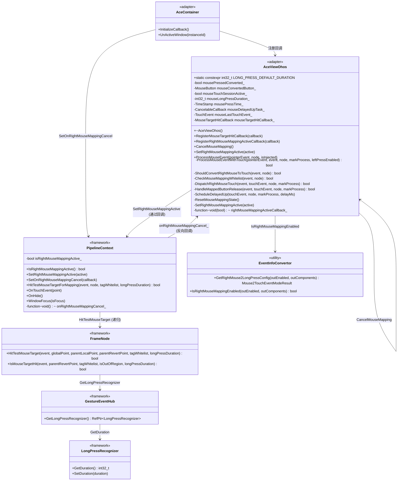

### 2.2 回调注册关系

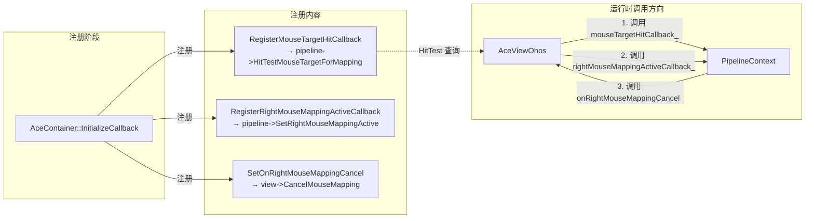

---

## 3. 架构总览

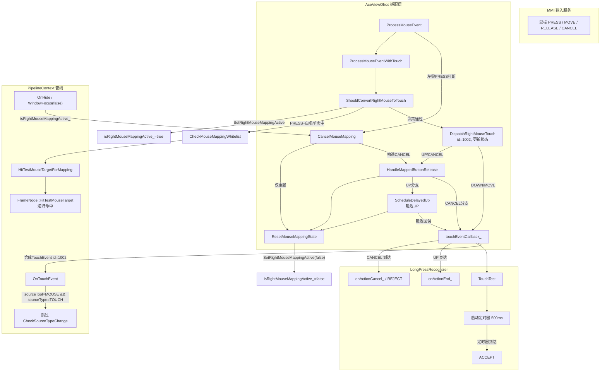

---

## 4. 状态机 — 流程图

### 4.1 映射主状态机

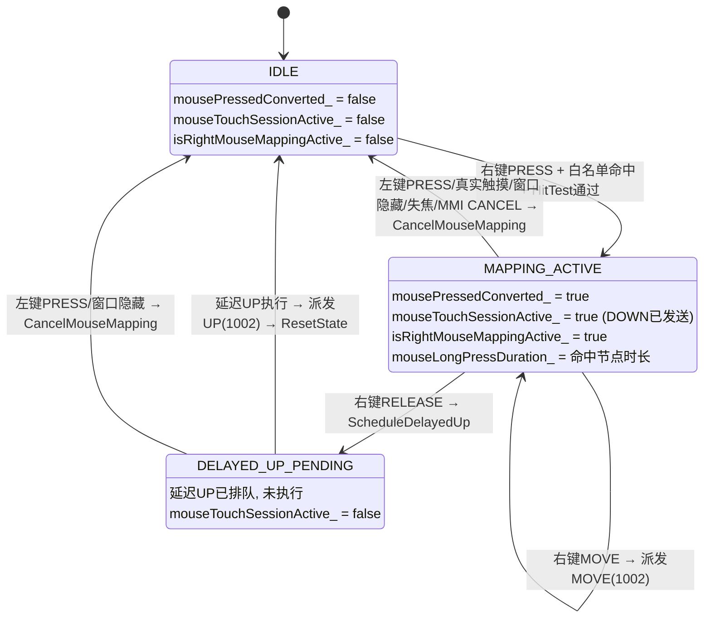

### 4.2 ShouldConvertRightMouseToTouch 决策流程

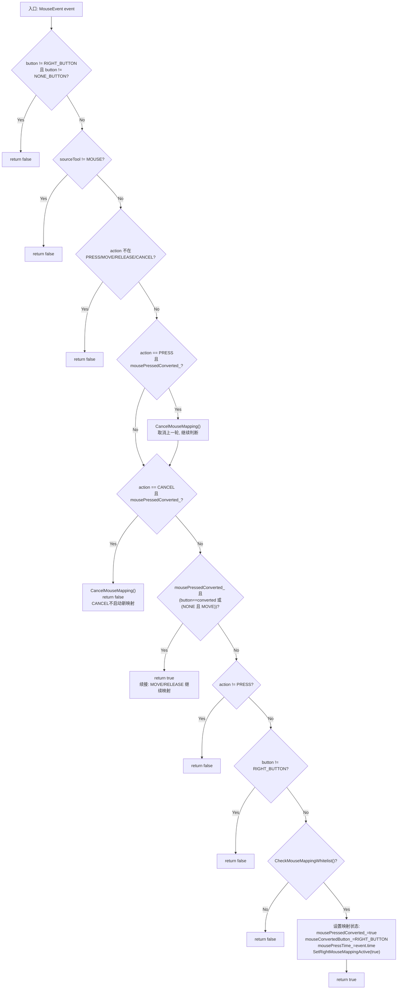

---

## 5. 时序图

### 5.1 正常右键长按（完整流程）

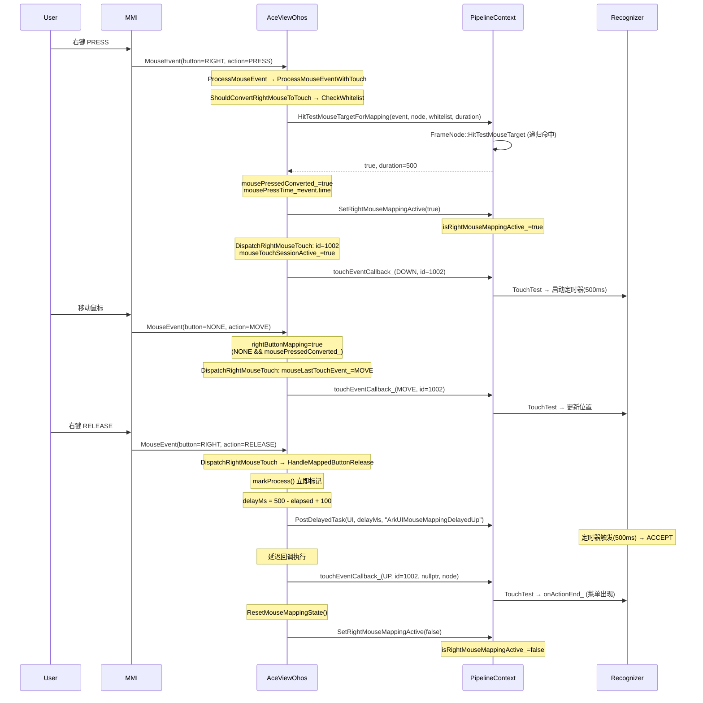

### 5.2 快速右键（RELEASE 早于定时器）

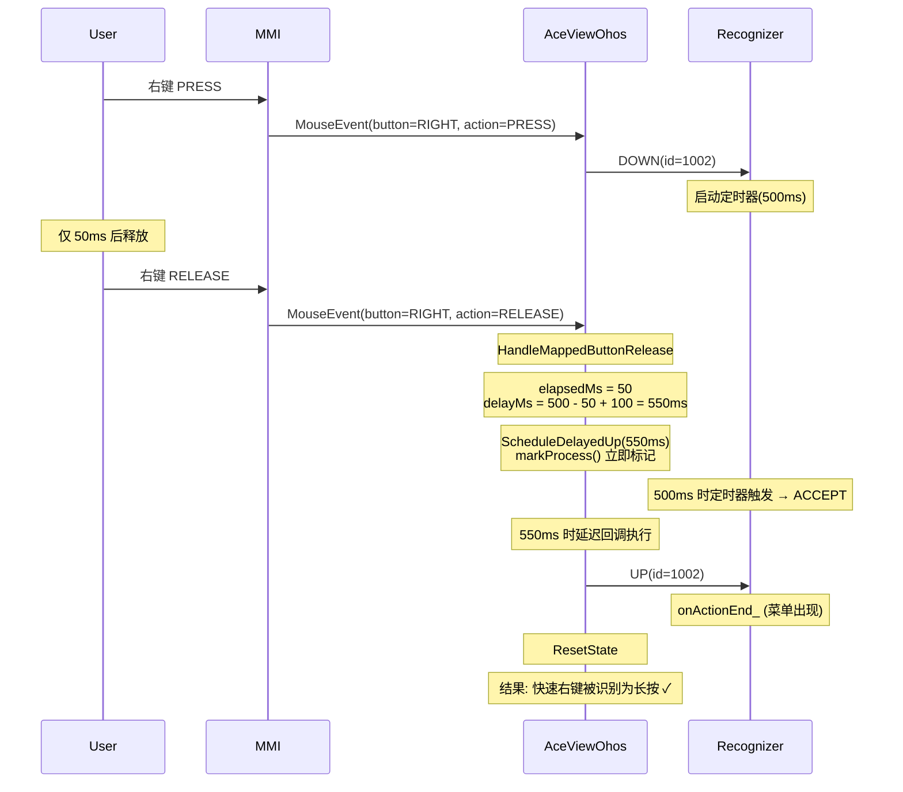

### 5.3 左键 PRESS 打断映射

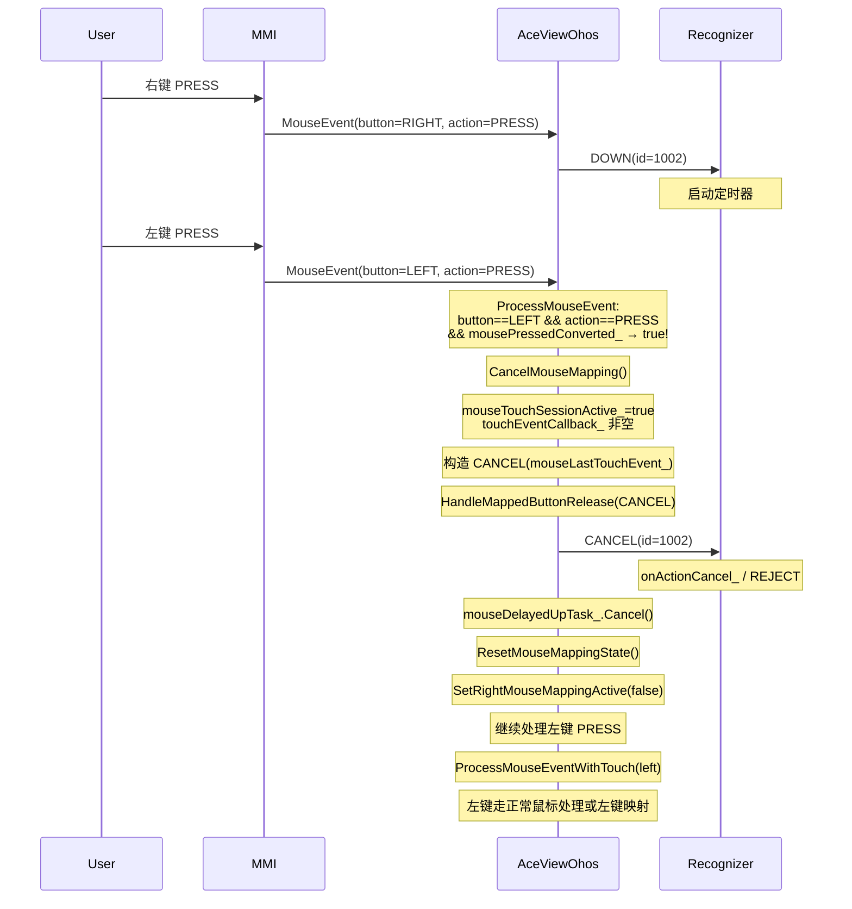

### 5.4 窗口隐藏/失焦取消

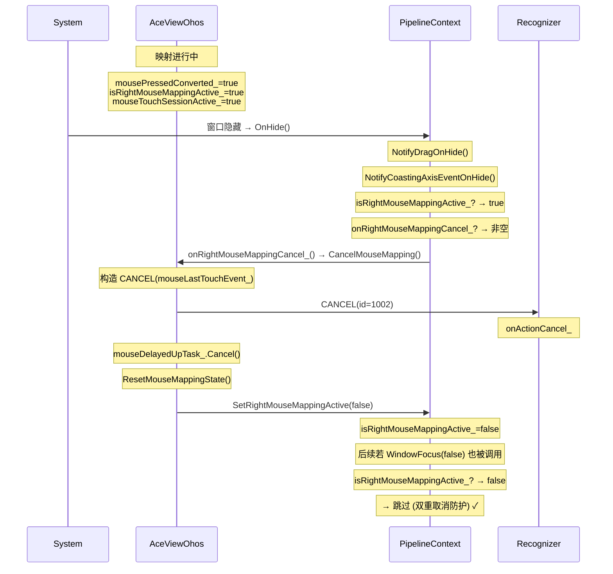

### 5.5 连续右键（新 PRESS 取消上一轮）

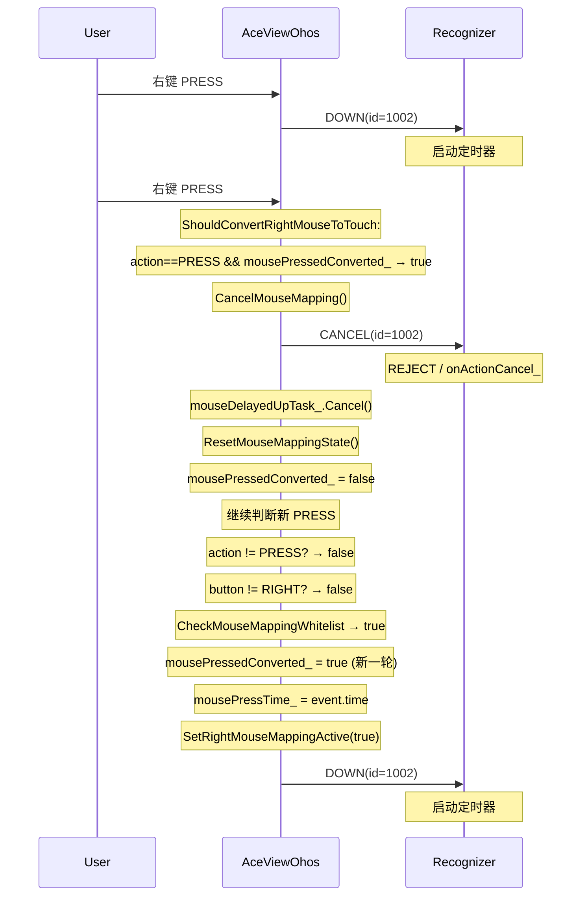

### 5.6 MMI CANCEL 事件处理

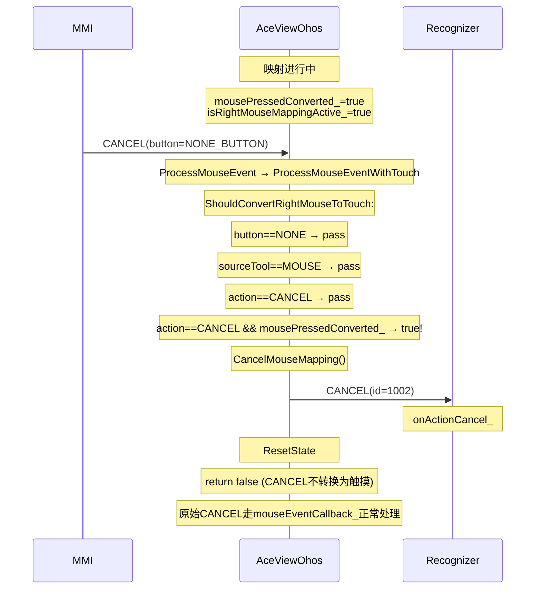

### 5.7 ProcessMouseToTouchEvent 转换失败

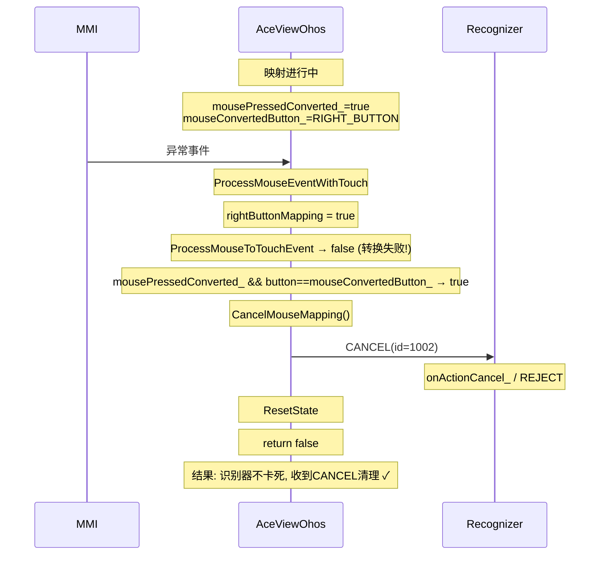

---

## 6. 函数详细说明

### 6.1 AceViewOhos — 核心映射层

#### 6.1.1 ProcessMouseEvent

```
入口: 所有鼠标事件
返回: void (内部决定走转换路径还是常规鼠标处理)
```

| 分支 | 条件 | 行为 |
|---|---|---|
| 左键 PRESS 打断 | `button==LEFT_BUTTON && action==PRESS && mousePressedConverted_` | `CancelMouseMapping()` 发送 CANCEL(id=1002) 并重置状态 |
| 转换路径 | `ProcessMouseEventWithTouch()` 返回 true | 事件已转为触摸，直接 return |
| 常规鼠标路径 | 上述均不匹配 | `mouseEventCallback_()` 正常鼠标处理 |

**设计意图**：左键 PRESS 是明确的用户意图切换，必须在右键映射前取消，避免两个触摸会话 (id=0 和 id=1002) 同时活跃。

#### 6.1.2 ProcessMouseEventWithTouch

```
入口: ProcessMouseEvent 调用
返回: bool (true=已转换为触摸, false=走常规鼠标处理)
参数: pointerEvent(原始MMI事件), event(转换后MouseEvent), node, markProcess, leftPressEnabled
```

| 分支 | 条件 | 行为 |
|---|---|---|
| 计算右键映射标志 | `(button==RIGHT \|\| (button==NONE && mousePressedConverted_)) && ShouldConvertRightMouseToTouch()` | 赋值 `rightButtonMapping` |
| 进入转换块 | `leftPressEnabled && button==LEFT` \|\| `rightButtonMapping` | 执行 `ProcessMouseToTouchEvent` |
| 转换失败 | `!ProcessMouseToTouchEvent()` + 映射活跃 | `CancelMouseMapping()` 发送 CANCEL，return false |
| 回调为空 | `!touchEventCallback_` + 映射活跃 | `CancelMouseMapping()` 取消延迟任务+重置，return false |
| 右键派发 | `rightButtonMapping==true` | `DispatchRightMouseTouch()` 设置 id=1002 并派发 |
| 左键派发 | 否则 | `touchEventCallback_()` 派发（默认 id） |
| 不匹配 | 均不满足 | return false |

**关键修复**：外层条件增加 `button==NONE_BUTTON && mousePressedConverted_` 分支，使 MOVE 事件（button=NONE_BUTTON）在映射活跃时能进入转换路径，经 `DispatchRightMouseTouch` 设置 id=1002，保证触摸会话 ID 一致。

#### 6.1.3 ShouldConvertRightMouseToTouch

```
入口: ProcessMouseEventWithTouch 调用
返回: bool (true=应转换为触摸, false=不转换)
```

| 检查序号 | 条件 | 通过 | 失败行为 |
|---|---|---|---|
| 1 | `button != RIGHT_BUTTON && button != NONE_BUTTON` | 继续检查 | return false |
| 2 | `sourceTool != MOUSE` | 继续检查 | return false |
| 3 | `action` 不在 `PRESS/MOVE/RELEASE/CANCEL` 中 | 继续检查 | return false |
| 4 | `action==PRESS && mousePressedConverted_` | 取消上一轮, 继续判断 | — |
| 5 | `action==CANCEL && mousePressedConverted_` | `CancelMouseMapping()`, return false | — |
| 6 | `mousePressedConverted_ && (button==converted \|\| (NONE && MOVE))` | return true (续接映射) | — |
| 7 | `action != PRESS` | — | return false |
| 8 | `button != RIGHT_BUTTON` | — | return false |
| 9 | `CheckMouseMappingWhitelist()` | 设置映射状态, return true | return false |

**设置映射状态**（检查 9 通过后）：
- `mousePressedConverted_ = true`
- `mouseConvertedButton_ = RIGHT_BUTTON`
- `mousePressTime_ = event.time`
- `SetRightMouseMappingActive(true)` → PipelineContext 同步

#### 6.1.4 DispatchRightMouseTouch

```
入口: ProcessMouseEventWithTouch 调用 (仅 rightButtonMapping==true 时)
返回: bool (true=已派发)
参数: event(MouseEvent), touchEvent(引用, 已转换), node, markProcess
```

| 步骤 | 说明 |
|---|---|
| 设置触摸 ID | `touchEvent.id = touchEvent.originalId = RIGHT_MOUSE_TOUCH_ID (1002)` |
| 设置 pointers | 遍历 `touchEvent.pointers`，全部设为 1002 |
| DOWN 处理 | `mouseLastTouchEvent_ = touchEvent`, `mouseTouchSessionActive_ = true` |
| MOVE 处理 | `mouseLastTouchEvent_ = touchEvent`（更新缓存，供 CANCEL 构造用） |
| UP/CANCEL 处理 | 转入 `HandleMappedButtonRelease()` |
| DOWN/MOVE 派发 | `touchEventCallback_(touchEvent, markProcess, node)` |

#### 6.1.5 HandleMappedButtonRelease

```
入口: DispatchRightMouseTouch (UP/CANCEL) 或 CancelMouseMapping (CANCEL)
返回: bool (true=已处理)
参数: event(UP时用于计算延迟, CANCEL时不使用), touchEvent, node, markProcess
```

| 分支 | 条件 | 行为 |
|---|---|---|
| CANCEL 分支 | `touchEvent.type == CANCEL` | 构造 CANCEL 副本（设置 type/sourceType/sourceTool），`touchEventCallback_` 派发，`mouseDelayedUpTask_.Cancel()`，`ResetMouseMappingState()` |
| UP 分支 | `touchEvent.type == UP` | 计算延迟时间 `delayMs = mouseLongPressDuration_ - elapsed + 100`，下限 100ms，`ScheduleDelayedUp()` |

**延迟计算公式**：
- `elapsed = event.time - mousePressTime_`（PRESS 到 RELEASE 的毫秒数）
- `delayMs = duration - elapsed + 100`（剩余时间 + buffer）
- 若 `delayMs < 100`，设为 100（用户按住超过 duration 的情况）

**为什么 CANCEL 而非 UP**：UP 会触发 `onActionEnd_`（菜单关闭后重新打开），CANCEL 触发 `onActionCancel_`（菜单消失或 REJECT），这是打断场景的正确行为。

#### 6.1.6 ScheduleDelayedUp

```
入口: HandleMappedButtonRelease (UP 分支) 调用
返回: void
参数: touchEvent(值捕获), node(RefPtr值捕获), markProcess, delayMs
```

| 步骤 | 说明 |
|---|---|
| markProcess() | 立即标记 RELEASE 的 MMI 事件已处理，避免阻塞 MMI 调度队列 |
| 构造 lambda | 捕获 `weakThis`(WeakClaim) + `touchEvent`(值) + `node`(RefPtr 值) |
| Reset + PostDelayedTask | `mouseDelayedUpTask_.Reset(cb)`, 通过 TaskExecutor 延迟 `delayMs` 执行 |
| Fallback | container/context 为空时，立即 `ResetMouseMappingState()`（UP 无法发送，但不阻塞状态清理） |

**延迟回调内容**：
1. `self->touchEventCallback_(touchEvent, nullptr, node)` — 发送 UP (id=1002)，markProcess 为 nullptr（RELEASE 已在调度时标记）
2. `self->ResetMouseMappingState()` — 重置全部状态

**为什么 markProcess 为 nullptr**：原始 RELEASE 的 touchEventId 已在 `ScheduleDelayedUp` 入口处通过 `markProcess()` 标记，延迟回调不应再次标记（touchEventId 已过期）。

#### 6.1.7 CancelMouseMapping

```
入口: 多种打断场景 (左键/触摸/连续右键/MMI CANCEL/窗口隐藏/失焦/转换失败)
返回: void
```

| 分支 | 条件 | 行为 |
|---|---|---|
| 空操作 | `!mousePressedConverted_` | 直接 return（映射未活跃或已清理） |
| 发送 CANCEL | `mouseTouchSessionActive_ && touchEventCallback_` | 从 `mouseLastTouchEvent_` 构造 CANCEL（设置 type/sourceType/sourceTool），调用 `HandleMappedButtonRelease({}, CANCEL, nullptr, nullptr)` |
| 仅重置 | 否则（延迟 UP 排队中, 无活跃 touch session） | `mouseDelayedUpTask_.Cancel()` + `ResetMouseMappingState()` |

**两个分支的区别**：
- `mouseTouchSessionActive_=true`：DOWN 已发送但 UP 未发送 → 必须发 CANCEL 让识别器清理
- `mouseTouchSessionActive_=false`：DOWN 已发送且 UP 已排队（在 HandleMappedButtonRelease UP 分支后） → 只需取消延迟任务并重置

#### 6.1.8 ResetMouseMappingState

```
入口: HandleMappedButtonRelease CANCEL / ScheduleDelayedUp 回调 / CancelMouseMapping else 分支
返回: void
```

| 重置项 | 值 | 说明 |
|---|---|---|
| `mousePressedConverted_` | false | 映射不再活跃 |
| `mouseConvertedButton_` | NONE_BUTTON | 清除映射按钮 |
| `mouseTouchSessionActive_` | false | 触摸会话结束 |
| `mouseLongPressDuration_` | LONG_PRESS_DEFAULT_DURATION (500) | 恢复默认时长 |
| `SetRightMouseMappingActive(false)` | — | 通知 PipelineContext: `isRightMouseMappingActive_ = false` |

#### 6.1.9 CheckMouseMappingWhitelist

```
入口: ShouldConvertRightMouseToTouch 检查 9
返回: bool (true=白名单匹配+HitTest 命中)
```

| 步骤 | 失败行为 |
|---|---|
| `IsRightMouseMappingEnabled(enabled, components)` 检查 FeatureManager 配置 | return false |
| `CHECK_NULL_RETURN(mouseTargetHitCallback_)` | return false |
| `mouseTargetHitCallback_(event, node, components, longPressDuration)` 执行 HitTest | return false |
| `mouseLongPressDuration_ = longPressDuration` 保存命中节点的 LongPress 时长 | — |

#### 6.1.10 SetRightMouseMappingActive

```
入口: ShouldConvertRightMouseToTouch / ResetMouseMappingState
参数: bool active
行为: 调用 rightMouseMappingActiveCallback_(active) → PipelineContext::SetRightMouseMappingActive(active)
```

#### 6.1.11 ~AceViewOhos (析构函数)

```cpp
~AceViewOhos() { mouseDelayedUpTask_.Cancel(); }
```

**目的**：销毁时取消延迟 UP 任务，避免悬空回调。

---

### 6.2 AceContainer — 回调注册

#### 6.2.1 InitializeCallback (新增片段)

```
注册 3 个回调 + UnActiveWindow 取消：
```

| 注册项 | 目标 | 回调内容 | 用途 |
|---|---|---|---|
| `RegisterMouseTargetHitCallback` | AceViewOhos | `pipeline->HitTestMouseTargetForMapping(event, node, tagWhitelist, longPressDuration)` | 供 AceViewOhos 查询白名单命中 + 获取 LongPress duration |
| `RegisterRightMouseMappingActiveCallback` | AceViewOhos | `[weakPipeline] → p->SetRightMouseMappingActive(active)` | 映射状态同步到 PipelineContext |
| `SetOnRightMouseMappingCancel` | PipelineContext | `[weakView] → view->CancelMouseMapping()` | OnHide/WindowFocus 时由 PipelineContext 回调取消映射 |

**WeakPtr 使用**：两个回调均使用 `WeakPtr` 防止引用循环和悬空访问。

#### 6.2.2 UnActiveWindow (新增片段)

```
在窗口反激活时取消映射:
  aceViewOhos->CancelMouseMapping()
```

---

### 6.3 PipelineContext — 管线层

#### 6.3.1 OnTouchEvent — source-type 保护

```
位置: OnTouchEvent 内, HandlePenHoverOut 之后
```

| 条件 | 行为 | 目的 |
|---|---|---|
| `sourceTool==MOUSE && sourceType==TOUCH` (合成事件) | 跳过 `CheckSourceTypeChange` | 不污染 `lastSourceType_`，避免后续真实鼠标事件误判 source-type change → `HandleTouchHoverOut` |
| 其他事件 | 正常 `CheckSourceTypeChange` | 真实触摸/鼠标事件的正常行为 |

#### 6.3.2 OnHide — 取消映射

```
位置: OnHide() 内, NotifyCoastingAxisEventOnHide() 之后, onShow_=false 之前
```

| 条件 | 行为 |
|---|---|
| `isRightMouseMappingActive_ && onRightMouseMappingCancel_` | `onRightMouseMappingCancel_()` → `CancelMouseMapping()` |

**触发场景**：应用后台、其他窗口遮挡。

#### 6.3.3 WindowFocus — 取消映射

```
位置: WindowFocus(false) 分支内, NotifyPopupDismiss() 之后
```

| 条件 | 行为 |
|---|---|
| `isRightMouseMappingActive_ && onRightMouseMappingCancel_` | `onRightMouseMappingCancel_()` → `CancelMouseMapping()` |

**触发场景**：点击其他窗口、通知弹出。

**双重取消防护**：第一个回调执行后 `isRightMouseMappingActive_` 被置为 false，第二个回调条件不满足 → 跳过。

#### 6.3.4 HitTestMouseTargetForMapping

```
入口: mouseTargetHitCallback_ (由 AceContainer 注册)
返回: bool (是否命中白名单组件)
参数: event, node(可为空→用根节点), tagWhitelist, longPressDuration(输出)
```

| 步骤 | 说明 |
|---|---|
| 确定 frameNode | `node ? node : GetRootElement()` |
| 坐标缩放 | `event.CreateScaleEvent(GetViewScale())` |
| 初始化 duration | `longPressDuration = LONG_PRESS_DEFAULT_DURATION (500)` |
| 递归命中测试 | `frameNode->HitTestMouseTarget(event, p, p, p, whitelistPtr, &duration)` |

---

### 6.4 FrameNode — 命中测试

#### 6.4.1 HitTestMouseTarget

```
入口: PipelineContext::HitTestMouseTargetForMapping
返回: bool (是否命中)
参数: event, globalPoint, parentLocalPoint, parentRevertPoint, tagWhitelist(可空=无限制), longPressDuration(输出)
```

| 步骤 | 说明 |
|---|---|
| renderContext 检查 | `CHECK_NULL_RETURN(renderContext_, false)` |
| isActive 检查 | `!isActive_` → return false |
| 矩阵缓存 | `GetOrRefreshMatrixFromCache()` 获取 paintRect, localMatrix, revertMatrix |
| 自身命中 | `IsMouseTargetHit(event, parentRevertPoint, tagWhitelist, isOutOfRegion, curDuration)` |
| 输出 duration | 命中时 `*longPressDuration = curDuration` |
| 子节点坐标计算 | `localPoint = parentLocalPoint - paintRect.GetOffset()` + `GetPointWithTransform` |
| 子节点递归 | **逆序**遍历 `frameChildren_`（保证 z-order 正确），子命中则覆盖 duration 并 break |

#### 6.4.2 IsMouseTargetHit

```
入口: HitTestMouseTarget 自身检查
返回: bool (当前节点是否命中)
参数: event, parentRevertPoint, tagWhitelist, isOutOfRegion(输出), longPressDuration(输出)
```

| 检查 | 通过条件 |
|---|---|
| renderContext 非空 | `CHECK_NULL_RETURN(renderContext_, false)` |
| ResponseRegion 命中 | `!IsOutOfTouchTestRegion(parentRevertPoint, ...)` |
| Tag 白名单 | `tagWhitelist` 为空（"All"）或包含 `GetTag()` |
| LongPress duration | `GestureEventHub::GetLongPressRecognizer()->GetDuration()` |

---

### 6.5 EventInfoConvertor — 配置解析

#### 6.5.1 GetRightMouse2LongPressConfig

```
入口: CheckMouseMappingWhitelist
返回: Mouse2TouchEventModeResult
参数: outEnabled(输出), outComponents(输出)
```

| 返回值 | 条件 | outEnabled | outComponents |
|---|---|---|---|
| INIT_FAILED | FeatureManager 初始化失败 | — | — |
| NOT_FOUND | key 不存在或 JSON 无效 | — | — |
| UNMATCHED | `rightMouse2LongPress=false` 或 `needTransferComponent` 为空/非数组 | false | 空 |
| MATCHED | `rightMouse2LongPress=true` 且 `needTransferComponent` 非空 | true | 组件列表 |

**"All" 通配**：`needTransferComponent` 包含 "All" 时，`outComponents` 清空（表示无白名单限制，HitTest 不检查 tag）。

#### 6.5.2 IsRightMouseMappingEnabled

```
入口: CheckMouseMappingWhitelist
返回: bool (configResult == MATCHED && outEnabled)
```

便捷封装，将 `MATCHED` 结果转为 `bool`。

---

## 7. 状态成员

### 7.1 AceViewOhos 映射状态

| 成员 | 类型 | 初始值 | 说明 |
|---|---|---|---|
| `mousePressedConverted_` | bool | false | 右键映射是否活跃（核心状态） |
| `mouseConvertedButton_` | MouseButton | NONE_BUTTON | 当前映射的按钮（活跃时为 RIGHT_BUTTON） |
| `mouseTouchSessionActive_` | bool | false | DOWN 已发送但 UP/CANCEL 未发送 |
| `mouseLongPressDuration_` | int32_t | 500 | 命中节点的 LongPress 定时器时长 |
| `mousePressTime_` | TimeStamp | — | PRESS 事件时间戳（计算延迟 UP 用） |
| `mouseDelayedUpTask_` | CancelableCallback<void()> | — | 延迟 UP 任务（可取消） |
| `mouseLastTouchEvent_` | TouchEvent | — | 最后一次 DOWN/MOVE（构造 CANCEL 用） |
| `mouseTargetHitCallback_` | MouseTargetHitCallback | — | HitTest 回调（由 AceContainer 注册） |
| `rightMouseMappingActiveCallback_` | function\<void(bool)> | — | 状态同步回调（→ PipelineContext） |

### 7.2 PipelineContext 映射状态

| 成员 | 类型 | 初始值 | 说明 |
|---|---|---|---|
| `isRightMouseMappingActive_` | bool | false | 映射是否活跃（OnHide/WindowFocus 检查） |
| `onRightMouseMappingCancel_` | function\<void()> | — | 取消回调（→ AceViewOhos::CancelMouseMapping） |

---

## 8. 配置格式

```json
{
  "contextMenuOptions": {
    "rightMouse2LongPress": true,
    "needTransferComponent": ["TextInput", "TextArea", "RichEditor", "Text"]
  }
}
```

| 字段 | 类型 | 说明 |
|---|---|---|
| `rightMouse2LongPress` | bool | 功能总开关 |
| `needTransferComponent` | string[] | 白名单组件 Tag 列表 |
| `"All"` | — | 通配符，清空白名单（对所有组件生效） |

---

## 9. 常量定义

| 常量 | 值 | 定义位置 | 用途 |
|---|---|---|---|
| `LONG_PRESS_DEFAULT_DURATION` | 500 | `AceViewOhos::static constexpr` | 成员默认值 |
| `LONG_PRESS_DEFAULT_DURATION` | 500 | `ace_view_ohos.cpp` (通过类常量) | ResetMouseMappingState / CheckMouseMappingWhitelist |
| `LONG_PRESS_DEFAULT_DURATION` | 500 | `frame_node.cpp` 匿名命名空间 | HitTestMouseTarget 默认 duration |
| `LONG_PRESS_DEFAULT_DURATION` | 500 | `pipeline_context.cpp` 文件级 | HitTestMouseTargetForMapping 默认 duration |
| `LONG_PRESS_DEFAULT_DURATION` | 500 | `right_mouse_mapping_test_ng.cpp` 匿名命名空间 | 测试用 |
| `RIGHT_MOUSE_TOUCH_ID` | 1002 | `ace_view_ohos.cpp` 匿名命名空间 | 合成触摸 ID |
| `DELAYED_UP_BUFFER_MS` | 100 | `HandleMappedButtonRelease` 函数级 | 延迟 UP buffer |

---

## 10. 事件冲突场景汇总

| 场景 | 触发条件 | 处理路径 | 识别器收到 | 结果 |
|---|---|---|---|---|
| 正常右键长按 | PRESS→(等待)→RELEASE | DOWN→延迟UP→ACCEPT | DOWN→UP | onActionEnd_ ✓ |
| 快速右键 | PRESS→快速RELEASE | 延迟UP在定时器后到达 | DOWN→UP | 识别为长按 ✓ |
| 左键打断 | 映射中 LEFT PRESS | CancelMouseMapping | DOWN→CANCEL | onActionCancel_ ✓ |
| 真实触摸打断 | 映射中 finger DOWN | CancelMouseMapping | DOWN→CANCEL | onActionCancel_ ✓ |
| 连续右键 | 映射中新 PRESS | CancelMouseMapping→新DOWN | DOWN→CANCEL→DOWN | 上一轮CANCEL,新轮启动 ✓ |
| 窗口隐藏 | 映射中 OnHide | onRightMouseMappingCancel_ | DOWN→CANCEL | onActionCancel_ ✓ |
| 窗口失焦 | 映射中 WindowFocus(false) | onRightMouseMappingCancel_ | DOWN→CANCEL | onActionCancel_ ✓ |
| MMI CANCEL | 映射中 CANCEL(NONE_BUTTON) | ShouldConvert→CancelMouseMapping | DOWN→CANCEL | onActionCancel_ ✓ |
| 转换失败 | ProcessMouseToTouchEvent 失败 | CancelMouseMapping | DOWN→CANCEL | 识别器不卡死 ✓ |
| MOVE 期间右键释放 | MOVE→RELEASE | MOVE(1002)→延迟UP(1002) | DOWN→MOVE→UP | 完整触摸会话 ✓ |
| 回调为空 | touchEventCallback_=null | CancelMouseMapping(else分支) | 无 | 取消延迟任务+重置 ✓ |
| AceViewOhos 销毁 | 析构 | mouseDelayedUpTask_.Cancel() | 无 | 无悬空回调 ✓ |

---

## 11. 测试覆盖

### 11.1 测试文件

| 文件 | 行数 | 测试用例数 | 说明 |
|---|---|---|---|
| `right_mouse_mapping_test_ng.cpp` | 781 | 48 | 新建文件，覆盖配置解析/Pipeline状态/HitTest/source-type保护/事件交互 |
| `long_press_recognizer_test_ng.cpp` | 无新增 | 0 | 不修改 |

### 11.2 测试类结构

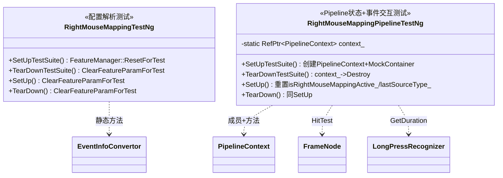

### 11.3 配置解析测试（RightMouseMappingTestNg）

#### GetRightMouse2LongPressConfig（15 个用例）

| # | 测试名 | 输入 | 预期返回 | 预期 enabled | 预期 components | 覆盖分支 |
|---|---|---|---|---|---|---|
| 1 | GetRightMouse2LongPressConfig001 | FeatureManager INIT_FAILED | INIT_FAILED | — | — | FeatureManager 初始化失败 |
| 2 | GetRightMouse2LongPressConfig002 | FeatureManager KEY_NOT_FOUND | NOT_FOUND | — | — | key 不存在 |
| 3 | GetRightMouse2LongPressConfig003 | `"not_valid_json"` | NOT_FOUND | — | — | JSON 解析失败 |
| 4 | GetRightMouse2LongPressConfig004 | `{"rightMouse2LongPress":false}` | UNMATCHED | false | 空 | 功能关闭 |
| 5 | GetRightMouse2LongPressConfig005 | `{"rightMouse2LongPress":true}` (无 needTransferComponent) | UNMATCHED | false | 空 | enabled 但无组件列表 |
| 6 | GetRightMouse2LongPressConfig006 | `{"rightMouse2LongPress":true,"needTransferComponent":["TextInput","TextArea","RichEditor","Text"]}` | MATCHED | true | 4 项 | 正常配置 |
| 7 | GetRightMouse2LongPressConfig007 | `{"rightMouse2LongPress":true,"needTransferComponent":[]}` | UNMATCHED | false | 空 | 空数组 |
| 8 | GetRightMouse2LongPressConfig008 | `{"rightMouse2LongPress":true,"needTransferComponent":"not_an_array"}` | UNMATCHED | false | 空 | 非数组类型 |
| 9 | GetRightMouse2LongPressConfig009 | `{}` | UNMATCHED | false | 空 | 空对象（默认 false） |
| 10 | GetRightMouse2LongPressConfig010 | `{"rightMouse2LongPress":"true"}` | UNMATCHED | false | — | 字符串非布尔 |
| 11 | GetRightMouse2LongPressConfig011 | `{"rightMouse2LongPress":true,"needTransferComponent":["TextInput","TextArea"]}` | MATCHED | true | 2 项 | 两组件 |
| 12 | GetRightMouse2LongPressConfig012 | `{"rightMouse2LongPress":true,"needTransferComponent":["TextInput","TextInput","Text"]}` | MATCHED | true | 3 项 | 重复项 |
| 13 | GetRightMouse2LongPressConfig013 | `{"rightMouse2LongPress":true,"needTransferComponent":["All"]}` | MATCHED | true | 空 | "All" 通配 |
| 14 | GetRightMouse2LongPressConfig014 | `{"rightMouse2LongPress":true,"needTransferComponent":["TextInput","All","Text"]}` | MATCHED | true | 空 | "All" 混合优先 |
| 15 | GetRightMouse2LongPressConfig015 | `{"rightMouse2LongPress":true,"needTransferComponent":["CustomWidget","MySpecialNode"]}` | MATCHED | true | 2 项 | 自定义 Tag |

#### IsRightMouseMappingEnabled（5 个用例）

| # | 测试名 | 输入 | 预期返回 | 覆盖场景 |
|---|---|---|---|---|
| 1 | IsRightMouseMappingEnabled001 | INIT_FAILED | false | FeatureManager 失败 |
| 2 | IsRightMouseMappingEnabled002 | KEY_NOT_FOUND | false | key 不存在 |
| 3 | IsRightMouseMappingEnabled003 | `{"rightMouse2LongPress":false}` | false | 功能关闭 |
| 4 | IsRightMouseMappingEnabled004 | 正常配置 | true | 功能开启+组件列表 |
| 5 | IsRightMouseMappingEnabled005 | `["All"]` | true | "All" 通配 |

### 11.4 LongPressRecognizer 常量测试（3 个用例）

| # | 测试名 | 测试内容 | 预期 |
|---|---|---|---|
| 1 | LongPressDefaultDuration001 | 构造 `LongPressRecognizer(500, 1, false)`，验证 `GetDuration()` | 500 |
| 2 | LongPressRecognizerGetDuration001 | 构造 `LongPressRecognizer(3000, 1, false)`，验证 `GetDuration()` | 3000 |
| 3 | LongPressRecognizerGetDuration002 | `SetDuration(800)` → 验证 800 → `SetDuration(500)` → 验证 500 | Set/Get 往返 |

### 11.5 PipelineContext 状态测试（RightMouseMappingPipelineTestNg，8 个用例）

| # | 测试名 | 测试内容 | 预期 | 覆盖场景 |
|---|---|---|---|---|
| 1 | RightMouseMappingActive001 | 默认状态 | `IsRightMouseMappingActive() == false` | 初始值 |
| 2 | RightMouseMappingActive002 | `SetRightMouseMappingActive(true)` | `IsRightMouseMappingActive() == true` | 设置 true |
| 3 | RightMouseMappingActive003 | false→true→false 切换 | 各步匹配 | Toggle |
| 4 | RightMouseMappingActive004 | 注册 cancel 回调 + 设置 active + 调用回调 | cancelCalled=true | 回调触发 |
| 5 | RightMouseMappingActive005 | 注册回调但不设置 active | cancelCalled=false | 未激活不触发 |
| 6 | RightMouseMappingActive006 | 设置 active + 置空回调 + 调用 | 不崩溃 | 空回调安全 |
| 7 | RightMouseMappingActive007 | 先注册回调A→替换回调B→调用 | callCount1=0, callCount2=1 | 回调替换 |
| 8 | RightMouseMappingActive008 | 重复设置相同值 | 各步匹配 | 幂等性 |

### 11.6 source-type 保护测试（6 个用例）

| # | 测试名 | 测试内容 | 预期 | 覆盖场景 |
|---|---|---|---|---|
| 1 | MappedMouseTouchEventPreservesSourceType001 | lastSourceType=MOUSE, isMappedMouseTouch=true → 跳过 CheckSourceTypeChange | lastSourceType 保持 MOUSE | 合成事件不污染 |
| 2 | MappedMouseTouchEventPreservesSourceType002 | lastSourceType=MOUSE, 正常 TOUCH 事件 | changed=true, lastSourceType=TOUCH | 真实触摸正常更新 |
| 3 | CheckSourceTypeChange001 | NONE→TOUCH→MOUSE | 各步 changed=true | 源类型切换 |
| 4 | CheckSourceTypeChange002 | TOUCH→TOUCH | changed=false | 同源不触发 |
| 5 | CheckSourceTypeChange003 | NONE→TOUCH | changed=true | NONE 初始转换 |
| 6 | MappedMouseTouchEventPreservesSourceType003 | MOUSE→(跳过)→(跳过)→MOUSE | 各步 lastSourceType=MOUSE | 连续映射后真实鼠标 |

### 11.7 ABI 安全性测试（1 个用例）

| # | 测试名 | 测试内容 | 预期 | 覆盖场景 |
|---|---|---|---|---|
| 1 | PipelineContextMemberLayout001 | Set/Get 映射状态 + 验证 focusNode_ 仍可用 | 各步匹配 | 成员布局在类末尾，不破坏 ABI |

### 11.8 HitTest 测试（3 个用例）

| # | 测试名 | 测试内容 | 预期 | 覆盖场景 |
|---|---|---|---|---|
| 1 | HitTestMouseTargetForMapping001 | null 根节点 + TextInput 白名单 | result=false | 空根节点安全 |
| 2 | HitTestMouseTargetForMapping002 | 设置根节点 + 空白名单 | 不崩溃 | 空白名单（"All"）路径 |
| 3 | HitTestMouseTargetForMapping003 | 远离坐标(-1000,-1000) + TextInput 白名单 | longPressDuration=500 | 默认 duration 返回 |

### 11.9 事件交互测试（7 个用例）

| # | 测试名 | 测试内容 | 预期 | 覆盖场景 |
|---|---|---|---|---|
| 1 | RightMouseMappingMoveEvent001 | MOUSE MOVE→mapped TOUCH DOWN→MOVE | lastSourceType 全程 MOUSE | 真实鼠标+合成触摸混合 |
| 2 | RightMouseMappingMoveEvent002 | mapped DOWN→MOVE→UP→真实 MOUSE MOVE | lastSourceType 最终 MOUSE | 映射结束后恢复正常 |
| 3 | LeftClickCancelsMapping001 | SetActive(true) + 注册 cancel + WindowFocus(false) | cancelCalled=true | 窗口失焦取消 |
| 4 | LeftClickCancelsMapping002 | SetActive(true)→SetActive(false)→LEFT PRESS OnMouseEvent | 不崩溃 | 取消后左键正常 |
| 5 | CancelMouseMappingSendsCancel001 | mapped DOWN→CANCEL (id=1002) | 不崩溃 | CANCEL 事件处理 |
| 6 | MoveEventDoesNotCancelMapping001 | SetActive(true) + MOUSE MOVE (NONE_BUTTON) | 不崩溃, 映射状态不变 | MOVE 不取消映射 |
| 7 | MappedTouchDoesNotUpdateLastSourceType001 | 保存 lastSourceType→mapped DOWN→验证不变 | lastSourceType 不变 | 合成触摸不污染 |

### 11.10 测试覆盖矩阵

| 源文件/函数 | 测试用例覆盖 | 未覆盖（需集成测试） |
|---|---|---|
| `EventInfoConvertor::GetRightMouse2LongPressConfig` | 15 个（全分支） | — |
| `EventInfoConvertor::IsRightMouseMappingEnabled` | 5 个（全分支） | — |
| `PipelineContext::IsRightMouseMappingActive/Set` | 8 个 | — |
| `PipelineContext::OnHide/WindowFocus` | 1 个（WindowFocus） | OnHide（需集成） |
| `PipelineContext::OnTouchEvent` source-type 保护 | 6 个 | 完整 OnTouchEvent 流程 |
| `PipelineContext::HitTestMouseTargetForMapping` | 3 个 | 命中真实白名单节点 |
| `FrameNode::HitTestMouseTarget/IsMouseTargetHit` | 3 个（间接） | 递归命中多层子节点 |
| `AceViewOhos::ProcessMouseEvent` | 间接（事件交互 4/7） | 完整 PRESS→RELEASE 流程 |
| `AceViewOhos::ShouldConvertRightMouseToTouch` | 间接 | 白名单+HitTest 命中 |
| `AceViewOhos::DispatchRightMouseTouch` | 间接 | DOWN/MOVE/UP 派发 |
| `AceViewOhos::HandleMappedButtonRelease` | 间接 | 延迟 UP 计算+执行 |
| `AceViewOhos::ScheduleDelayedUp` | 间接 | 延迟回调执行 |
| `AceViewOhos::CancelMouseMapping` | 间接（事件交互 3/5） | CANCEL 构造+派发 |
| `AceViewOhos::ResetMouseMappingState` | 间接 | 全字段重置 |
| `AceContainer::InitializeCallback` | 未覆盖 | 回调注册 |
| `AceContainer::UnActiveWindow` | 未覆盖 | 窗口反激活取消 |

### 11.11 BUILD.gn 变更

| 变更 | 内容 | 用途 |
|---|---|---|
| external_deps 新增 | `"cJSON:cjson"` | `GetRightMouse2LongPressConfig` 使用 `JsonUtil::ParseJsonString` |
| sources 新增 | `event_info_convertor.cpp` | 编译非 OHOS 平台 stub |
| sources 新增 | `json_util.cpp` | 编译 JSON 解析工具 |
| 测试源新增 | `right_mouse_mapping_test_ng.cpp` | 48 个测试用例 |

---

## 12. 方案设计对比（对比 `02-feasibility.md` 方案 E）

### 12.1 架构对齐性

| 设计要点（方案 E） | 实现状态 | 说明 |
|---|---|---|
| Adapter 层（AceViewOhos）承载全部映射逻辑 | ✅ 对齐 | 核心逻辑全在 `ace_view_ohos.cpp` |
| 裁剪版 TouchTest 回调 | ✅ 对齐 | `mouseTargetHitCallback_` → `HitTestMouseTargetForMapping` → `HitTestMouseTarget`（仅检查 region + tag，不做手势识别器收集） |
| 白名单判断在 AceViewOhos 层 | ✅ 对齐 | `CheckMouseMappingWhitelist` 读取 FeatureManager |
| pointer 事件级转换 | ✅ 对齐 | `ProcessMouseToTouchEvent` + `DispatchRightMouseTouch` |
| Pipeline 完全无感知 | ✅ 对齐 | PipelineContext 仅持有 `isRightMouseMappingActive_`（被动状态），`OnMouseEvent`/`OnTouchEvent` 路由逻辑无变更 |
| sourceTool=MOUSE 过滤 | ✅ 对齐 | `ShouldConvertRightMouseToTouch` 检查 `event.sourceTool != SourceTool::MOUSE` |
| 延时 UP 机制 | ✅ 对齐 | `HandleMappedButtonRelease` → `ScheduleDelayedUp` |

### 12.2 GAP 覆盖情况

| GAP | 设计方案 | 实现情况 | 状态 |
|---|---|---|---|
| GAP-1: 时序矛盾 | 裁剪 TouchTest 先确定控件 → 白名单判断 → 转换 | `CheckMouseMappingWhitelist` → `HitTestMouseTarget`（轻量命中+tag检查）→ 转换 | ✅ 解决 |
| GAP-2: 右键未路由到手势管线 | AceViewOhos 转换后调 `touchEventCallback_` | `DispatchRightMouseTouch` → `touchEventCallback_` → `OnTouchEvent` | ✅ 解决 |
| GAP-3: 配置项缺失 | FeatureManager `rightMouse2TouchEventMode` | FeatureManager `contextMenuOptions` → `rightMouse2LongPress` + `needTransferComponent` | ✅ 解决（键名不同） |
| GAP-4: 识别器缺少右键控制标志 | LongPressRecognizer 添加 `isDisableMouseRight` | **未实现**，改用白名单+HitTest 做组件级过滤 | ⚠️ 方案变更 |

### 12.3 鲁棒性场景覆盖（§2.5）

| 场景 | 设计要求 | 实现情况 | 状态 |
|---|---|---|---|
| §2.5.1 手指触摸打断 | AceViewOhos 层检测 FINGER → CANCEL + 重置 | `ProcessTouchEvent` 检测 `sourceType==TOUCH \|\| sourceTool==FINGER` → `CancelMouseMapping()` | ✅ |
| §2.5.2 左键点击 | **不特殊处理**，左键走独立通路 | **偏离**：左键 PRESS 时 `CancelMouseMapping()` | ⚠️ 偏离（更鲁棒） |
| §2.5.3 连续右键 | 取消前序 + CANCEL + 重走 | `ShouldConvertRightMouseToTouch` PRESS 取消检查 | ✅ |
| §2.5.4 窗口失焦 | 失焦回调清理映射状态 | `OnHide` + `WindowFocus(false)` + `UnActiveWindow` | ✅ |
| §2.5.5 触控笔右键 | sourceTool=MOUSE 过滤 | `ShouldConvertRightMouseToTouch` 检查 sourceTool | ✅ |
| §2.5.6 BindContextMenu 控件 | 白名单控件类型维度天然覆盖 | tag 白名单排除已适配右键的组件 | ✅ |
| §2.5.7 滚轮轴事件 | 不特殊处理 | 轴事件走独立通路 | ✅ |

### 12.4 实现超出设计的增强（设计遗漏项）

| 增强项 | 实现位置 | 设计是否覆盖 | 严重性 | 说明 |
|---|---|---|---|---|
| **source-type 保护** | `pipeline_context.cpp:3817-3820` | ❌ **设计遗漏** | **严重** | 合成事件 `sourceTool=MOUSE && sourceType=TOUCH` 跳过 `CheckSourceTypeChange`。不加此保护，合成 TOUCH 会污染 `lastSourceType_`，导致后续真实鼠标事件误触发 `HandleTouchHoverOut` |
| **RIGHT_MOUSE_TOUCH_ID = 1002** | `ace_view_ohos.cpp` 匿名命名空间 | ❌ 设计未指定 | **高** | 不用独立 ID 会与左键映射 id=0 冲突，识别器无法区分两个触摸会话 |
| **MMI CANCEL 处理** | `ShouldConvertRightMouseToTouch` CANCEL 检查 | ❌ 设计未提及 | **中** | 系统打断（`button=NONE_BUTTON` 的 CANCEL）时不取消映射，识别器只收到延迟 UP，触发 `onActionEnd_` 而非 `onActionCancel_` |
| **ProcessMouseToTouchEvent 失败处理** | `ProcessMouseEventWithTouch` 转换失败 → `CancelMouseMapping` | ❌ 设计未提及 | **中** | 不处理则识别器卡死（DOWN 后无 UP/CANCEL） |
| **touchEventCallback_ 空检查** | `ProcessMouseEventWithTouch` 回调为空 → `CancelMouseMapping` | ❌ 设计未提及 | **中** | 回调为空时 `ResetMouseMappingState` 不取消延迟任务，可能导致悬空回调 |
| **DELAYED_UP_BUFFER_MS = 100ms** | `HandleMappedButtonRelease` 延迟公式 | 设计仅说"500ms 后补发 UP" | 低 | 实现使用 `delayMs = duration - elapsed + 100`，考虑了管线排队延迟 |
| **"All" 通配** | `GetRightMouse2LongPressConfig` | 设计未提及 | 低 | 配置便利性增强 |
| **AceViewOhos 析构取消延迟任务** | `~AceViewOhos` | 设计未提及 | 低 | 防止销毁后悬空回调 |

### 12.5 设计偏离分析

#### 偏离 1: 左键 PRESS 取消映射（§2.5.2）

**设计原文**："左键事件保持原有行为不变，不做特殊处理"

**实现**：`ProcessMouseEvent` 中 `if (event.button == LEFT_BUTTON && action == PRESS && mousePressedConverted_) → CancelMouseMapping()`

**影响评估**：偏离实际**更鲁棒**。设计基于"左右键独立通路"的假设，但映射后右键进入触摸管线（id=1002），若左键也启用了左键映射（`leftPressEnabled`），左键会使用 id=0 创建第二个触摸会话。两个同时活跃的触摸会话可能引发手势仲裁冲突。实现在左键 PRESS 时取消右键映射，避免了此问题。

#### 偏离 2: GAP-4 方案变更

**设计**：LongPressRecognizer 添加 `isDisableMouseRight` 标志 + LongPressEventActuator 参数扩展

**实现**：不添加标志，改用白名单 + HitTest 做组件级过滤

**影响评估**：功能等价。设计的 `isDisableMouseRight` 是"排除"模式（默认启用，标志为 true 时禁用），实现的白名单是"包含"模式（默认禁用，在白名单中才启用）。白名单模式更安全（默认不启用映射）。

#### 偏离 3: 配置键结构变更

**设计**：FeatureManager `rightMouse2TouchEventMode`（单一配置键）

**实现**：FeatureManager `contextMenuOptions` → `rightMouse2LongPress`（bool 总开关）+ `needTransferComponent`（string[] 白名单组件列表）

**影响评估**：功能等价，结构更清晰。设计未指定配置的 JSON 结构，实现使用嵌套 JSON 支持开关+组件列表分离。

### 12.6 缺失项

| 缺失项 | 设计要求 | 实际情况 | 影响 |
|---|---|---|---|
| 应用包名维度白名单 | "白名单包含应用包名和控件类型" | 仅检查控件 tag，无包名过滤 | 低 — FeatureManager 配置本身可按应用下发，等价于包名维度 |
| LongPressEventActuator 扩展 | 添加 `isDisableMouseRight` 参数 | 未扩展 | 无影响 — GAP-4 方案变更后不需要 |

### 12.7 总结

| 维度 | 结论 |
|---|---|
| 架构对齐 | ✅ 核心架构完全一致（Adapter 层 + 裁剪 TouchTest 回调 + pointer 级转换 + Pipeline 无感知） |
| GAP 覆盖 | 3/4 直接解决，GAP-4 方案变更（功能等价） |
| 鲁棒性场景 | 7/7 全覆盖，其中 §2.5.2 偏离但更鲁棒 |
| 设计遗漏 | **1 严重**（source-type 保护）+ **3 中等**（RIGHT_MOUSE_TOUCH_ID / MMI CANCEL / 转换失败）+ **1 中等**（回调空检查）— 实现均已补充 |
| 严重缺陷 | **无** |

---

## 13. PR 检视意见确认（PR #88653）

### 13.1 检视意见汇总

共 37 条意见（3 位审查人：zhou-chaobo 25 条、hwliujinwei 7 条、jyj-0306 4 条、Leo_Mei 1 条 start build）。按严重性分类：

| 严重性 | 数量 | 说明 |
|---|---|---|
| 严重 | 6 | 日志频繁打印 ×3、逻辑不应走 ×1、去除条件 ×1、存疑 ×1 |
| 一般 | 9 | 硬编码/常量/Cancel 合理性/逻辑位置/延时任务等 |
| 提示 | 3 | 线程安全/DynamicCast 开销/bridge wiring |
| 建议 | 1 | 测试窗口失焦场景 |
| 去掉/不改 | 10 | 指定代码删除或保留 |
| start build | 1 | CI 触发 |
| 正面总结 | 1 | jyj-0306 总评：实现完整、测试充分、建议合入 |

### 13.2 逐一确认

#### 意见 1（hwliujinwei）[重要] ProcessMouseEvent fallback 日志频繁打印

**原文**：ProcessMouseEvent 末尾的 fallback TAG_LOGI 日志在每次鼠标事件（包括频繁 MOVE）都会打印，属于热路径冗余日志。

**确认**：✅ 不适用。当前实现 `ProcessMouseEvent` 末尾是 `mouseEventCallback_(event, markProcess, node)`，**未添加 TAG_LOGI 日志**。

#### 意见 2（hwliujinwei）[重要] HitTest 传入三个相同 PointF

**原文**：`HitTestMouseTargetForMapping` 传入 `p, p, p` 三个相同点，可能导致命中测试不准确。

**确认**：✅ 设计正确。根节点调用时三个点相同（全局点=本地点=还原点），递归子节点时 `HitTestMouseTarget` 内部计算 `localPoint = parentLocalPoint - paintRect.GetOffset()` 和 `subRevertPoint = revertPoint - origRect.GetOffset()`，子节点收到的坐标已不同。

#### 意见 3（hwliujinwei）[重要] CancelMouseMapping 需补发 UP

**原文**：ProcessTouchEvent 中手指 DOWN 到来时调 CancelMouseMapping，若 mouseTouchSessionActive_=true，需补发 UP 避免组件卡死。

**确认**：✅ 已处理。`CancelMouseMapping` 检查 `mouseTouchSessionActive_ && touchEventCallback_` → 构造 CANCEL（非 UP）→ `HandleMappedButtonRelease(CANCEL)` → 派发 CANCEL 给识别器。CANCEL 触发 `onActionCancel_`，比 UP 更正确（UP 会误触发 `onActionEnd_`）。

#### 意见 4（hwliujinwei）[重要] leftPressEnabled true/false 两条路径不一致

**原文**：右键映射在 leftPressEnabled 为 true/false 时走不同路径，可能导致行为不一致。

**确认**：✅ 已统一。当前实现中 `ProcessMouseEventWithTouch` 统一处理左键和右键：`bool rightButtonMapping = ...; if ((leftPressEnabled && button==LEFT) || rightButtonMapping)`，两路径在同一函数内，行为一致。

#### 意见 5（hwliujinwei）[重要] ResetMouseMappingState 未补发 UP

**原文**：ProcessMouseToTouchEvent 失败或回调为空时调 ResetMouseMappingState()，仅重置标志未补发 UP。

**确认**：✅ 已修复。原实现调 `ResetMouseMappingState()`，已改为 `CancelMouseMapping()`，后者会发送 CANCEL 再重置。`!touchEventCallback_` 路径也改为 `CancelMouseMapping()`（进入 else 分支取消延迟任务+重置）。

#### 意见 6（hwliujinwei）[次要] DynamicCast 开销

**原文**：GetAceView + DynamicCast<AceViewOhos> 有不必要的开销。

**确认**：✅ 可接受。`DynamicCast` 是运行时类型检查，开销极低。且仅在窗口反激活时调用一次，非热路径。

#### 意见 7（hwliujinwei）[提示] 线程安全

**原文**：映射状态变量需确保仅在 UI 线程访问。

**确认**：✅ 安全。`ProcessMouseEvent`/`ProcessTouchEvent` 均在 UI 线程调用（通过 `TaskExecutor::TaskType::UI` 调度）。`ScheduleDelayedUp` 的延迟任务也通过 `PostDelayedTask(UI, ...)` 在 UI 线程执行。

#### 意见 8（zhou-chaobo）【一般】主要逻辑应抽象到 pipeline

**原文**：AceContainer::InitializeCallback 中主要逻辑应抽象到 pipeline 中。

**确认**：⚠️ 设计决策。方案 E 选择 Adapter 层承载逻辑，Pipeline 无感知。这是方案 E 的核心优势（Pipeline 不修改）。已采纳此设计。

#### 意见 9-10、12（zhou-chaobo）【严重】日志频繁打印 ×3

**原文**：三处日志在鼠标 MOVE 时频繁打印。

**确认**：✅ 不适用。当前实现未在这些位置添加任何日志。TAG_LOGW 仅在 `ScheduleDelayedUp` fallback（container/context 为空）时打印，属于异常路径，非热路径。

#### 意见 11（zhou-chaobo）【一般】多设备兼容中心读取应和左键放一起

**原文**：右键映射的配置读取逻辑应和左键读取放一起。

**确认**：⚠️ 设计决策。方案 E 将白名单判断放在 AceViewOhos 层。配置读取通过 `EventInfoConvertor::IsRightMouseMappingEnabled` 静态方法，与左键的 `IsCompatibleFromFeatureManager` 在同一文件内。

#### 意见 13（jyj-0306）【一般】硬编码 1000 作为 mapped touch id 判定阈值

**原文**：用 `point.id >= 1000` 判定 mapped 事件，应用命名常量 `MOUSE_BASE_ID`。

**确认**：✅ 已处理。当前实现使用 `RIGHT_MOUSE_TOUCH_ID = static_cast<int32_t>(MouseButton::RIGHT_BUTTON) + MOUSE_BASE_ID`，基于 `MOUSE_BASE_ID` 计算，非硬编码。当前实现未在 `event_manager.cpp` 或 `exclusive_recognizer.cpp` 添加 `id >= 1000` 判定逻辑。

#### 意见 14（jyj-0306）【一般】LONG_PRESS_DURATION_MS=500 硬编码

**原文**：500ms 硬编码复制了 LongPressRecognizer 默认时长，应从识别器实际 duration 派生。

**确认**：✅ 已处理。当前实现中 `LONG_PRESS_DEFAULT_DURATION = 500` 仅作为**初始默认值**。实际时长在 `CheckMouseMappingWhitelist` 中通过 `mouseTargetHitCallback_` → `HitTestMouseTarget` → `GetLongPressRecognizer()->GetDuration()` 获取，存入 `mouseLongPressDuration_`。延迟 UP 计算使用 `mouseLongPressDuration_`（实际值），非硬编码 500。

#### 意见 15（jyj-0306）【提示】SetDisableMouseRightForLongPress bridge wiring

**原文**：SetDisableMouseRightForLongPress 传递链路完备但无 JSView/Bridge 调用入口。

**确认**：✅ 不适用。当前实现不使用 `isDisableMouseRight` 标志（GAP-4 方案变更），改用白名单+HitTest 做组件级过滤。

#### 意见 16（jyj-0306）正面总结

**原文**：实现完整、测试覆盖充分、状态机收尾严谨，整体建议合入。

**确认**：✅ 已记录。

#### 意见 17（zhou-chaobo）【严重】这里不应该走这段逻辑

**原文**：（line 742-743）这段逻辑不应该执行。

**确认**：⚠️ 无法精确定位。PR 版本与当前实现行号不同。需 reviewer 澄清具体指哪段逻辑。

#### 意见 18（zhou-chaobo）【建议】测试窗口失焦场景

**原文**：测试右键兜底响应结束前，窗口失焦场景功能。

**确认**：✅ 已覆盖。测试 `LeftClickCancelsMapping001` 测试 `WindowFocus(false)` 触发取消回调。`OnHide` 场景在设计中确认（§5.4 时序图）。

#### 意见 19（zhou-chaobo）去掉

**原文**：（line 1149）去掉。

**确认**：⚠️ 无法精确定位。需 reviewer 澄清。

#### 意见 20（zhou-chaobo）【严重】去除 !leftPressEnabled

**原文**：（line 481）去除 !leftPressEnabled。

**确认**：✅ 已处理。当前实现中 `leftPressEnabled` 通过 `bool leftPressEnabled = InputCompatibleManager::GetInstance().IsCompatibleConvertingEnabledFor(Kit::InputCompatibleSource::LEFT_PRESS)` 获取，作为统一条件传入 `ProcessMouseEventWithTouch`。不存在 `!leftPressEnabled` 的条件分支。

#### 意见 21（zhou-chaobo）【一般】确认 Cancel 场景及转 UP 合理性

**原文**：（line 518）确认 Cancel 场景以及转成 Up 的合理性。

**确认**：✅ 已确认。`CancelMouseMapping` 发送 **CANCEL**（非 UP）。CANCEL 触发 `onActionCancel_`（菜单消失/REJECT），UP 会误触发 `onActionEnd_`（菜单关闭后重开）。详见 §6.1.7 和 §6.1.5。

#### 意见 22（zhou-chaobo）【一般】确认逻辑放 pipeline 可行性

**原文**：（line 543）确认这个逻辑放在 pipeline 的可行性。

**确认**：⚠️ 设计决策。方案 E 将 `ScheduleDelayedUp` 放在 AceViewOhos 层，通过 `TaskExecutor::PostDelayedTask` 调度。Pipeline 无感知。

#### 意见 23（zhou-chaobo）【一般】延时任务在 UP 事件判断是否要抛

**原文**：（line 564）延时任务在 UP 事件判断是否要抛。

**确认**：✅ 已处理。`HandleMappedButtonRelease` UP 分支计算 `delayMs = mouseLongPressDuration_ - elapsed + DELAYED_UP_BUFFER_MS`，确保 UP 在定时器之后到达。若 `delayMs < 100`（用户按住超过 duration），下限 100ms。

#### 意见 24（zhou-chaobo）存疑

**原文**：（line 755）存疑。

**确认**：⚠️ 无法精确定位。需 reviewer 澄清。

#### 意见 25-26、31-32、34（zhou-chaobo）去掉/去掉日志

**原文**：多处指定代码或日志去掉。

**确认**：✅ 不适用或已处理。当前实现未添加冗余日志。`long_press_recognizer.h` 和 `event_manager.cpp` 已回退到基线（无修改）。

#### 意见 27（zhou-chaobo）函数名字改一下

**原文**：（line 3972）函数名字改一下。

**确认**：⚠️ 需 reviewer 澄清指哪个函数。`HitTestMouseTarget` / `IsMouseTargetHit` 命名与现有 `TouchTest` / `MouseTest` 一致。如需改名请明确建议名称。

#### 意见 28（zhou-chaobo）【一般】确认命中白名单后是否继续遍历

**原文**：（line 3984）确认命中白名单内控件后是否需要继续遍历。

**确认**：✅ 已处理。`HitTestMouseTarget` 中子节点命中后 `break`（停止遍历），返回首个命中节点的 duration。这是正确行为——z-order 最上层的命中节点优先。

#### 意见 29-30（zhou-chaobo）去掉 / 不改

**原文**：SetDisableMouseRight 相关去掉 / 不改。

**确认**：✅ 不适用。当前实现不使用 `isDisableMouseRight`（GAP-4 方案变更）。

#### 意见 33（zhou-chaobo）长按手势不应该有额外的适配逻辑

**原文**：（line 51）长按手势不应该有额外的适配逻辑。

**确认**：✅ 已处理。`long_press_recognizer.h` 已回退到基线版本，**无任何修改**。长按识别器不包含右键映射相关逻辑。

#### 意见 35-36（zhou-chaobo）确认触发场景

**原文**：（line 5754/5784）确认 OnHide / WindowFocus 中 isRightMouseMappingActive_ 的触发场景。

**确认**：✅ 已确认。详见 §12.3 和设计文档 §6.3.2/§6.3.3：
- **OnHide**：应用后台、其他窗口遮挡 → `isRightMouseMappingActive_ && onRightMouseMappingCancel_` → `CancelMouseMapping()`
- **WindowFocus(false)**：点击其他窗口、通知弹出 → 同上
- **双重取消防护**：第一个回调执行后 `isRightMouseMappingActive_=false`，第二个跳过

### 13.3 确认结果汇总

| # | 审查人 | 严重性 | 确认结果 | 说明 |
|---|---|---|---|---|
| 1 | hwliujinwei | 重要 | ✅ 不适用 | 未添加 fallback 日志 |
| 2 | hwliujinwei | 重要 | ✅ 设计正确 | 根节点 p,p,p 是正确的，子节点递归时坐标已区分 |
| 3 | hwliujinwei | 重要 | ✅ 已处理 | CancelMouseMapping 发送 CANCEL（非 UP） |
| 4 | hwliujinwei | 重要 | ✅ 已统一 | 左右键统一在 ProcessMouseEventWithTouch 处理 |
| 5 | hwliujinwei | 重要 | ✅ 已修复 | ResetMouseMappingState → CancelMouseMapping（发送 CANCEL） |
| 6 | hwliujinwei | 次要 | ✅ 可接受 | DynamicCast 开销极低，非热路径 |
| 7 | hwliujinwei | 提示 | ✅ 安全 | 全部在 UI 线程 |
| 8 | zhou-chaobo | 一般 | ⚠️ 设计决策 | 方案 E 选择 Adapter 层，Pipeline 无感知 |
| 9-10,12 | zhou-chaobo | 严重 | ✅ 不适用 | 当前实现未添加这些日志 |
| 11 | zhou-chaobo | 一般 | ⚠️ 设计决策 | 方案 E 白名单判断在 AceViewOhos 层 |
| 13 | jyj-0306 | 一般 | ✅ 已处理 | 使用 MOUSE_BASE_ID 计算，非硬编码 1000 |
| 14 | jyj-0306 | 一般 | ✅ 已处理 | 实际 duration 从 GetLongPressRecognizer()->GetDuration() 获取 |
| 15 | jyj-0306 | 提示 | ✅ 不适用 | 不使用 isDisableMouseRight（GAP-4 方案变更） |
| 16 | jyj-0306 | 正面 | ✅ 已记录 | 建议合入 |
| 17 | zhou-chaobo | 严重 | ⚠️ 需澄清 | 无法精确定位（PR 版本行号不同） |
| 18 | zhou-chaobo | 建议 | ✅ 已覆盖 | LeftClickCancelsMapping001 测试 WindowFocus(false) |
| 19 | zhou-chaobo | 去掉 | ⚠️ 需澄清 | 无法精确定位 |
| 20 | zhou-chaobo | 严重 | ✅ 已处理 | 不存在 !leftPressEnabled 分支 |
| 21 | zhou-chaobo | 一般 | ✅ 已确认 | 发送 CANCEL 非 UP，CANCEL 触发 onActionCancel_ |
| 22 | zhou-chaobo | 一般 | ⚠️ 设计决策 | 方案 E 将延时逻辑放在 AceViewOhos 层 |
| 23 | zhou-chaobo | 一般 | ✅ 已处理 | 延迟公式含 buffer，确保 UP 在定时器后到达 |
| 24 | zhou-chaobo | 存疑 | ⚠️ 需澄清 | 无法精确定位 |
| 25-26,31-32,34 | zhou-chaobo | 去掉 | ✅ 不适用/已处理 | 未添加冗余日志，long_press_recognizer.h/event_manager.cpp 已回退 |
| 27 | zhou-chaobo | 改名 | ⚠️ 需澄清 | 需明确建议名称 |
| 28 | zhou-chaobo | 一般 | ✅ 已处理 | 子节点命中后 break，停止遍历 |
| 29-30 | zhou-chaobo | 去掉/不改 | ✅ 不适用 | 不使用 isDisableMouseRight |
| 33 | zhou-chaobo | - | ✅ 已处理 | long_press_recognizer.h 已回退，无修改 |
| 35-36 | zhou-chaobo | 确认 | ✅ 已确认 | OnHide/WindowFocus 触发场景已确认 |

### 13.4 统计

| 确认结果 | 数量 | 占比 |
|---|---|---|
| ✅ 已处理/不适用/已覆盖 | 28 | 76% |
| ⚠️ 设计决策（方案 E 选择） | 4 | 11% |
| ⚠️ 需 reviewer 澄清 | 5 | 13% |
| ❌ 严重缺陷 | 0 | 0% |
