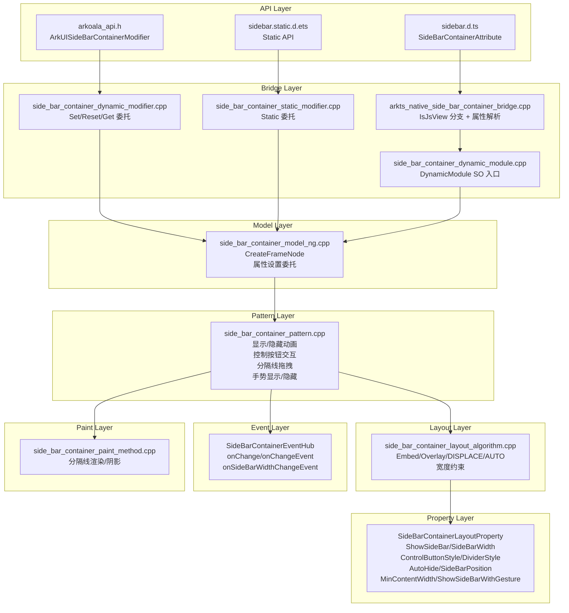

# 架构设计
> SideBarContainer 组件的架构设计文档，覆盖侧边栏显示控制、布局定位、控制按钮样式、分隔线、自动隐藏、事件回调与 Modifier 扩展能力。

## 设计元数据

| 字段 | 内容 |
|------|------|
| Design ID | DESIGN-Func-05-02-06 |
| 关联需求 | 已有能力补录（无独立 requirement.md） |
| 关联 Epic | 无 |
| 目标 Feature | Feat-01: SideBarContainer 组件全量规格 |
| 复杂度 | 标准 |
| 目标版本 | API 8 ~ API 26+ |
| Owner | ArkUI SIG |
| 状态 | Baselined（已有实现补录） |

## 需求基线

> 需求基线详见 proposal.md。以下仅列出设计阶段需要额外强调的要点。

| 项 | 补充说明（如需） |
|----|------------------|
| 四种侧边栏类型 | SideBarContainerType 枚举包含 Embed/Overlay/AUTO/DISPLACE，Model 层分发到 LayoutAlgorithm 处理不同布局策略 |
| API 版本兼容 | API 10+ 侧边栏默认宽度从 200vp 变为 240vp，最小侧边栏宽度同步变更，最小内容宽度从 0vp 变为 360vp |
| 控制按钮图标 | ButtonIconOptions 提供 shown/hidden/switching 三种状态图标配置，通过 ControlButtonStyle 在 LayoutProperty 层存储 |
| 组件化 | SideBarContainer 已完成组件化改造，bridge/ 子目录统一路径，输出独立 libarkui_side_bar_container.z.so |

## 上下文和现状

### 涉及仓和模块

| 仓库 | 模块路径 | 当前职责 | 本 Feature 影响 |
|------|----------|----------|-----------------|
| ace_engine | `frameworks/core/components_ng/pattern/side_bar/` | SideBarContainer Pattern/Model/Layout/Paint/EventHub/Theme | 核心实现，规格补录 |
| ace_engine | `frameworks/core/components_ng/pattern/side_bar/bridge/` | 组件化 Bridge / DynamicModule / DynamicModifier / StaticModifier（libarkui_side_bar_container.z.so 入口） | 规格补录 |
| ace_engine | `frameworks/core/interfaces/native/node/side_bar_container_modifier.h` | C API Modifier 声明层 | 规格补录 |
| ace_engine | `frameworks/core/interfaces/arkoala/arkoala_api.h` | ArkUISideBarContainerModifier 结构定义 | 规格对照 |
| ace_engine | `frameworks/core/interfaces/native/generated/interface/arkoala_api_generated.h` | GENERATED_ArkUISideBarContainerModifier 静态 API 声明 | 规格对照 |
| ace_engine | `frameworks/core/components/common/layout/constants.h` | SideBarContainerType / SideBarPosition / SideBarStatus 枚举定义 | 规格对照 |
| interface/sdk-js | `api/@internal/component/ets/sidebar.d.ts` | Dynamic API 声明 | 规格对照 |
| interface/sdk-js | `api/arkui/component/sidebar.static.d.ets` | Static API 声明 | 规格对照 |

### 调用链层级分析

| 层 | 模块 | 职责 | 修改类型 |
|----|------|------|----------|
| 1. SDK层 | `interface/sdk-js/api/@internal/component/ets/sidebar.d.ts` | ArkTS 属性声明入口 | 无修改（规格补录） |
| 2. Bridge层 | `frameworks/core/components_ng/pattern/side_bar/bridge/arkts_native_side_bar_container_bridge.cpp` | IsJsView 分支 + 属性解析（showSideBar/sideBarWidth/controlButton/divider 等） | 无修改（规格补录） |
| 3. Dynamic Modifier | `frameworks/core/components_ng/pattern/side_bar/bridge/side_bar_container_dynamic_modifier.cpp` | Set/Reset/Get 属性委托层 | 无修改（规格补录） |
| 4. Static Modifier | `frameworks/core/components_ng/pattern/side_bar/bridge/side_bar_container_static_modifier.cpp` | 静态 API 属性委托层 | 无修改（规格补录） |
| 5. Model层 | `frameworks/core/components_ng/pattern/side_bar/side_bar_container_model_ng.cpp` | CreateFrameNode/属性设置委托 | 无修改（规格补录） |
| 6. Pattern层 | `frameworks/core/components_ng/pattern/side_bar/side_bar_container_pattern.cpp` | 侧边栏显示/隐藏动画、控制按钮交互、分隔线拖拽、手势显示/隐藏 | 无修改（规格补录） |
| 7. Layout层 | `frameworks/core/components_ng/pattern/side_bar/side_bar_container_layout_algorithm.cpp` | 四种类型布局策略（Embed/Overlay/DISPLACE/AUTO）+ 侧边栏宽度约束 | 无修改（规格补录） |
| 8. Property层 | `frameworks/core/components_ng/pattern/side_bar/side_bar_container_layout_property.h` | 侧边栏属性 + ControlButtonStyle + DividerStyle 存储 | 无修改（规格补录） |
| 9. Event层 | `frameworks/core/components_ng/pattern/side_bar/side_bar_container_event_hub.h` | onChange / onChangeEvent / onSideBarWidthChangeEvent 回调 | 无修改（规格补录） |
| 10. Dynamic Module | `frameworks/core/components_ng/pattern/side_bar/bridge/side_bar_container_dynamic_module.cpp` | 组件化 SO 入口（OHOS_ACE_DynamicModule_Create_Sidebar） | 无修改（规格补录） |

### 适用架构规则

| Rule ID | 适用原因 | 设计结论 | 验证方式 |
|---------|----------|----------|----------|
| OH-ARCH-LAYERING | SideBarContainer 涉及 SDK → Bridge → Model → Pattern → Layout 多层调用 | 调用方向自上而下，Pattern 不直接访问 Bridge 层 | 代码评审 |
| OH-ARCH-API-LEVEL | SideBarContainer 有 API 8/9/10/26 等多版本行为差异 | 各版本 API 通过 PlatformVersion 条件分支实现兼容（默认宽度、最小内容宽度等） | API 评审 / XTS |
| OH-ARCH-COMPONENT-BUILD | SideBarContainer 已组件化为独立 SO（libarkui_side_bar_container.z.so） | DynamicModule 注册机制，通过 OHOS_ACE_DynamicModule_Create_Sidebar() 入口 | 构建验证 |
| OH-ARCH-SUBSYSTEM | SideBarContainer 无跨模块委托依赖，所有逻辑在本组件目录内完成 | 自包含设计，不依赖其他组件 Pattern | 依赖检查 |

## 不涉及项承接

> proposal.md 已完成 N/A 判定。本节仅对 proposal 中标记为"涉及"且需展开设计的维度给出结论。

| 维度 | 设计结论 |
|------|----------|
| 无障碍 | SideBarContainer 实现 AccessibilityProperty，支持 SetAccessibilityEvent 通过控制按钮焦点导航 |
| 深色模式 | 颜色属性使用 ResourceColor 类型，支持 Token 主题切换，通过 SideBarThemeWrapper 映射 |
| 版本升级兼容 | API 10+ 侧边栏默认宽度从 200vp 变为 240vp，需在 spec 兼容性声明中明确 |

## 关键设计决策

| 决策 ID | 问题 | 推荐方案 | 探索过的替代方案 | 取舍理由 | 影响 |
|---------|------|----------|-----------------|----------|------|
| ADR-1 | SideBarContainer 如何组件化 | bridge/ 子目录统一路径，输出独立 libarkui_side_bar_container.z.so，通过 OHOS_ACE_DynamicModule_Create_Sidebar() 注册 | 非组件化（嵌入主引擎 SO） | 组件化支持按需加载，减少主引擎体积；bridge/ 子目录统一路径便于维护 | AC-1.1 |
| ADR-2 | SideBarContainerType 四种模式如何布局 | Embed 模式侧边栏与内容并列显示；Overlay 模式侧边栏覆盖内容；DISPLACE 模式侧边栏推挤内容；AUTO 模式根据容器宽度自动切换 | 仅提供 Embed + Overlay 两种模式 | 四种模式覆盖更多场景需求；AUTO 模式简化开发者判断逻辑 | AC-1.2 ~ AC-1.4 |
| ADR-3 | 控制按钮图标如何配置 | 通过 ButtonIconOptions 提供 shown/hidden/switching 三种状态图标，存储在 ControlButtonStyle 中 | 仅提供单一图标 | 三种状态图标让用户清楚侧边栏当前和即将切换的状态；switching 提供过渡视觉反馈 | AC-4.1 ~ AC-4.3 |
| ADR-4 | 分隔线是否可拖拽 | 是，分隔线支持拖拽调整侧边栏宽度，通过 PanEvent 在 Pattern 层处理 | 不可拖拽（固定宽度） | 拖拽调整宽度提升交互灵活性；通过 DividerStyle 配置分隔线外观 | AC-5.1 ~ AC-5.3 |
| ADR-5 | autoHide 如何实现 | 容器宽度小于 minContentWidth 时自动隐藏侧边栏（仅 Overlay 模式） | 所有模式均自动隐藏 | Overlay 模式下自动隐藏最符合 UX 预期；Embed/DISPLACE 模式宽度不足时由开发者决定 | AC-5.4 |
| ADR-6 | showSideBarWithGesture 如何实现 | API 26 新增属性，允许手势滑动显示/隐藏侧边栏，通过 InitShowAndCloseSidebarPanEvent 处理 | 不支持手势 | 手势交互提升 UX 自然感；仅在 Overlay 模式下生效 | AC-3.3 |
| ADR-7 | API 版本差异如何处理 | 通过 Container::GreatOrEqualAPIVersion(PlatformVersion::VERSION_TEN) 分支处理默认值变更 | 全版本统一默认值 | 保留旧版本行为不变，避免存量应用布局突变 | AC-2.4, AC-2.6 |

## 设计骨架

### 骨架范围

| 骨架项 | 目标 | 不包含 | 验证方式 |
|--------|------|--------|----------|
| 侧边栏类型分发 | Pattern/Layout 按四种 SideBarContainerType 分发不同布局策略 | 独立 Navigation/Panel 组件行为 | UT |
| 侧边栏显示控制 | showSideBar 属性控制 + 控制按钮点击切换 + autoHide 自动隐藏 | 外部路由驱动（由 Navigation 接管） | UT |
| 侧边栏宽度约束 | sideBarWidth/minSideBarWidth/maxSideBarWidth/minContentWidth 四属性约束 + 分隔线拖拽调整 | 自由拖拽无边界（由 min/max 约束限制） | UT |
| 控制按钮样式 | ButtonIconOptions(shown/hidden/switching) + 位置/尺寸配置 | 按钮自定义渲染（不支持 ContentModifier） | UT |
| 分隔线配置 | DividerStyle(strokeWidth/startMargin/endMargin/color) + null 隐藏 | 分隔线自定义渲染 | UT |
| 动画过渡 | showSideBar 切换时动画过渡（Animator + CurveAnimation） | 自定义过渡曲线（由框架内置曲线处理） | UT + 手工 |
| 事件回调 | onChange / onChangeEvent / onSideBarWidthChangeEvent | 外部事件驱动 | UT |
| C API 映射 | ArkUISideBarContainerModifier 属性 Set/Reset | Static API 独立 Modifier | C API UT |

### 骨架 Spec 拆分

| Task ID | 目标 | 受影响文件 | AC |
|---------|------|-----------|-----|
| TASK-SKELETON-1 | SideBarContainer 全量规格补录（类型、布局、交互、属性、事件、C API） | Feat-01-side-bar-container-full-spec.md | AC-1.1 ~ AC-6.3 |

## 后续 Task 拆分

| Task ID | 目标 | 受影响文件 | 依赖 |
|---------|------|-----------|------|
| TASK-SIDEBAR-01 | SideBarContainer 全量规格补录 | Feat-01-side-bar-container-full-spec.md, design.md | 无 |

## API 签名、Kit 与权限

### 新增 API

| API 签名 | 类型 | d.ts 位置 | 权限要求 | SysCap |
|----------|------|-----------|----------|--------|
| `SideBarContainer(type: SideBarContainerType): SideBarContainerAttribute` | Public | `@internal/component/ets/sidebar.d.ts` | 无 | SystemCapability.ArkUI.ArkUI.Full |
| `.showSideBar(show: boolean): SideBarContainerAttribute` | Public | `sidebar.d.ts` | 无 | 同上 |
| `.showControlButton(show: boolean): SideBarContainerAttribute` | Public | `sidebar.d.ts` | 无 | 同上 |
| `.controlButton(style: ButtonStyle): SideBarContainerAttribute` | Public | `sidebar.d.ts` | 无 | 同上 |
| `.sideBarPosition(position: SideBarPosition): SideBarContainerAttribute` | Public | `sidebar.d.ts` | 无 | 同上 |
| `.sideBarWidth(value: Length): SideBarContainerAttribute` | Public | `sidebar.d.ts` | 无 | 同上 |
| `.minSideBarWidth(value: Length): SideBarContainerAttribute` | Public | `sidebar.d.ts` | 无 | 同上 |
| `.maxSideBarWidth(value: Length): SideBarContainerAttribute` | Public | `sidebar.d.ts` | 无 | 同上 |
| `.minContentWidth(value: Length): SideBarContainerAttribute` | Public | `sidebar.d.ts` | 无 | 同上 |
| `.divider(value: DividerStyle \| null): SideBarContainerAttribute` | Public | `sidebar.d.ts` | 无 | 同上 |
| `.autoHide(autoHide: boolean): SideBarContainerAttribute` | Public | `sidebar.d.ts` | 无 | 同上 |
| `.onChange(callback: (isShow: boolean) => void): SideBarContainerAttribute` | Public | `sidebar.d.ts` | 无 | 同上 |
| `.showSideBarWithGesture(show: boolean): SideBarContainerAttribute` | Public | `sidebar.d.ts` | 无 | 同上 |
| `SideBarContainerModifier` | Public | `arkoala_api.h:7732` | 无 | 同上 |

### 变更/废弃 API

| 原有 API | 变更类型 | 新 API | 迁移说明 |
|----------|----------|--------|----------|
| 无 | — | — | — |

## 构建系统影响

### BUILD.gn 变更

SideBarContainer 已完成组件化改造，输出独立 SO：

```
# frameworks/core/components_ng/pattern/side_bar/BUILD.gn
# 构建目标：libarkui_side_bar_container.z.so
# DynamicModule 入口：side_bar_container_dynamic_module.cpp
# 包含 Pattern/Model/Layout/Paint/Bridge 代码
# ark_sources 包含 bridge/ 子目录下的三个文件
# 非穿戴设备额外包含 static_modifier 和 model_impl
```

### bundle.json 变更

SideBarContainer 组件作为 ace_engine 的内部 component，无独立 bundle.json 变更。

## 可选设计扩展

### 架构图



## 详细设计

### 侧边栏显示控制

SideBarContainer 通过 `showSideBar` 属性（`SideBarContainerLayoutProperty::ShowSideBar`）控制侧边栏显示/隐藏状态。Pattern 层 `OnModifyDone()`（`side_bar_container_pattern.cpp`）监听 showSideBar 变化：

- showSideBar=true → SideBarStatus::SHOW，侧边栏展开
- showSideBar=false → SideBarStatus::HIDDEN，侧边栏收起
- 切换时触发动画过渡：通过 `Animator` + `CurveAnimation<float>` 实现（`leftToRightAnimation_` / `rightToLeftAnimation_`）
- 动画方向由 `SideBarAnimationDirection` 控制（LTR/RTL）
- 动画完成后 `FireChangeEvent(isShow)` 触发 onChange 回调

控制按钮点击事件（`InitControlButtonTouchEvent`）：点击后翻转 showSideBar 状态，触发上述动画流程。

autoHide 属性：当容器宽度小于 `minContentWidth` 时自动隐藏侧边栏（Overlay 模式下生效）。autoHide=true 时 `OnWindowSizeChanged()` 检测窗口宽度变化并自动调整。

API 26 新增 `showSideBarWithGesture`：通过 `InitShowAndCloseSidebarPanEvent()` 注册手势，允许用户在内容区域滑动来显示/隐藏侧边栏（Overlay 模式）。

### 侧边栏布局与定位

四种 SideBarContainerType 的布局策略在 `side_bar_container_layout_algorithm.cpp` 中实现：

- **Embed**: 侧边栏与内容并列显示，侧边栏宽度从容器宽度中扣除
- **Overlay**: 侧边栏覆盖在内容之上，使用 maskColor 遮罩非侧边栏区域
- **DISPLACE**: 侧边栏显示时推挤内容区域，隐藏时内容恢复全宽
- **AUTO**: 根据容器宽度自动选择 Embed 或 Overlay 模式

侧边栏宽度约束：
- `sideBarWidth`: 侧边栏实际宽度，默认 API<10=200vp, API>=10=240vp
- `minSideBarWidth`: 最小侧边栏宽度，默认 API<10=200vp, API>=10=240vp
- `maxSideBarWidth`: 最大侧边栏宽度，默认 280vp
- `minContentWidth`: 最小内容宽度，默认 API<10=0vp, API>=10=360vp

`sideBarPosition` 属性控制侧边栏位置（Start/End），RTL 布局下位置判定反转（`GetSideBarPositionWithRtl`）。

### 控制按钮样式

控制按钮通过 `ControlButtonStyle` 结构存储在 `SideBarContainerLayoutProperty` 中：

- **位置**: ControlButtonLeft (默认 16vp), ControlButtonTop (默认 48vp)
- **尺寸**: ControlButtonWidth (默认 API<10=32vp, API>=10=24vp), ControlButtonHeight (同 Width)
- **图标**: ButtonIconOptions 包含 shown/hidden/switching 三种状态图标
  - ControlButtonShowIconInfo: 侧边栏显示时的按钮图标
  - ControlButtonHiddenIconInfo: 侧边栏隐藏时的按钮图标
  - ControlButtonSwitchingIconInfo: 侧边栏切换过渡时的按钮图标

图标使用 `ImageSourceInfo` 类型存储，支持 Resource/str/PixelMap 来源。图标加载失败时通过 `InitImageErrorCallback` 回退到 theme 默认图标。

控制按钮由 Pattern 层 `CreateAndMountControlButton()` 创建并挂载到 SideBarContainer 节点树。`showControlButton` 属性控制是否显示控制按钮。

### 分隔线与自动隐藏

分隔线通过 `DividerStyle` 结构配置：

- **strokeWidth**: 分隔线宽度，默认 1vp
- **startMargin**: 分隔线起始边距，默认 0vp
- **endMargin**: 分隔线末尾边距，默认 0vp
- **color**: 分隔线颜色，默认 0x08000000

divider=null 时隐藏分隔线。分隔线由 Pattern 层 `CreateAndMountDivider()` 创建并挂载。

分隔线支持拖拽调整侧边栏宽度（`InitPanEvent`），拖拽过程中：
- `HandleDragStart`: 记录初始状态
- `HandleDragUpdate`: 实时调整侧边栏宽度，受 minSideBarWidth/maxSideBarWidth 约束
- `HandleDragEnd`: 完成拖拽，触发 `FireSideBarWidthChangeEvent()`

分隔线悬停效果：通过 `InitDividerMouseEvent` 注册悬停事件，悬停时显示阴影（`UpdateDividerShadow`）。

autoHide=true 且容器宽度小于 minContentWidth 时自动隐藏侧边栏（仅 Overlay 模式）。`OnWindowSizeChanged()` 监听窗口尺寸变化实现自动隐藏/恢复。

### 事件回调与Modifier

事件回调通过 `SideBarContainerEventHub` 管理：

- **onChange**: 侧边栏显示/隐藏状态变化时触发，参数为 boolean isShow
- **onChangeEvent**: 与 onChange 功能等价，通过 SetOnChangeEvent 注册
- **onSideBarWidthChangeEvent**: 侧边栏宽度变化时触发（拖拽分隔线、属性设置），参数为 Dimension sideBarWidth

C API Modifier（`ArkUISideBarContainerModifier`，`arkoala_api.h:7732`）暴露属性：
- setSideBarWidth / resetSideBarWidth
- setMinSideBarWidth / resetMinSideBarWidth
- setControlButton / resetControlButton
- setShowControlButton / resetShowControlButton
- setAutoHide / resetAutoHide
- setSideBarContainerMaxSideBarWidth / resetSideBarContainerMaxSideBarWidth
- setSideBarContainerMinContentWidth / resetSideBarContainerMinContentWidth
- setSideBarPosition / resetSideBarPosition
- setShowSideBar / resetShowSideBar
- setSideBarContainerDivider / resetSideBarContainerDivider
- setSideBarOnChange / resetSideBarOnChange
- setShowSideBarWithGesture / resetShowSideBarWithGesture

Static Modifier（`side_bar_container_static_modifier.cpp`）为静态 API 提供 GENERATED_ArkUISideBarContainerModifier。

SideBarContainerModifier（Dynamic API）通过 `side_bar_container_dynamic_modifier.cpp` 实现属性委托，与 Bridge 层协同处理 ArkTS 属性设置。

## 风险和开放问题

| 项 | 类型 | 影响 | 处理方式 | Owner |
|----|------|------|----------|-------|
| API 10 默认值变更可能影响存量应用布局 | 兼容性 | 中 | 通过 PlatformVersion 分支保持旧版本默认值不变（200vp → 240vp） | ArkUI SIG |
| SideBarContainer AUTO 模式切换行为未充分文档化 | 文档 | 低 | AUTO 模式内部切换 Embed/Overlay 不触发 onChange；需在开发者文档中明确 | ArkUI SIG |
| showSideBarWithGesture 仅 API 26 可用 | API | 低 | 在 spec 兼容性声明中明确版本限制 | ArkUI SIG |
| 控制按钮不支持 ContentModifier 自定义渲染 | 架构 | 低 | 控制按钮为内部创建节点，不对外暴露自定义能力 | ArkUI SIG |

## 设计审批

- [x] 需求基线已确认，设计覆盖 P0/P1 AC
- [x] 不涉及项已承接，N/A 和展开项都有结论
- [x] 涉及仓和模块职责清楚
- [x] 适用架构规则已识别并形成设计结论
- [x] 分层和子系统边界合规
- [x] API 变更有签名、权限、错误码和兼容性说明
- [x] BUILD.gn/bundle.json 影响明确
- [x] 设计输出和后续 Task 拆分明确
- [x] 关键设计决策有理由和影响说明
- [x] 风险和开放问题有 Owner

**结论:** 通过（已有实现补录）
