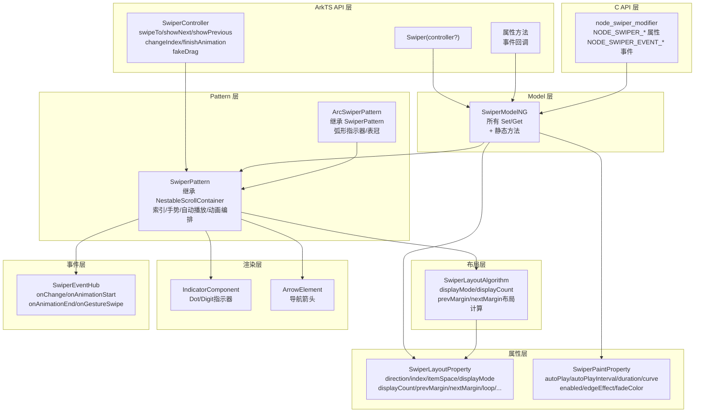

# 架构设计

> Swiper 轮播容器组件功能域的架构设计文档，补录已有实现。

## 设计元数据

| 字段 | 内容 |
|------|------|
| Design ID | DESIGN-Func-05-03-08 |
| 关联需求 | 已有能力补录（无独立 requirement.md） |
| 关联 Epic | 无 |
| 目标 Feature | Feat-01 创建与布局属性, Feat-02 自动播放与指示器, Feat-03 动画与过渡, Feat-04 交互与控制器, Feat-05 事件回调, Feat-06 C API 全量规格 |
| 复杂度 | 复杂 |
| 目标版本 | API 7 起支持 |
| Owner | ArkUI SIG |
| 状态 | Baselined（已有实现补录） |

## 需求基线

| 项 | 补充说明 |
|----|----------|
| 核心目标 | 提供 Swiper 轮播容器组件，支持自动播放、手势滑动、指示器（DotIndicator/DigitIndicator）、箭头导航、循环、自定义过渡动画、ArcSwiper 弧形轮播、C API 等，覆盖轮播容器全场景 |
| ArcSwiper 补充 | 穿戴设备专用形态，ArcSwiperPattern 继承 SwiperPattern，增加弧形指示器和旋转表冠交互 |

## 上下文和现状

### 涉及仓和模块

| 仓库 | 模块/路径 | 当前职责 | 本 Feature 影响 |
|------|-----------|----------|-----------------|
| ace_engine | `frameworks/core/components_ng/pattern/swiper/swiper_pattern.h/.cpp` | SwiperPattern 主逻辑，继承 NestableScrollContainer，管理当前索引、手势、自动播放、动画、过渡等 | 核心调度层 |
| ace_engine | `frameworks/core/components_ng/pattern/swiper/arc_swiper_pattern.h/.cpp` | ArcSwiperPattern 继承 SwiperPattern，增加弧形指示器和旋转表冠支持 | Feat-02/04 |
| ace_engine | `frameworks/core/components_ng/pattern/swiper/swiper_layout_property.h/.cpp` | 布局属性：direction, index, itemSpace, displayMode, displayCount, minSize, prevMargin, nextMargin, loop, disableSwipe, swipeByGroup, cachedCount, fillType 等 | Feat-01 |
| ace_engine | `frameworks/core/components_ng/pattern/swiper/swiper_paint_property.h/.cpp` | 渲染属性：autoPlay, autoPlayInterval, duration, curve, enabled, edgeEffect, fadeColor | Feat-02/03 |
| ace_engine | `frameworks/core/components_ng/pattern/swiper/swiper_event_hub.h` | 事件回调：onChange, onAnimationStart, onAnimationEnd, onGestureSwipe 等 | Feat-05 |
| ace_engine | `frameworks/core/components_ng/pattern/swiper/swiper_model.h` | SwiperModel 抽象接口，定义所有属性和事件的 Set/Get 方法 | API 层抽象 |
| ace_engine | `frameworks/core/components_ng/pattern/swiper/swiper_model_ng.h/.cpp` | SwiperModelNG 实现，所有属性的 Set/Get 方法，含静态方法供 C API 调用 | API 层实现 |
| ace_engine | `frameworks/bridge/declarative_frontend/jsview/js_swiper.h/.cpp` | JSView 层，解析 ArkTS Swiper() 构造参数及属性方法，调用 SwiperModel | 桥接层 |
| ace_engine | `frameworks/bridge/declarative_frontend/engine/jsi/nativeModule/arkts_native_swiper_bridge.h/.cpp` | ArkTS Bridge 层，Swiper 属性的 Set/Reset 方法 | 桥接层 |
| ace_engine | `frameworks/core/interfaces/native/node/node_swiper_modifier.h/.cpp` | C API Modifier 层，ARKUI_NODE_SWIPER 的属性设置与事件绑定 | Feat-06 |
| ace_engine | `interfaces/native/native_node.h` | C API 公开接口，NODE_SWIPER_* 属性与事件枚举定义 | Feat-06 |
| ace_engine | `frameworks/core/components_ng/pattern/swiper/swiper_layout_algorithm.h/.cpp` | 布局算法，根据 displayMode/displayCount/prevMargin/nextMargin 计算子项尺寸和偏移 | Feat-01 |
| ace_engine | `frameworks/core/components_ng/pattern/swiper/swiper_constants.h` | SwiperDisplayMode/SwiperIndicatorType/SwiperArcDirection 枚举定义 | Feat-01/02 |
| ace_engine | `frameworks/core/components/swiper/swiper_controller.h/.cpp` | SwiperController 控制器，提供 swipeTo/showNext/showPrevious/changeIndex/finishAnimation/fakeDrag 等方法 | Feat-04 |

### 调用链层级分析

| 层 | 模块 | 职责 | 修改类型 |
|----|------|------|----------|
| 1. SDK层 (.d.ts) | `interfaces/sdk/arkui/arkui-ts/arkui.d.ts` | Swiper 组件 TS 类型声明，属性方法签名与枚举定义 | 存量分析 |
| 2. JSView层 | `bridge/declarative_frontend/jsview/js_swiper.cpp` | 解析 ArkTS Swiper() 构造参数及属性方法，参数类型校验与枚举映射 | 存量分析 |
| 3. Bridge层 | `bridge/declarative_frontend/engine/jsi/nativeModule/arkts_native_swiper_bridge.cpp` | ArkTS → C++ 桥接层，将 JSI 值转换为 C++ 类型后调用 SwiperModelNG | 存量分析 |
| 4. node_modifier层 | `core/interfaces/native/node/node_swiper_modifier.cpp` | C API 属性设置实现，调用 SwiperModelNG 静态方法 | 存量分析 |
| 5. Model层 | `core/components_ng/pattern/swiper/swiper_model_ng.cpp` | 属性设置统一入口：Set/Get 方法写入 LayoutProperty、PaintProperty 或 Pattern 成员 | 存量分析 |
| 6. Pattern层 | `core/components_ng/pattern/swiper/swiper_pattern.cpp` | 核心编排（~1632 行）：索引管理、手势处理、自动播放定时器、动画驱动、过渡编排、事件触发 | 存量分析 |
| 7. Layout层 | `core/components_ng/pattern/swiper/swiper_layout_algorithm.cpp` | 布局计算：根据 displayMode/displayCount/prevMargin/nextMargin/itemSpace 计算子项尺寸和偏移 | 存量分析 |
| 8. Paint层 | `core/components_ng/pattern/swiper/swiper_paint_method.cpp` | 绘制方法，负责指示器绘制和箭头绘制 | 存量分析 |
| 9. Event层 | `core/components_ng/pattern/swiper/swiper_event_hub.h` + `swiper_change_event.h` | 事件回调：onChange/onAnimationStart/onAnimationEnd/onGestureSwipe/onContentDidScroll/onSelected/onScrollStateChanged 等 | 存量分析 |
| 10. C API层 | `interfaces/native/native_node.h` + `node_swiper_modifier.cpp` | C API 公开接口：NODE_SWIPER_* 属性枚举和事件枚举，ArkUI_AttributeItem 参数传递 | 存量分析 |

### 适用架构规则

| Rule ID | 适用原因 | 设计结论 | 验证方式 |
|---------|----------|----------|----------|
| OH-ARCH-LAYERING | Swiper 涉及 API 层 → Layout Property → Layout Algorithm → Paint | 单向调用，无反向依赖 | 代码评审 |
| OH-ARCH-API-LEVEL | 部分 API 在 API 9/10/11/12 有增强 | 各属性标注 @since 版本 | API 评审/XTS |
| OH-ARCH-COMPONENT-BUILD | Swiper 未组件化，属于 ace_core_ng | 无需新增 target | 构建验证 |
| OH-ARCH-NO-COMPONENT | Swiper 未组件化，JSView + Bridge 双路径共存 | ADR-1 已记录 | 代码评审 |

## 不涉及项承接

| 维度 | 设计结论 |
|------|----------|
| 性能 | 是 — 展开：cachedCount 预加载、LazyForEach 懒加载已在 Pattern 层实现 |
| 安全与权限 | N/A |
| 兼容性 | 是 — 展开：displayCount 与 SwiperAutoFill 的交互规则需标注；loop 在子项 <=1 时强制 false |
| IPC/跨进程 | N/A |

## 关键设计决策

| 决策 ID | 问题 | 推荐方案 | 探索过的替代方案 | 取舍理由 | 影响 |
|---------|------|----------|-----------------|----------|------|
| ADR-1 | Swiper 未组件化 — JSView + Bridge 双路径 | 保持 JSView 层 (`js_swiper.cpp`) + Bridge 层 (`arkts_native_swiper_bridge.cpp`) 双路径共存 | 方案A：组件化改造（拆分独立库）；方案B：仅保留 Bridge 路径 | Swiper 与滚动容器框架深度耦合（NestableScrollContainer），组件化改造时机未成熟 | JSView + Bridge 双路径需维护 |
| ADR-2 | C API 双通道 — ArkTS Bridge + C API node_modifier 共存 | ArkTS 动态版走 Bridge → ModelNG；C API 走 node_modifier → ModelNG 静态方法 | 方案A：统一只走 Bridge；方案B：统一只走 Modifier | 两条路径服务于不同范式（ArkTS 动态版 vs NDK），最终都汇聚到 ModelNG 层 | node_swiper_modifier.cpp 与 arkts_native_swiper_bridge.cpp 需保持一致 |
| ADR-3 | 指示器体系 — DotIndicator/DigitIndicator/IndicatorComponent 三种指示器 | SwiperIndicatorType 枚举三种：DOT(0)、DIGIT(1)、ARC_DOT(2)；DOT/DIGIT 由 IndicatorComponent 绘制，ARC_DOT 由 ArcSwiperPattern 绘制 | 方案A：统一一种指示器；方案B：外部自定义指示器（bindIndicator） | 三种指示器覆盖手机/平板/穿戴场景，ARC_DOT 为穿戴专用 | `swiper_constants.h`, `indicator_component.cpp`, `arc_swiper_pattern.cpp` |
| ADR-4 | ArcSwiper 弧形轮播 — 穿戴设备专用形态 | ArcSwiperPattern 继承 SwiperPattern，重写 GetArcDotIndicatorStyle() 等虚方法，增加 SUPPORT_DIGITAL_CROWN 表冠交互 | 方案A：独立组件；方案B：Swiper 内通过属性切换弧形模式 | 继承方式可复用 Swiper 核心逻辑（手势、索引管理等），仅扩展弧形指示器和表冠 | `arc_swiper_pattern.h/.cpp` |
| ADR-F2-1 | 指示器样式替代 — indicatorStyle 废弃迁移 | DotIndicator/DigitIndicator 对象型属性替代废弃的 indicatorStyle，保证向后兼容 | 方案A：保留 indicatorStyle 不废弃；方案B：强制迁移 | indicatorStyle 保留但标记废弃，新老 API 并行过渡，降低迁移成本 | `swiper_model_ng.cpp` |
| ADR-F3-1 | 自定义过渡代理生命周期 — SwiperContentTransitionProxy | SwiperContentTransitionProxy 由 Pattern 创建并在过渡过程中传递，timeout 超时自动 finish | 方案A：开发者自行管理 Proxy 生命周期；方案B：Pattern 自动管理 | Pattern 自动管理更安全，避免 Proxy 泄漏；timeout 兜底防止动画卡死 | `swiper_content_transition_proxy.h/.cpp` |
| ADR-F4-1 | FakeDrag 与手势互斥 — 状态机守卫 | FakeDrag 进行中时手势拖拽被禁止，手势进行中时 startFakeDrag 返回 false，通过 isFakeDragging_ 状态守卫 | 方案A：允许 FakeDrag 与手势共存；方案B：严格互斥 | 互斥保证状态一致性，避免并发拖拽冲突 | `swiper_controller.h:257-306` |
| ADR-F5-1 | 事件回调触发时机 — 动画驱动 vs 手势驱动 | onChange 在动画完成时触发（非手势开始时）；onAnimationStart/onAnimationEnd 覆盖代码翻页和手势翻页 | 方案A：onChange 在手势开始时触发；方案B：onChange 在动画完成时触发 | 动画完成触发更符合"切换完成"语义，避免中间状态回调 | `swiper_pattern.cpp` |
| ADR-F6-1 | C API 对象生命周期 — Create/Dispose/Destroy 模式 | OH_ArkUI_SwiperIndicator/DigitIndicator/ArrowStyle 对象需手动 Create 和 Dispose/Destroy，与 ArkUI_AttributeItem 配合使用 | 方案A：自动管理对象生命周期（引用计数）；方案B：手动 Create/Dispose | 手动管理更清晰，与 C API 通用模式一致，避免引用计数复杂度 | `native_type.h:2368-2986` |

## 设计骨架

### 骨架范围

| 骨架项 | 目标 | 不包含 | 验证方式 |
|--------|------|--------|----------|
| 属性两层存储 | LayoutProperty / PaintProperty / Pattern 成员三层分离 | 各属性内部实现细节 | 代码审查 |
| displayMode/displayCount 布局算法 | STRETCH/AUTO_LINEAR + displayCount/prevMargin/nextMargin 组合布局计算 | 自定义过渡动画 | 单元测试 |
| 指示器体系 | Dot/Digit/ARC_DOT 三种指示器创建与绘制 | 指示器样式细节 | 单元测试 |
| 事件触发时序 | onChange/onAnimationStart/onAnimationEnd/onGestureSwipe 等回调触发时序 | 回调内部实现 | 代码审查 |

### 静架 Spec 拆分

| Task ID | 目标 | 受影响文件 | AC |
|---------|------|-----------|-----|
| TASK-SKELETON-1 | 基础布局计算验证 | `swiper_layout_algorithm.cpp` | Feat-01 AC |
| TASK-SKELETON-2 | 自动播放与指示器验证 | `swiper_pattern.cpp`, `indicator_component.cpp` | Feat-02 AC |
| TASK-SKELETON-3 | 动画过渡验证 | `swiper_pattern.cpp`, `swiper_content_transition_proxy.cpp` | Feat-03 AC |
| TASK-SKELETON-4 | 控制器与交互验证 | `swiper_controller.cpp`, `swiper_pattern.cpp` | Feat-04 AC |
| TASK-SKELETON-5 | 事件回调验证 | `swiper_event_hub.h`, `swiper_pattern.cpp` | Feat-05 AC |
| TASK-SKELETON-6 | C API 验证 | `node_swiper_modifier.cpp`, `native_node.h` | Feat-06 AC |

## 后续 Task 拆分

| Spec | 目的 | 依赖 | 输出 |
|------|------|------|------|
| Feat-01-swiper-creation-layout-spec.md | 固化创建与布局属性行为规格 | 本 Design | 完整行为规格与 AC |
| Feat-02-swiper-autoplay-indicator-spec.md | 固化自动播放与指示器行为规格 | 本 Design + Feat-01 | 完整行为规格与 AC |
| Feat-03-swiper-animation-transition-spec.md | 固化动画与过渡行为规格 | 本 Design + Feat-01 | 完整行为规格与 AC |
| Feat-04-swiper-interaction-controller-spec.md | 固化交互与控制器行为规格 | 本 Design + Feat-01 | 完整行为规格与 AC |
| Feat-05-swiper-events-spec.md | 固化事件回调行为规格 | 本 Design | 完整行为规格与 AC |
| Feat-06-swiper-capi-spec.md | 固化 C API 全量规格 | 本 Design + Feat-01~05 | 完整行为规格与 AC |
| TASK-F2-1 | 自动播放与指示器规格验证 | Feat-02 Spec | 完整行为规格与 AC |
| TASK-F3-1 | 动画与过渡规格验证 | Feat-03 Spec | 完整行为规格与 AC |
| TASK-F4-1 | 交互与控制器规格验证 | Feat-04 Spec | 完整行为规格与 AC |
| TASK-F5-1 | 事件回调规格验证 | Feat-05 Spec | 完整行为规格与 AC |
| TASK-F6-1 | C API 全量规格验证 | Feat-06 Spec | 完整行为规格与 AC |

---

## API 签名、Kit 与权限

### 新增 API

| API 签名 | 类型 | 功能描述 | 关联 Feat |
|----------|------|----------|----------|
| `Swiper(controller?: SwiperController)` | Public | Swiper 组件构造函数 | Feat-01 |
| `index(value: number): T` | Public | 设置初始索引位置（默认 0） | Feat-01 |
| `loop(value: boolean): T` | Public | 设置是否循环滑动（默认 true） | Feat-01 |
| `vertical(value: boolean): T` | Public | 设置是否纵向滑动 | Feat-01 |
| `displayMode(value: SwiperDisplayMode): T` | Public | 设置显示模式（STRETCH/AUTO_LINEAR） | Feat-01 |
| `displayCount(value: number \| SwiperAutoFill, swipeByGroup?: boolean): T` | Public | 设置同屏显示数量或自动填充 | Feat-01 |
| `itemSpace(value: number \| Dimension): T` | Public | 设置子项间距 | Feat-01 |
| `prevMargin(value: number \| Dimension, ignoreBlank?: boolean): T` | Public | 设置前预览边距 | Feat-01 |
| `nextMargin(value: number \| Dimension, ignoreBlank?: boolean): T` | Public | 设置后预览边距 | Feat-01 |
| `cachedCount(value: number \| CachedCountOptions): T` | Public | 设置预加载缓存数量 | Feat-01 |
| `autoPlay(value: boolean): T` | Public | 设置是否自动播放 | Feat-02 |
| `autoPlayInterval(value: number): T` | Public | 设置自动播放间隔（ms） | Feat-02 |
| `autoPlayOptions(value: SwiperAutoPlayOptions): T` | Public | 设置自动播放选项（含 stopWhenTouch 和 reverse） | Feat-02 |
| `showIndicator(value: boolean \| DotIndicator \| DigitIndicator): T` | Public | 设置是否显示指示器及指示器类型 | Feat-02 |
| `indicatorStyle(value: SwiperIndicatorStyle): T` | Public | 设置指示器样式（已废弃） | Feat-02 |
| `duration(value: number): T` | Public | 设置动画时长（ms） | Feat-03 |
| `curve(value: Curve \| ICurve): T` | Public | 设置动画曲线 | Feat-03 |
| `disableSwipe(value: boolean): T` | Public | 设置是否禁用手势滑动 | Feat-03 |
| `edgeEffect(value: EdgeEffect): T` | Public | 设置边缘滑动效果 | Feat-03 |
| `customContentTransition(value: SwiperContentAnimatedTransition): T` | Public | 设置自定义内容过渡动画 | Feat-03 |
| `disableTransitionAnimation(value: boolean): T` | Public | 设置是否禁用过渡动画 | Feat-03 |
| `displayArrow(value: boolean \| ArrowStyle): T` | Public | 设置是否显示导航箭头 | Feat-03 |
| `controller(value: SwiperController): T` | Public | 设置 SwiperController 控制器 | Feat-04 |
| `onChange(callback: (index: number) => void): T` | Public | 页面切换完成回调 | Feat-05 |
| `onAnimationStart(callback: (index: number, targetIndex: number, extraInfo: SwiperAnimationEventInfo) => void): T` | Public | 动画开始回调 | Feat-05 |
| `onAnimationEnd(callback: (index: number, extraInfo: SwiperAnimationEventInfo) => void): T` | Public | 动画结束回调 | Feat-05 |
| `onGestureSwipe(callback: (index: number, offset: number) => void): T` | Public | 手势滑动回调 | Feat-05 |
| `onContentDidScroll(callback: (index: number, targetIndex: number, extraInfo: SwiperAnimationEventInfo) => void): T` | Public | 内容滚动回调 | Feat-05 |
| `onSelected(callback: (index: number) => void): T` | Public | 页面选中回调 | Feat-05 |
| `onUnselected(callback: (index: number) => void): T` | Public | 页面取消选中回调 | Feat-05 |
| `SwiperAnimationMode.NO_ANIMATION/DEFAULT_ANIMATION/FAST_ANIMATION` | Public | 动画模式枚举 | Feat-03 |
| `PageFlipMode.CONTINUOUS/SINGLE` | Public | 翻页模式枚举 | Feat-03 |
| `customContentTransition(value: SwiperContentAnimatedTransition): T` | Public | 自定义内容过渡动画 | Feat-03 |
| `disableTransitionAnimation(value: boolean): T` | Public | 禁用过渡动画 | Feat-03 |
| `displayArrow(value: boolean \| ArrowStyle): T` | Public | 显示导航箭头 | Feat-02 |
| `disableSwipe(value: boolean): T` | Public | 禁用手势滑动 | Feat-04 |
| `nestedScroll(value: SwiperNestedScrollMode): T` | Public | 设置嵌套滚动模式 | Feat-04 |
| `SwiperController.changeIndex(index, animationMode)` | Public | 指定动画模式翻页 | Feat-04 |
| `SwiperController.finishAnimation()` | Public | 结束当前动画 | Feat-04 |
| `SwiperController.preloadItems(indexSet)` | Public | 预加载子项 | Feat-04 |
| `SwiperController.startFakeDrag/fakeDragBy/stopFakeDrag/isFakeDragging` | Public | 模拟拖拽系列方法 | Feat-04 |
| `indicatorInteractive(value: boolean): T` | Public | 指示器可交互 | Feat-02 |
| `maintainVisibleContentPosition(value: boolean): T` | Public | 保持可见内容位置 | Feat-04 |
| `IndicatorComponent + IndicatorComponentController` | Public | 独立指示器组件 | Feat-02 |
| `OH_ArkUI_SwiperIndicator_Create/Dispose/Set*/Get*` | System | C API 指示器对象 | Feat-06 |
| `OH_ArkUI_SwiperDigitIndicator_Create/Set*/Get*/Destroy` | System | C API 数字指示器对象 | Feat-06 |
| `OH_ArkUI_SwiperArrowStyle_Create/Set*/Get*/Destroy` | System | C API 箭头样式对象 | Feat-06 |
| `OH_ArkUI_Swiper_FinishAnimation/ShowPrevious/ShowNext` | System | C API 控制器函数 | Feat-06 |
| `OH_ArkUI_Swiper_StartFakeDrag/FakeDragBy/StopFakeDrag/IsFakeDragging` | System | C API FakeDrag 函数 | Feat-06 |
| `ArkUI_SwiperArrow/SwiperNestedScrollMode/PageFlipMode/SwiperIndicatorType/SwiperAnimationMode` | System | C API 枚举 | Feat-06 |
| `NODE_SWIPER_* (25 attributes)` | System | C API Swiper 属性枚举 | Feat-06 |
| `NODE_SWIPER_EVENT_* (9 events)` | System | C API Swiper 事件枚举 | Feat-06 |
| `SwiperContentTransitionProxy.selectedIndex/index/position/mainAxisLength/finishTransition` | Public | 过渡代理属性与方法 | Feat-03 |
| `SwiperContentWillScrollResult` | Public | 内容滚动控制结果 | Feat-05 |
| `onContentWillScroll(callback: ContentWillScrollCallback): T` | Public | 内容即将滚动回调 | Feat-05 |
| `onScrollStateChanged(callback): T` | Public | 滚动状态变化回调 | Feat-05 |

### 变更/废弃 API

| API 签名 | 变更类型 | 说明 | 关联 Feat |
|----------|----------|------|----------|
| `indicatorStyle(value)` | 废弃 | 由 DotIndicator/DigitIndicator 对象替代 | Feat-02 |

## 构建系统影响

### BUILD.gn 变更

无新增 target。Swiper 组件已在 `ace_core_ng_source_set` 中。ArcSwiper 通过 `SUPPORT_DIGITAL_CROWN` 宏守卫编译。

### bundle.json 变更

无。

## 可选设计扩展

### 架构图



### 数据模型设计

```typescript
// ArkTS 类型定义
interface SwiperAutoFill {
  overflow: number
}

interface SwiperAutoPlayOptions {
  stopWhenTouch?: boolean
  reverse?: boolean
}

interface SwiperAnimationEventInfo {
  currentOffset: number
  targetOffset: number
  velocity: number
}

interface SwiperContentAnimatedTransition {
  timeout?: number
  transition?: (transitionProxy: SwiperContentTransitionProxy) => void
}

interface DotIndicator {
  itemWidth?: number | Dimension
  itemHeight?: number | Dimension
  selectedItemWidth?: number | Dimension
  selectedItemHeight?: number | Dimension
  color?: ResourceColor
  selectedColor?: ResourceColor
  mask?: boolean
  maxDisplayCount?: number
  ignoreSize?: boolean
  space?: number | Dimension
}

interface DigitIndicator {
  digitWidth?: number | Dimension
  digitHeight?: number | Dimension
  digitRadius?: number | Dimension
  digitFontSize?: number | Dimension
  digitFontColor?: ResourceColor
  selectedDigitFontSize?: number | Dimension
  selectedDigitFontColor?: ResourceColor
  space?: number | Dimension
  hide?: boolean
}

interface ArrowStyle {
  showBackground?: boolean
  isSidebarMiddle?: boolean
  backgroundSize?: number | Dimension
  backgroundColor?: ResourceColor
  arrowSize?: number | Dimension
  arrowColor?: ResourceColor
}
```

### 线程与并发模型

| 操作 | 发起线程 | 回调线程 | 说明 |
|------|----------|----------|------|
| 属性设置 (Set*) | UI | UI | 直接写入 Property |
| 自动播放定时器 | UI | UI | SwiperPattern 内 Timer |
| 事件回调 | UI | UI | 由 Pattern 在动画/手势回调中触发 |
| FakeDrag | UI | UI | SwiperController 方法 |

## 详细设计

### 创建与布局属性

Swiper 组件创建与布局属性分布在 SwiperLayoutProperty：

**布局属性（触发 MEASURE/LAYOUT）**：
- direction（Axis::HORIZONTAL/VERTICAL），默认 HORIZONTAL
- index（int32_t），默认 0，变更触发 PROPERTY_UPDATE_MEASURE_SELF_AND_PARENT
- itemSpace（Dimension），默认 0vp
- displayMode（SwiperDisplayMode::STRETCH/AUTO_LINEAR），默认 STRETCH
- displayCount（int32_t），默认 1
- minSize（Dimension），用于 AUTO_LINEAR 模式最小尺寸
- prevMargin/nextMargin（Dimension），前/后预览边距
- loop（bool），默认 true
- disableSwipe（bool），默认 false
- swipeByGroup（bool），默认 false
- cachedCount（int32_t），默认 1
- fillType（int32_t），SwiperAutoFill 填充策略

**布局算法核心**：
- STRETCH 模式：子项等分容器宽度减去 margin 和 itemSpace
- AUTO_LINEAR 模式：子项按 minSize 自适应排列，多余空间不填
- displayCount + prevMargin/nextMargin 组合：预览边距区域显示前后子项缩略图

→ `swiper_layout_algorithm.cpp`, `swiper_layout_property.h`

### 自动播放与指示器

**自动播放**：
- autoPlay（bool），存储在 SwiperPaintProperty 的 SwiperAnimationStyle 组中
- autoPlayInterval（int32_t），默认 3000ms
- SwiperAutoPlayOptions：stopWhenTouch（触摸时暂停，默认 true）、reverse（反向播放）
- SwiperPattern 内 Timer 驱动，OnModifyDone 中启动定时器
- stopWhenTouch @since 18 增强为 SwiperAutoPlayOptions.stopWhenTouched（支持 false=不暂停）

**指示器体系**：
- SwiperIndicatorType：DOT(0) 圆点指示器、DIGIT(1) 数字指示器、ARC_DOT(2) 弧形指示器
- DOT/DIGIT 由 IndicatorComponent（独立子节点）绘制
- ARC_DOT 由 ArcSwiperPattern 自绘（弧形分布圆点）
- showIndicator（bool），默认 true
- DotIndicator/DigitIndicator 对象型属性替代废弃的 indicatorStyle（ADR-F2-1）

**DotIndicator 属性映射**：
- itemWidth/itemHeight（未选中圆点尺寸，默认 4vp）
- selectedItemWidth/selectedItemHeight（选中圆点尺寸，默认 12vp）
- mask（蒙版，默认 false）、color（未选中颜色）、selectedColor（选中颜色）
- maxDisplayCount（@since 12，最大显示数量，默认 10）
- space（@since 19，圆点间距）
- ignoreSize（忽略尺寸标志）
- 位置属性：.left/.top/.right/.bottom/.start/.end

**DigitIndicator 属性映射**：
- digitFontColor/selectedDigitFontColor（字体颜色）
- digitFontSize/selectedDigitFontSize（字体大小）
- digitFontWeight/selectedDigitFontWeight（字体粗细）
- space（间距）、hide（隐藏标志）
- 位置属性：.left/.top/.right/.bottom/.start/.end

**IndicatorComponent（@since 15）独立组件**：
- IndicatorComponentController：initialIndex、count、style（DotIndicator/DigitIndicator）、loop、vertical
- onChange 回调：页码切换时触发
- 与 Swiper 分离的独立指示器，通过 Controller 关联

**indicatorInteractive**：
- 默认 true，指示器可点击跳转到对应页
- @since 12

**C API 指示器对象**：
- OH_ArkUI_SwiperIndicator_Create(type)/Dispose：创建/释放指示器对象
- OH_ArkUI_SwiperIndicator_Set*/Get*：20+ 函数设置/获取 DOT 指示器属性
- OH_ArkUI_SwiperDigitIndicator_Create/Set*/Get*/Destroy：15+ 函数设置/获取 DIGIT 指示器属性（@since 19）
- ArkUI_SwiperIndicatorType：DOT(0)/DIGIT(1)
- ArkUI_SwiperIndicator/ArkUI_SwiperDigitIndicator 结构体：`node_extened.h:128-159`

→ `swiper_paint_property.h`, `indicator_component.cpp`, `arc_swiper_pattern.cpp`, `native_type.h:2368-2848`

### 导航箭头

**displayArrow**：
- boolean | ArrowStyle，显示前后导航箭头
- isHoverShow：悬停时才显示箭头
- ArrowStyle 属性：showBackground/isSidebarMiddle/backgroundSize/backgroundColor/arrowSize/arrowColor

**C API 箭头样式对象**：
- OH_ArkUI_SwiperArrowStyle_Create/Set*/Get*/Destroy：9+ 函数
- ArkUI_SwiperArrow 枚举：HIDE(0)/SHOW(1)/SHOW_ON_HOVER(2)
- ArkUI_SwiperArrowStyle 结构体：`node_extened.h:161-168`
- NODE_SWIPER_SHOW_DISPLAY_ARROW 属性：支持 ArkUI_SwiperArrow 或 ArkUI_SwiperArrowStyle 两种参数

→ `arrow_element.cpp`, `native_type.h:2856-2986`

### 动画与过渡

**动画属性**：
- duration（int32_t），默认 400ms，存储在 SwiperPaintProperty SwiperAnimationStyle 组
- curve（RefPtr<Curve>），默认 Curve::EASE_OUT
- edgeEffect（EdgeEffect），SPRING/FADE/NONE，fadeColor 可自定义

**自定义过渡**：
- customContentTransition（SwiperContentAnimatedTransition），传入 transition 回调和 timeout
- SwiperContentTransitionProxy 提供 selectedIndex/index/position/mainAxisLength/finishTransition（ADR-F3-1）
- timeout 超时自动 finishTransition，兜底防止动画卡死
- disableTransitionAnimation（bool），禁用所有过渡动画

**SwiperAnimationMode（@since 15）**：
- NO_ANIMATION(0)：无动画翻页
- DEFAULT_ANIMATION(1)：默认动画翻页
- FAST_ANIMATION(2)：快速动画翻页
- SwiperController.changeIndex(index, animationMode) 可指定动画模式

**PageFlipMode（@since 15）**：
- CONTINUOUS(0)：连续翻页，滚轮事件多次翻页
- SINGLE(1)：单页翻页，动画结束前不响应新事件

→ `swiper_pattern.cpp`, `swiper_content_transition_proxy.cpp`, `constants.h:960-965`

### 交互与控制器

**手势交互**：
- 继承 NestableScrollContainer，支持 PanGesture 滑动
- disableSwipe 禁用手势
- nestedScroll 嵌套滚动选项（SwiperNestedScrollMode：SELF_ONLY/SELF_FIRST）
- swipeByGroup 按 displayCount 组为单位滑动

**SwiperController**：
- swipeTo(index, useAnimation?)：跳转指定页
- showNext()/showPrevious()：前后翻页
- changeIndex(index, useAnimation?)：切换指定页（带动画）
- changeIndex(index, animationMode)：指定动画模式切换（@since 15）
- finishAnimation()：结束当前动画
- preloadItems(indexSet)：预加载子项（@since 18）
- startFakeDrag()/fakeDragBy(offset)/stopFakeDrag()/isFakeDragging()：模拟拖拽（@since 23，ADR-F4-1）
- FakeDrag 与手势拖拽严格互斥（状态机守卫）

**maintainVisibleContentPosition**：
- @since 20，保持内容变化时可见位置稳定
- 默认 false

→ `swiper_controller.h`, `swiper_pattern.cpp`

### 事件回调

| 事件 | 触发时机 | 回调参数 | @since |
|------|----------|----------|--------|
| onChange | 页面切换完成（动画完成） | index: number | 7 |
| onSelected | 页面选中 | index: number | 18 |
| onUnselected | 页面取消选中 | index: number | 18 |
| onAnimationStart | 动画开始 | index, targetIndex, extraInfo | 7 |
| onAnimationEnd | 动画结束 | index, extraInfo | 7 |
| onGestureSwipe | 手势滑动中 | index, offset | 7 |
| onContentDidScroll | 内容滚动 | index, targetIndex, extraInfo | 12 |
| onContentWillScroll | 内容即将滚动 | index, targetIndex, extraInfo | 15 |
| onScrollStateChanged | 滚动状态变化 | state: SwiperScrollState | 20 |

**回调类型定义**：
- OnSwiperAnimationStartCallback: (index: number, targetIndex: number, extraInfo: SwiperAnimationEventInfo) => void
- OnSwiperAnimationEndCallback: (index: number, extraInfo: SwiperAnimationEventInfo) => void
- OnSwiperGestureSwipeCallback: (index: number, offset: number) => void
- ContentDidScrollCallback: (index: number, targetIndex: number, extraInfo: SwiperAnimationEventInfo) => void
- ContentWillScrollCallback: (index: number, targetIndex: number, extraInfo: SwiperAnimationEventInfo) => SwiperContentWillScrollResult
- SwiperAnimationEventInfo: { currentOffset, targetOffset, velocity }

**onChange 触发时机**（ADR-F5-1）：
- 动画完成时触发（非手势开始时），符合"切换完成"语义

→ `swiper_event_hub.h`, `swiper_change_event.h`

### C API

**属性枚举**（NODE_SWIPER_*，共 25 个）：
- NODE_SWIPER_LOOP, NODE_SWIPER_AUTO_PLAY, NODE_SWIPER_SHOW_INDICATOR
- NODE_SWIPER_INTERVAL, NODE_SWIPER_VERTICAL, NODE_SWIPER_DURATION
- NODE_SWIPER_CURVE, NODE_SWIPER_ITEM_SPACE, NODE_SWIPER_INDEX
- NODE_SWIPER_DISPLAY_COUNT, NODE_SWIPER_DISABLE_SWIPE
- NODE_SWIPER_SHOW_DISPLAY_ARROW, NODE_SWIPER_EDGE_EFFECT_MODE
- NODE_SWIPER_NODE_ADAPTER, NODE_SWIPER_CACHED_COUNT
- NODE_SWIPER_PREV_MARGIN, NODE_SWIPER_NEXT_MARGIN
- NODE_SWIPER_INDICATOR, NODE_SWIPER_NESTED_SCROLL
- NODE_SWIPER_SWIPE_TO_INDEX, NODE_SWIPER_INDICATOR_INTERACTIVE
- NODE_SWIPER_PAGE_FLIP_MODE, NODE_SWIPER_AUTO_FILL
- NODE_SWIPER_MAINTAIN_VISIBLE_CONTENT_POSITION, NODE_SWIPER_ITEMFILLPOLICY

**事件枚举**（NODE_SWIPER_EVENT_*，共 9 个）：
- NODE_SWIPER_EVENT_ON_CHANGE
- NODE_SWIPER_EVENT_ON_ANIMATION_START
- NODE_SWIPER_EVENT_ON_ANIMATION_END
- NODE_SWIPER_EVENT_ON_GESTURE_SWIPE
- NODE_SWIPER_EVENT_ON_CONTENT_DID_SCROLL
- NODE_SWIPER_EVENT_ON_SELECTED
- NODE_SWIPER_EVENT_ON_UNSELECTED
- NODE_SWIPER_EVENT_ON_CONTENT_WILL_SCROLL
- NODE_SWIPER_EVENT_ON_SCROLL_STATE_CHANGED

**控制器函数**（OH_ArkUI_Swiper_*，共 7 个）：
- OH_ArkUI_Swiper_FinishAnimation(node)
- OH_ArkUI_Swiper_StartFakeDrag(node, &isSuccessful)
- OH_ArkUI_Swiper_FakeDragBy(node, offset, &isConsumedOffset)
- OH_ArkUI_Swiper_StopFakeDrag(node, &isSuccessful)
- OH_ArkUI_Swiper_IsFakeDragging(node, &isFakeDragging)
- OH_ArkUI_Swiper_ShowPrevious(node)
- OH_ArkUI_Swiper_ShowNext(node)

**指示器/数字指示器/箭头样式对象函数**：
- OH_ArkUI_SwiperIndicator_*：20+ 函数（Create/Dispose/Set*/Get*）
- OH_ArkUI_SwiperDigitIndicator_*：15+ 函数（Create/Set*/Get*/Destroy，@since 19）
- OH_ArkUI_SwiperArrowStyle_*：9+ 函数（Create/Set*/Get*/Destroy）

**C API 枚举**（共 5 个）：
- ArkUI_SwiperArrow：HIDE(0)/SHOW(1)/SHOW_ON_HOVER(2)
- ArkUI_SwiperNestedScrollMode：SELF_ONLY(0)/SELF_FIRST(1)
- ArkUI_PageFlipMode：CONTINUOUS(0)/SINGLE(1)
- ArkUI_SwiperIndicatorType：DOT(0)/DIGIT(1)
- ArkUI_SwiperAnimationMode：NO_ANIMATION(0)/DEFAULT_ANIMATION(1)/FAST_ANIMATION(2)

**实现文件**：
- node_swiper_modifier.cpp：所有 NODE_SWIPER_* 属性 SetAttr/ResetAttr 和 NODE_SWIPER_EVENT_* OnEvent
- swiper_option.cpp（如果存在）：OH_ArkUI_Swiper_* 控制器函数实现
- ArkUI_SwiperIndicator/DigitIndicator/ArrowStyle 结构体定义：`node_extened.h:128-168`

→ `native_node.h:7924-8301`, `native_node.h:11276-11399`, `node_swiper_modifier.cpp`, `native_type.h:2368-2986`

## 风险和开放问题

| 项 | 类型 | 影响 | 处理方式 | Owner |
|----|------|------|----------|-------|
| Swiper 未组件化 | 架构 | 中 | JSView + Bridge 双路径共存，组件化时机待定（ADR-1） | ArkUI SIG |
| C API 双通道 | 架构 | 低 | Bridge + Modifier 最终汇聚 ModelNG，需保持一致性（ADR-2） | ArkUI SIG |
| loop 子项 <=1 强制 false | 兼容性 | 低 | Pattern 层 loop_ 在子项 <=1 时强制 false，需文档标注 | 文档标注 |
| displayCount 与 SwiperAutoFill 交互 | 行为 | 中 | displayCount 设置后 itemSpace 可能被忽略（ignoreItemSpace_），需标注优先级规则 | Feat-01 |
| indicatorStyle 废弃迁移 | API | 低 | indicatorStyle 已废弃，由 DotIndicator/DigitIndicator 对象替代 | API 评审 |
| ArcSwiper 编译守卫 | 构建 | 低 | SUPPORT_DIGITAL_CROWN 宏守卫 ArcSwiper 编译，非穿戴平台不编译 | 构建验证 |

## 设计审批

- [x] 需求基线已确认，设计覆盖 P0/P1 AC
- [x] 不涉及项已承接，N/A 和展开项都有结论
- [x] 涉及仓和模块职责清楚
- [x] 适用架构规则已识别并形成设计结论
- [x] 分层和子系统边界合规
- [x] API 变更有签名、权限、错误码和兼容性说明
- [x] BUILD.gn/bundle.json 影响明确
- [x] 设计输出和后续 Task 拆分明确
- [x] 关键设计决策有理由和影响说明
- [x] 风险和开放问题有 Owner

**结论:** 通过（已有实现补录）
