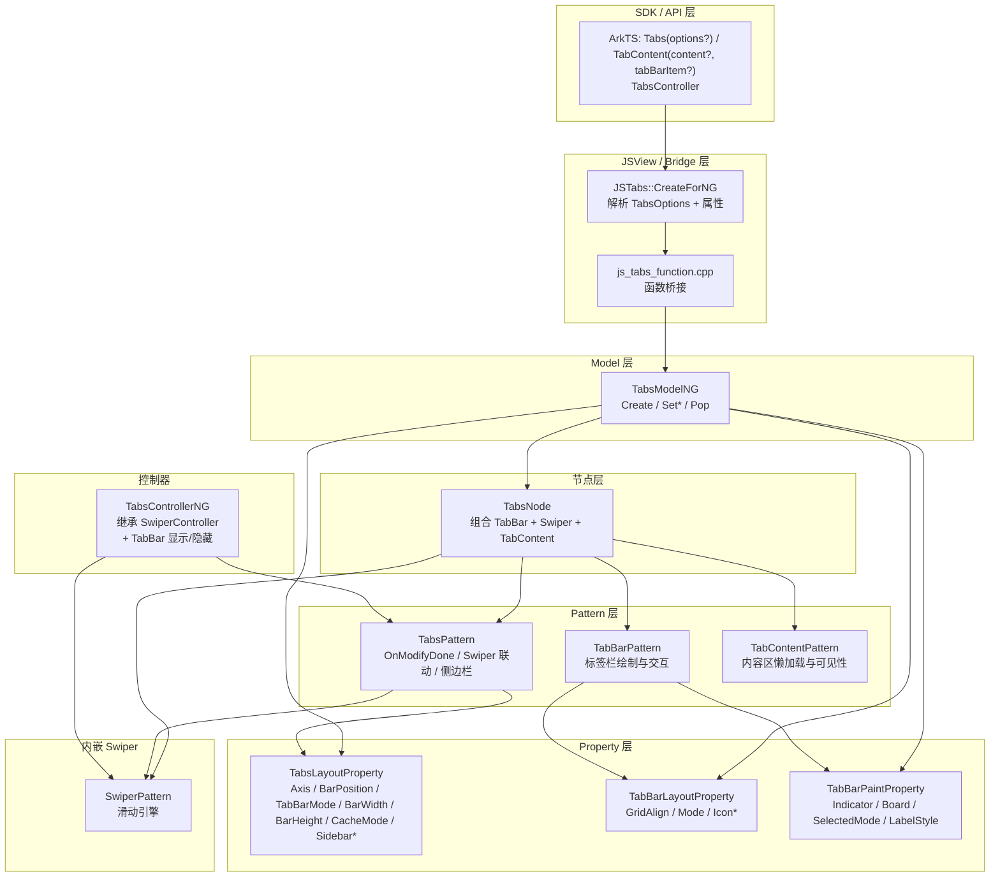

# 架构设计

> Tabs/TabContent 是 ArkUI 滚动容器类组件中的标签页容器组件，提供 TabBar/TabContent 切换、自定义标签栏样式、侧边栏模式、控制器、动画、缓存与事件回调等能力。当前未组件化，走 JSView + Bridge 双路径。

## 设计元数据

| 字段 | 内容 |
|------|------|
| Design ID | DESIGN-Func-05-03-09 |
| 关联需求 | 已有能力补录（无独立 requirement.md） |
| 关联 Epic | 无 |
| 目标 Feature | Feat-01~06（创建与基础属性、标签栏样式、侧边栏模式、动画与自定义过渡、事件回调、缓存与滚动控制） |
| 复杂度 | 高 |
| 目标版本 | API 8 起支持，API 10+ 有多项扩展 |
| Owner | ArkUI SIG |
| 状态 | Baselined（已有实现补录） |

## 需求基线

| 字段 | 内容 |
|------|------|
| 问题陈述 | 需要一个标签页容器组件，支持标签栏与内容区切换，支持多种标签栏样式（子标签栏/底部标签栏/侧边栏），支持动画、缓存、控制器与事件回调 |
| 核心目标 | （Feat-01）创建 Tabs 组件并配置基础属性；（Feat-02）配置标签栏样式（SubTabBarStyle/BottomTabBarStyle/TabBarSymbol）；（Feat-03）侧边栏模式（BarStyle.SidebarAdaptable）；（Feat-04）动画与自定义过渡；（Feat-05）事件回调；（Feat-06）缓存与滚动控制 |
| P0 AC | AC-1.1 ~ AC-1.20（创建与基础属性）、AC-2.1 ~ AC-2.8（标签栏样式）、AC-3.1 ~ AC-3.10（侧边栏模式）、AC-4.1 ~ AC-4.6（动画与自定义过渡）、AC-5.1 ~ AC-5.8（事件回调）、AC-6.1 ~ AC-6.4（缓存与滚动控制） |

## 上下文和现状

### 涉及仓和模块

| 仓库 | 模块路径 | 当前职责 | 本 Feature 影响 |
|------|----------|----------|-----------------|
| ace_engine | `frameworks/core/components_ng/pattern/tabs/tabs_pattern.cpp/.h` | Tabs 组件主 Pattern，管理 Swiper 内嵌、TabBar/TabContent 联动、布局分发 | Feat-01~06 全量涉及 |
| ace_engine | `frameworks/core/components_ng/pattern/tabs/tabs_layout_property.h` | Tabs 布局属性（Axis/BarPosition/TabBarMode/BarWidth/BarHeight/Divider/CacheMode/Sidebar 系属性等） | Feat-01~06 全量涉及 |
| ace_engine | `frameworks/core/components_ng/pattern/tabs/tabs_model_ng.cpp/.h` | Tabs NG Model 层，Create + 全部属性设置 | Feat-01~06 全量涉及 |
| ace_engine | `frameworks/core/components_ng/pattern/tabs/tabs_model.h` | Tabs 抽象 Model 层接口 | Feat-01~06 全量涉及 |
| ace_engine | `frameworks/core/components_ng/pattern/tabs/tab_bar_pattern.cpp/.h` | TabBar 子组件 Pattern，标签栏内容绘制与交互 | Feat-02~03 涉及 |
| ace_engine | `frameworks/core/components_ng/pattern/tabs/tab_bar_layout_property.h/.cpp` | TabBar 子组件布局属性 | Feat-02~03 涉及 |
| ace_engine | `frameworks/core/components_ng/pattern/tabs/tab_bar_paint_property.h` | TabBar 子组件渲染属性（Indicator/Board 等） | Feat-02 涉及 |
| ace_engine | `frameworks/core/components_ng/pattern/tabs/tab_content_pattern.cpp/.h` | TabContent 子组件 Pattern，内容区懒加载与可见性 | Feat-06 涉及 |
| ace_engine | `frameworks/core/components_ng/pattern/tabs/tab_content_layout_property.h` | TabContent 子组件布局属性 | Feat-06 涉及 |
| ace_engine | `frameworks/core/components_ng/pattern/tabs/tabs_controller.h` | TabsControllerNG（继承 SwiperController），切换/显示/隐藏标签栏 | Feat-01 涉及 |
| ace_engine | `frameworks/core/components_ng/pattern/tabs/tabs_node.h/.cpp` | TabsNode 节点管理（组合 TabBar+Swiper+TabContent） | Feat-01~06 涉及 |
| ace_engine | `frameworks/bridge/declarative_frontend/jsview/js_tabs.h/.cpp` | JS 桥接层，处理 JS→C++ 调用 | Feat-01~06 涉及 |
| ace_engine | `frameworks/bridge/declarative_frontend/jsview/js_tabs_controller.h` | JS TabsController 桥接 | Feat-01 涉及 |
| ace_engine | `test/unittest/core/pattern/tabs/` | Tabs 单元测试 | 验证覆盖 |

### 调用链层级分析

| 层 | 模块 | 职责 | 修改类型 |
|----|------|------|----------|
| SDK层 | SDK `.d.ts` 定义（tabs.d.ts 等） | 公开 API 签名与类型定义 | 无修改（规格补录） |
| JSView层 | `frameworks/bridge/declarative_frontend/jsview/js_tabs.cpp/.h` | JS→C++ 调用桥接，解析 Tabs 构造参数和属性 | 无修改（规格补录） |
| Bridge层 | `frameworks/bridge/declarative_frontend/engine/functions/js_tabs_function.cpp/.h` | Tabs 函数桥接 | 无修改（规格补录） |
| Model层 | `frameworks/core/components_ng/pattern/tabs/tabs_model_ng.cpp/.h` | NG Model 层：Create + 全属性 Set | 无修改（规格补录） |
| Pattern层 | `frameworks/core/components_ng/pattern/tabs/tabs_pattern.cpp/.h` | 主 Pattern：OnModifyDone/Swiper 联动/侧边栏/动画/缓存 | 无修改（规格补录） |
| Layout层 | `frameworks/core/components_ng/pattern/tabs/tabs_layout_property.h` | 布局属性：Axis/BarPosition/TabBarMode/BarWidth/BarHeight/CacheMode/Sidebar 系属性 | 无修改（规格补录） |
| Property层 | `frameworks/core/components_ng/pattern/tabs/tab_bar_paint_property.h` | 渲染属性：Indicator/Board/SelectedMode 等 | 无修改（规格补录） |
| Event层 | `frameworks/core/components_ng/pattern/tabs/tabs_pattern.cpp` | 事件：onChange/onAnimationStart/onAnimationEnd/onGestureSwipe/onContentWillChange 等 | 无修改（规格补录） |

### 适用架构规则

| 规则 ID | 设计结论 |
|---------|----------|
| OH-ARCH-01 | Tabs 未组件化，遵循 JSView + Bridge → Model → Pattern 路径（动态版本），不走 Node Modifier C API 路径 |
| OH-ARCH-02 | 布局属性与渲染属性分离存储（TabsLayoutProperty vs TabBarPaintProperty） |
| OH-ARCH-03 | Tabs 内嵌 Swiper 作为底层滑动引擎，Swiper 的 Layout/Paint/Event 属性通过 Tabs 间接透传 |
| OH-ARCH-04 | API 版本差异通过 Container::LessThanAPIVersion 门控（如侧边栏模式仅 API >= 12） |

## 不涉及项承接

| 维度 | 结论 |
|------|------|
| 性能 | 展开设计 — Tabs 使用 Swiper 引擎，标签栏模式切换和侧边栏自适应断点计算涉及性能考量 |
| 安全与权限 | N/A — Tabs 不涉及安全敏感操作 |
| 兼容性 | 展开设计 — BarPosition/TabBarMode/AnimationMode 等枚举在不同 API 版本有扩展 |
| API/SDK | 展开设计 — Tabs/TabContent/TabsController ArkTS API 签名需与 SDK 定义交叉验证 |
| IPC/跨进程 | N/A — Tabs 为纯 UI 组件，不涉及 IPC |
| 构建与部件 | N/A — Tabs 源码已包含在 ace_core_ng_source_set 中 |

## 关键设计决策

| 决策 ID | 问题 | 推荐方案 | 探索过的替代方案 | 取舍理由 | 影响 |
|---------|------|----------|------------------|----------|------|
| ADR-1 | Tabs 未组件化 | JSView + Bridge 双路径，不走 Node Modifier C API 路径 | 组件化后走 C API + Modifier 路径 | 当前存量组件较多，组件化改动量大，保持现有 JSView 桥接路径 | Tabs 无 C API Modifier 实现，不支持 NDK 直接使用 |
| ADR-2 | TabBar 样式体系 | SubTabBarStyle/BottomTabBarStyle/TabBarSymbol 三种样式类，对应 TabBarStyle 枚举 NOSTYLE/SUBTABBATSTYLE/BOTTOMTABBATSTYLE/SIDEBARADAPTABLE | 单一通用样式类 | 三种样式覆盖不同 UI 范式（子标签/底部标签/侧边栏），分离更清晰 | 样式类需在 TabBar PaintProperty 中独立存储和绘制 |
| ADR-3 | 侧边栏模式 | BarStyle.SidebarAdaptable 模式下标签栏变为侧边栏，通过 BarDisplayModeBreakpoint 断点配置自适应切换 | 固定底部/顶部标签栏模式 | 侧边栏模式提供更大内容区空间，断点机制可在不同屏幕尺寸下自动切换 Bottom/Sidebar 显示模式 | 侧边栏模式引入 Sidebar 系属性（width/backgroundColor/divider/displayStyle/autoHide/minWidth/maxWidth 等） |
| ADR-4 | Swiper 内嵌 | Tabs 使用 Swiper 作为底层滑动引擎，TabsPattern 持有 Swiper Pattern 引用 | 自实现滑动逻辑 | Swiper 已成熟且支持 Animation/EdgeEffect/NestedScroll 等能力，复用减少重复实现 | Tabs 的滑动、动画、缓存等行为依赖 Swiper 内部实现 |
| ADR-5 | TabAnimateMode 枚举 | 定义 CONTENT_FIRST/ACTION_FIRST/NO_ANIMATION/CONTENT_FIRST_WITH_JUMP/ACTION_FIRST_WITH_JUMP 五种动画模式 | 仅提供同步切换动画 | 分级动画模式满足不同交互场景（先切换内容或先切换标签栏指示器） | AnimationMode 需在 Swiper PaintProperty 中同步设置 |
| ADR-6 | 缓存策略 | TabsCacheMode 提供 CACHE_BOTH_SIDE 和 CACHE_LATEST_SWITCHED 两种缓存模式 | 仅提供一侧缓存 | CACHE_LATEST_SWITCHED 可减少两侧同时缓存的内存开销 | 缓存模式通过 TabsLayoutProperty::propCachedMaxCount 和 propCacheMode 控制 |
| ADR-F2-1 | 标签栏样式存储 | SubTabBarStyle/BottomTabBarStyle 渲染属性通过 TabBarPaintProperty 分离存储（Indicator/Board/SelectedMode/LabelStyle/IconStyle），布局属性通过 TabBarLayoutProperty 存储（layoutMode/verticalAlign/symmetricExtensible） | 全部属性统一存储在一个 Property 类 | 渲染属性与布局属性分离符合 OH-ARCH-02，减少单一 Property 类膨胀 | 样式属性变更需同时更新 PaintProperty 和 LayoutProperty |
| ADR-F3-1 | 侧边栏 API 版本门控 | 侧边栏模式（BarStyle.SidebarAdaptable）仅 API >= 12 支持，通过 Container::LessThanAPIVersion 门控 | 全版本支持 | 侧边栏模式引入大量新属性（Sidebar 系属性/断点/事件），需与 Swiper 侧边栏扩展同步，仅在较新版本稳定可用 | API < 12 设置 SidebarAdaptable 不生效 |
| ADR-F4-1 | 自定义过渡生命周期 | customContentTransition 通过 SetIsCustomAnimation(true) + TabContentTransitionProxy 超时机制管理过渡生命周期 | 无超时机制，依赖开发者主动调用 finishTransition | 超时机制防止自定义过渡动画不结束导致切换阻塞，确保系统可恢复 | 超时时间由 TabContentAnimatedTransition.timeout 设置，默认值参考 Swiper 配置 |
| ADR-F5-1 | 事件回调注册方式 | Tabs 事件回调通过 TabsModelNG Set 方法注册到 TabsPattern，onChange/onAnimationStart/onAnimationEnd/onGestureSwipe 通过 Swiper 事件系统触发 | 所有事件由 Tabs 直接监听 | Swiper 内嵌架构下，滑动相关事件自然由 Swiper 触发，Tabs 仅做转发 | 事件回调签名与 Swiper 事件签名需对齐 |
| ADR-F6-1 | 缓存与嵌套滚动版本门控 | cachedMaxCount/TabsCacheMode 仅 API >= 19，nestedScroll/TabsNestedScrollMode 仅 API >= 24，preloadItems/onWillShow/onWillHide 仅 API >= 12 | 全版本支持 | 缓存和嵌套滚动为渐进增强能力，不同版本引入时机不同，需逐版本门控 | API 版本差异通过 Container::LessThanAPIVersion 检查 |

## 设计骨架

### 静架范围

| 骨架项 | 目标 | 不包含 | 验证方式 |
|--------|------|--------|----------|
| TabsLayoutProperty | 存储 Axis/BarPosition/TabBarMode/BarWidth/BarHeight/Divider/CacheMode/Sidebar 系属性 | Swiper 独有属性 | 单元测试 |
| TabBarPaintProperty | 存储 Indicator/Board/SelectedMode/LabelStyle 等渲染属性 | Tabs 主容器渲染属性 | 单元测试 |
| TabsPattern | Swiper 联动/TabBar/TabContent 管理/侧边栏/动画模式 | Swiper 自身逻辑 | 单元测试 |
| TabsModelNG | Create + 全属性 Set API | 旧版 Model 实现 | 单元测试 |
| TabsControllerNG | 继承 SwiperController，扩展 TabBar 显示/隐藏 | Swiper 独立控制器 | 单元测试 |
| TabsNode | 组合 TabBar+Swiper+TabContent 节点管理 | Swiper 节点管理 | 单元测试 |

### 骨架 Spec 拆分

| Task ID | 目标 | 受影响文件 | AC |
|---------|------|------------|-----|
| TASK-SKELETON-1 | TabsLayoutProperty 定义 | `tabs_layout_property.h` | AC-1.1 ~ AC-1.20 |
| TASK-SKELETON-2 | TabBarPaintProperty 定义 | `tab_bar_paint_property.h` | AC-2.1 ~ AC-2.8 |
| TASK-SKELETON-3 | TabsPattern 主逻辑 | `tabs_pattern.cpp/.h` | AC-1~6 全量 |
| TASK-SKELETON-4 | TabsModelNG 创建流程 | `tabs_model_ng.cpp/.h` | AC-1.1 ~ AC-1.20 |
| TASK-SKELETON-5 | TabsControllerNG 控制器 | `tabs_controller.h` | AC-1.15 ~ AC-1.20 |
| TASK-SKELETON-6 | TabsNode 节点组合 | `tabs_node.h/.cpp` | AC-1.1 ~ AC-1.5 |

## 后续 Task 拆分

| Task ID | 目标 | 受影响文件 | 依赖 |
|---------|------|------------|------|
| TASK-1 | 创建与基础属性规格 | Feat-01-tabs-creation-basic-properties-spec.md | 无 |
| TASK-2 | 标签栏样式规格 | Feat-02-tabs-bar-style-spec.md | TASK-1 |
| TASK-3 | 侧边栏模式规格 | Feat-03-tabs-sidebar-mode-spec.md | TASK-1 |
| TASK-4 | 动画与自定义过渡规格 | Feat-04-tabs-animation-transition-spec.md | TASK-1 |
| TASK-5 | 事件回调规格 | Feat-05-tabs-events-spec.md | TASK-1 |
| TASK-6 | 缓存与滚动控制规格 | Feat-06-tabs-cache-scroll-spec.md | TASK-1 |

## API 签名、Kit 与权限

### 新增 API

| API 签名 | 类型 | d.ts 位置 | 权限要求 | SysCap |
|----------|------|-----------|----------|--------|
| `Tabs(options?: TabsOptions)` | Public | `tabs.d.ts` | - | - |
| `TabContent(content?: () => void, tabBarItem?: TabBarItem | SubTabBarStyle | BottomTabBarStyle)` | Public | `tabs.d.ts` | - | - |
| `TabsController` | Public | `tabs.d.ts` | - | - |
| `barPosition(value: BarPosition): TabsAttribute` | Public | `tabs.d.ts` | - | - |
| `vertical(value: boolean): TabsAttribute` | Public | `tabs.d.ts` | - | - |
| `scrollable(value: boolean): TabsAttribute` | Public | `tabs.d.ts` | - | - |
| `barMode(value: BarMode): TabsAttribute` | Public | `tabs.d.ts` | - | - |
| `barWidth(value: Length): TabsAttribute` | Public | `tabs.d.ts` | - | - |
| `barHeight(value: Length): TabsAttribute` | Public | `tabs.d.ts` | - | - |
| `animationDuration(value: number): TabsAttribute` | Public | `tabs.d.ts` | - | - |
| `animationCurve(value: Curve | ICurve): TabsAttribute` | Public | `tabs.d.ts` | - | - |
| `animationMode(value: AnimationMode): TabsAttribute` | Public | `tabs.d.ts` | - | - |
| `edgeEffect(value: EdgeEffect): TabsAttribute` | Public | `tabs.d.ts` | - | - |
| `pageFlipMode(value: PageFlipMode): TabsAttribute` | Public | `tabs.d.ts` | - | - |
| `TabsController.changeIndex(index: number): void` | Public | `tabs.d.ts` | - | - |
| `SubTabBarStyle()` | Public | `tabs.d.ts` | - | - |
| `SubTabBarStyle.of(contentModifier?: ContentModifier<TabContent>): SubTabBarStyle` | Public | `tabs.d.ts` | - | - |
| `SubTabBarStyle.indicator(value: IndicatorStyle): SubTabBarStyle` | Public | `tabs.d.ts` | - | - |
| `SubTabBarStyle.selectedMode(value: SelectedMode): SubTabBarStyle` | Public | `tabs.d.ts` | - | - |
| `SubTabBarStyle.board(value: BoardStyle): SubTabBarStyle` | Public | `tabs.d.ts` | - | - |
| `SubTabBarStyle.labelStyle(value: LabelStyle): SubTabBarStyle` | Public | `tabs.d.ts` | - | - |
| `SubTabBarStyle.padding(value: Padding | Length): SubTabBarStyle` | Public | `tabs.d.ts` | - | - |
| `SubTabBarStyle.id(value: string): SubTabBarStyle` | Public | `tabs.d.ts` | - | - |
| `BottomTabBarStyle()` | Public | `tabs.d.ts` | - | - |
| `BottomTabBarStyle.of(contentModifier?: ContentModifier<TabContent>): BottomTabBarStyle` | Public | `tabs.d.ts` | - | - |
| `BottomTabBarStyle.labelStyle(value: LabelStyle): BottomTabBarStyle` | Public | `tabs.d.ts` | - | - |
| `BottomTabBarStyle.padding(value: Padding | Length): BottomTabBarStyle` | Public | `tabs.d.ts` | - | - |
| `BottomTabBarStyle.layoutMode(value: BarLayoutMode): BottomTabBarStyle` | Public | `tabs.d.ts` | - | - |
| `BottomTabBarStyle.verticalAlign(value: Alignment): BottomTabBarStyle` | Public | `tabs.d.ts` | - | - |
| `BottomTabBarStyle.symmetricExtensible(value: boolean): BottomTabBarStyle` | Public | `tabs.d.ts` | - | - |
| `BottomTabBarStyle.id(value: string): BottomTabBarStyle` | Public | `tabs.d.ts` | - | - |
| `BottomTabBarStyle.iconStyle(value: TabBarIconStyle): BottomTabBarStyle` | Public | `tabs.d.ts` | - | - |
| `barStyle(value: BarStyle): TabsAttribute` | Public | `tabs.d.ts` | - | - |
| `sidebarWidth(value: Length): TabsAttribute` | Public | `tabs.d.ts` | - | - |
| `sidebarBackgroundColor(value: ResourceColor): TabsAttribute` | Public | `tabs.d.ts` | - | - |
| `sidebarDivider(value: TabsSidebarDivider): TabsAttribute` | Public | `tabs.d.ts` | - | - |
| `showSideBar(value: boolean): TabsAttribute` | Public | `tabs.d.ts` | - | - |
| `showSideBarWithGesture(value: boolean): TabsAttribute` | Public | `tabs.d.ts` | - | - |
| `sidebarAutoHide(value: boolean): TabsAttribute` | Public | `tabs.d.ts` | - | - |
| `minSidebarWidth(value: Length): TabsAttribute` | Public | `tabs.d.ts` | - | - |
| `maxSidebarWidth(value: Length): TabsAttribute` | Public | `tabs.d.ts` | - | - |
| `minContentWidth(value: Length): TabsAttribute` | Public | `tabs.d.ts` | - | - |
| `sidebarPosition(value: SidebarPosition): TabsAttribute` | Public | `tabs.d.ts` | - | - |
| `sidebarHeader(value: CustomBuilder): TabsAttribute` | Public | `tabs.d.ts` | - | - |
| `sidebarFooter(value: CustomBuilder): TabsAttribute` | Public | `tabs.d.ts` | - | - |
| `sidebarSearchable(value: SidebarSearchableOptions): TabsAttribute` | Public | `tabs.d.ts` | - | - |
| `barDisplayModeBreakpoint(value: TabBarDisplayModeBreakpoint): TabsAttribute` | Public | `tabs.d.ts` | - | - |
| `onBarDisplayModeChange(callback: (displayMode: TabBarDisplayMode) => void): TabsAttribute` | Public | `tabs.d.ts` | - | - |
| `onSideBarChange(callback: (isVisible: boolean) => void): TabsAttribute` | Public | `tabs.d.ts` | - | - |
| `customContentTransition(handler: (from: number, to: number) => TabContentAnimatedTransition): TabsAttribute` | Public | `tabs.d.ts` | - | - |
| `onChange(callback: (index: number) => void): TabsAttribute` | Public | `tabs.d.ts` | - | - |
| `onSelected(callback: (index: number) => void): TabsAttribute` | Public | `tabs.d.ts` | - | - |
| `onUnselected(callback: (index: number) => void): TabsAttribute` | Public | `tabs.d.ts` | - | - |
| `onTabBarClick(callback: (index: number) => void): TabsAttribute` | Public | `tabs.d.ts` | - | - |
| `onAnimationStart(callback: (index: number, event: TabsAnimationEvent) => void): TabsAttribute` | Public | `tabs.d.ts` | - | - |
| `onAnimationEnd(callback: (index: number, event: TabsAnimationEvent) => void): TabsAttribute` | Public | `tabs.d.ts` | - | - |
| `onGestureSwipe(callback: (index: number, event: TabsAnimationEvent) => void): TabsAttribute` | Public | `tabs.d.ts` | - | - |
| `onContentWillChange(callback: (fromIndex: number, toIndex: number) => boolean): TabsAttribute` | Public | `tabs.d.ts` | - | - |
| `onContentDidScroll(callback: (offset: number) => void): TabsAttribute` | Public | `tabs.d.ts` | - | - |
| `cachedMaxCount(value: number, mode?: TabsCacheMode): TabsAttribute` | Public | `tabs.d.ts` | - | - |
| `nestedScroll(value: TabsNestedScrollMode): TabsAttribute` | Public | `tabs.d.ts` | - | - |
| `TabsController.preloadItems(indexList: number[]): void` | Public | `tabs.d.ts` | - | - |
| `TabsController.setTabBarTranslate(offset: number): void` | Public | `tabs.d.ts` | - | - |
| `TabsController.setTabBarOpacity(opacity: number): void` | Public | `tabs.d.ts` | - | - |
| `TabContent.onWillShow(callback: () => void): TabContentAttribute` | Public | `tabs.d.ts` | - | - |
| `TabContent.onWillHide(callback: () => void): TabContentAttribute` | Public | `tabs.d.ts` | - | - |
| `TabContent.sidebarSection(value: string): TabContentAttribute` | Public | `tabs.d.ts` | - | - |
| `TabContent.defaultVisibility(value: TabVisibility): TabContentAttribute` | Public | `tabs.d.ts` | - | - |
| `TabContent.preferredPlacement(value: TabBarPlacement): TabContentAttribute` | Public | `tabs.d.ts` | - | - |
| `TabContent.customizationBehavior(value: CustomizationBehavior): TabContentAttribute` | Public | `tabs.d.ts` | - | - |

### 变更/废弃 API

| 原有 API | 变更类型 | 新 API | 迁移说明 |
|----------|----------|--------|----------|
| — | — | — | 无变更/废弃 API |

## 构建系统影响

### BUILD.gn 变更

```
无变更。Tabs 组件实现位于 ace_core_ng_source_set，已有构建配置覆盖。
```

### bundle.json 变更

无变更。

## 可选设计扩展

### 架构图



### 数据流/控制流

| 步骤 | 调用方 | 被调用方 | 数据/接口 | 说明 |
|------|--------|----------|-----------|------|
| 1 | ArkTS | JSTabs::CreateForNG | TabsOptions（barPosition/index/controller） | 解析构造参数 |
| 2 | CreateForNG | TabsModelNG::Create | barPosition, index, swiperController | 创建 TabsNode（含 TabBar+Swiper 组合） |
| 3 | TabsModelNG::Create | TabsNode::GetOrCreateTabsNode | — | 创建或获取 Tabs FrameNode |
| 4 | TabsModelNG | TabsLayoutProperty | Axis/BarPosition/TabBarMode/BarWidth/BarHeight 等 | 设置布局属性 |
| 5 | TabsModelNG | SwiperPattern | animationDuration/animationCurve/animationMode/edgeEffect | 透传滑动引擎属性 |
| 6 | TabsPattern::OnModifyDone | SwiperPattern | — | Swiper 联动，同步 Swiper 属性 |
| 7 | TabsControllerNG::ChangeIndex | SwiperController::ChangeIndex | index | 切换标签页 |
| 8 | TabsPattern | TabBarPattern | — | 标签栏内容联动（选中态、指示器） |
| 9 | TabsPattern | TabContentPattern | — | 内容区可见性管理 |

### 数据模型设计

**ArkTS (API 层类型)**

```typescript
interface TabsOptions {
  barPosition?: BarPosition;
  index?: number;
  controller?: TabsController;
}

interface TabsInterface {
  (options?: TabsOptions): TabsAttribute;
}

declare class TabsAttribute extends CommonMethod<TabsAttribute> {
  barPosition(value: BarPosition): TabsAttribute;
  vertical(value: boolean): TabsAttribute;
  scrollable(value: boolean): TabsAttribute;
  barMode(value: BarMode): TabsAttribute;
  barWidth(value: Length): TabsAttribute;
  barHeight(value: Length): TabsAttribute;
  animationDuration(value: number): TabsAttribute;
  animationCurve(value: Curve | ICurve): TabsAttribute;
  animationMode(value: AnimationMode): TabsAttribute;
  edgeEffect(value: EdgeEffect): TabsAttribute;
  pageFlipMode(value: PageFlipMode): TabsAttribute;
  // ... 更多属性见各 Feat spec
}

enum BarPosition { Start, End }
enum BarMode { Fixed, Scrollable }
enum AnimationMode { ContentFirst, ActionFirst, NoAnimation, ContentFirstWithJump, ActionFirstWithJump }
enum EdgeEffect { Spring, Fade, None }
```

**C++ (框架层结构)**

```cpp
// 布局属性
struct TabsLayoutProperty : LayoutProperty {
  std::optional<Axis> propAxis_;                    // 水平/垂直方向
  std::optional<BarPosition> propTabBarPosition_;   // 标签栏位置
  std::optional<TabBarMode> propTabBarMode_;        // 固定/可滚动
  std::optional<Dimension> propBarWidth_;           // 标签栏宽度
  std::optional<Dimension> propBarHeight_;          // 标签栏高度
  std::optional<TabsItemDivider> propDivider_;      // 分割线
  std::optional<int32_t> propIndex_;                // 当前选中索引
  std::optional<int32_t> propIndexSetByUser_;       // 用户显式设置的索引
  std::optional<bool> propBarOverlap_;              // 标签栏是否叠加
  std::optional<int32_t> propCachedMaxCount_;       // 缓存最大数量
  std::optional<TabsCacheMode> propCacheMode_;      // 缓存模式
  std::optional<TabBarStyle> propBarStyle_;         // 标签栏样式类型
  // Sidebar 系属性...
  // 脏标记: PROPERTY_UPDATE_MEASURE / PROPERTY_UPDATE_MEASURE_SELF 等
};
```

## 详细设计

### 创建与基础属性

**创建入口**: `TabsModelNG::Create()` (`tabs_model_ng.cpp:61-139`)

```
1. 解析 TabsOptions：barPosition（默认 BarPosition::START）、index（默认 0）、controller
2. GetOrCreateTabsNode 创建 TabsNode（tag=TABS_ETS_TAG）
3. TabsNode 内部创建三个子节点：
   - TabBar 节点（tag=TAB_BAR_ETS_TAG）
   - Swiper 节点（tag=SWIPER_ETS_TAG）— 作为内容区滑动引擎
   - TabContent 节点列表
4. 设置初始属性：
   - TabsLayoutProperty::Axis → HORIZONTAL（默认）
   - TabsLayoutProperty::TabBarPosition → barPosition
   - TabsLayoutProperty::Index → index
5. IF controller 有值 → TabsControllerNG 挂载到 TabsPattern
6. Push 到 ViewStackProcessor
```

**基础属性透传路径**:

| 属性 | Model 方法 | 存储位置 | 脏标记 |
|------|-----------|----------|--------|
| vertical | SetIsVertical | TabsLayoutProperty::propAxis_ | PROPERTY_UPDATE_MEASURE |
| barPosition | SetTabBarPosition | TabsLayoutProperty::propTabBarPosition_ | PROPERTY_UPDATE_MEASURE_SELF |
| scrollable | SetScrollable | SwiperPaintProperty | PROPERTY_UPDATE_NORMAL |
| barMode | SetTabBarMode | TabsLayoutProperty::propTabBarMode_ | PROPERTY_UPDATE_MEASURE |
| barWidth | SetTabBarWidth | TabsLayoutProperty::propBarWidth_ | PROPERTY_UPDATE_MEASURE |
| barHeight | SetTabBarHeight | TabsLayoutProperty::propBarHeight_ | PROPERTY_UPDATE_MEASURE |
| animationDuration | SetAnimationDuration | SwiperLayoutProperty | PROPERTY_UPDATE_NORMAL |
| animationCurve | SetAnimationCurve | SwiperPattern 内部 | PROPERTY_UPDATE_NORMAL |
| animationMode | SetAnimateMode | SwiperPaintProperty | PROPERTY_UPDATE_NORMAL |
| edgeEffect | SetEdgeEffect | SwiperLayoutProperty | PROPERTY_UPDATE_NORMAL |
| pageFlipMode | SetPageFlipMode | SwiperPaintProperty | PROPERTY_UPDATE_NORMAL |

### 标签栏样式

**样式体系**: 三种样式类对应 TabBarStyle 枚举

| TabBarStyle 值 | 样式类 | 适用场景 | 存储 |
|-----------------|--------|----------|------|
| SUBTABBATSTYLE | SubTabBarStyle | 顶部/底部子标签栏 | TabBarPaintProperty::propIndicator_/propBoard_/propLabelStyle_ 等 |
| BOTTOMTABBATSTYLE | BottomTabBarStyle | 底部图标标签栏 | TabBarPaintProperty::propBoard_/icon 相关属性 |
| SIDEBARADAPTABLE | — (侧边栏模式) | 侧边栏标签栏 | TabsLayoutProperty::propSidebarWidth_/propSidebarBackgroundColor_/propSidebarDivider_ 等 |

**SubTabBarStyle 渲染属性路径**: `tab_bar_paint_property.h`

```
Indicator: strokeWidth/startMargin/endMargin/color/borderRadius
Board: borderRadius/backgroundColor
SelectedMode: INDICATOR/BOARD
LabelStyle: overflow/maxLines/font/fontSize/fontWeight/fontColor/height
```

**Feat-02 规格**: SubTabBarStyle 构造器/.of()/indicator/selectedMode/board/labelStyle/padding/id、BottomTabBarStyle 构造器/.of()/labelStyle/padding/layoutMode/verticalAlign/symmetricExtensible/id/iconStyle、TabBarSymbol(normal/selected)、TabBarOptions(icon/text)、IndicatorStyle/BoardStyle/LabelStyle(selectedColor since 12/unselectedColor since 12)/TabBarIconStyle(selectedColor/unselectedColor)/DrawableTabBarIndicator(since 22)/SelectedMode/BarGridColumnOptions/ScrollableBarModeOptions。AC-2.1~AC-2.25 覆盖全部样式类属性行为。

### 侧边栏模式

**入口**: `TabsPattern::OnModifyDone()` 中根据 `TabsLayoutProperty::propBarStyle_ == TabBarStyle::SIDEBARADAPTABLE` 判断

```
1. IF BarStyle == SIDEBARADAPTABLE:
   - 标签栏改为侧边栏布局（SidebarWidth/BackgroundColor/Divider）
   - 启用 BarDisplayModeBreakpoint 断点自适应
   - 侧边栏支持 SidebarDisplayStyle: EMBED/OVERLAY/DISPLACE
   - 侧边栏支持 SidebarAutoHide 自动隐藏
   - 侧边栏支持 ShowSideBar/ShowSideBarWithGesture
   - 侧边栏支持 MinSidebarWidth/MaxSidebarWidth/MinContentWidth
   - 侧边栏支持 SidebarPosition: START/END
2. 断点自适应逻辑：
   - 根据 BarDisplayModeBreakpoint（sm/md/lg）在窗口宽度变化时
     自动切换 BottomTabBar ↔ Sidebar 显示模式
3. 侧边栏搜索:
   - SidebarSearchable + SidebarSearchableOptions（autoSearchOnFocus/searchAreaHeight）
```

**Feat-03 规格**: barStyle(NoStyle/BottomTabBar/SidebarAdaptable)/sidebarWidth/sidebarBackgroundColor/sidebarDivider(TabsSidebarDivider)/showSideBar/showSideBarWithGesture/sidebarAutoHide/minSidebarWidth/maxSidebarWidth/minContentWidth/sidebarPosition(SidebarPosition.Start/End)/sidebarHeader/sidebarFooter/sidebarSearchable/barDisplayModeBreakpoint(TabBarDisplayModeBreakpoint)/onBarDisplayModeChange/onSideBarChange。TabContent 侧边栏扩展: sidebarSection/defaultVisibility(TabVisibility)/preferredPlacement(TabBarPlacement)/customizationBehavior。AC-3.1~AC-3.29 覆盖侧边栏模式全量属性和事件。

### 动画与自定义过渡

**动画模式**: TabAnimateMode 枚举

| TabAnimateMode 值 | 行为 |
|--------------------|------|
| CONTENT_FIRST | 内容区先切换，标签栏指示器后跟随 |
| ACTION_FIRST | 标签栏指示器先移动，内容区后切换 |
| NO_ANIMATION | 无动画直接切换 |
| CONTENT_FIRST_WITH_JUMP | 内容先切换+跳动画 |
| ACTION_FIRST_WITH_JUMP | 标签栏先移动+跳动画 |

**自定义过渡**: `customContentTransition` → `TabContentAnimatedTransition`

```
1. SetIsCustomAnimation(true)
2. 注册 onCustomAnimation 回调 → 返回 TabContentAnimatedTransition
3. TabContentTransitionProxy 管理过渡动画生命周期
4. onContentWillChange 回调决定是否允许切换
```

**Feat-04 规格**: customContentTransition(TabContentAnimatedTransition.timeout/transition)/TabContentTransitionProxy(from/to/finishTransition)/animationMode(CONTENT_FIRST/ACTION_FIRST/NO_ANIMATION/CONTENT_FIRST_WITH_JUMP/ACTION_FIRST_WITH_JUMP)/animationCurve(Curve/ICurve)/pageFlipMode(PageFlipMode)/TabsAnimationEvent(currentOffset/targetOffset/velocity)。AC-4.1~AC-4.18 覆盖动画模式、自定义过渡生命周期、动画曲线和事件数据。

### 事件回调

| 事件 | Model 方法 | 回调签名 | 说明 |
|------|-----------|----------|------|
| onChange | SetOnChange | `(index: number) => void` | 选中标签页变更 |
| onTabBarClick | SetOnTabBarClick | `(index: number) => void` | 标签栏点击 |
| onAnimationStart | SetOnAnimationStart | `(index: number) => void` | 切换动画开始 |
| onAnimationEnd | SetOnAnimationEnd | `(index: number) => void` | 切换动画结束 |
| onGestureSwipe | SetOnGestureSwipe | `(index: number) => void` | 手势滑动 |
| onSelected | SetOnSelected | `(index: number) => void` | 标签选中 |
| onUnselected | SetOnUnselected | `(index: number) => void` | 标签取消选中 |
| onContentWillChange | SetOnContentWillChange | `(fromIndex, toIndex) => boolean` | 内容即将切换（可拦截） |
| onContentDidScroll | SetOnContentDidScroll | ContentDidScrollEvent | 内容滑动 |
| onBarDisplayModeChange | SetOnBarDisplayModeChange | `(displayMode) => void` | 侧边栏断点切换 |
| onSideBarChange | SetOnSideBarChange | `(isVisible) => void` | 侧边栏显示/隐藏 |

**Feat-05 规格**: onChange/onSelected/onUnselected(since 18)/onTabBarClick/onAnimationStart/onAnimationEnd/onGestureSwipe/onContentWillChange(onContentWillChange 返回 false 可拦截切换)/onContentDidScroll(since 23)。回调类型: OnTabsChangeCallback/OnTabsSelectedCallback/OnTabsUnselectedCallback/OnTabsTabBarClickCallback/OnTabsAnimationStartCallback/OnTabsAnimationEndCallback/OnTabsGestureSwipeCallback/OnTabsContentWillChangeCallback/OnTabsContentDidScrollCallback。AC-5.1~AC-5.18 覆盖全部事件回调行为。

### 缓存与滚动控制

**缓存**: `TabsLayoutProperty::propCachedMaxCount_` + `propCacheMode_`

```
1. cachedMaxCount: 设置预缓存的最大 TabContent 数量（两侧或最近切换）
2. TabsCacheMode:
   - CACHE_BOTH_SIDE: 缓存当前页两侧相邻页
   - CACHE_LATEST_SWITCHED: 仅缓存最近切换过的页面
3. TabContentPattern::OnActive/OnInactive 控制可见性
```

**滚动控制**: Swiper 系属性透传

```
1. edgeEffect: SPRING/FADE/NONE — 滑动边缘效果
2. nestedScroll: NestedScrollOptions — 嵌套滚动配置
3. pageFlipMode: PageFlipMode — 翻页模式
```

**Feat-06 规格**: cachedMaxCount(since 19)/TabsCacheMode(CACHE_BOTH_SIDE/CACHE_LATEST_SWITCHED)/nestedScroll(since 24)/TabsNestedScrollMode(SELF_ONLY/SELF_FIRST)/TabsController.preloadItems(since 12)/TabsController.setTabBarTranslate(since 13)/TabsController.setTabBarOpacity(since 13)/TabContent.onWillShow/TabContent.onWillHide(since 12)。AC-6.1~AC-6.18 覆盖缓存策略、嵌套滚动、控制器扩展和可见性回调。

## 风险和开放问题

| 项 | 类型 | 影响 | 处理方式 | Owner |
|----|------|------|----------|-------|
| Tabs 未组件化，无 C API Modifier | 架构 | 高 | 保持现状，记录为组件化 backlog | ArkUI SIG |
| Swiper 内嵌耦合 | 架构 | 中 | 文档化 Swiper 联动机制，Tabs 属性变更需同步 Swiper | ArkUI SIG |
| 侧边栏模式仅 API >= 12 | 兼容性 | 高 | 在兼容性声明中标注 | ArkUI SIG |
| TabBarStyle 枚举名与样式类名不统一 | 文档 | 低 | 在规格中明确映射关系 | ArkUI SIG |
| animationMode 透传到 Swiper 的同步时序 | 架构 | 中 | OnModifyDone 中同步设置 | ArkUI SIG |
| TabsNode 三子节点组合的布局分发复杂度 | 性能 | 中 | 监控布局算法耗时 | ArkUI SIG |
| cachedMaxCount 与 TabsCacheMode 交互 | 功能 | 低 | 在规格中说明默认值和优先级 | ArkUI SIG |

## 设计审批

- [x] 需求基线已确认，设计覆盖 P0/P1 AC
- [x] 不涉及项已承接，N/A 和展开项都有结论
- [x] 涉及仓和模块职责清楚
- [x] 适用架构规则已识别并形成设计结论
- [x] 分层和子系统边界合规
- [x] API 变更有签名、权限、错误码和兼容性说明
- [x] BUILD.gn/bundle.json 影响明确
- [x] 设计输出和后续 Task 拆分明确
- [x] 关键设计决策有理由和影响说明
- [x] 风险和开放问题有 Owner

**结论:** 通过（已有实现补录）
